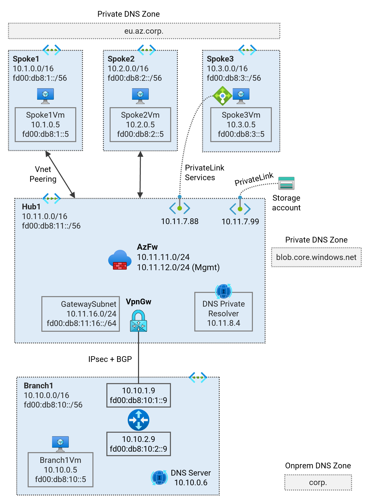
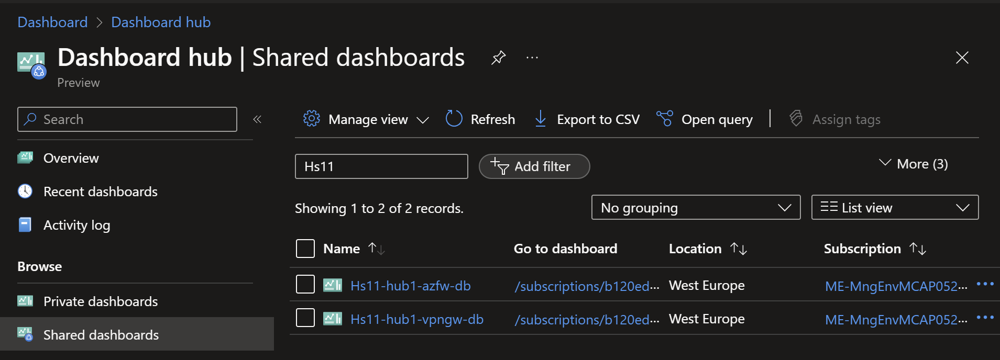

# Secured Hub and Spoke - Single Region <!-- omit from toc -->

## Lab: Hs11 <!-- omit from toc -->

Contents

- [Overview](#overview)
- [Prerequisites](#prerequisites)
- [Deploy the Lab](#deploy-the-lab)
- [Troubleshooting](#troubleshooting)
- [Outputs](#outputs)
- [Dashboards (Optional)](#dashboards-optional)
- [Testing](#testing)
  - [1. Ping IP](#1-ping-ip)
  - [2. Ping DNS](#2-ping-dns)
  - [3. Curl DNS](#3-curl-dns)
  - [4. Private Link Service](#4-private-link-service)
  - [5. Private Link (Storage Account) Access from Public Client](#5-private-link-storage-account-access-from-public-client)
  - [6. Private Link (Storage Account) Access from On-premises](#6-private-link-storage-account-access-from-on-premises)
  - [8. Azure Firewall](#8-azure-firewall)
  - [8. On-premises Routes](#8-on-premises-routes)
- [Cleanup](#cleanup)

## Overview

Deploy a single-region Hub and Spoke Secured Virtual Network (Vnet) topology using Azure Firewall for traffic inspection. The lab demonstrates traffic routing patterns, [hybrid DNS](https://learn.microsoft.com/en-us/azure/dns/private-resolver-hybrid-dns) resolution, firewall security policies, and [PrivateLink Services](https://learn.microsoft.com/en-us/azure/private-link/private-link-service-overview) access to IaaS, [PrivateLink](https://learn.microsoft.com/en-us/azure/private-link/private-link-overview) access to PaaS services.



***Hub1*** is a Vnet hub that has an Azure firewall used for inspection of traffic between an on-premises branch and Vnet spokes. User-Defined Routes (UDR) are used to influence the hub Vnet data plane to route traffic between the branch and spokes via the firewall. An isolated spoke ***spoke3*** does not have Vnet peering to ***hub1***, but is reachable from the hub via [Private Link Service](https://learn.microsoft.com/en-us/azure/private-link/private-link-service-overview).

***Branch1*** is our on-premises network simulated in a Vnet. A Multi-NIC Cisco-CSR-1000V Network Virtual Appliance (NVA) connects to the ***hub1*** using an IPsec VPN connection with dynamic (BGP) routing.

## Prerequisites

Ensure you meet all requirements in the [prerequisites](../../prerequisites/README.md) before proceeding.

## Deploy the Lab

1. Clone the Git Repository for the Labs

   ```sh
   git clone https://github.com/kaysalawu/azure-network-terraform.git
   ```

2. Navigate to the lab directory

   ```sh
   cd azure-network-terraform/1-hub-and-spoke/1-hub-spoke-azfw-single-region
   ```

3. Run the following terraform commands and type ***yes*** at the prompt:

   ```sh
   terraform init
   terraform plan
   terraform apply -parallelism=50
   ```

## Troubleshooting

See the [troubleshooting](../../troubleshooting/README.md) section for tips on how to resolve common issues that may occur during the deployment of the lab.

## Outputs

The table below shows the auto-generated output files from the lab. They are located in the `output` directory.

| Item    | Description  | Location |
|--------|--------|--------|
| IP ranges and DNS | IP ranges and DNS hostname values | [output/values.md](./output/values.md) |
| Branch1 DNS | Authoritative DNS and forwarding | [output/branch1Dns.sh](./output/branch1Dns.sh) |
| Branch1 NVA | Cisco IOS configuration | [output/branch1Nva.sh](./output/branch1Nva.sh) |
| Web server | Python Flask web server, test scripts | [output/server.sh](./output/server.sh) |
||||

## Dashboards (Optional)

This lab contains a number of pre-configured dashboards for monitoring gateways, VPN gateways, and Azure Firewall.

To configure dashboards, set `enable_diagnostics = true` in the [`main.tf`](./02-main.tf). Then run `terraform apply` to update the deployment.

To view the dashboards, follow the steps below:

1. From the Azure portal menu, select **Dashboard hub**.

2. Under **Browse**, select **Shared dashboards**.

3. Select the dashboard you want to view.

   

4. Click on a dashboard under **Go to dashboard** column.

   Sample dashboard for VPN gateway in ***hub1***.

    

    Sample dashboard for Azure Firewall in ***hub1***.

   

## Testing

Each virtual machine is pre-configured with a shell [script](../../scripts/server.sh) to run various types of network reachability tests. Serial console access has been configured for all virtual machines.

Login to virtual machine `Vwan24-spoke1Vm` via the [serial console](https://learn.microsoft.com/en-us/troubleshoot/azure/virtual-machines/serial-console-overview#access-serial-console-for-virtual-machines-via-azure-portal):

- On Azure portal select *Virtual machines*
- Select the virtual machine `Hs11-spoke1Vm`
- Under ***Help*** section, select ***Serial console*** and wait for a login prompt
- Enter the login credentials
  - username = ***azureuser***
  - password = ***Password123***
- You should now be in a shell session `azureuser@Hs11-spoke1Vm:~$`

Run the following tests from inside the serial console session.

### 1. Ping IP

This script pings the IP addresses of some test virtual machines and reports reachability and round trip time.

**1.1.** Run the IP ping test

```sh
ping-ip
```

Sample output

```sh

```

### 2. Ping DNS

This script pings the DNS name of some test virtual machines and reports reachability and round trip time. This tests hybrid DNS resolution between on-premises and Azure.

**2.1.** Run the DNS ping test

```sh
ping-dns
```

Sample output

```sh

```

### 3. Curl DNS

This script uses curl to check reachability of web server (python Flask) on the test virtual machines. It reports HTTP response message, round trip time and IP address.

**3.1.** Run the DNS curl test

```sh
curl-dns
```

Sample output

```sh

```

### 4. Private Link Service

**4.1.** Test access to ***spoke3*** web application using the private endpoint in ***hub1***.

```sh
curl spoke3pls.eu.az.corp
```

Sample output

```sh

```

The `Hostname` and `Local-IP` fields identify the target web server - in this case ***spoke3*** virtual machine. The `Remote-IP` field (as seen by the web server) is an IP address in the Private Link Service NAT subnet in ***spoke3***.

### 5. Private Link (Storage Account) Access from Public Client

A storage account with a container blob deployed and accessible via private endpoints in ***hub1***. The storage accounts have the following naming convention:

* hs11spoke3sa\<AAAA\>.blob.core.windows.net

Where ***\<AAAA\>*** is a randomly generated two-byte string.

**5.1.** On your Cloudshell (or local machine), get the storage account hostname and blob URL.

```sh
spoke3_storage_account=$(az storage account list -g Hs11RG --query "[?contains(name, 'hs11spoke3sa')].name" -o tsv)

spoke3_sgtacct_host="$spoke3_storage_account.blob.core.windows.net"
spoke3_blob_url="https://$spoke3_sgtacct_host/spoke3/spoke3.txt"

echo -e "\n$spoke3_sgtacct_host\n" && echo
```

Sample output (yours will be different)

```sh
hs11spoke3sae71e.blob.core.windows.net
```

**5.2.** Resolve the hostname

```sh
nslookup $spoke3_sgtacct_host
```

Sample output (yours will be different)

```sh

```

We can see that the endpoint is a public IP address, ***20.60.204.97***. We can see the CNAME `hs11spoke3sae71e.privatelink.blob.core.windows.net.` created for the storage account which recursively resolves to the public IP address.

**5.3.** Test access to the storage account blob.

```sh
curl $spoke3_blob_url && echo
```

Sample output

```sh
Hello, World!
```

### 6. Private Link (Storage Account) Access from On-premises

**6.1** Login to on-premises virtual machine `Hs11-branch1Vm` via the [serial console](https://learn.microsoft.com/en-us/troubleshoot/azure/virtual-machines/serial-console-overview#access-serial-console-for-virtual-machines-via-azure-portal):
  - username = ***azureuser***
  - password = ***Password123***

 We will test access from `Hs11-branch1Vm` to the storage account for ***spoke3*** via the private endpoint in ***hub1***.

**6.2.** Run `az login` using the VM's system-assigned managed identity.

```sh
az login --identity
```

**6.3.** Get the storage account hostname and blob URL.

```sh
spoke3_storage_account=$(az storage account list -g Hs11RG --query "[?contains(name, 'hs11spoke3sa')].name" -o tsv)

spoke3_sgtacct_host="$spoke3_storage_account.blob.core.windows.net"
spoke3_blob_url="https://$spoke3_sgtacct_host/spoke3/spoke3.txt"

echo -e "\n$spoke3_sgtacct_host\n" && echo
```

Sample output (yours will be different)

```sh
hs11spoke3sae71e.blob.core.windows.net
```

**6.4.** Resolve the storage account DNS name

```sh
nslookup $spoke3_sgtacct_host
```

Sample output

```sh

```

We can see that the storage account hostname resolves to the private endpoint ***10.11.7.99*** in ***hub1***. The following is a summary of the DNS resolution from `Hs11-branch1Vm`:

- On-premises server `Hs11-branch1Vm` makes a DNS request for `hs11spoke3sae71e.blob.core.windows.net`
- The request is received by on-premises DNS server `Hs11-branch1-dns`
- The DNS server resolves `hs11spoke3sae71e.blob.core.windows.net` to the CNAME `hs11spoke3sae71e.privatelink.blob.core.windows.net`
- The DNS server has a conditional DNS forwarding defined in the branch1 unbound DNS configuration file, [output/branch1Dns.sh](./output/branch1Dns.sh).

  ```sh
  forward-zone:
          name: "privatelink.blob.core.windows.net."
          forward-addr: 10.11.8.4
  ```

  DNS Requests matching `privatelink.blob.core.windows.net` will be forwarded to the private DNS resolver inbound endpoint in ***hub1*** (10.11.8.4).
- The DNS server forwards the DNS request to the private DNS resolver inbound endpoint in ***hub1*** - which returns the IP address of the storage account private endpoint in ***hub1*** (10.11.7.99)

**6.5.** Test access to the storage account blob.

```sh
curl $spoke3_blob_url && echo
```

Sample output

```sh
Hello, World!
```

### 8. Azure Firewall

**8.1.** Check the Azure Firewall logs to observe the traffic flow.

- Select the Azure Firewall resource `Hs11-hub1-azfw` in the Azure portal.
- Click on **Logs** in the left navigation pane.
- Click on **Firewall Logs (Resource Specific Tables)**.
- Click on **Run** in the log category *Network rule logs*.


Observe the firewall logs based on traffic flows generated from our tests.


### 8. On-premises Routes

**8.1** Login to on-premises virtual machine `Hs11-branch1Nva` via the [serial console](https://learn.microsoft.com/en-us/troubleshoot/azure/virtual-machines/serial-console-overview#access-serial-console-for-virtual-machines-via-azure-portal):
  - username = ***azureuser***
  - password = ***Password123***

**8.2.** Enter the Cisco ***enable*** mode

```sh
enable
```

**8.3.** Display the routing table by typing `show ip route` and pressing the space bar to show the complete output.

```sh
show ip route
```

Sample output

```sh
branch1Nva# show ip route
...

```

We can see the Vnet ranges learned dynamically via BGP.

**8.4.** Display BGP information by typing `show ip bgp` and pressing the space bar to show the complete output.

```sh
show ip bgp
```

Sample output

```sh

```

We can see the hub and spoke Vnet ranges being learned dynamically in the BGP table.

## Cleanup

1. (Optional) Navigate back to the lab directory (if you are not already there)

   ```sh
   cd azure-network-terraform/1-hub-and-spoke/1-hub-spoke-azfw-single-region
   ```

2. (Optional) This is not required if `enable_diagnostics = false` in the [`main.tf`](./02-main.tf). If you deployed the lab with `enable_diagnostics = true`, in order to avoid terraform errors when re-deploying this lab, run a cleanup script to remove diagnostic settings that are not removed after the resource group is deleted.

   ```sh
   bash ../../scripts/_cleanup.sh Hs11
   ```

   Sample output

   ```sh
   1-hub-spoke-azfw-single-region$    bash ../../scripts/_cleanup.sh Hs11

   Resource group: Hs11RG

   ⏳ Checking for diagnostic settings on resources in Hs11RG ...
   ➜  Checking firewall ...
        ❌ Deleting: diag setting [Hs11-hub1-azfw-diag] for firewall [Hs11-hub1-azfw] ...
   ➜  Checking vnet gateway ...
        ❌ Deleting: diag setting [Hs11-hub1-vpngw-diag] for vnet gateway [Hs11-hub1-vpngw] ...
   ➜  Checking vpn gateway ...
   ➜  Checking er gateway ...
   ➜  Checking app gateway ...
   ⏳ Checking for azure policies in Vwan24RG ...
   Done!
   ```

3. Delete the resource group to remove all resources installed.

   ```sh
   az group delete -g Hs11RG --no-wait
   ```

4. Delete terraform state files and other generated files.

   ```sh
   rm -rf .terraform*
   rm terraform.tfstate*
   ```
