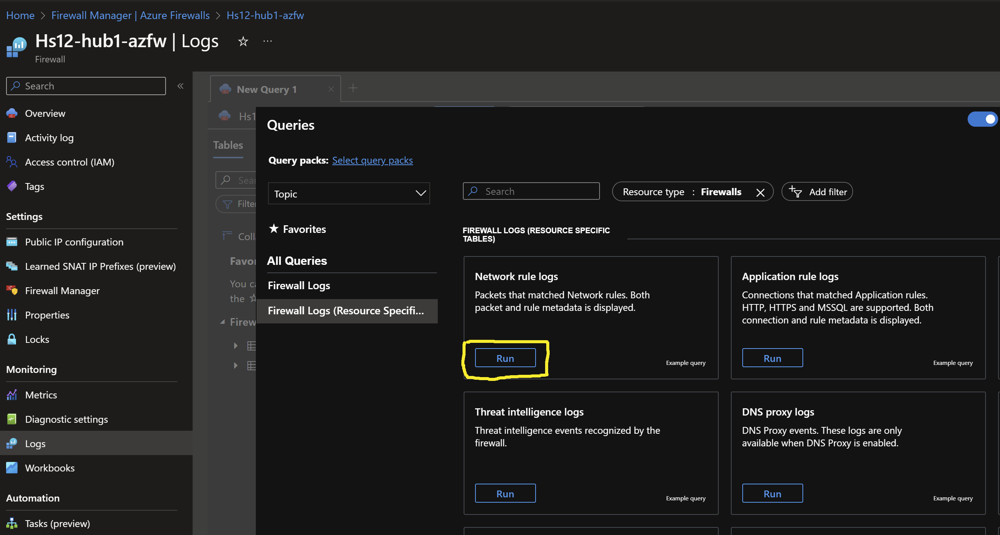
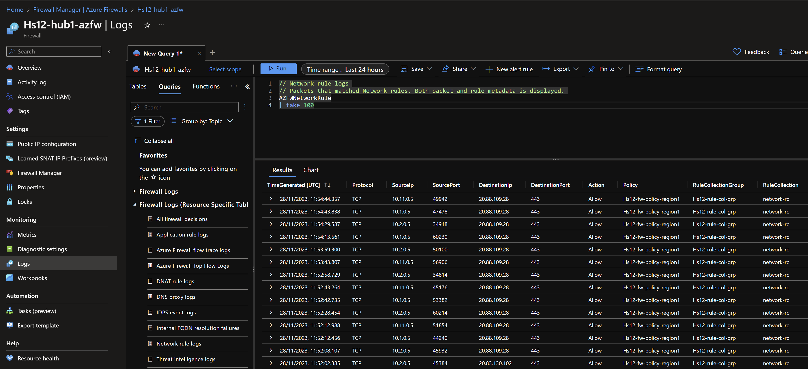

# Secured Hub and Spoke - Dual Region <!-- omit from toc -->
## Lab: Hs12 <!-- omit from toc -->

Contents
- [Overview](#overview)
- [Prerequisites](#prerequisites)
- [Deploy the Lab](#deploy-the-lab)
- [Troubleshooting](#troubleshooting)
- [Outputs](#outputs)
- [Testing](#testing)
  - [1. Ping IP](#1-ping-ip)
  - [2. Ping DNS](#2-ping-dns)
  - [3. Curl DNS](#3-curl-dns)
  - [4. Private Link Service](#4-private-link-service)
  - [5. Private Link (App Service) Access from Public Client](#5-private-link-app-service-access-from-public-client)
  - [6. Private Link (App Service) Access from On-premises](#6-private-link-app-service-access-from-on-premises)
  - [7. Azure Firewall](#7-azure-firewall)
  - [8. Onprem Routes](#8-onprem-routes)
- [Cleanup](#cleanup)

## Overview

This terraform code deploys a dual-region Hub and Spoke Secured Virtual Network (Vnet) topology.


***Hub1*** is a Vnet hub that has an Azure firewall used for inspection of traffic between an on-premises branch and Vnet spokes. User-Defined Routes (UDR) are used to influence the hub Vnet data plane to route traffic between the branch and spokes via the firewall. An isolated spoke ***spoke3*** does not have Vnet peering to ***hub1***, but is reachable from the hub via [Private Link Service](https://learn.microsoft.com/en-us/azure/private-link/private-link-service-overview).

Similarly, ***hub2*** has an Azure firewall used for inspection of traffic between branch and spokes ***spoke6*** does not have Vnet peering to ***hub2***, but is reachable from the hub via Private Link Service.

The hubs are connected together via Vnet peering to allow inter-hub network reachability.

***Branch1*** and ***branch3*** are on-premises networks simulated using Vnets. Multi-NIC Cisco-CSR-1000V NVA appliances connect to the hubs using IPsec VPN connections with dynamic (BGP) routing. A simulated on-premises Wide Area Network (WAN) is created using Vnet peering between ***branch1*** and ***branch3*** as the underlay connectivity, and IPsec with BGP configured as the overlay connection.

Each branch connects to Vnet spokes in their local regions through the directly connected hub. However, each branch connects to spokes in the remote region via the on-premises WAN network. For example, ***branch1*** only receives dynamic routes for ***spoke1***, ***spoke2*** and ***hub1*** through the VPN to ***hub1***. ***Branch1*** uses the simulated on-premises network via ***branch3*** to reach ***spoke4***, ***spoke5*** and ***hub2*** through the VPN from ***branch3*** to ***hub2***.

> ***_NOTE:_*** It is possible to route all Azure traffic from a branch through a single hub, but that is not the focus of this lab.

## Prerequisites

Ensure you meet all requirements in the [prerequisites](../../prerequisites/) before proceeding.

## Deploy the Lab

1. Clone the Git Repository for the Labs
```sh
git clone https://github.com/kaysalawu/azure-network-terraform.git
```

2. Navigate to the lab directory
```sh
cd azure-network-terraform/1-hub-and-spoke/2-hub-spoke-azfw-dual-region
```

3. Run the following terraform commands and type ***yes*** at the prompt:
```sh
terraform init
terraform plan
terraform apply
```

## Troubleshooting

See the [troubleshooting](../../troubleshooting/) section for tips on how to resolve common issues that may occur during the deployment of the lab.

## Outputs

The table below show the auto-generated output files from the lab. They are located in the `output` directory.

| Item    | Description  | Location |
|--------|--------|--------|
| IP ranges and DNS | IP ranges and DNS hostname values | [output/values.md](./output/values.md) |
| Branch DNS Server | Unbound DNS server configuration showing on-premises authoritative zones and conditional forwarding to hub private DNS resolver endpoint | [output/branch-unbound.sh](./output/branch-unbound.sh) |
| Branch1 NVA | Cisco IOS commands for IPsec VPN, BGP, route maps etc. | [output/branch1-nva.sh](./output/branch1-nva.sh) |
| Branch2 NVA | Cisco IOS commands for IPsec VPN, BGP, route maps etc. | [output/branch3-nva.sh](./output/branch3-nva.sh) |
| Web server for workload VMs | Python Flask web server and various test and debug scripts | [output/server.sh](./output/server.sh) |
||||

## Testing

Each virtual machine is pre-configured with a shell [script](../../scripts/server.sh) to run various types of network reachability tests. Serial console access has been configured for all virtual machines. You can [access the serial console](https://learn.microsoft.com/en-us/troubleshoot/azure/virtual-machines/serial-console-overview#access-serial-console-for-virtual-machines-via-azure-portal) of a virtual machine from the Azure portal.

Login to virtual machine `Hs12-spoke1-vm` via the serial console:
- On Azure portal select *Virtual machines*
- Select the virtual machine `Hs12-spoke1-vm`
- Under ***Help*** section, select ***Serial console*** and wait for a login prompt
- Enter the login credentials
  - username = ***azureuser***
  - password = ***Password123***
- You should now be in a shell session `azureuser@Hs12-spoke1-vm:~$`

Run the following tests from inside the serial console session.

### 1. Ping IP

This script pings the IP addresses of some test virtual machines and reports reachability and round trip time.

Run the IP ping test
```sh
ping-ip
```
Sample output
```sh
azureuser@Hs12-spoke1-vm:~$ ping-ip

 ping ip ...

branch1 - 10.10.0.5 -OK 8.357 ms
hub1    - 10.11.0.5 -OK 3.700 ms
spoke1  - 10.1.0.5 -OK 0.037 ms
spoke2  - 10.2.0.5 -OK 3.046 ms
branch3 - 10.30.0.5 -OK 25.411 ms
hub2    - 10.22.0.5 -OK 19.710 ms
spoke4  - 10.4.0.5 -OK 20.164 ms
spoke5  - 10.5.0.5 -OK 21.362 ms
internet - icanhazip.com -NA

```

### 2. Ping DNS

This script pings the DNS name of some test virtual machines and reports reachability and round trip time. This tests hybrid DNS resolution between on-premises and Azure.

Run the DNS ping test
```sh
ping-dns
```

Sample output
```sh
azureuser@Hs12-spoke1-vm:~$ ping-dns

 ping dns ...

vm.branch1.corp - 10.10.0.5 -OK 8.032 ms
vm.hub1.az.corp - 10.11.0.5 -OK 3.348 ms
vm.spoke1.az.corp - 10.1.0.5 -OK 0.032 ms
vm.spoke2.az.corp - 10.2.0.5 -OK 6.369 ms
vm.branch3.corp - 10.30.0.5 -OK 22.445 ms
vm.hub2.az.corp - 10.22.0.5 -OK 19.895 ms
vm.spoke4.az.corp - 10.4.0.5 -OK 19.866 ms
vm.spoke5.az.corp - 10.5.0.5 -OK 20.613 ms
icanhazip.com - 104.18.115.97 -NA

```

### 3. Curl DNS

This script uses curl to check reachability of the web servers (python Flask) on the test virtual machines. It reports HTTP response message, round trip time and IP address.

Run the DNS curl test
```sh
curl-dns
```

Sample output
```sh
azureuser@Hs12-spoke1-vm:~$ curl-dns

 curl dns ...

200 (0.056976s) - 10.10.0.5 - vm.branch1.corp
200 (0.029657s) - 10.11.0.5 - vm.hub1.az.corp
200 (0.024691s) - 10.11.4.4 - spoke3.p.hub1.az.corp
[ 2672.373496] cloud-init[1459]: 10.1.0.5 - - [03/Nov/2023 14:11:29] "GET / HTTP/1.1" 200 -
200 (0.021730s) - 10.1.0.5 - vm.spoke1.az.corp
200 (0.031828s) - 10.2.0.5 - vm.spoke2.az.corp
000 (2.001696s) -  - vm.spoke3.az.corp
200 (0.099121s) - 10.30.0.5 - vm.branch3.corp
200 (0.066180s) - 10.22.0.5 - vm.hub2.az.corp
200 (0.085894s) - 10.22.4.4 - spoke6.p.hub2.az.corp
200 (0.093268s) - 10.4.0.5 - vm.spoke4.az.corp
200 (0.091083s) - 10.5.0.5 - vm.spoke5.az.corp
000 (2.000345s) -  - vm.spoke6.az.corp
200 (0.013103s) - 104.18.114.97 - icanhazip.com
```
We can see that curl test to spoke3 virtual machine `vm.spoke3.az.corp` returns a ***000*** HTTP response code. This is expected since there is no Vnet peering from ***spoke3*** to ***hub1***. However, ***spoke3*** web application is reachable via Private Link Service private endpoint in ***hub1*** `spoke3.p.hub1.az.corp`. The same explanation applies to ***spoke6*** virtual machine `vm.spoke6.az.corp`

### 4. Private Link Service

4.1. Test access to ***spoke3*** web application using the private endpoint in ***hub1***.
```sh
curl spoke3.p.hub1.az.corp
```

Sample output
```sh
azureuser@Hs12-spoke1-vm:~$ curl spoke3.p.hub1.az.corp
{
  "Headers": {
    "Accept": "*/*",
    "Host": "spoke3.p.hub1.az.corp",
    "User-Agent": "curl/7.68.0"
  },
  "Hostname": "Hs12-spoke3-vm",
  "Local-IP": "10.3.0.5",
  "Remote-IP": "10.3.3.4"
}
```

4.2. Test access to ***spoke6*** web application using the private endpoint in ***hub2***.
```sh
curl spoke6.p.hub2.az.corp
```

Sample output
```sh
azureuser@Hs12-spoke1-vm:~$ curl spoke6.p.hub2.az.corp
{
  "Headers": {
    "Accept": "*/*",
    "Host": "spoke6.p.hub2.az.corp",
    "User-Agent": "curl/7.68.0"
  },
  "Hostname": "Hs12-spoke6-vm",
  "Local-IP": "10.6.0.5",
  "Remote-IP": "10.6.3.4"
}
```

The `Hostname` and `Local-IP` fields identifies the actual web servers - in this case ***spoke3*** and ***spoke6*** virtual machines. The `Remote-IP` fields (as seen by the web servers) are IP addresses in the Private Link Service NAT subnets in ***spoke3*** and ***spoke6*** respectively.

### 5. Private Link (App Service) Access from Public Client

App service instances are deployed for ***spoke3*** and ***spoke6***. The app service instance is a fully managed PaaS service. In this lab, the services are linked to ***spoke3*** and ***spoke6***. By using [Virtual Network integration](https://learn.microsoft.com/en-us/azure/app-service/overview-vnet-integration#regional-virtual-network-integration), the app services are deployed in dedicated ***AppServiceSubnet*** subnets in ***spoke3*** and ***spoke6***. This allows each app service to access private resources in their linked spoke Vnet.

The app services are accessible via the private endpoints in ***hub1*** and ***hub2*** respectively. The app services are also accessible via their public endpoints. The app service application is a simple [python Flask web application](https://hub.docker.com/r/ksalawu/web) that returns the HTTP headers, hostname and IP addresses of the server running the application.

The app services have the following naming convention:
- hs12-spoke3-AAAA-app.azurewebsites.net
- hs12-spoke6-BBBB-app.azurewebsites.net

Where ***AAAA*** and ***BBBB*** are randomly generated two-byte strings.

5.1. ***On your local machine***, get the hostname of the app service linked to ***spoke3***
```sh
spoke3_apps_url=$(az webapp list --resource-group Hs12RG --query "[?contains(name, 'hs12-spoke3')].defaultHostName" -o tsv)
``````
5.2. Display the hostname
```sh
echo $spoke3_apps_url
```

Sample output (your result will be different)
```sh
hs12-spoke3-eab4-app.azurewebsites.net
```
5.3. Resolve the hostname
```sh
nslookup $spoke3_apps_url
```

Sample output (your result will be different)
```sh
2-hub-spoke-azfw-dual-region$ nslookup $spoke3_apps_url
Server:         172.22.0.1
Address:        172.22.0.1#53

Non-authoritative answer:
hs12-spoke3-eab4-app.azurewebsites.net  canonical name = hs12-spoke3-eab4-app.privatelink.azurewebsites.net.
hs12-spoke3-eab4-app.privatelink.azurewebsites.net      canonical name = waws-prod-am2-597.sip.azurewebsites.windows.net.
waws-prod-am2-597.sip.azurewebsites.windows.net canonical name = waws-prod-am2-597-91a3.westeurope.cloudapp.azure.com.
Name:   waws-prod-am2-597-91a3.westeurope.cloudapp.azure.com
Address: 20.105.232.16
```

We can see that the endpoint is a public IP address, ***20.105.232.16*** in this example. We can also observe there is a CNAME created for the app service `hs12-spoke3-eab4-app.azurewebsites.net` which recursively resolves to the public IP address.

5.4. Test access to the ***spoke3*** app service via the public endpoint.

```sh
curl $spoke3_apps_url
```

Sample output
```sh
2-hub-spoke-azfw-dual-region$ curl $spoke3_apps_url
{
  "Headers": {
    "Accept": "*/*",
    "Client-Ip": "174.173.70.196:53122",
    "Disguised-Host": "hs12-spoke3-eab4-app.azurewebsites.net",
    "Host": "hs12-spoke3-eab4-app.azurewebsites.net",
    "Max-Forwards": "10",
    "User-Agent": "curl/7.74.0",
    "Was-Default-Hostname": "hs12-spoke3-eab4-app.azurewebsites.net",
    "X-Arr-Log-Id": "80d68dde-866e-4d13-ab82-13ff8fff0e13",
    "X-Client-Ip": "174.173.70.196",
    "X-Client-Port": "53122",
    "X-Forwarded-For": "174.173.70.196:53122",
    "X-Original-Url": "/",
    "X-Site-Deployment-Id": "hs12-spoke3-eab4-app",
    "X-Waws-Unencoded-Url": "/"
  },
  "Hostname": "056e73b13e4b",
  "Local-IP": "169.254.129.3",
  "Remote-IP": "169.254.129.1"
}
```

Observe that we are connecting from our local client's public IP address specified in the `X-Client-Ip`.

Let's confirm the public IP address of our local machine
```sh
curl -4 icanhazip.com
```

Sample output
```sh
2-hub-spoke-azfw-dual-region$ curl -4 icanhazip.com
174.173.70.196
```

Repeat steps *5.1* through *5.4* for the app service linked to ***spoke6***.

### 6. Private Link (App Service) Access from On-premises

6.1 ***On your local machine***, recall the hostname of the app service in ***spoke3*** as done in Step 5.2. In our example, the hostname is `hs12-spoke3-eab4-app.azurewebsites.net`.

6.2. Connect to the on-premises server `Hs12-branch1-vm` [using the serial console](https://learn.microsoft.com/en-us/troubleshoot/azure/virtual-machines/serial-console-overview#access-serial-console-for-virtual-machines-via-azure-portal). We will test access from `Hs12-branch1-vm` to the app service for ***spoke3*** via the private endpoint in ***hub1***.

6.3. Resolve the hostname DNS - which is `hs12-spoke3-eab4-app.azurewebsites.net` in this example. Use your actual hostname from Step 6.1
```sh
nslookup hs12-spoke3-<AAAA>-app.azurewebsites.net
```

Sample output
```sh
azureuser@Hs12-branch1-vm:~$ nslookup hs12-spoke3-eab4-app.azurewebsites.net
Server:         127.0.0.53
Address:        127.0.0.53#53

Non-authoritative answer:
hs12-spoke3-eab4-app.azurewebsites.net  canonical name = hs12-spoke3-eab4-app.privatelink.azurewebsites.net.
Name:   hs12-spoke3-eab4-app.privatelink.azurewebsites.net
Address: 10.11.4.5
```

We can see that the app service hostname resolves to the private endpoint ***10.11.4.5*** in ***hub1***. The following is a summary of the DNS resolution from `Hs12-branch1-vm`:
- On-premises server `Hs12-branch1-vm` makes a DNS request for `hs12-spoke3-0ca7-app.azurewebsites.net`
- The request is received by on-premises DNS server `Hs12-branch1-dns`
- The DNS server resolves `hs12-spoke3-0ca7-app.azurewebsites.net` to the CNAME `hs12-spoke3-0ca7-app.privatelink.azurewebsites.net`
- The DNS server has a conditional DNS forwarding defined in the [unbound DNS configuration file](./output/branch-unbound.sh).

  ```sh
  forward-zone:
          name: "privatelink.azurewebsites.net."
          forward-addr: 10.11.5.4
          forward-addr: 10.22.5.4
  ```
  DNS Requests matching `privatelink.azurewebsites.net` will be forwarded to the private DNS resolver inbound endpoint in ***hub1*** (10.11.5.4). The DNS resolver inbound endpoint for ***hub2*** (10.22.5.4) is also included as a forwarding target for redundancy.
- The DNS server forwards the DNS request to the private DNS resolver inbound endpoint in ***hub1*** - which returns the IP address of the app service private endpoint in ***hub1*** (10.11.4.5)

6.4. From `Hs12-branch1-vm`, test access to the ***spoke3*** app service via the private endpoint. Use your actual hostname.
```sh
curl hs12-spoke3-<AAAA>-app.azurewebsites.net
```

Sample output
```sh
azureuser@Hs12-branch1-vm:~$ curl hs12-spoke3-eab4-app.azurewebsites.net
{
  "Headers": {
    "Accept": "*/*",
    "Client-Ip": "[fd40:fd95:12:148f:7912:100:a0a:5]:46516",
    "Disguised-Host": "hs12-spoke3-eab4-app.azurewebsites.net",
    "Host": "hs12-spoke3-eab4-app.azurewebsites.net",
    "Max-Forwards": "10",
    "User-Agent": "curl/7.68.0",
    "Was-Default-Hostname": "hs12-spoke3-eab4-app.azurewebsites.net",
    "X-Arr-Log-Id": "b7275fb2-f727-4d77-bc9f-bab20ec505aa",
    "X-Client-Ip": "10.10.0.5",
    "X-Client-Port": "0",
    "X-Forwarded-For": "10.10.0.5",
    "X-Original-Url": "/",
    "X-Site-Deployment-Id": "hs12-spoke3-eab4-app",
    "X-Waws-Unencoded-Url": "/"
  },
  "Hostname": "056e73b13e4b",
  "Local-IP": "169.254.129.3",
  "Remote-IP": "169.254.129.1"
}
```

Observe that we are connecting from the private IP address (10.10.0.5) of `Hs12-branch1-vm` (10.10.0.5) specified in the `X-Client-Ip`.

### 7. Azure Firewall

Check the Azure Firewall logs to observe the traffic flow.
- Select the Azure Firewall resource `Hs12-azfw-hub1` in the Azure portal.
- Click on **Logs** in the left navigation pane.
- Click **Run** in the *Network rule log data* log category.



Observe the firewall traffic flows from the tests done so far.



Repeat steps 1-5 for all other spoke and branch virtual machines.

### 8. Onprem Routes

Login to the onprem router `Hs12-branch1-nva` in order to observe its dynamic routes.

1. Login to virtual machine `Hs12-branch1-nva` via the [serial console](https://learn.microsoft.com/en-us/troubleshoot/azure/virtual-machines/serial-console-overview#access-serial-console-for-virtual-machines-via-azure-portal).
2. Enter username and password
   - username = ***azureuser***
   - password = ***Password123***
3. Enter the Cisco enable mode
```sh
enable
```
4. Display the routing table by typing `show ip route` and pressing the space bar to show the complete output.
```sh
show ip route
```

Sample output
```sh
Hs12-branch1-nva-vm#show ip route
...
[Truncated for brevity]
...
Gateway of last resort is 10.10.1.1 to network 0.0.0.0

S*    0.0.0.0/0 [1/0] via 10.10.1.1
      10.0.0.0/8 is variably subnetted, 20 subnets, 4 masks
B        10.1.0.0/16 [20/0] via 10.11.7.4, 01:17:03
B        10.2.0.0/16 [20/0] via 10.11.7.4, 01:17:03
B        10.4.0.0/16 [20/0] via 192.168.30.30, 01:17:03
B        10.5.0.0/16 [20/0] via 192.168.30.30, 01:17:03
S        10.10.0.0/24 [1/0] via 10.10.2.1
C        10.10.1.0/24 is directly connected, GigabitEthernet1
L        10.10.1.9/32 is directly connected, GigabitEthernet1
C        10.10.2.0/24 is directly connected, GigabitEthernet2
L        10.10.2.9/32 is directly connected, GigabitEthernet2
C        10.10.10.0/30 is directly connected, Tunnel0
L        10.10.10.1/32 is directly connected, Tunnel0
C        10.10.10.4/30 is directly connected, Tunnel1
L        10.10.10.5/32 is directly connected, Tunnel1
C        10.10.10.8/30 is directly connected, Tunnel2
L        10.10.10.9/32 is directly connected, Tunnel2
B        10.11.0.0/16 [20/0] via 10.11.7.4, 01:17:03
S        10.11.7.4/32 is directly connected, Tunnel0
S        10.11.7.5/32 is directly connected, Tunnel1
B        10.22.0.0/16 [20/0] via 192.168.30.30, 01:17:03
B        10.30.0.0/24 [20/0] via 192.168.30.30, 01:17:03
      168.63.0.0/32 is subnetted, 1 subnets
S        168.63.129.16 [254/0] via 10.10.1.1
      169.254.0.0/32 is subnetted, 1 subnets
S        169.254.169.254 [254/0] via 10.10.1.1
      192.168.10.0/32 is subnetted, 1 subnets
C        192.168.10.10 is directly connected, Loopback0
      192.168.30.0/32 is subnetted, 1 subnets
S        192.168.30.30 is directly connected, Tunnel2
```

We can see our hub and spoke Vnet ranges being learned dynamically via BGP:
- ***Spoke1 Vnet*** (10.1.0.0/16) via ***hub1*** VPN gateway 10.11.7.4
- ***Spoke2 Vnet*** (10.2.0.0/16) via ***hub1*** VPN gateway 10.11.7.4
- ***Spoke4 Vnet*** (10.1.0.0/16) via ***branch3*** VPN Tunnel 192.168.30.30
- ***Spoke5 Vnet*** (10.2.0.0/16) via ***branch3*** VPN Tunnel 192.168.30.30
- ***Hub1 Vnet*** (10.11.0.0/16) via ***hub1*** VPN gateway 10.11.7.4
- ***Hub2 Vnet*** (10.22.0.0/16) via ***branch3*** VPN Tunnel 192.168.30.30

5. Display BGP information by typing `show ip bgp`.
```sh
show ip bgp
```

Sample output
```sh
Hs12-branch1-nva-vm#show ip bgp
BGP table version is 9, local router ID is 192.168.10.10
Status codes: s suppressed, d damped, h history, * valid, > best, i - internal,
              r RIB-failure, S Stale, m multipath, b backup-path, f RT-Filter,
              x best-external, a additional-path, c RIB-compressed,
              t secondary path, L long-lived-stale,
Origin codes: i - IGP, e - EGP, ? - incomplete
RPKI validation codes: V valid, I invalid, N Not found

     Network          Next Hop            Metric LocPrf Weight Path
 *>   10.1.0.0/16      10.11.7.4                              0 65515 i
 *                     10.11.7.5                              0 65515 i
 *>   10.2.0.0/16      10.11.7.4                              0 65515 i
 *                     10.11.7.5                              0 65515 i
 *>   10.4.0.0/16      192.168.30.30                          0 65003 65003 65003 65003 65515 i
 *>   10.5.0.0/16      192.168.30.30                          0 65003 65003 65003 65003 65515 i
 *>   10.10.0.0/24     10.10.2.1                0         32768 i
 *>   10.11.0.0/16     10.11.7.4                              0 65515 i
 *                     10.11.7.5                              0 65515 i
 *>   10.22.0.0/16     192.168.30.30                          0 65003 65003 65003 65003 65515 i
 *>   10.30.0.0/24     192.168.30.30            0             0 65003 65003 65003 65003 i
```

We can see our hub and spoke Vnet ranges being learned dynamically in the BGP table.

## Cleanup

1. Navigate back to the lab directory (if you are not already there)
   ```sh
   cd azure-network-terraform/1-hub-and-spoke/2-hub-spoke-azfw-dual-region
   ```

2. Delete the resource group to remove all resources installed.

   ```sh
   az group delete -g Hs12RG --no-wait
   ```
