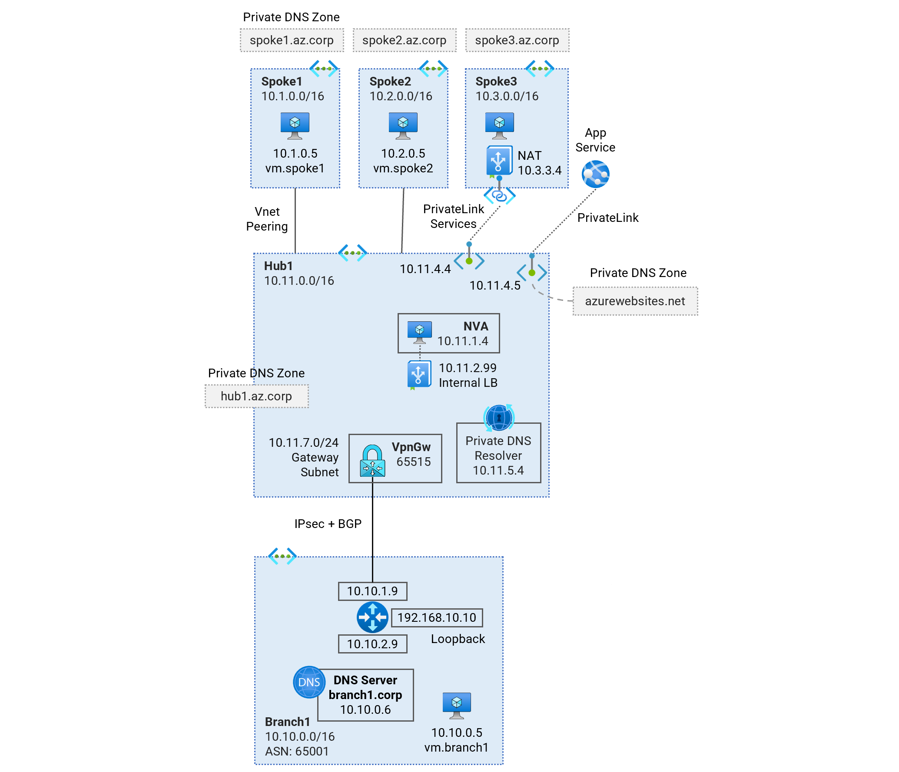
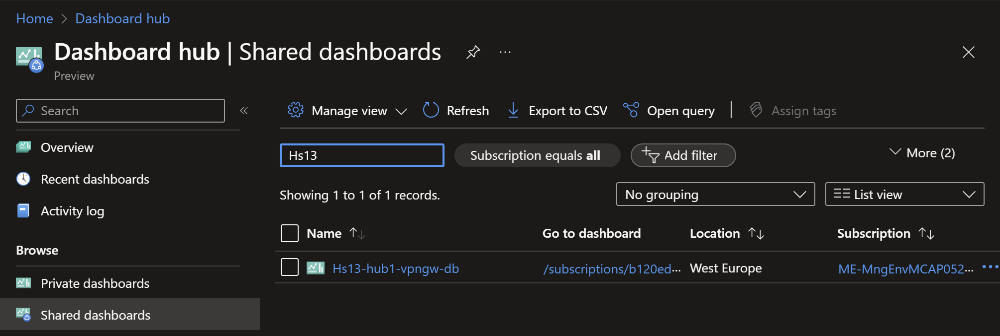
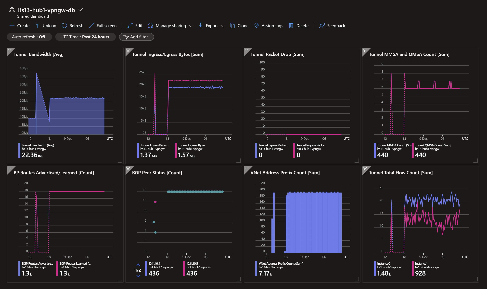

# Hub and Spoke - Single Region (NVA) <!-- omit from toc -->

## Lab: Hs13 <!-- omit from toc -->

Contents

- [Overview](#overview)
- [Prerequisites](#prerequisites)
- [Deploy the Lab](#deploy-the-lab)
- [Troubleshooting](#troubleshooting)
- [Outputs](#outputs)
- [Dashboards (Optional)](#dashboards-optional)
- [Testing](#testing)
  - [1. Ping IP](#1-ping-ip)
  - [2. Ping DNS](#2-ping-dns)
  - [3. Curl DNS](#3-curl-dns)
  - [4. Private Link Service](#4-private-link-service)
  - [5. Private Link Access to Storage Account](#5-private-link-access-to-storage-account)
  - [6. Private Link Access to Storage Account from On-premises](#6-private-link-access-to-storage-account-from-on-premises)
  - [7. Network Virtual Appliance (NVA)](#7-network-virtual-appliance-nva)
  - [8. On-premises Routes](#8-on-premises-routes)
- [Cleanup](#cleanup)

## Overview

This lab deploys a single-region Hub and Spoke Vnet topology using Virtual Network Appliances (NVA) for traffic inspection. The lab demonstrates traffic routing patterns, [hybrid DNS](https://learn.microsoft.com/en-us/azure/dns/private-resolver-hybrid-dns) resolution, NVA deployment, and [PrivateLink Services](https://learn.microsoft.com/en-us/azure/private-link/private-link-service-overview) access to IaaS, [PrivateLink](https://learn.microsoft.com/en-us/azure/private-link/private-link-overview) access to PaaS services.



***Hub1*** is a Vnet hub that has an NVA used for inspection of traffic between an on-premises branch and Vnet spokes. User-Defined Routes (UDR) are used to influence the hub Vnet data plane to route traffic between the branch and spokes via the NVA. An isolated spoke ***spoke3*** does not have Vnet peering to ***hub1***, but is reachable from the hub via [Private Link Service](https://learn.microsoft.com/en-us/azure/private-link/private-link-service-overview).

***Branch1*** is our on-premises network simulated in a Vnet. A Multi-NIC Cisco-CSR-1000V Network Virtual Appliance (NVA) connects to the ***hub1*** using an IPsec VPN connection with dynamic (BGP) routing.

## Prerequisites

Ensure you meet all requirements in the [prerequisites](../../prerequisites/README.md) before proceeding.

## Deploy the Lab

1. Clone the Git Repository for the Labs

   ```sh
   git clone https://github.com/kaysalawu/azure-network-terraform.git
   ```

2. Navigate to the lab directory

   ```sh
   cd azure-network-terraform/1-hub-and-spoke/3-hub-spoke-nva-single-region
   ```

3. Run the following terraform commands and type ***yes*** at the prompt:

   ```sh
   terraform init
   terraform plan
   terraform apply -parallelism=50
   ```

## Troubleshooting

See the [troubleshooting](../../troubleshooting/README.md) section for tips on how to resolve common issues that may occur during the deployment of the lab.

## Outputs

The table below shows the auto-generated output files from the lab. They are located in the `output` directory.

| Item    | Description  | Location |
|--------|--------|--------|
| IP ranges and DNS | IP ranges and DNS hostname values | [output/values.md](./output/values.md) |
| Branch1 DNS | Authoritative DNS and forwarding | [output/branch1Dns.sh](./output/branch1Dns.sh) |
| Branch1 NVA | Cisco IOS configuration | [output/branch1Nva.sh](./output/branch1Nva.sh) |
| (Optional) Hub1 Linux NVA | Linux NVA configuration | [output/hub1-linux-nva.sh](./output/hub1-linux-nva.sh) |
| Web server | Python Flask web server, test scripts | [output/server.sh](./output/server.sh) |
||||

## Dashboards (Optional)

This lab contains a number of pre-configured dashboards for monitoring gateways, VPN gateways, and Azure Firewall. To deploy the dashboards, set `enable_diagnostics = true` in the [`main.tf`](./02-main.tf) file. Then run `terraform apply` to update the deployment.

<details>

<summary>Sample Dashboards</summary>

To view the dashboards, follow the steps below:

1. From the Azure portal menu, select **Dashboard hub**.

2. Under **Browse**, select **Shared dashboards**.

3. Select the dashboard you want to view.

   

4. Click on a dashboard under **Go to dashboard** column.

   Sample dashboard for VPN gateway in ***hub1***.

    

    </details>
<p>

## Testing

Each virtual machine is pre-configured with a shell [script](../../scripts/server.sh) to run various types of network reachability tests. Serial console access has been configured for all virtual machines.

Login to virtual machine `Vwan24-spoke1Vm` via the [serial console](https://learn.microsoft.com/en-us/troubleshoot/azure/virtual-machines/serial-console-overview#access-serial-console-for-virtual-machines-via-azure-portal):

- On Azure portal select *Virtual machines*
- Select the virtual machine `Hs13-spoke1Vm`
- Under ***Help*** section, select ***Serial console*** and wait for a login prompt
- Enter the login credentials
  - username = ***azureuser***
  - password = ***Password123***
- You should now be in a shell session `azureuser@Hs13-spoke1Vm:~$`

Run the following tests from inside the serial console session.

### 1. Ping IP

This script pings the IP addresses of some test virtual machines and reports reachability and round trip time.

**1.1.** Run the IP ping test

```sh
ping-ip
```

<details>

<summary>Sample output</summary>

```sh
azureuser@spoke1Vm:~$ ping-ip

 ping ip ...

branch1 - 10.10.0.5 -OK 4.731 ms
hub1    - 10.11.0.5 -OK 2.465 ms
spoke1  - 10.1.0.5 -OK 0.043 ms
spoke2  - 10.2.0.5 -OK 4.486 ms
internet - icanhazip.com -OK 4.204 ms
```

</details>
<p>

### 2. Ping DNS

This script pings the DNS name of some test virtual machines and reports reachability and round trip time. This tests hybrid DNS resolution between on-premises and Azure.

**2.1.** Run the DNS ping test

```sh
ping-dns
```

<details>

<summary>Sample output</summary>

```sh
branch1vm.corp - 10.10.0.5 -OK 4.864 ms
hub1vm.eu.az.corp - 10.11.0.5 -OK 3.690 ms
spoke1vm.eu.az.corp - 10.1.0.5 -OK 0.032 ms
spoke2vm.eu.az.corp - 10.2.0.5 -OK 3.305 ms
icanhazip.com - 104.16.184.241 -OK 4.359 ms
```

</details>
<p>

### 3. Curl DNS

This script uses curl to check reachability of web server (python Flask) on the test virtual machines. It reports HTTP response message, round trip time and IP address.

**3.1.** Run the DNS curl test

```sh
curl-dns
```

<details>

<summary>Sample output</summary>

```sh
azureuser@spoke1Vm:~$ curl-dns

 curl dns ...

200 (0.046859s) - 10.10.0.5 - branch1vm.corp
200 (0.023771s) - 10.11.0.5 - hub1vm.eu.az.corp
200 (0.014175s) - 10.11.7.88 - spoke3pls.eu.az.corp
200 (0.010734s) - 10.1.0.5 - spoke1vm.eu.az.corp
200 (0.019713s) - 10.2.0.5 - spoke2vm.eu.az.corp
200 (0.017927s) - 104.16.185.241 - icanhazip.com
200 (0.053133s) - 10.11.7.99 - https://hs13spoke3sa4104.blob.core.windows.net/spoke3/spoke3.txt
```

</details>
<p>

### 4. Private Link Service

**4.1.** Test access to ***spoke3*** web application using the private endpoint in ***hub1***.

```sh
curl spoke3pls.eu.az.corp
```

<details>

<summary>Sample output</summary>

```sh
azureuser@spoke1Vm:~$ curl spoke3pls.eu.az.corp
{
  "Headers": {
    "Accept": "*/*",
    "Host": "spoke3pls.eu.az.corp",
    "User-Agent": "curl/7.68.0"
  },
  "Hostname": "spoke3Vm",
  "Local-IP": "10.3.0.5",
  "Remote-IP": "10.3.6.4"
}
```

</details>
<p>

The `Hostname` and `Local-IP` fields identify the target web server - in this case ***spoke3*** virtual machine. The `Remote-IP` field (as seen by the web server) is an IP address in the Private Link Service NAT subnet in ***spoke3***.

### 5. Private Link Access to Storage Account

A storage account with a container blob deployed and accessible via private endpoints in ***hub1***. The storage accounts have the following naming convention:

* hs13spoke3sa\<AAAA\>.blob.core.windows.net

Where ***\<AAAA\>*** is a randomly generated two-byte string.

**5.1.** On your Cloudshell (or local machine), get the storage account hostname and blob URL.

```sh
spoke3_storage_account=$(az storage account list -g Hs13RG --query "[?contains(name, 'hs13spoke3sa')].name" -o tsv)

spoke3_sgtacct_host="$spoke3_storage_account.blob.core.windows.net"
spoke3_blob_url="https://$spoke3_sgtacct_host/spoke3/spoke3.txt"

echo -e "\n$spoke3_sgtacct_host\n" && echo
```

<details>

<summary>Sample output</summary>

```sh
hs13spoke3sa4104.blob.core.windows.net
```

</details>
<p>

**5.2.** Resolve the hostname

```sh
nslookup $spoke3_sgtacct_host
```

<details>

<summary>Sample output</summary>

```sh
3-hub-spoke-nva-single-region$ nslookup $spoke3_sgtacct_host
Server:         8.8.8.8
Address:        8.8.8.8#53

Non-authoritative answer:
hs13spoke3sa4104.blob.core.windows.net  canonical name = hs13spoke3sa4104.privatelink.blob.core.windows.net.
hs13spoke3sa4104.privatelink.blob.core.windows.net      canonical name = blob.db3prdstr19a.store.core.windows.net.
Name:   blob.db3prdstr19a.store.core.windows.net
Address: 20.150.75.36
```

</details>
<p>

We can see that the endpoint is a public IP address, ***20.150.75.36***. We can see the CNAME `hs13spoke3sa4104.privatelink.blob.core.windows.net.` created for the storage account which recursively resolves to the public IP address.

**5.3.** Test access to the storage account blob.

```sh
curl $spoke3_blob_url && echo
```

<details>

<summary>Sample output</summary>

```sh
Hello, World!
```

</details>
<p>

### 6. Private Link Access to Storage Account from On-premises

**6.1** Login to on-premises virtual machine `Hs13-branch1Vm` via the [serial console](https://learn.microsoft.com/en-us/troubleshoot/azure/virtual-machines/serial-console-overview#access-serial-console-for-virtual-machines-via-azure-portal):
  - username = ***azureuser***
  - password = ***Password123***

 We will test access from `Hs13-branch1Vm` to the storage account for ***spoke3*** via the private endpoint in ***hub1***.

**6.2.** Run `az login` using the VM's system-assigned managed identity.

```sh
az login --identity
```

<details>

<summary>Sample output</summary>

```json
azureuser@branch1Vm:~$ az login --identity
[
  {
    "environmentName": "AzureCloud",
    "homeTenantId": "aaa-bbb-ccc-ddd-eee",
    "id": "xxx-yyy-1234-1234-1234",
    "isDefault": true,
    "managedByTenants": [
      {
        "tenantId": "your-tenet-id"
      }
    ],
    "name": "some-random-name",
    "state": "Enabled",
    "tenantId": "your-tenet-id",
    "user": {
      "assignedIdentityInfo": "MSI",
      "name": "systemAssignedIdentity",
      "type": "servicePrincipal"
    }
  }
]
```

</details>
<p>

**6.3.** Get the storage account hostname and blob URL.

```sh
spoke3_storage_account=$(az storage account list -g Hs13RG --query "[?contains(name, 'hs13spoke3sa')].name" -o tsv)

spoke3_sgtacct_host="$spoke3_storage_account.blob.core.windows.net"
spoke3_blob_url="https://$spoke3_sgtacct_host/spoke3/spoke3.txt"

echo -e "\n$spoke3_sgtacct_host\n" && echo
```

<details>

<summary>Sample output</summary>

```sh
hs13spoke3sa4104.blob.core.windows.net
```

</details>
<p>

**6.4.** Resolve the storage account DNS name

```sh
nslookup $spoke3_sgtacct_host
```

<details>

<summary>Sample output</summary>

```sh
azureuser@branch1Vm:~$ nslookup $spoke3_sgtacct_host
Server:         127.0.0.53
Address:        127.0.0.53#53

Non-authoritative answer:
hs13spoke3sa4104.blob.core.windows.net  canonical name = hs13spoke3sa4104.privatelink.blob.core.windows.net.
Name:   hs13spoke3sa4104.privatelink.blob.core.windows.net
Address: 10.11.7.99
```

</details>
<p>

We can see that the storage account hostname resolves to the private endpoint ***10.11.7.99*** in ***hub1***. The following is a summary of the DNS resolution from `Hs13-branch1Vm`:

- On-premises server `Hs13-branch1Vm` makes a DNS request for `hs13spoke3sa4104.blob.core.windows.net`
- The request is received by on-premises DNS server `Hs13-branch1-dns`
- The DNS server resolves `hs13spoke3sa4104.blob.core.windows.net` to the CNAME `hs13spoke3sa4104.privatelink.blob.core.windows.net`
- The DNS server has a conditional DNS forwarding defined in the branch1 unbound DNS configuration file, [output/branch1Dns.sh](./output/branch1Dns.sh).

  ```sh
  forward-zone:
          name: "privatelink.blob.core.windows.net."
          forward-addr: 10.11.8.4
  ```

  DNS Requests matching `privatelink.blob.core.windows.net` will be forwarded to the private DNS resolver inbound endpoint in ***hub1*** (10.11.8.4).
- The DNS server forwards the DNS request to the private DNS resolver inbound endpoint in ***hub1*** - which returns the IP address of the storage account private endpoint in ***hub1*** (10.11.7.99)

**6.5.** Test access to the storage account blob.

```sh
curl $spoke3_blob_url && echo
```

<details>

<summary>Sample output</summary>

```sh
Hello, World!
```

</details>
<p>

### 7. Network Virtual Appliance (NVA)

Whilst still logged into the on-premises server `Hs13-branch1Vm` via the serial console, we will test connectivity to all virtual machines using a `trace-ip` script using the linux `tracepath` utility.

**7.1.** Run the `trace-ip` script

```sh
trace-ip
```

<details>

<summary>Sample output</summary>

```sh
azureuser@branch1Vm:~$ trace-ip

 trace ip ...


branch1
-------------------------------------
 1:  branch1Vm                                             0.083ms reached
     Resume: pmtu 65535 hops 1 back 1

hub1
-------------------------------------
 1?: [LOCALHOST]                      pmtu 1500
 1:  10.10.1.9                                             1.662ms
 1:  10.10.1.9                                             1.063ms
 2:  10.10.1.9                                             2.096ms pmtu 1436
 2:  10.10.1.9                                             0.987ms pmtu 1422
 2:  10.11.2.4                                             5.973ms
 3:  10.11.0.5                                             5.433ms reached
     Resume: pmtu 1422 hops 3 back 3

spoke1
-------------------------------------
 1?: [LOCALHOST]                      pmtu 1500
 1:  10.10.1.9                                             1.539ms
 1:  10.10.1.9                                             1.265ms
 2:  10.10.1.9                                             2.184ms pmtu 1436
 2:  10.10.1.9                                             2.963ms pmtu 1422
 2:  10.11.2.4                                             4.600ms
 3:  10.1.0.5                                              6.248ms reached
     Resume: pmtu 1422 hops 3 back 3

spoke2
-------------------------------------
 1?: [LOCALHOST]                      pmtu 1500
 1:  10.10.1.9                                             5.060ms
 1:  10.10.1.9                                             0.788ms
 2:  10.10.1.9                                             2.715ms pmtu 1436
 2:  10.10.1.9                                             2.842ms pmtu 1422
 2:  10.11.2.4                                             3.322ms
 3:  10.2.0.5                                              5.166ms reached
     Resume: pmtu 1422 hops 3 back 3

internet
-------------------------------------
 1?: [LOCALHOST]                      pmtu 1500
 1:  no reply
 2:  no reply
```

</details>
<p>

We can observe that traffic to ***spoke1***, ***spoke2*** and ***hub1*** flow symmetrically via the NVA in ***hub1*** (10.11.2.4).

### 8. On-premises Routes

**8.1** Login to on-premises virtual machine `Hs13-branch1Nva` via the [serial console](https://learn.microsoft.com/en-us/troubleshoot/azure/virtual-machines/serial-console-overview#access-serial-console-for-virtual-machines-via-azure-portal):
  - username = ***azureuser***
  - password = ***Password123***

**8.2.** Enter the VTY shell for the FRRouting daemon.

```sh
sudo vtysh
```

<details>

<summary>Sample output</summary>

```sh
azureuser@branch1Nva:~$ sudo vtysh

Hello, this is FRRouting (version 7.2.1).
Copyright 1996-2005 Kunihiro Ishiguro, et al.
```

</details>
<p>

**8.3.** Display the routing table by typing `show ip route` and pressing the space bar to show the complete output.

```sh
show ip route
```

<details>

<summary>Sample output</summary>

```sh
branch1Nva# show ip route
Codes: K - kernel route, C - connected, S - static, R - RIP,
       O - OSPF, I - IS-IS, B - BGP, E - EIGRP, N - NHRP,
       T - Table, v - VNC, V - VNC-Direct, A - Babel, D - SHARP,
       F - PBR, f - OpenFabric,
       > - selected route, * - FIB route, q - queued route, r - rejected route

K>* 0.0.0.0/0 [0/100] via 10.10.1.1, eth0, src 10.10.1.9, 01:57:18
B>* 10.1.0.0/20 [20/0] via 10.11.16.4, vti0, 00:07:04
  *                    via 10.11.16.5, vti1, 00:07:04
B>* 10.2.0.0/20 [20/0] via 10.11.16.4, vti0, 00:07:04
  *                    via 10.11.16.5, vti1, 00:07:04
S>* 10.10.0.0/24 [1/0] via 10.10.1.1, eth0, 01:57:17
C>* 10.10.1.0/24 is directly connected, eth0, 01:57:18
C>* 10.10.2.0/24 is directly connected, eth1, 01:57:18
B>* 10.11.0.0/20 [20/0] via 10.11.16.4, vti0, 00:07:04
  *                     via 10.11.16.5, vti1, 00:07:04
B>* 10.11.16.0/20 [20/0] via 10.11.16.4, vti0, 00:07:04
  *                      via 10.11.16.5, vti1, 00:07:04
S   10.11.16.4/32 [1/0] is directly connected, vti0, 00:07:04
C>* 10.11.16.4/32 is directly connected, vti0, 00:07:04
S   10.11.16.5/32 [1/0] is directly connected, vti1, 00:07:20
C>* 10.11.16.5/32 is directly connected, vti1, 00:07:20
K>* 168.63.129.16/32 [0/100] via 10.10.1.1, eth0, src 10.10.1.9, 01:57:18
K>* 169.254.169.254/32 [0/100] via 10.10.1.1, eth0, src 10.10.1.9, 01:57:18
C>* 192.168.10.10/32 is directly connected, lo, 01:57:18
```

We can see the Vnet ranges learned dynamically via BGP.

</details>
<p>

**8.4.** Display BGP information by typing `show ip bgp` and pressing the space bar to show the complete output.

```sh
show ip bgp
```

<details>

<summary>Sample output</summary>

```sh
branch1Nva# show ip bgp
BGP table version is 5, local router ID is 192.168.10.10, vrf id 0
Default local pref 100, local AS 65001
Status codes:  s suppressed, d damped, h history, * valid, > best, = multipath,
               i internal, r RIB-failure, S Stale, R Removed
Nexthop codes: @NNN nexthop's vrf id, < announce-nh-self
Origin codes:  i - IGP, e - EGP, ? - incomplete

   Network          Next Hop            Metric LocPrf Weight Path
*= 10.1.0.0/20      10.11.16.5                             0 65515 i
*>                  10.11.16.4                             0 65515 i
*= 10.2.0.0/20      10.11.16.5                             0 65515 i
*>                  10.11.16.4                             0 65515 i
*> 10.10.0.0/24     0.0.0.0                  0         32768 i
*= 10.11.0.0/20     10.11.16.5                             0 65515 i
*>                  10.11.16.4                             0 65515 i
*= 10.11.16.0/20    10.11.16.5                             0 65515 i
*>                  10.11.16.4                             0 65515 i

Displayed  5 routes and 9 total paths
```

We can see the hub and spoke Vnet ranges being learned dynamically in the BGP table.

</details>
<p>

## Cleanup

1\. (Optional) Navigate back to the lab directory (if you are not already there)

```sh
cd azure-network-terraform/1-hub-and-spoke/3-hub-spoke-nva-single-region
```

2\. (Optional) This is not required if `enable_diagnostics = false` in the [`main.tf`](./02-main.tf). If you deployed the lab with `enable_diagnostics = true`, in order to avoid terraform errors when re-deploying this lab, run a cleanup script to remove diagnostic settings that are not removed after the resource group is deleted.

```sh
bash ../../scripts/_cleanup.sh Hs13
```

<details>

<summary>Sample output</summary>

```sh
3-hub-spoke-nva-single-region$    bash ../../scripts/_cleanup.sh Hs13

Resource group: Hs13RG

⏳ Checking for diagnostic settings on resources in Hs13RG ...
➜  Checking firewall ...
➜  Checking vnet gateway ...
    ❌ Deleting: diag setting [Hs13-hub1-vpngw-diag] for vnet gateway [Hs13-hub1-vpngw] ...
➜  Checking vpn gateway ...
➜  Checking er gateway ...
➜  Checking app gateway ...
⏳ Checking for azure policies in Hs13RG ...
Done!
```

</details>
<p>

3\. Delete the resource group to remove all resources installed.

```sh
az group delete -g Hs13RG --no-wait
```

4\. Delete terraform state files and other generated files.

```sh
rm -rf .terraform*
rm terraform.tfstate*
```
