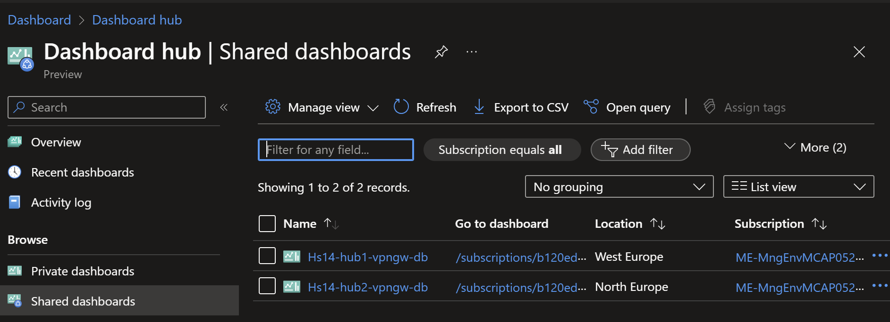

# Hub and Spoke - Dual Region (NVA) <!-- omit from toc -->

## Lab: Hs14 <!-- omit from toc -->

Contents

- [Overview](#overview)
- [Prerequisites](#prerequisites)
- [Deploy the Lab](#deploy-the-lab)
- [Troubleshooting](#troubleshooting)
- [Outputs](#outputs)
- [Dashboards (Optional)](#dashboards-optional)
- [Testing](#testing)
  - [1. Ping IP](#1-ping-ip)
  - [2. Ping DNS](#2-ping-dns)
  - [3. Curl DNS](#3-curl-dns)
  - [4. Private Link Service](#4-private-link-service)
  - [5. Private Link (Storage Account) Access from Public Client](#5-private-link-storage-account-access-from-public-client)
  - [6. Private Link (Storage Account) Access from On-premises](#6-private-link-storage-account-access-from-on-premises)
  - [7. Network Virtual Appliance (NVA)](#7-network-virtual-appliance-nva)
  - [8. On-premises Routes](#8-on-premises-routes)
- [Cleanup](#cleanup)

## Overview

Deploy a dual-region Hub and Spoke Vnet topology using Virtual Network Appliances (NVA) for traffic inspection. The lab demonstrates multi-region traffic routing patterns, [hybrid DNS](https://learn.microsoft.com/en-us/azure/dns/private-resolver-hybrid-dns) resolution, NVA deployment, and [PrivateLink Services](https://learn.microsoft.com/en-us/azure/private-link/private-link-service-overview) access to IaaS, [PrivateLink](https://learn.microsoft.com/en-us/azure/private-link/private-link-overview) access to PaaS services.


***Hub1*** is a Vnet hub that has a Virtual Network Appliance (NVA) used for inspection of traffic between an on-premises branch and Vnet spokes. User-Defined Routes (UDR) are used to influence the hub Vnet data plane to route traffic between the branch and spokes via the NVA. An isolated spoke ***spoke3*** does not have Vnet peering to ***hub1***, but is reachable from the hub via [Private Link Service](https://learn.microsoft.com/en-us/azure/private-link/private-link-service-overview).

Similarly, ***hub2*** has an NVA used for inspection of traffic between branch and spokes. ***Spoke6*** does not have Vnet peering to ***hub2***, but is reachable from the hub via Private Link Service.

The hubs are connected together via Vnet peering to allow inter-hub network reachability.

***Branch1*** and ***branch3*** are on-premises networks simulated using Vnets. Multi-NIC Cisco-CSR-1000V NVA appliances connect to the hubs using IPsec VPN connections with dynamic (BGP) routing. A simulated on-premises Wide Area Network (WAN) is created using Vnet peering between ***branch1*** and ***branch3*** as the underlay connectivity, and IPsec with BGP as the overlay connection.

Each branch connects to Vnet spokes in their local regions through the directly connected hub. However, each branch connects to spokes in the remote region via the on-premises WAN network. For example, ***branch1*** only receives dynamic routes for ***spoke1***, ***spoke2*** and ***hub1*** through the VPN to ***hub1***. ***Branch1*** uses the simulated on-premises network via ***branch3*** to reach ***spoke4***, ***spoke5*** and ***hub2*** through the VPN from ***branch3*** to ***hub2***.

> ***_NOTE:_*** It is possible to route all Azure traffic from a branch through a single hub, but that is not the focus of this lab.

## Prerequisites

Ensure you meet all requirements in the [prerequisites](../../prerequisites/README.md) before proceeding.

## Deploy the Lab

1. Clone the Git Repository for the Labs

   ```sh
   git clone https://github.com/kaysalawu/azure-network-terraform.git
   ```

2. Navigate to the lab directory

   ```sh
   cd azure-network-terraform/1-hub-and-spoke/4-hub-spoke-nva-dual-region
   ```

3. Run the following terraform commands and type ***yes*** at the prompt:

   ```sh
   terraform init
   terraform plan
   terraform apply -parallelism=50
   ```

## Troubleshooting

See the [troubleshooting](../../troubleshooting/README.md) section for tips on how to resolve common issues that may occur during the deployment of the lab.

## Outputs

The table below shows the auto-generated output files from the lab. They are located in the `output` directory.

| Item    | Description  | Location |
|--------|--------|--------|
| IP ranges and DNS | IP ranges and DNS hostname values | [output/values.md](./output/values.md) |
| Branch1 DNS | Authoritative DNS and forwarding | [output/branch1Dns.sh](./output/branch1Dns.sh) |
| Branch3 DNS | Authoritative DNS and forwarding | [output/branch3Dns.sh](./output/branch3Dns.sh) |
| Branch1 NVA | Cisco IOS configuration | [output/branch1Nva.sh](./output/branch1Nva.sh) |
| Branch3 NVA | Cisco IOS configuration | [output/branch3Nva.sh](./output/branch3Nva.sh) |
| (Optional) Hub1 Linux NVA | Linux NVA configuration | [output/hub1-linux-nva.sh](./output/hub1-linux-nva.sh) |
| (Optional) Hub2 Linux NVA | Linux NVA configuration | [output/hub2-linux-nva.sh](./output/hub2-linux-nva.sh) |
| Web server | Python Flask web server, test scripts | [output/server.sh](./output/server.sh) |
||||

## Dashboards (Optional)

This lab contains a number of pre-configured dashboards for monitoring gateways, VPN gateways, and Azure Firewall.

To deploy the dashboards, set `enable_diagnostics = true` in the [`main.tf`](./02-main.tf). Then run `terraform apply` to update the deployment.

To view the dashboards, follow the steps below:

1. From the Azure portal menu, select **Dashboard hub**.

2. Under **Browse**, select **Shared dashboards**.

3. Select the dashboard you want to view.

   

4. Click on a dashboard under **Go to dashboard** column.

   Sample dashboard for VPN gateway in ***hub1***.

    

## Testing

Each virtual machine is pre-configured with a shell [script](../../scripts/server.sh) to run various types of network reachability tests. Serial console access has been configured for all virtual machines.

Login to virtual machine `Vwan24-spoke1Vm` via the [serial console](https://learn.microsoft.com/en-us/troubleshoot/azure/virtual-machines/serial-console-overview#access-serial-console-for-virtual-machines-via-azure-portal):

- On Azure portal select *Virtual machines*
- Select the virtual machine `Hs14-spoke1Vm`
- Under ***Help*** section, select ***Serial console*** and wait for a login prompt
- Enter the login credentials
  - username = ***azureuser***
  - password = ***Password123***
- You should now be in a shell session `azureuser@Hs14-spoke1Vm:~$`

Run the following tests from inside the serial console session.

### 1. Ping IP

This script pings the IP addresses of some test virtual machines and reports reachability and round trip time.

**1.1.** Run the IP ping test

```sh
ping-ip
```

Sample output

```sh

```

### 2. Ping DNS

This script pings the DNS name of some test virtual machines and reports reachability and round trip time. This tests hybrid DNS resolution between on-premises and Azure.

**2.1.** Run the DNS ping test

```sh
ping-dns
```

Sample output

```sh

```

### 3. Curl DNS

This script uses curl to check reachability of web server (python Flask) on the test virtual machines. It reports HTTP response message, round trip time and IP address.

**3.1.** Run the DNS curl test

```sh
curl-dns
```

Sample output

```sh

```

### 4. Private Link Service

**4.1.** Test access to ***spoke3*** web application using the private endpoint in ***hub1***.

```sh
curl spoke3pls.eu.az.corp
```

Sample output

```sh

```

**4.2.** Test access to ***spoke6*** web application using the private endpoint in ***hub2***.

```sh
curl spoke6pls.us.az.corp
```

Sample output

```sh

```

The `Hostname` and `Local-IP` fields identifies the actual web servers - in this case ***spoke3*** and ***spoke6*** virtual machines. The `Remote-IP` fields (as seen by the web servers) are IP addresses in the Private Link Service NAT subnets in ***spoke3*** and ***spoke6*** respectively.

### 5. Private Link (Storage Account) Access from Public Client

A storage account with a container blob deployed and accessible via private endpoints in ***hub1***. The storage accounts have the following naming convention:

* hs14spoke3sa\<AAAA\>.blob.core.windows.net
* hs14spoke6sa\<BBBB\>.blob.core.windows.net

Where ***\<AAAA\>*** and ***\<BBBB\>*** are randomly generated two-byte strings.

**5.1.** On your Cloudshell (or local machine), get the storage account hostname and blob URL.

```sh
spoke3_storage_account=$(az storage account list -g Hs14RG --query "[?contains(name, 'hs14spoke3sa')].name" -o tsv)

spoke3_sgtacct_host="$spoke3_storage_account.blob.core.windows.net"
spoke3_blob_url="https://$spoke3_sgtacct_host/spoke3/spoke3.txt"

echo -e "\n$spoke3_sgtacct_host\n" && echo
```

Sample output (yours will be different)

```sh
hs14spoke3sae71e.blob.core.windows.net
```

**5.2.** Resolve the hostname

```sh
nslookup $spoke3_sgtacct_host
```

Sample output (yours will be different)

```sh

```

We can see that the endpoint is a public IP address, ***20.60.204.97***. We can see the CNAME `hs14spoke3sae71e.privatelink.blob.core.windows.net.` created for the storage account which recursively resolves to the public IP address.

**5.3.** Test access to the storage account blob.

```sh
curl $spoke3_blob_url && echo
```

Sample output

```sh
Hello, World!
```

### 6. Private Link (Storage Account) Access from On-premises

**6.1** Login to on-premises virtual machine `Hs14-branch1Vm` via the [serial console](https://learn.microsoft.com/en-us/troubleshoot/azure/virtual-machines/serial-console-overview#access-serial-console-for-virtual-machines-via-azure-portal):
  - username = ***azureuser***
  - password = ***Password123***

 We will test access from `Hs14-branch1Vm` to the storage account for ***spoke3*** via the private endpoint in ***hub1***.

**6.2.** Run `az login` using the VM's system-assigned managed identity.

```sh
az login --identity
```

**6.3.** Get the storage account hostname and blob URL.

```sh
spoke3_storage_account=$(az storage account list -g Hs14RG --query "[?contains(name, 'hs14spoke3sa')].name" -o tsv)

spoke3_sgtacct_host="$spoke3_storage_account.blob.core.windows.net"
spoke3_blob_url="https://$spoke3_sgtacct_host/spoke3/spoke3.txt"

echo -e "\n$spoke3_sgtacct_host\n" && echo
```

Sample output (yours will be different)

```sh
hs14spoke3sae71e.blob.core.windows.net
```

**6.4.** Resolve the storage account DNS name

```sh
nslookup $spoke3_sgtacct_host
```

Sample output

```sh

```

We can see that the storage account hostname resolves to the private endpoint ***10.11.7.99*** in ***hub1***. The following is a summary of the DNS resolution from `Hs14-branch1Vm`:

- On-premises server `Hs14-branch1Vm` makes a DNS request for `hs14spoke3sae71e.blob.core.windows.net`
- The request is received by on-premises DNS server `Hs14-branch1-dns`
- The DNS server resolves `hs14spoke3sae71e.blob.core.windows.net` to the CNAME `hs14spoke3sae71e.privatelink.blob.core.windows.net`
- The DNS server has a conditional DNS forwarding defined in the branch1 unbound DNS configuration file, [output/branch1Dns.sh](./output/branch1Dns.sh).

  ```sh
  forward-zone:
          name: "privatelink.blob.core.windows.net."
          forward-addr: 10.11.8.4
  ```

  DNS Requests matching `privatelink.blob.core.windows.net` will be forwarded to the private DNS resolver inbound endpoint in ***hub1*** (10.11.8.4).
- The DNS server forwards the DNS request to the private DNS resolver inbound endpoint in ***hub1*** - which returns the IP address of the storage account private endpoint in ***hub1*** (10.11.7.99)

**6.5.** Test access to the storage account blob.

```sh
curl $spoke3_blob_url && echo
```

Sample output

```sh
Hello, World!
```

### 7. Network Virtual Appliance (NVA)

Whilst still logged into the on-premises server `Hs14-branch1Vm` via the serial console, we will test connectivity to all virtual machines using a `trace-ip` script using the linux `tracepath` utility.

**7.1.** Run the `trace-ip` script

```sh

```

We can observe that traffic to ***spoke1***, ***spoke2*** and ***hub1*** flow symmetrically via the NVA in ***hub1*** (10.11.2.4).
Similarly, traffic to ***spoke4***, ***spoke5*** and ***hub2*** flow symmetrically via the NVA in ***hub2*** (10.22.2.4).

### 8. On-premises Routes

**8.1** Login to on-premises virtual machine `Hs14-branch1Nva` via the [serial console](https://learn.microsoft.com/en-us/troubleshoot/azure/virtual-machines/serial-console-overview#access-serial-console-for-virtual-machines-via-azure-portal):
  - username = ***azureuser***
  - password = ***Password123***

**8.2.** Enter the Cisco ***enable*** mode

```sh
enable
```

**8.3.** Display the routing table by typing `show ip route` and pressing the space bar to show the complete output.

```sh
show ip route
```

Sample output

```sh
branch1Nva# show ip route
...

```

We can see the Vnet ranges learned dynamically via BGP.

**8.4.** Display BGP information by typing `show ip bgp` and pressing the space bar to show the complete output.

```sh
show ip bgp
```

Sample output

```sh

```

We can see the hub and spoke Vnet ranges being learned dynamically in the BGP table.

## Cleanup

1. (Optional) Navigate back to the lab directory (if you are not already there)

   ```sh
   cd azure-network-terraform/1-hub-and-spoke/4-hub-spoke-nva-dual-region
   ```

2. (Optional) This is not required if `enable_diagnostics = false` in the [`main.tf`](./02-main.tf). If you deployed the lab with `enable_diagnostics = true`, in order to avoid terraform errors when re-deploying this lab, run a cleanup script to remove diagnostic settings that are not removed after the resource group is deleted.

   ```sh
   bash ../../scripts/_cleanup.sh Hs14
   ```

   Sample output

   ```sh
   4-hub-spoke-nva-dual-region$ . ../../scripts/_cleanup.sh Hs14

   Resource group: Hs14RG

   ⏳ Checking for diagnostic settings on resources in Hs14RG ...
   ➜  Checking firewall ...
   ➜  Checking vnet gateway ...
       ❌ Deleting: diag setting [Hs14-hub1-vpngw-diag] for vnet gateway [Hs14-hub1-vpngw] ...
       ❌ Deleting: diag setting [Hs14-hub2-vpngw-diag] for vnet gateway [Hs14-hub2-vpngw] ...
   ➜  Checking vpn gateway ...
   ➜  Checking er gateway ...
   ➜  Checking app gateway ...
   ⏳ Checking for azure policies in Vwan24RG ...
   Done!
   ```

3. Delete the resource group to remove all resources installed.

   ```sh
   az group delete -g Hs14RG --no-wait
   ```

4. Delete terraform state files and other generated files.

   ```sh
   rm -rf .terraform*
   rm terraform.tfstate*
   ```
