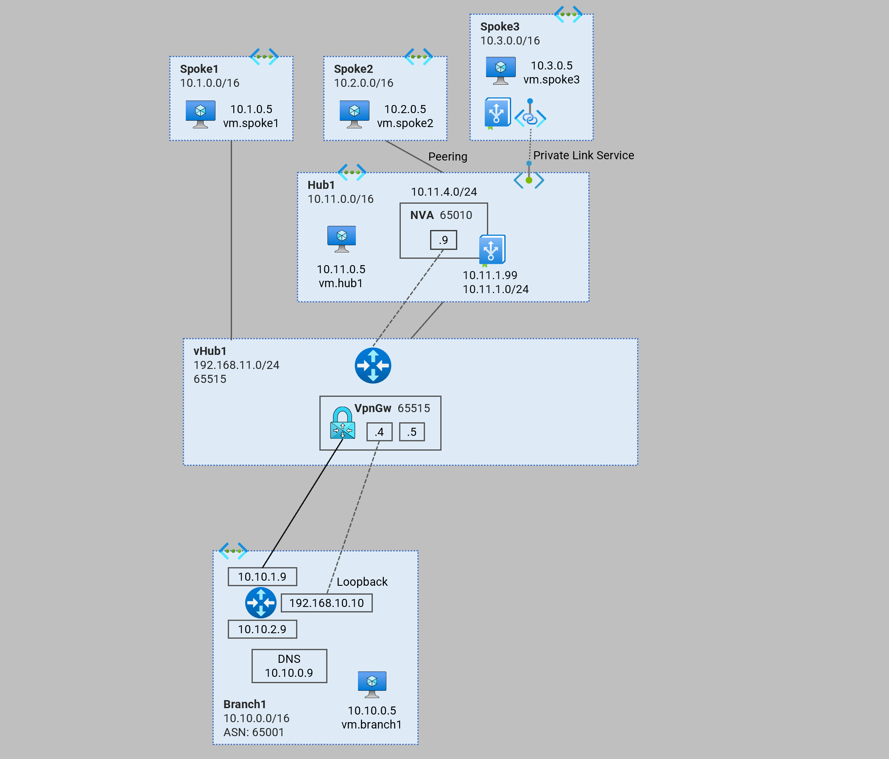
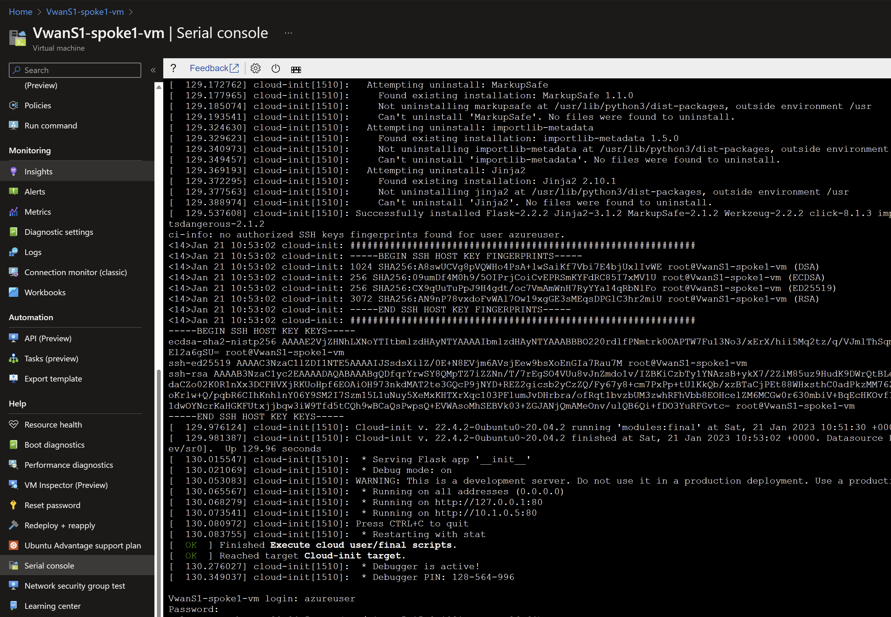

# Virtual WAN - Single Hub <!-- omit from toc -->

Contents
- [Overview](#overview)
- [Prerequisites](#prerequisites)
- [Deploy the Lab](#deploy-the-lab)
- [Troubleshooting](#troubleshooting)
- [Testing](#testing-and-observation)
  - [1. Ping IP](#1-ping-ip)
  - [2. Ping DNS](#2-ping-dns)
  - [3. Curl DNS](#3-curl-dns)
  - [4. Private Link Service](#4-private-link-service)
  - [5. Virtual WAN Routes](#5-virtual-wan-routes)
  - [6. Onprem Routes](#6-onprem-routes)
- [Cleanup](#cleanup)

## Overview

This terraform code deploys a virtual WAN architecture playground to observe dynamic routing patterns. 

In this architecture, we integrate a standard hub (`hub1`) to the virtual WAN hub (`vHub1`) via a virtual WAN connection. `vHub1` has a direct spoke (`Spoke1`) connected using a virtual WAN connection. `Spoke2` is an indirect spoke from a virtual WAN perspective; and is connected via standard VNET peering to `Hub1`. 

The isolated spoke (`Spoke3`) does not have VNET peering to the `Hub1`, but is reachable via Private Link Service through a private endpoint in `Hub1`.

`Branch1` is the on-premises network which is simulated in a VNET using a multi-NIC Cisco-CSR-100V NVA appliance.



## Prerequisites

Ensure you meet all requirements in the [prerequisites](../../prerequisites/) before proceeding.

## Deploy the Lab

1. Clone the Git Repository for the Labs
```sh
git clone https://github.com/kaysalawu/azure-network-terraform.git
```

2. Navigate to the lab directory
```sh
cd azure-network-terraform/2-virtual-wan/1-virtual-wan-single-hub
```

3. un the following terraform commands and type **yes** at the prompt:
```sh
terraform init
terraform plan
terraform apply
```

## Troubleshooting

See the [troubleshooting](../../troubleshooting/) section for tips on how to resolve common issues that may occur during the deployment of the lab.

## Testing

Each virtual machine is pre-configured with a shell [script](../../scripts/server.sh) to run various types of tests. Serial console access has been configured for all virtual mchines. You can [access the serial console](https://learn.microsoft.com/en-us/troubleshoot/azure/virtual-machines/serial-console-overview#access-serial-console-for-virtual-machines-via-azure-portal) of a virtual machine from the Azure portal. 

Login to virtual machine `VwanS1-spoke1-vm` via the serial console. 

- username = **azureuser**
- password = **Password123**



Run the following tests from inside the serial console.

### 1. Ping IP

This script pings the IP addresses of some test virtual machines and reports reachability and round trip time.

Run the IP ping test
```sh
ping-ip
```
Sample output
```sh
azureuser@VwanS1-spoke1-vm:~$ ping-ip

 ping ip ...

branch1 - 10.10.0.5 -OK 5.623 ms
hub1    - 10.11.0.5 -OK 2.877 ms
spoke1  - 10.1.0.5 -OK 0.031 ms
spoke2  - 10.2.0.5 -OK 8.406 ms
```

### 2. Ping DNS

This script pings the DNS name of some test virtual machines and reports reachability and round trip time.

Run the DNS ping test
```sh
ping-dns
```

Sample output
```sh
azureuser@VwanS1-spoke1-vm:~$ ping-dns

 ping dns ...

vm.branch1.corp.net - 10.10.0.5 -OK 5.812 ms
vm.hub1.az.corp.net - 10.11.0.5 -OK 5.523 ms
vm.spoke1.az.corp.net - 10.1.0.5 -OK 0.029 ms
vm.spoke2.az.corp.net - 10.2.0.5 -OK 5.366 ms
```

### 3. Curl DNS

This script uses curl to check reachability of web server (python Flask) on the test virtual machines. It reports HTTP response message, round trip time and IP address.

Run the DNS curl test
```sh
curl-dns
```

Sample output
```sh
azureuser@VwanS1-spoke1-vm:~$ curl-dns

 curl dns ...

200 (0.030842s) - 10.10.0.5 - vm.branch1.corp.net
200 (0.023403s) - 10.11.0.5 - vm.hub1.az.corp.net
200 (0.020256s) - 10.11.4.4 - pep.hub1.az.corp.net
[ 1834.729303] cloud-init[1510]: 10.1.0.5 - - [21/Jan/2023 11:21:27] "GET / HTTP/1.1" 200 -
200 (0.016819s) - 10.1.0.5 - vm.spoke1.az.corp.net
200 (0.048311s) - 10.2.0.5 - vm.spoke2.az.corp.net
000 (2.000521s) -  - vm.spoke3.az.corp.net
```
We can see that spoke3 (vm.spoke3.az.corp.net) returns a **000** HTTP response code. This is expected as there is no Vnet peering to `Spoke3` from `Hub1`. But `Spoke3` web application is reachable via Private Link Service private endpoint (pep.hub1.az.corp.net).

### 4. Private Link Service

Test access to `Spoke3` application using the private endpoint in `Hub1`.
```sh
curl pep.hub1.az.corp.net
```

Sample output
```sh
azureuser@VwanS1-spoke1-vm:~$ curl pep.hub1.az.corp.net
{
  "headers": {
    "Accept": "*/*",
    "Host": "pep.hub1.az.corp.net",
    "User-Agent": "curl/7.68.0"
  },
  "hostname": "VwanS1-spoke3-vm",
  "local-ip": "10.3.0.5",
  "remote-ip": "10.3.3.4"
}
```
The `hostname` and `local-ip` field belong to the server running the web application - in this case `Spoke3` virtual machine. The `remote-ip` field (as seen by the web server) is the IP address in the Private Link Service NAT subnets.

Repeat steps 1-4 for all other virtual machines.

### 5. Virtual WAN Routes

1. Ensure you are in the lab directory `azure-network-terraform/2-virtual-wan/1-virtual-wan-single-hub`
2. Display the virtual WAN routing table(s)

```sh
bash ../../scripts/_routes.sh VwanS1RG
```

Sample output
```sh
salawu$ bash ../../scripts/_routes.sh VwanS1RG

Resource group: VwanS1RG

vHUB: VwanS1-vhub1-hub
Effective route table: defaultRouteTable
AddressPrefixes    AsPath    NextHopType
-----------------  --------  --------------------------
10.2.0.0/16        65010     HubBgpConnection
10.1.0.0/16                  Virtual Network Connection
10.11.0.0/16                 Virtual Network Connection
10.10.0.0/24       65001     VPN_S2S_Gateway
```

### 6. Onprem Routes

Let's login to the onprem router `VwanS1-branch1-nva` and observe its dynamic routes.

1. Login to virtual machine `VwanS1-branch1-nva` via the serial console. 
2. Enter username and password 
   - username = **azureuser**
   - password = **Password123**
3. Enter the Cisco enable mode
```sh
enable
```
1. Display the routing table
```sh
show ip route
```

Sample output
```sh
VwanS1-branch1-nva-vm#show ip route
[Truncated]
...
Gateway of last resort is 10.10.1.1 to network 0.0.0.0

S*    0.0.0.0/0 [1/0] via 10.10.1.1
      10.0.0.0/8 is variably subnetted, 12 subnets, 4 masks
B        10.1.0.0/16 [20/0] via 192.168.11.12, 00:57:43
B        10.2.0.0/16 [20/0] via 192.168.11.12, 00:57:43
S        10.10.0.0/24 [1/0] via 10.10.2.1
C        10.10.1.0/24 is directly connected, GigabitEthernet1
L        10.10.1.9/32 is directly connected, GigabitEthernet1
C        10.10.2.0/24 is directly connected, GigabitEthernet2
L        10.10.2.9/32 is directly connected, GigabitEthernet2
C        10.10.10.0/30 is directly connected, Tunnel0
L        10.10.10.1/32 is directly connected, Tunnel0
C        10.10.10.4/30 is directly connected, Tunnel1
L        10.10.10.5/32 is directly connected, Tunnel1
B        10.11.0.0/16 [20/0] via 192.168.11.12, 00:57:43
      168.63.0.0/32 is subnetted, 1 subnets
S        168.63.129.16 [254/0] via 10.10.1.1
      169.254.0.0/32 is subnetted, 1 subnets
S        169.254.169.254 [254/0] via 10.10.1.1
      192.168.10.0/32 is subnetted, 1 subnets
C        192.168.10.10 is directly connected, Loopback0
      192.168.11.0/24 is variably subnetted, 3 subnets, 2 masks
B        192.168.11.0/24 [20/0] via 192.168.11.12, 00:57:43
S        192.168.11.12/32 is directly connected, Tunnel1
S        192.168.11.13/32 is directly connected, Tunnel0
```

5. Show BGP information
```sh
VwanS1-branch1-nva-vm#show ip bgp
BGP table version is 6, local router ID is 192.168.10.10
Status codes: s suppressed, d damped, h history, * valid, > best, i - internal, 
              r RIB-failure, S Stale, m multipath, b backup-path, f RT-Filter, 
              x best-external, a additional-path, c RIB-compressed, 
              t secondary path, L long-lived-stale,
Origin codes: i - IGP, e - EGP, ? - incomplete
RPKI validation codes: V valid, I invalid, N Not found

     Network          Next Hop            Metric LocPrf Weight Path
 *>   10.1.0.0/16      192.168.11.12                          0 65515 i
 *                     192.168.11.13                          0 65515 i
 *>   10.2.0.0/16      192.168.11.12            0             0 65515 65010 i
 *                     192.168.11.13            0             0 65515 65010 i
 *>   10.10.0.0/24     10.10.2.1                0         32768 i
 *>   10.11.0.0/16     192.168.11.12                          0 65515 i
 *                     192.168.11.13                          0 65515 i
 *>   192.168.11.0     192.168.11.12                          0 65515 i
 *                     192.168.11.13                          0 65515 i
```

## Cleanup 

1. Navigate to the lab directory
```sh
cd azure-network-terraform/2-virtual-wan/1-virtual-wan-single-hub
```

2. Delete the resource group to remove all resources installed.\
Run the following Azure CLI command:

```sh
az group delete -g VwanS1RG --no-wait
```
