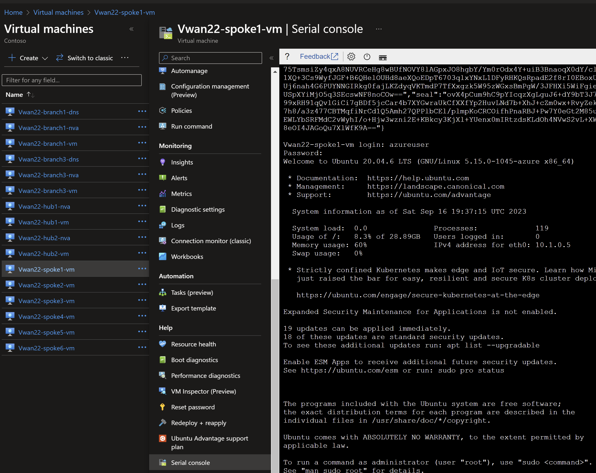

# Virtual WAN - Dual Region <!-- omit from toc -->
## Lab: Vwan22 <!-- omit from toc -->

Contents
- [Overview](#overview)
- [Prerequisites](#prerequisites)
- [Deploy the Lab](#deploy-the-lab)
- [Troubleshooting](#troubleshooting)
- [Testing](#testing)
  - [1. Ping IP](#1-ping-ip)
  - [2. Ping DNS](#2-ping-dns)
  - [3. Curl DNS](#3-curl-dns)
  - [4. Private Link Service](#4-private-link-service)
  - [5. Virtual WAN Routes](#5-virtual-wan-routes)
  - [6. Onprem Routes](#6-onprem-routes)
- [Cleanup](#cleanup)

## Overview

This terraform code deploys a multi-hub (multi-region) Virtual WAN (Vwan) testbed to observe traffic routing patterns.


Standard Virtual Network (Vnet) hubs (`Hub1` and `Hub2`) connect to Vwan hubs (`vHub1` and `vHub2` respectively) via a Vwan connections. Direct spokes (`Spoke1` and `Spoke4`) are connected to their respective Vwan hubs via Vnet connections. `Spoke2` and `Spoke5` are indirect spokes from a Vwan perspective; and are connected via standard Vnet peering to `Hub1` and `Hub2` respectively. `Spoke2` and `Spoke5` use the Network Virtual Applinace (NVA) in the standard Vnet hubs as the next hop for traffic to all destinations.

The isolated spokes (`Spoke3` and `Spoke6`) do not have Vnet peering to their respective Vnet hubs (`Hub1` and `Hub2`), but are reachable via Private Link Service through a private endpoint in each respective hub.

`Branch1` and `Branch3` are on-premises networks which are simulated using Vnets. Multi-NIC Cisco-CSR-1000V NVA appliances connect to the Vwan hubs using IPsec VPN connections with dynamic (BGP) routing.

## Prerequisites

Ensure you meet all requirements in the [prerequisites](../../prerequisites/) before proceeding.

## Deploy the Lab

1. Clone the Git Repository for the Labs
```sh
git clone https://github.com/kaysalawu/azure-network-terraform.git
```

2. Navigate to the lab directory
```sh
cd azure-network-terraform/2-virtual-wan/2-vwan-dual-region
```

3. Run the following terraform commands and type **yes** at the prompt:
```sh
terraform init
terraform plan
terraform apply
```

## Troubleshooting

See the [troubleshooting](../../troubleshooting/) section for tips on how to resolve common issues that may occur during the deployment of the lab.

## Testing

Each virtual machine is pre-configured with a shell [script](../../scripts/server.sh) to run various types of tests. Serial console access has been configured for all virtual mchines. You can [access the serial console](https://learn.microsoft.com/en-us/troubleshoot/azure/virtual-machines/serial-console-overview#access-serial-console-for-virtual-machines-via-azure-portal) of a virtual machine from the Azure portal.

Login to virtual machine `Vwan22-spoke1-vm` via the serial console.
- username = **azureuser**
- password = **Password123**



Run the following tests from inside the serial console.

### 1. Ping IP

This script pings the IP addresses of some test virtual machines and reports reachability and round trip time.

Run the IP ping test
```sh
ping-ip
```
Sample output
```sh
azureuser@Vwan22-spoke1-vm:~$ ping-ip

 ping ip ...

branch1 - 10.10.0.5 -OK 5.343 ms
hub1    - 10.11.0.5 -OK 6.788 ms
spoke1  - 10.1.0.5 -OK 0.034 ms
spoke2  - 10.2.0.5 -OK 6.766 ms
branch3 - 10.30.0.5 -OK 22.516 ms
hub2    - 10.22.0.5 -OK 22.959 ms
spoke4  - 10.4.0.5 -OK 23.298 ms
spoke5  - 10.5.0.5 -OK 24.086 ms
internet - icanhazip.com -NA
```

### 2. Ping DNS

This script pings the DNS name of some test virtual machines and reports reachability and round trip time.

Run the DNS ping test
```sh
ping-dns
```

Sample output
```sh
azureuser@Vwan22-spoke1-vm:~$ ping-dns

 ping dns ...

vm.branch1.corp - 10.10.0.5 -OK 5.845 ms
vm.hub1.az.corp - 10.11.0.5 -OK 6.830 ms
vm.spoke1.az.corp - 10.1.0.5 -OK 0.028 ms
vm.spoke2.az.corp - 10.2.0.5 -OK 6.687 ms
vm.branch3.corp - 10.30.0.5 -OK 22.131 ms
vm.hub2.az.corp - 10.22.0.5 -OK 23.005 ms
vm.spoke4.az.corp - 10.4.0.5 -OK 23.893 ms
vm.spoke5.az.corp - 10.5.0.5 -OK 23.333 ms
icanhazip.com - 104.18.114.97 -NA
```

### 3. Curl DNS

This script uses curl to check reachability of web server (python Flask) on the test virtual machines. It reports HTTP response message, round trip time and IP address.

Run the DNS curl test
```sh
curl-dns
```

Sample output
```sh
azureuser@Vwan22-spoke1-vm:~$ curl-dns

 curl dns ...

200 (0.052320s) - 10.10.0.5 - vm.branch1.corp
200 (0.029548s) - 10.11.0.5 - vm.hub1.az.corp
200 (0.035460s) - 10.11.4.4 - pep.hub1.az.corp
[ 4749.094359] cloud-init[1535]: 10.1.0.5 - - [16/Sep/2023 19:41:35] "GET / HTTP/1.1" 200 -
200 (0.018222s) - 10.1.0.5 - vm.spoke1.az.corp
200 (0.036481s) - 10.2.0.5 - vm.spoke2.az.corp
000 (2.001569s) -  - vm.spoke3.az.corp
200 (0.082606s) - 10.30.0.5 - vm.branch3.corp
200 (0.069719s) - 10.22.0.5 - vm.hub2.az.corp
200 (0.071944s) - 10.22.4.4 - pep.hub2.az.corp
200 (0.075465s) - 10.4.0.5 - vm.spoke4.az.corp
200 (0.078828s) - 10.5.0.5 - vm.spoke5.az.corp
000 (2.001323s) -  - vm.spoke6.az.corp
200 (0.015291s) - 104.18.115.97 - icanhazip.com
```
We can see that spoke3 `vm.spoke3.az.corp` returns a **000** HTTP response code. This is expected as there is no Vnet peering to `Spoke3` from `Hub1`. But `Spoke3` web application is reachable via Private Link Service private endpoint `pep.hub1.az.corp`. The same explanation applies to `Spoke6` virtual machine `vm.spoke6.az.corp`

### 4. Private Link Service

Test access to `Spoke3` application using the private endpoint in `Hub1`.
```sh
curl pep.hub1.az.corp
```

Sample output
```sh
azureuser@Vwan22-spoke1-vm:~$ curl pep.hub1.az.corp
{
  "headers": {
    "Accept": "*/*",
    "Host": "pep.hub1.az.corp",
    "User-Agent": "curl/7.68.0"
  },
  "hostname": "Vwan22-spoke3-vm",
  "local-ip": "10.3.0.5",
  "remote-ip": "10.3.3.4"
}
```
Test access to `Spoke6` application using the private endpoint in `Hub2`.
```sh
curl pep.hub2.az.corp
```

Sample output
```sh
azureuser@Vwan22-spoke1-vm:~$ curl pep.hub2.az.corp
{
  "headers": {
    "Accept": "*/*",
    "Host": "pep.hub2.az.corp",
    "User-Agent": "curl/7.68.0"
  },
  "hostname": "Vwan22-spoke6-vm",
  "local-ip": "10.6.0.5",
  "remote-ip": "10.6.3.4"
}
```

The `hostname` and `local-ip` fields belong to the servers running the web application - in this case `Spoke3` and `Spoke6`virtual machines. The `remote-ip` fields (as seen by the web servers) are the respective IP addresses in the Private Link Service NAT subnets.

Repeat steps 1-4 for all other spoke and branch virtual machines.

### 5. Virtual WAN Routes

1. Ensure you are in the lab directory `azure-network-terraform/2-virtual-wan/2-vwan-dual-region`
2. Display the virtual WAN routing table(s)

```sh
bash ../../scripts/_routes.sh Vwan22RG
```

Sample output
```sh
2-vwan-dual-region$ bash ../../scripts/_routes.sh Vwan22RG

Resource group: Vwan22RG

vHUB: Vwan22-vhub2-hub
Effective route table: defaultRouteTable
AddressPrefixes    NextHopType                 AsPath
-----------------  --------------------------  -----------------
10.22.0.0/16       Virtual Network Connection
10.4.0.0/16        Virtual Network Connection
10.30.0.0/24       VPN_S2S_Gateway             65003
10.5.0.0/16        HubBgpConnection            65020
10.1.0.0/16        Remote Hub                  65520-65520
10.10.0.0/24       Remote Hub                  65520-65520-65001
10.2.0.0/16        Remote Hub                  65520-65520-65010
10.11.0.0/16       Remote Hub                  65520-65520

vHUB: Vwan22-vhub2-hub
Effective route table: custom


vHUB: Vwan22-vhub1-hub
Effective route table: defaultRouteTable
AddressPrefixes    NextHopType                 AsPath
-----------------  --------------------------  -----------------
10.1.0.0/16        Virtual Network Connection
10.11.0.0/16       Virtual Network Connection
10.10.0.0/24       VPN_S2S_Gateway             65001
10.5.0.0/16        Remote Hub                  65520-65520-65020
10.30.0.0/24       Remote Hub                  65520-65520-65003
10.22.0.0/16       Remote Hub                  65520-65520
10.4.0.0/16        Remote Hub                  65520-65520
10.2.0.0/16        HubBgpConnection            65010

vHUB: Vwan22-vhub1-hub
Effective route table: custom
```

### 6. Onprem Routes

Let's login to the onprem router `Vwan22-branch1-nva` and observe its dynamic routes.

1. Login to virtual machine `Vwan22-branch1-nva` via the serial console.
2. Enter username and password
   - username = **azureuser**
   - password = **Password123**
3. Enter the Cisco enable mode
```sh
enable
```
4. Display the routing table
```sh
show ip route
```

Sample output
```sh
Vwan22-branch1-nva-vm#show ip route
...
[Truncated for brevity]
...
Gateway of last resort is 10.10.1.1 to network 0.0.0.0

S*    0.0.0.0/0 [1/0] via 10.10.1.1
      10.0.0.0/8 is variably subnetted, 16 subnets, 4 masks
B        10.1.0.0/16 [20/0] via 192.168.11.12, 06:59:07
B        10.2.0.0/16 [20/0] via 192.168.11.12, 01:37:59
B        10.4.0.0/16 [20/0] via 192.168.11.12, 06:59:07
B        10.5.0.0/16 [20/0] via 192.168.11.12, 01:38:01
S        10.10.0.0/24 [1/0] via 10.10.2.1
C        10.10.1.0/24 is directly connected, GigabitEthernet1
L        10.10.1.9/32 is directly connected, GigabitEthernet1
C        10.10.2.0/24 is directly connected, GigabitEthernet2
L        10.10.2.9/32 is directly connected, GigabitEthernet2
C        10.10.10.0/30 is directly connected, Tunnel0
L        10.10.10.1/32 is directly connected, Tunnel0
C        10.10.10.4/30 is directly connected, Tunnel1
L        10.10.10.5/32 is directly connected, Tunnel1
B        10.11.0.0/16 [20/0] via 192.168.11.12, 06:59:07
B        10.22.0.0/16 [20/0] via 192.168.11.12, 06:59:07
B        10.30.0.0/24 [20/0] via 192.168.11.12, 06:59:07
      168.63.0.0/32 is subnetted, 1 subnets
S        168.63.129.16 [254/0] via 10.10.1.1
      169.254.0.0/32 is subnetted, 1 subnets
S        169.254.169.254 [254/0] via 10.10.1.1
      192.168.10.0/32 is subnetted, 1 subnets
C        192.168.10.10 is directly connected, Loopback0
      192.168.11.0/24 is variably subnetted, 3 subnets, 2 masks
B        192.168.11.0/24 [20/0] via 192.168.11.12, 06:59:07
S        192.168.11.12/32 is directly connected, Tunnel0
S        192.168.11.13/32 is directly connected, Tunnel1
```

5. Display BGP information
```sh
show ip bgp
```

Sample output
```sh
Vwan22-branch1-nva-vm#show ip bgp
BGP table version is 70, local router ID is 192.168.10.10
Status codes: s suppressed, d damped, h history, * valid, > best, i - internal,
              r RIB-failure, S Stale, m multipath, b backup-path, f RT-Filter,
              x best-external, a additional-path, c RIB-compressed,
              t secondary path, L long-lived-stale,
Origin codes: i - IGP, e - EGP, ? - incomplete
RPKI validation codes: V valid, I invalid, N Not found

     Network          Next Hop            Metric LocPrf Weight Path
 *>   10.1.0.0/16      192.168.11.12                          0 65515 i
 *                     192.168.11.13                          0 65515 i
 *    10.2.0.0/16      192.168.11.13            0             0 65515 65010 i
 *>                    192.168.11.12            0             0 65515 65010 i
 *>   10.4.0.0/16      192.168.11.12                          0 65515 65520 65520 e
 *                     192.168.11.13                          0 65515 65520 65520 e
 *    10.5.0.0/16      192.168.11.13                          0 65515 65520 65520 65020 e
 *>                    192.168.11.12                          0 65515 65520 65520 65020 e
 *>   10.10.0.0/24     10.10.2.1                0         32768 i
     Network          Next Hop            Metric LocPrf Weight Path
 *>   10.11.0.0/16     192.168.11.12                          0 65515 i
 *                     192.168.11.13                          0 65515 i
 *>   10.22.0.0/16     192.168.11.12                          0 65515 65520 65520 e
 *                     192.168.11.13                          0 65515 65520 65520 e
 *>   10.30.0.0/24     192.168.11.12                          0 65515 65520 65520 65003 e
 *                     192.168.11.13                          0 65515 65520 65520 65003 e
 *>   192.168.11.0     192.168.11.12                          0 65515 i
 *                     192.168.11.13                          0 65515 i
```

## Cleanup

1. Make sure you are in the lab directory
```sh
cd azure-network-terraform/2-virtual-wan/2-vwan-dual-region
```

2. Delete the resource group to remove all resources installed.\
Run the following Azure CLI command:

```sh
az group delete -g Vwan22RG --no-wait
```
