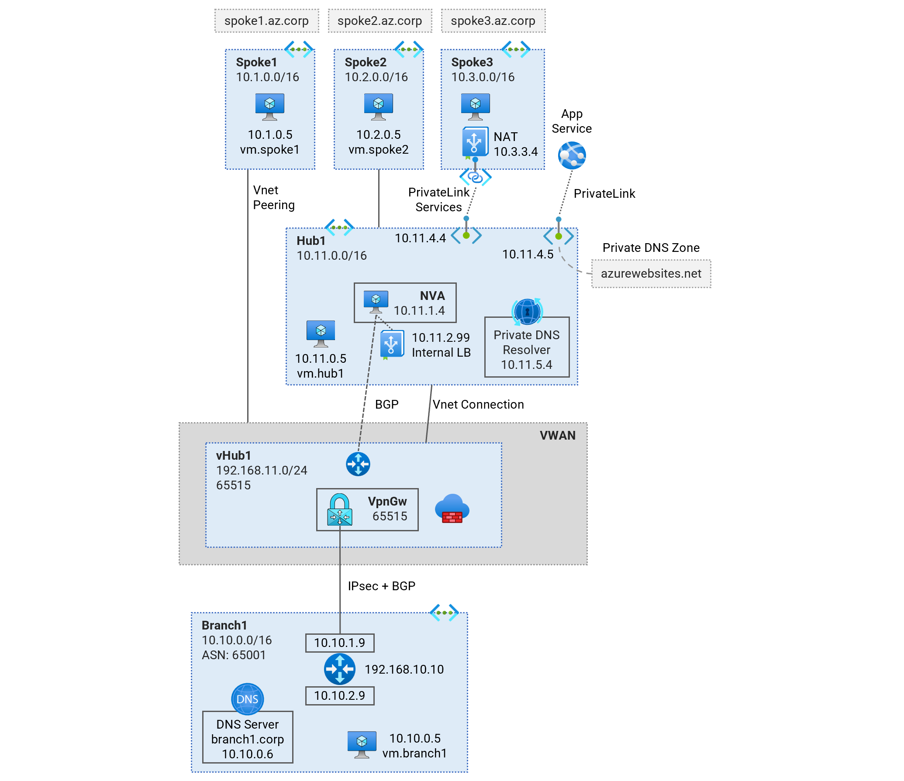
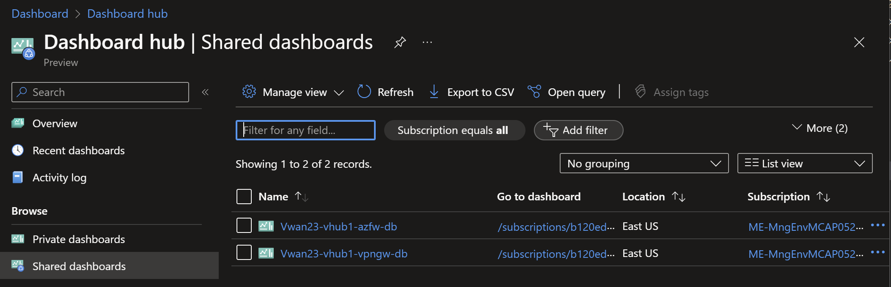
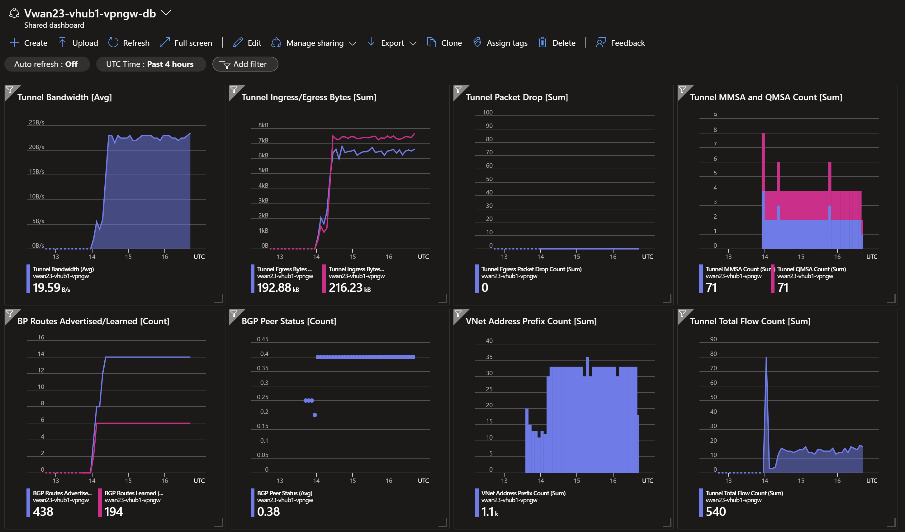
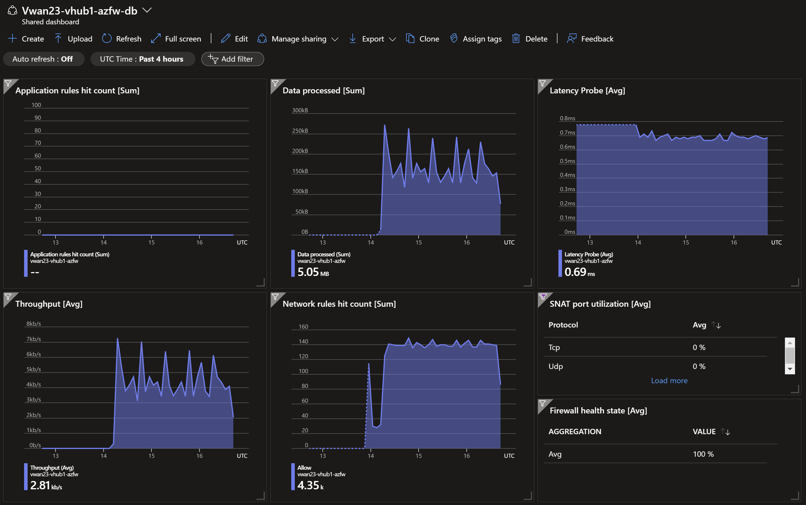
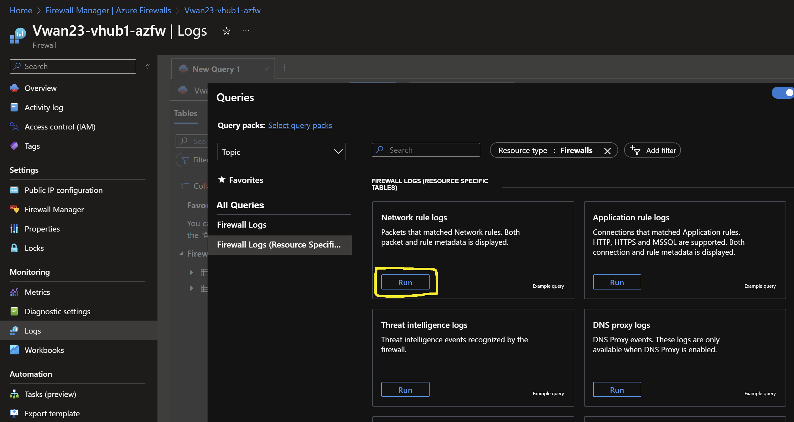
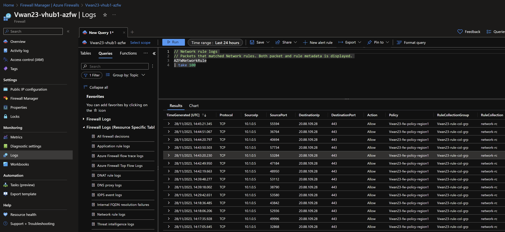

# Secured Virtual WAN - Single Region <!-- omit from toc -->

## Lab: Vwan23 <!-- omit from toc -->

Contents

- [Overview](#overview)
- [Prerequisites](#prerequisites)
- [Deploy the Lab](#deploy-the-lab)
- [Troubleshooting](#troubleshooting)
- [Outputs](#outputs)
- [Dashboards](#dashboards)
- [Testing](#testing)
  - [1. Ping IP](#1-ping-ip)
  - [2. Ping DNS](#2-ping-dns)
  - [3. Curl DNS](#3-curl-dns)
  - [4. Private Link Service](#4-private-link-service)
  - [5. Private Link (App Service) Access from Public Client](#5-private-link-app-service-access-from-public-client)
  - [6. Private Link (App Service) Access from On-premises](#6-private-link-app-service-access-from-on-premises)
  - [7. Virtual WAN Routes](#7-virtual-wan-routes)
  - [8. On-premises Routes](#8-on-premises-routes)
  - [9. Azure Firewall](#9-azure-firewall)
- [Cleanup](#cleanup)

## Overview

Deploy a single-region Secured Virtual WAN (Vwan) topology to observe traffic routing patterns. [Routing Intent](https://learn.microsoft.com/en-us/azure/virtual-wan/how-to-routing-policies) feature is enabled to allow traffic inspection through the Azure firewall in the virtual hub. Learn about traffic routing patterns, routing intent [security policies](https://learn.microsoft.com/en-us/azure/virtual-wan/how-to-routing-policies), [hybrid DNS](https://learn.microsoft.com/en-us/azure/dns/private-resolver-hybrid-dns) resolution, NVA integration into the virtual hub, and [PrivateLink Services](https://learn.microsoft.com/en-us/azure/private-link/private-link-service-overview) access to IaaS, [PrivateLink](https://learn.microsoft.com/en-us/azure/private-link/private-link-overview) access to PaaS services.



Standard Virtual Network (Vnet) hub, ***hub1*** connects to Vwan hub ***vHub1***. Direct spoke, ***spoke1*** is connected directly to the Vwan hub. ***Spoke2*** is an indirect spoke from a Vwan perspective; and is connected to the standard Vnet hub. ***Spoke2*** uses the Network Virtual Appliance (NVA) in the Vnet hub as the next hop for traffic to all destinations.

The isolated spoke (***spoke3***) does not have Vnet peering to the Vnet hub (***hub1***), but is reachable via [Private Link Service](https://learn.microsoft.com/en-us/azure/private-link/private-link-service-overview) endpoints in the hub.

***Branch1*** is our on-premises network simulated in a Vnet. A Multi-NIC Cisco-CSR-1000V Network Virtual Appliance (NVA) connects to the ***hub1*** using an IPsec VPN connection with dynamic (BGP) routing.

## Prerequisites

Ensure you meet all requirements in the [prerequisites](../../prerequisites/) before proceeding.

## Deploy the Lab

1. Clone the Git Repository for the Labs

   ```sh
   git clone https://github.com/kaysalawu/azure-network-terraform.git
   ```

2. Navigate to the lab directory

   ```sh
   cd azure-network-terraform/2-virtual-wan/3-vwan-sec-single-region
   ```

3. Run the following terraform commands and type ***yes*** at the prompt:

   ```sh
   terraform init
   terraform plan
   terraform apply -parallelism=50
   ```

## Troubleshooting

See the [troubleshooting](../../troubleshooting/) section for tips on how to resolve common issues that may occur during the deployment of the lab.

## Outputs

The table below shows the auto-generated output files from the lab. They are located in the `output` directory.

| Item    | Description  | Location |
|--------|--------|--------|
| IP ranges and DNS | IP ranges and DNS hostname values | [output/values.md](./output/values.md) |
| Branch DNS Server | Unbound DNS server configuration showing on-premises authoritative zones and conditional forwarding to hub private DNS resolver endpoint | [output/branch-unbound.sh](./output/branch-unbound.sh) |
| Branch1 NVA | Cisco IOS commands for IPsec VPN, BGP, route maps etc. | [output/branch1-nva.sh](./output/branch1-nva.sh) |
| Web server for workload VMs | Python Flask web server and various test and debug scripts | [output/server.sh](./output/server.sh) |
||||

## Dashboards

This lab contains a number of pre-configured dashboards for monitoring and troubleshooting network gateways, VPN gateways, and Azure Firewall.

To view the dashboards, follow the steps below:

1. From the Azure portal menu, select **Dashboard hub**.

2. Under **Browse**, select **Shared dashboards**.

3. Select the dashboard you want to view.

   

4. Click on the dashboard name.

5. Click on **Go to dashboard**.

   Sample dashboard for VPN gateway in ***hub1***.

    

    Sample dashboard for Azure Firewall in ***hub1***.

    

## Testing

Each virtual machine is pre-configured with a shell [script](../../scripts/server.sh) to run various types of network reachability tests. Serial console access has been configured for all virtual machines. You can [access the serial console](https://learn.microsoft.com/en-us/troubleshoot/azure/virtual-machines/serial-console-overview#access-serial-console-for-virtual-machines-via-azure-portal) of a virtual machine from the Azure portal.

Login to virtual machine `Vwan23-spoke1-vm` via the serial console:

- On Azure portal select *Virtual machines*
- Select the virtual machine `Vwan23-spoke1-vm`
- Under ***Help*** section, select ***Serial console*** and wait for a login prompt
- Enter the login credentials
  - username = ***azureuser***
  - password = ***Password123***
- You should now be in a shell session `azureuser@Vwan23-spoke1-vm:~$`

Run the following tests from inside the serial console session.

### 1. Ping IP

This script pings the IP addresses of some test virtual machines and reports reachability and round trip time.

**1.1.** Run the IP ping test

```sh
ping-ip
```

Sample output

```sh
azureuser@Vwan23-spoke1-vm:~$ ping-ip

 ping ip ...

branch1 - 10.10.0.5 -OK 7.501 ms
hub1    - 10.11.0.5 -OK 4.703 ms
spoke1  - 10.1.0.5 -OK 0.027 ms
spoke2  - 10.2.0.5 -OK 7.586 ms
internet - icanhazip.com -NA
```

### 2. Ping DNS

This script pings the DNS name of some test virtual machines and reports reachability and round trip time. This tests hybrid DNS resolution between on-premises and Azure.

**2.1.** Run the DNS ping test

```sh
ping-dns
```

Sample output

```sh
azureuser@Vwan23-spoke1-vm:~$ ping-dns

 ping dns ...

vm.branch1.corp - 10.10.0.5 -OK 5.973 ms
vm.hub1.we.az.corp - 10.11.0.5 -OK 5.915 ms
vm.spoke1.we.az.corp - 10.1.0.5 -OK 0.022 ms
vm.spoke2.we.az.corp - 10.2.0.5 -OK 4.915 ms
icanhazip.com - 104.18.114.97 -NA
```

### 3. Curl DNS

This script uses curl to check reachability of web server (python Flask) on the test virtual machines. It reports HTTP response message, round trip time and IP address.

**3.1.** Run the DNS curl test

```sh
curl-dns
```

Sample output

```sh
azureuser@Vwan23-spoke1-vm:~$ curl-dns

 curl dns ...

200 (0.045739s) - 10.10.0.5 - vm.branch1.corp
200 (0.024330s) - 10.11.0.5 - vm.hub1.we.az.corp
200 (0.024561s) - 10.11.7.4 - spoke3.p.hub1.we.az.corp
200 (0.022708s) - 10.1.0.5 - vm.spoke1.we.az.corp
200 (0.034620s) - 10.2.0.5 - vm.spoke2.we.az.corp
000 (2.001471s) -  - vm.spoke3.we.az.corp
200 (0.015935s) - 104.18.115.97 - icanhazip.com
200 (0.043908s) - 10.11.7.5 - vwan23-spoke3-2f34.azurewebsites.net
```

We can see that curl test to spoke3 virtual machine `vm.spoke3.we.az.corp` returns a ***000*** HTTP response code. This is expected since there is no Vnet peering from ***spoke3*** to ***hub1***. However, ***spoke3*** web application is reachable via Private Link Service private endpoint in ***hub1*** `spoke3.p.hub1.we.az.corp`.

### 4. Private Link Service

**4.1.** Test access to ***spoke3*** web application using the private endpoint in ***hub1***.

```sh
curl spoke3.p.hub1.we.az.corp
```

Sample output

```sh
azureuser@Vwan23-spoke1-vm:~$ curl spoke3.p.hub1.we.az.corp
{
  "Headers": {
    "Accept": "*/*",
    "Host": "spoke3.p.hub1.we.az.corp",
    "User-Agent": "curl/7.68.0"
  },
  "Hostname": "Vwan23-spoke3-vm",
  "Local-IP": "10.3.0.5",
  "Remote-IP": "10.3.6.4"
}
```

The `Hostname` and `Local-IP` fields identify the target web server - in this case ***spoke3*** virtual machine. The `Remote-IP` field (as seen by the web server) is an IP address in the Private Link Service NAT subnet in ***spoke3***.

### 5. Private Link (App Service) Access from Public Client

An app service instance is deployed for ***spoke3***. The app service instance is a fully managed PaaS service. In this lab, the service is linked to ***spoke3***. By using [Virtual Network integration](https://learn.microsoft.com/en-us/azure/app-service/overview-vnet-integration#regional-virtual-network-integration), the app service is deployed in a dedicated ***AppServiceSubnet*** subnet in ***spoke3***. This allows the app service to access private resources in ***spoke3*** Vnet.

The app service is accessible via the private endpoint in ***hub1***. The app service is also accessible via its public endpoint. The app service application is a simple [python Flask web application](https://hub.docker.com/r/ksalawu/web) that returns the HTTP headers, hostname and IP addresses of the server running the application.

The app service uses the following naming convention:

- vwan23-spoke3-AAAA.azurewebsites.net

Where ***AAAA*** is a randomly generated two-byte string.

**5.1.** On your local machine, get the hostname of the app service linked to ***spoke3***

```sh
spoke3_apps_url=$(az webapp list --resource-group Vwan23RG --query "[?contains(name, 'vwan23-spoke3')].defaultHostName" -o tsv)
```

**5.2.** Display the hostname

```sh
echo $spoke3_apps_url
```

Sample output (yours will be different)

```sh
vwan23-spoke3-2f34.azurewebsites.net
```

**5.3.** Resolve the hostname

```sh
nslookup $spoke3_apps_url
```

Sample output (yours will be different)

```sh
3-vwan-sec-single-region$ nslookup $spoke3_apps_url
Server:         172.29.160.1
Address:        172.29.160.1#53

Non-authoritative answer:
vwan23-spoke3-2f34.azurewebsites.net        canonical name = vwan23-spoke3-2f34-app.privatelink.azurewebsites.net.
vwan23-spoke3-2f34-app.privatelink.azurewebsites.net    canonical name = waws-prod-am2-483.sip.azurewebsites.windows.net.
waws-prod-am2-483.sip.azurewebsites.windows.net canonical name = waws-prod-am2-483-0a0b.westeurope.cloudapp.azure.com.
Name:   waws-prod-am2-483-0a0b.westeurope.cloudapp.azure.com
Address: 20.50.2.78
```

We can see that the endpoint is a public IP address, ***20.50.2.78***. We can see the CNAME `vwan23-spoke3-2f34-app.privatelink.azurewebsites.net` created for the app service which recursively resolves to the public IP address.

**5.4.** Test access to the ***spoke3*** app service via the public endpoint.

```sh
curl $spoke3_apps_url
```

Sample output

```sh
3-vwan-sec-single-region$ curl $spoke3_apps_url
{
  "Headers": {
    "Accept": "*/*",
    "Client-Ip": "140.228.48.45:30154",
    "Disguised-Host": "vwan23-spoke3-2f34.azurewebsites.net",
    "Host": "vwan23-spoke3-2f34.azurewebsites.net",
    "Max-Forwards": "10",
    "User-Agent": "curl/7.74.0",
    "Was-Default-Hostname": "vwan23-spoke3-2f34.azurewebsites.net",
    "X-Arr-Log-Id": "6c2ef07b-1232-4b06-9c4d-8bd9f989c8d3",
    "X-Client-Ip": "140.228.48.45",
    "X-Client-Port": "30154",
    "X-Forwarded-For": "140.228.48.45:30154",
    "X-Original-Url": "/",
    "X-Site-Deployment-Id": "vwan23-spoke3-2f34-app",
    "X-Waws-Unencoded-Url": "/"
  },
  "Hostname": "21af0cbdd35b",
  "Local-IP": "169.254.129.3",
  "Remote-IP": "169.254.129.1"
}
```

Observe that we are connecting from our local client's public IP address specified in the `X-Client-Ip`.

**(Optional)** Repeat *Step 5.1* through *Step 5.4* for the app service linked to ***spoke6***.

### 6. Private Link (App Service) Access from On-premises

**6.1** Recall the hostname of the app service in ***spoke3*** as done in *Step 5.2*. In this lab deployment, the hostname is `vwan23-spoke3-2f34.azurewebsites.net`.

**6.2.** Connect to the on-premises server `Vwan23-branch1-vm` [using the serial console](https://learn.microsoft.com/en-us/troubleshoot/azure/virtual-machines/serial-console-overview#access-serial-console-for-virtual-machines-via-azure-portal). We will test access from `Vwan23-branch1-vm` to the app service for ***spoke3*** via the private endpoint in ***hub1***.

**6.3.** Resolve the hostname DNS - which is `vwan23-spoke3-2f34.azurewebsites.net` in this example. Use your actual hostname from *Step 6.1*.

```sh
nslookup vwan23-spoke3-<AAAA>.azurewebsites.net
```

Sample output

```sh
azureuser@Vwan23-branch1-vm:~$ nslookup vwan23-spoke3-2f34.azurewebsites.net

Server:         127.0.0.53
Address:        127.0.0.53#53

Non-authoritative answer:
vwan23-spoke3-2f34.azurewebsites.net        canonical name = vwan23-spoke3-2f34-app.privatelink.azurewebsites.net.
Name:   vwan23-spoke3-2f34-app.privatelink.azurewebsites.net
Address: 10.11.7.5
```

We can see that the app service hostname resolves to the private endpoint ***10.11.7.5*** in ***hub1***. The following is a summary of the DNS resolution from `Vwan23-branch1-vm`:

- On-premises server `Vwan23-branch1-vm` makes a DNS request for `vwan23-spoke3-2f34.azurewebsites.net`
- The request is received by on-premises DNS server `Vwan23-branch1-dns`
- The DNS server resolves `vwan23-spoke3-2f34.azurewebsites.net` to the CNAME `vwan23-spoke3-2f34-app.privatelink.azurewebsites.net`
- The DNS server has a conditional DNS forwarding defined in the [unbound DNS configuration file](./output/branch-unbound.sh).

  ```sh
  forward-zone:
          name: "privatelink.azurewebsites.net."
          forward-addr: 10.11.8.4
  ```

  DNS Requests matching `privatelink.azurewebsites.net` will be forwarded to the private DNS resolver inbound endpoint in ***hub1*** (10.11.8.4).
- The DNS server forwards the DNS request to the private DNS resolver inbound endpoint in ***hub1*** - which returns the IP address of the app service private endpoint in ***hub1*** (10.11.7.5)

**6.4.** From `Vwan23-branch1-vm`, test access to the ***spoke3*** app service via the private endpoint. Use your actual hostname.

```sh
curl vwan23-spoke3-<AAAA>.azurewebsites.net
```

Sample output

```sh
azureuser@Vwan23-branch1-vm:~$ curl vwan23-spoke3-2f34.azurewebsites.net
{
  "Headers": {
    "Accept": "*/*",
    "Client-Ip": "[fd40:783d:12:9a2c:7312:100:a0a:5]:40472",
    "Disguised-Host": "vwan23-spoke3-2f34.azurewebsites.net",
    "Host": "vwan23-spoke3-2f34.azurewebsites.net",
    "Max-Forwards": "10",
    "User-Agent": "curl/7.68.0",
    "Was-Default-Hostname": "vwan23-spoke3-2f34.azurewebsites.net",
    "X-Arr-Log-Id": "a8c9984e-9ed0-4888-b031-23eb638f6a65",
    "X-Client-Ip": "10.10.0.5",
    "X-Client-Port": "0",
    "X-Forwarded-For": "10.10.0.5",
    "X-Original-Url": "/",
    "X-Site-Deployment-Id": "vwan23-spoke3-2f34-app",
    "X-Waws-Unencoded-Url": "/"
  },
  "Hostname": "21af0cbdd35b",
  "Local-IP": "169.254.129.3",
  "Remote-IP": "169.254.129.1"
}
```

Observe that we are connecting from the private IP address of `Vwan23-branch1-vm` (10.10.0.5) specified in the `X-Client-Ip`.

### 7. Virtual WAN Routes

**7.1.** Ensure you are in the lab directory `azure-network-terraform/2-virtual-wan/3-vwan-sec-single-region`

**7.2.** Display the virtual WAN routing table(s)

```sh
sh ../../scripts/_routes.sh Vwan23RG
```

Sample output

```sh
3-vwan-sec-single-region$ sh ../../scripts/_routes.sh Vwan23RG

Resource group: Vwan23RG

vHub:       Vwan23-vhub1-hub
RouteTable: defaultRouteTable
-------------------------------------------------------

AddressPrefixes    NextHopType
-----------------  --------------
0.0.0.0/0          Azure Firewall
10.0.0.0/8         Azure Firewall
172.16.0.0/12      Azure Firewall
192.168.0.0/16     Azure Firewall
8.8.8.8/32         Azure Firewall


vHub:     Vwan23-vhub1-hub
Firewall: Vwan23-vhub1-azfw
-------------------------------------------------------

AddressPrefixes    AsPath    NextHopType
-----------------  --------  --------------------------
10.10.0.0/24       65001     VPN_S2S_Gateway
10.11.0.0/16                 Virtual Network Connection
10.1.0.0/16                  Virtual Network Connection
10.2.0.0/16        65010     HubBgpConnection
0.0.0.0/0                    Internet
```

### 8. On-premises Routes

Login to the onprem router `Vwan23-branch1-nva` in order to observe its dynamic routes.

**8.1.** Login to virtual machine `Vwan23-branch1-nva` via the [serial console](https://learn.microsoft.com/en-us/troubleshoot/azure/virtual-machines/serial-console-overview#access-serial-console-for-virtual-machines-via-azure-portal).

**8.2.** Enter username and password

   - username = ***azureuser***
   - password = ***Password123***

**8.3.** Enter the Cisco ***enable*** mode

```sh
enable
```

**8.4.** Display the routing table by typing `show ip route` and pressing the space bar to show the complete output.

```sh
show ip route
```

Sample output

```sh
Vwan23-branch1-nva-vm#show ip route
...
[Truncated for brevity]
...
Gateway of last resort is 10.10.1.1 to network 0.0.0.0

S*    0.0.0.0/0 [1/0] via 10.10.1.1
      10.0.0.0/8 is variably subnetted, 12 subnets, 4 masks
B        10.1.0.0/16 [20/0] via 192.168.11.12, 00:52:37
B        10.2.0.0/16 [20/0] via 192.168.11.12, 00:52:37
S        10.10.0.0/24 [1/0] via 10.10.3.1
C        10.10.1.0/24 is directly connected, GigabitEthernet1
L        10.10.1.9/32 is directly connected, GigabitEthernet1
C        10.10.3.0/24 is directly connected, GigabitEthernet2
L        10.10.3.9/32 is directly connected, GigabitEthernet2
C        10.10.10.0/30 is directly connected, Tunnel0
L        10.10.10.1/32 is directly connected, Tunnel0
C        10.10.10.4/30 is directly connected, Tunnel1
L        10.10.10.5/32 is directly connected, Tunnel1
B        10.11.0.0/16 [20/0] via 192.168.11.12, 00:52:37
      168.63.0.0/32 is subnetted, 1 subnets
S        168.63.129.16 [254/0] via 10.10.1.1
      169.254.0.0/32 is subnetted, 1 subnets
S        169.254.169.254 [254/0] via 10.10.1.1
      192.168.10.0/32 is subnetted, 1 subnets
C        192.168.10.10 is directly connected, Loopback0
      192.168.11.0/24 is variably subnetted, 3 subnets, 2 masks
B        192.168.11.0/24 [20/0] via 192.168.11.12, 00:52:37
S        192.168.11.12/32 is directly connected, Tunnel0
S        192.168.11.13/32 is directly connected, Tunnel1
```

We can see the Vnet ranges learned dynamically via BGP.

**8.5.** Display BGP information by typing `show ip bgp` and pressing the space bar to show the complete output.

```sh
show ip bgp
```

Sample output

```sh
Vwan23-branch1-nva-vm#show ip bgp
BGP table version is 38, local router ID is 192.168.10.10
Status codes: s suppressed, d damped, h history, * valid, > best, i - internal,
              r RIB-failure, S Stale, m multipath, b backup-path, f RT-Filter,
              x best-external, a additional-path, c RIB-compressed,
              t secondary path, L long-lived-stale,
Origin codes: i - IGP, e - EGP, ? - incomplete
RPKI validation codes: V valid, I invalid, N Not found

     Network          Next Hop            Metric LocPrf Weight Path
 r    0.0.0.0          192.168.11.13                          0 65515 i
 r>                    192.168.11.12                          0 65515 i
 *    10.1.0.0/16      192.168.11.13                          0 65515 i
 *>                    192.168.11.12                          0 65515 i
 *    10.2.0.0/16      192.168.11.13            0             0 65515 65010 i
 *>                    192.168.11.12            0             0 65515 65010 i
 *>   10.10.0.0/24     10.10.3.1                0         32768 i
 *    10.11.0.0/16     192.168.11.13                          0 65515 i
 *>                    192.168.11.12                          0 65515 i
 *    192.168.11.0     192.168.11.13                          0 65515 i
 *>                    192.168.11.12                          0 65515 i
```

We can see the Vnet ranges learned dynamically via BGP.

### 9. Azure Firewall

**9.1.** Check the Azure Firewall logs to observe the traffic flow.

- Select the Azure Firewall resource `Vwan23-hub1-azfw` in the Azure portal.
- Click on **Logs** in the left navigation pane.
- Click on **Firewall Logs (Resource Specific Tables)**.
- Click on **Run** in the log category *Network rule logs*.



Observe the firewall logs based on traffic flows generated from our tests.



## Cleanup

1. (Optional) Navigate back to the lab directory (if you are not already there)

   ```sh
   cd azure-network-terraform/2-virtual-wan/3-vwan-sec-single-region
   ```

2. In order to avoid terraform errors when re-deploying this lab, run a cleanup script to remove diagnostic settings that may not be removed after the resource group is deleted.

   ```sh
   bash ../../scripts/_cleanup.sh Vwan23
   ```

   Sample output

   ```sh
   3-vwan-sec-single-region$    bash ../../scripts/_cleanup.sh Vwan23

   Resource group: Vwan23RG

   ⏳ Checking for diagnostic settings on resources in Vwan23RG ...
   ➜  Checking firewall ...
       ❌ Deleting: diag setting [Vwan23-vhub1-azfw-diag] for firewall [Vwan23-vhub1-azfw] ...
   ➜  Checking vnet gateway ...
   ➜  Checking vpn gateway ...
       ❌ Deleting: diag setting [Vwan23-vhub1-vpngw-diag] for vpn gateway [Vwan23-vhub1-vpngw] ...
   ➜  Checking er gateway ...
   ➜  Checking app gateway ...
   ⏳ Checking for azure policies in Vwan24RG ...
   Done!
   ```

3. Delete the resource group to remove all resources installed.

   ```sh
   az group delete -g Vwan23RG --no-wait
   ```

4. Delete terraform state files and other generated files.

   ```sh
   rm -rf .terraform*
   rm terraform.tfstate*
   ```
