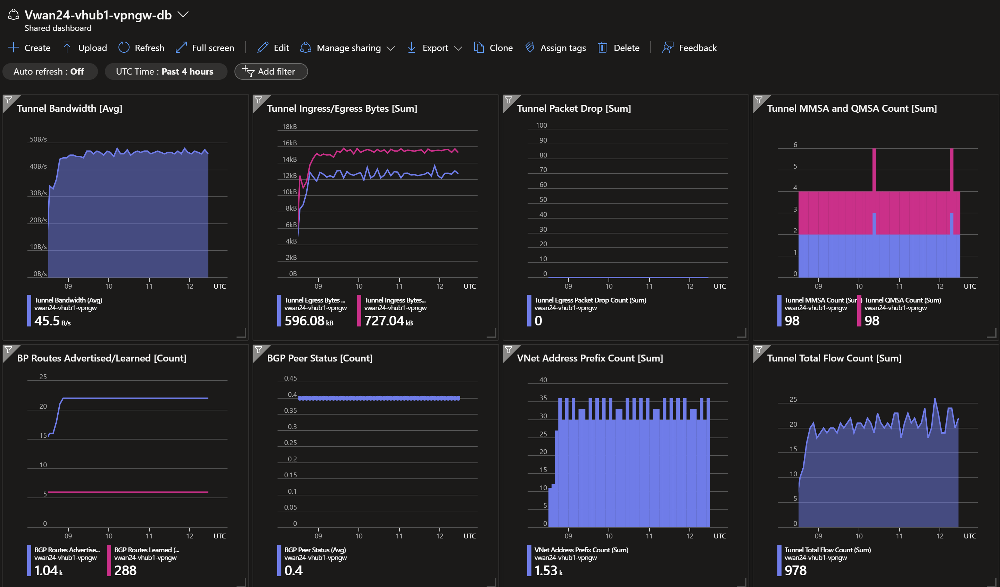
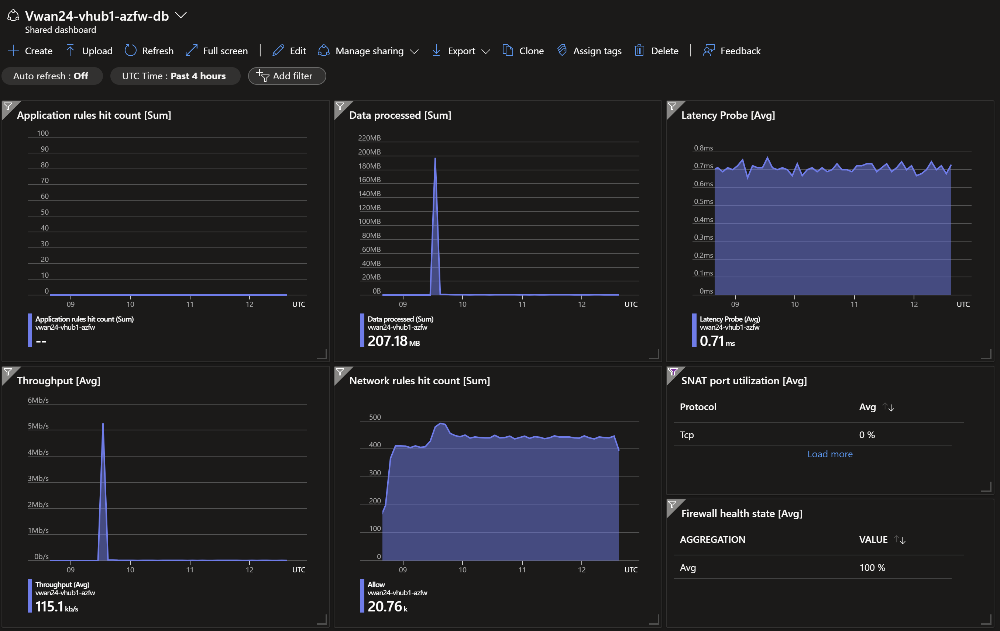
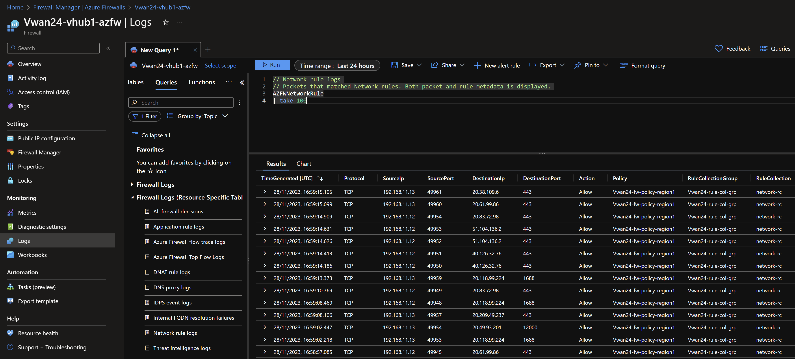

# Secured Virtual WAN - Dual Region (Azure FW) <!-- omit from toc -->

## Lab: Vwan24 <!-- omit from toc -->

Contents

- [Overview](#overview)
- [Prerequisites](#prerequisites)
- [Deploy the Lab](#deploy-the-lab)
- [Troubleshooting](#troubleshooting)
- [Outputs](#outputs)
- [Dashboards (Optional)](#dashboards-optional)
- [Testing](#testing)
  - [1. Ping IP](#1-ping-ip)
  - [2. Ping DNS](#2-ping-dns)
  - [3. Curl DNS](#3-curl-dns)
  - [4. Private Link Service](#4-private-link-service)
  - [5. Private Link Access to Storage Account](#5-private-link-access-to-storage-account)
  - [6. Private Link Access to Storage Account from On-premises](#6-private-link-access-to-storage-account-from-on-premises)
  - [7. Virtual WAN Routes](#7-virtual-wan-routes)
  - [8. On-premises Routes](#8-on-premises-routes)
  - [9. Azure Firewall (Optional)](#9-azure-firewall-optional)
- [Cleanup](#cleanup)

## Overview

This lab deploys a dual-region Secured Virtual WAN (Vwan) topology. [Routing Intent](https://learn.microsoft.com/en-us/azure/virtual-wan/how-to-routing-policies) feature is enabled to allow traffic inspection through the Azure firewalls in the virtual hubs. The lab demonstrates multi-region traffic routing patterns, routing intent [security policies](https://learn.microsoft.com/en-us/azure/virtual-wan/how-to-routing-policies), [hybrid DNS](https://learn.microsoft.com/en-us/azure/dns/private-resolver-hybrid-dns) resolution, [connecting NVA](https://learn.microsoft.com/en-us/azure/virtual-wan/scenario-bgp-peering-hub) into the virtual hubs, and [PrivateLink Services](https://learn.microsoft.com/en-us/azure/private-link/private-link-service-overview) access to IaaS, [PrivateLink](https://learn.microsoft.com/en-us/azure/private-link/private-link-overview) access to PaaS services.


Standard Virtual Network (Vnet) hubs (***hub1*** and ***hub2***) connect to Vwan hubs (***vHub1*** and ***vHub2*** respectively). Direct spokes (***spoke1*** and ***spoke4***) are connected directly to the Vwan hubs. ***Spoke2*** and ***spoke5*** are indirect spokes from a Vwan perspective; and are connected to standard Vnet hubs. ***Spoke2*** and ***spoke5*** use the Network Virtual Appliance (NVA) in the Vnet hubs as the next hop to all destinations.

The isolated spokes (***spoke3*** and ***spoke6***) do not have Vnet peering to the Vnet hubs, but are reachable via [Private Link Service](https://learn.microsoft.com/en-us/azure/private-link/private-link-service-overview) endpoints in the hubs.

***Branch1*** and ***branch3*** are on-premises networks simulated using Vnets. Multi-NIC Linux NVA appliances in the branches connect to the virtual hubs using IPsec VPN connections with dynamic (BGP) routing. Branches connect to each other via the Virtual WAN.

## Prerequisites

Ensure you meet all requirements in the [prerequisites](../../prerequisites/README.md) before proceeding.

## Deploy the Lab

1. Clone the Git Repository for the Labs

   ```sh
   git clone https://github.com/kaysalawu/azure-network-terraform.git
   ```

2. Navigate to the lab directory

   ```sh
   cd azure-network-terraform/2-virtual-wan/4-vwan-sec-dual-region
   ```
3. (Optional) If you want to enable additional features such as IPv6, Vnet flow logs and logging set the following variables to `true` in the [`02-main.tf`](./02-main.tf) file.

   | Variable | Description | Default | Link |
   |----------|-------------|---------|------|
   | enable_diagnostics | Enable Azure Monitor diagnostics | false | [main.tf](./02-main.tf#L9) |
   | enable_ipv6 | Enable IPv6 on all supported resources | false | [main.tf](./02-main.tf#L10) |
   | enable_flow_logs | Enable Vnet flow logs in the Vnet hubs | false | [main.tf](./02-main.tf#L11) |
   ||||
4. Run the following terraform commands and type ***yes*** at the prompt:

   ```sh
   terraform init
   terraform plan
   terraform apply -parallelism=50
   ```

## Troubleshooting

See the [troubleshooting](../../troubleshooting/README.md) section for tips on how to resolve common issues that may occur during the deployment of the lab.

## Outputs

The table below shows the auto-generated output files from the lab. They are located in the `output` directory.

| Item    | Description  | Location |
|--------|--------|--------|
| IP ranges and DNS | IP ranges and DNS hostname values | [output/values.md](./output/values.md) |
| Branch1 DNS | Authoritative DNS and forwarding | [output/branch1Dns.sh](./output/branch1Dns.sh) |
| Branch3 DNS | Authoritative DNS and forwarding | [output/branch3Dns.sh](./output/branch3Dns.sh) |
| Branch1 NVA | Linux Strongswan + FRR configuration | [output/branch1Nva.sh](./output/branch1Nva.sh) |
| Branch3 NVA | Linux Strongswan + FRR configuration | [output/branch3Nva.sh](./output/branch3Nva.sh) |
| Hub1 NVA | Linux NVA configuration | [output/hub1-linux-nva.sh](./output/hub1-linux-nva.sh) |
| Hub2 NVA | Linux NVA configuration | [output/hub2-linux-nva.sh](./output/hub2-linux-nva.sh) |
| Web server | Python Flask web server, test scripts | [output/server.sh](./output/server.sh) |
||||

## Dashboards (Optional)

This lab contains a number of pre-configured dashboards for monitoring gateways, VPN gateways, and Azure Firewall. To deploy the dashboards, set `enable_diagnostics = true` in the [`02-main.tf`](./02-main.tf) file. Then run `terraform apply` to update the deployment.

<details>

<summary>Sample Dashboards</summary>

To view the dashboards, follow the steps below:

1. From the Azure portal menu, select **Dashboard hub**.

2. Under **Browse**, select **Shared dashboards**.

3. Select the dashboard you want to view.

4. Click on a dashboard under **Go to dashboard** column.

   Sample dashboard for VPN gateway in ***hub1***.

    

    Sample dashboard for Azure Firewall in ***hub1***.

   

</details>
<p>

## Testing

Each virtual machine is pre-configured with a shell [script](../../scripts/server.sh) to run various types of network reachability tests. Serial console access has been configured for all virtual machines.

Login to virtual machine `Vwan24-spoke1Vm` via the [serial console](https://learn.microsoft.com/en-us/troubleshoot/azure/virtual-machines/serial-console-overview#access-serial-console-for-virtual-machines-via-azure-portal):

- On Azure portal select *Virtual machines*
- Select the virtual machine `Vwan24-spoke1Vm`
- Under ***Help*** section, select ***Serial console*** and wait for a login prompt
- Enter the login credentials
  - username = ***azureuser***
  - password = ***Password123***
- You should now be in a shell session `azureuser@Vwan24-spoke1Vm:~$`

Run the following tests from inside the serial console session.

### 1. Ping IP

This script pings the IP addresses of some test virtual machines and reports reachability and round trip time.

**1.1.** Run the IP ping tests

```sh
ping-ipv4
ping-ipv6
```

<details>

<summary>Sample output</summary>

```sh
azureuser@spoke1Vm:~$ ping-ipv4

 ping ipv4 ...

branch1 - 10.10.0.5 -OK 4.344 ms
hub1    - 10.11.0.5 -OK 3.142 ms
spoke1  - 10.1.0.5 -OK 0.049 ms
spoke2  - 10.2.0.5 -OK 4.001 ms
branch3 - 10.30.0.5 -OK 75.328 ms
hub2    - 10.22.0.5 -OK 71.630 ms
spoke4  - 10.4.0.5 -OK 70.453 ms
spoke5  - 10.5.0.5 -OK 71.822 ms
internet - icanhazip.com -NA
```

```sh
azureuser@spoke1Vm:~$ ping-ipv6

 ping ipv6 ...

branch1 - fd00:db8:10::5 -NA
hub1    - fd00:db8:11::5 -NA
spoke1  - fd00:db8:1::5 -OK 0.035 ms
spoke2  - fd00:db8:2::5 -NA
branch3 - fd00:db8:30::5 -NA
hub2    - fd00:db8:22::5 -NA
spoke4  - fd00:db8:4::5 -NA
spoke5  - fd00:db8:5::5 -NA
internet - icanhazip.com -NA
```

`Spoke1Vm` cannot reach any destinations via the Virtual WAN hub; which currently does not support IPv6.

</details>
<p>

### 2. Ping DNS

This script pings the DNS name of some test virtual machines and reports reachability and round trip time. This tests hybrid DNS resolution between on-premises and Azure.

**2.1.** Run the DNS ping tests

```sh
ping-dns4
ping-dns6
```

<details>

<summary>Sample output</summary>

```sh
azureuser@spoke1Vm:~$ ping-dns4

 ping dns ipv4 ...

branch1vm.corp - 10.10.0.5 -OK 4.655 ms
hub1vm.eu.az.corp - 10.11.0.5 -OK 2.995 ms
spoke1vm.eu.az.corp - 10.1.0.5 -OK 0.037 ms
spoke2vm.eu.az.corp - 10.2.0.5 -OK 3.436 ms
branch3vm.corp - 10.30.0.5 -OK 72.554 ms
hub2vm.us.az.corp - 10.22.0.5 -OK 72.175 ms
spoke4vm.us.az.corp - 10.4.0.5 -OK 69.998 ms
spoke5vm.us.az.corp - 10.5.0.5 -OK 71.609 ms
icanhazip.com - 104.16.185.241 -NA
```

```sh
azureuser@spoke1Vm:~$ ping-dns6

 ping dns ipv6 ...

branch1vm.corp - fd00:db8:10::5 -NA
hub1vm.eu.az.corp - fd00:db8:11::5 -NA
spoke1vm.eu.az.corp - fd00:db8:1::5 -OK 0.040 ms
spoke2vm.eu.az.corp - fd00:db8:2::5 -NA
branch3vm.corp - fd00:db8:30::5 -NA
hub2vm.us.az.corp - fd00:db8:22::5 -NA
spoke4vm.us.az.corp - fd00:db8:4::5 -NA
spoke5vm.us.az.corp - fd00:db8:5::5 -NA
icanhazip.com - 2606:4700::6810:b8f1 -NA
```

`Spoke1Vm` cannot reach any destinations via the Virtual WAN hub which currently does not support IPv6.

</details>
<p>

### 3. Curl DNS

This script uses curl to check reachability of web server (python Flask) on the test virtual machines. It reports HTTP response message, round trip time and IP address.

**3.1.** Run the DNS curl test

```sh
curl-dns4
curl-dns6
```

<details>

<summary>Sample output</summary>

```sh
azureuser@spoke1Vm:~$ curl-dns4

 curl dns ipv4 ...

200 (0.016048s) - 10.10.0.5 - branch1vm.corp
200 (0.012039s) - 10.11.0.5 - hub1vm.eu.az.corp
200 (0.006265s) - 10.11.7.88 - spoke3pls.eu.az.corp
200 (0.009690s) - 10.1.0.5 - spoke1vm.eu.az.corp
200 (0.016607s) - 10.2.0.5 - spoke2vm.eu.az.corp
200 (0.151705s) - 10.30.0.5 - branch3vm.corp
200 (0.151778s) - 10.22.0.5 - hub2vm.us.az.corp
200 (0.142176s) - 10.22.7.88 - spoke6pls.us.az.corp
200 (0.154482s) - 10.4.0.5 - spoke4vm.us.az.corp
200 (0.160333s) - 10.5.0.5 - spoke5vm.us.az.corp
200 (0.016558s) - 104.16.184.241 - icanhazip.com
200 (0.035977s) - 10.11.7.99 - https://vwan24spoke3sa5d99.blob.core.windows.net/spoke3/spoke3.txt
200 (0.303681s) - 10.22.7.99 - https://vwan24spoke6sa5d99.blob.core.windows.net/spoke6/spoke6.txt
```

```sh
azureuser@spoke1Vm:~$ curl-dns6

 curl dns ipv6 ...

 - branch1vm.corp
 - hub1vm.eu.az.corp
000 (0.007560s) -  - spoke3pls.eu.az.corp
200 (0.010092s) - fd00:db8:1::5 - spoke1vm.eu.az.corp
 - spoke2vm.eu.az.corp
 - branch3vm.corp
 - hub2vm.us.az.corp
000 (0.013936s) -  - spoke6pls.us.az.corp
 - spoke4vm.us.az.corp
 - spoke5vm.us.az.corp
000 (2.251979s) -  - icanhazip.com
000 (0.006467s) -  - https://vwan24spoke3sa5d99.blob.core.windows.net/spoke3/spoke3.txt
000 (0.009678s) -  - https://vwan24spoke6sa5d99.blob.core.windows.net/spoke6/spoke6.txt
```

</details>
<p>

### 4. Private Link Service

**4.1.** Test access to ***spoke3*** web application using the private endpoint in ***hub1***.

```sh
curl spoke3pls.eu.az.corp
```

<details>

<summary>Sample output</summary>

```json
azureuser@spoke1Vm:~$ curl spoke3pls.eu.az.corp
{
  "app": "SERVER",
  "hostname": "spoke3Vm",
  "server-ipv4": "10.3.0.5",
  "server-ipv6": "NotFound",
  "remote-addr": "10.3.6.4",
  "headers": {
    "host": "spoke3pls.eu.az.corp",
    "user-agent": "curl/7.68.0",
    "accept": "*/*"
  }
}
```

</details>
<p>

**4.2.** Test access to ***spoke6*** web application using the private endpoint in ***hub2***.

```sh
curl spoke6pls.us.az.corp
```

<details>

<summary>Sample output</summary>

```json
azureuser@spoke1Vm:~$ curl spoke6pls.us.az.corp
{
  "app": "SERVER",
  "hostname": "spoke6Vm",
  "server-ipv4": "10.6.0.5",
  "server-ipv6": "NotFound",
  "remote-addr": "10.6.6.4",
  "headers": {
    "host": "spoke6pls.us.az.corp",
    "user-agent": "curl/7.68.0",
    "accept": "*/*"
  }
}
```

</details>
<p>

The `Hostname`, `server-ipv4` and `server-ipv6` fields identify the backend web servers - in this case `spoke3Vm` and `spoke6Vm` virtual machines. The `remote-addr` fields (as seen by the web servers) are IP addresses in the Private Link Service NAT subnets in ***spoke3*** and ***spoke6*** Vnets respectively.

### 5. Private Link Access to Storage Account

Storage accounts with container blobs are deployed and accessible via private endpoints in ***hub1*** and ***hub2*** Vnets respectively. The storage accounts have the following naming convention:

* vwan24spoke3sa\<AAAA\>.blob.core.windows.net
* vwan24spoke6sa\<BBBB\>.blob.core.windows.net

Where ***\<AAAA\>*** and ***\<BBBB\>*** are randomly generated two-byte strings.

**5.1.** On your Cloudshell (or local machine), get the storage account hostname and blob URL.

```sh
spoke3_storage_account=$(az storage account list -g Vwan24_SecVwan_2Region_RG --query "[?contains(name, 'vwan24spoke3sa')].name" -o tsv)

spoke3_sgtacct_host="$spoke3_storage_account.blob.core.windows.net"
spoke3_blob_url="https://$spoke3_sgtacct_host/spoke3/spoke3.txt"

echo -e "\n$spoke3_sgtacct_host\n" && echo
```

<details>

<summary>Sample output</summary>

```sh
vwan24spoke3sa5d99.blob.core.windows.net
```

</details>
<p>

**5.2.** Resolve the hostname

```sh
nslookup $spoke3_sgtacct_host
```

<details>

<summary>Sample output</summary>

```sh
4-vwan-sec-dual-region$ nslookup $spoke3_sgtacct_host
Server:         127.0.0.53
Address:        127.0.0.53#53

Non-authoritative answer:
vwan24spoke3sa5d99.blob.core.windows.net  canonical name = vwan24spoke3sa5d99.privatelink.blob.core.windows.net.
vwan24spoke3sa5d99.privatelink.blob.core.windows.net      canonical name = blob.db4prdstr15a.store.core.windows.net.
Name:   blob.db4prdstr15a.store.core.windows.net
Address: 20.60.204.97
```

</details>
<p>

We can see that the endpoint is a public IP address, ***20.60.204.97***. We can see the CNAME `vwan24spoke3sa5d99.privatelink.blob.core.windows.net.` created for the storage account which recursively resolves to the public IP address.

**5.3.** Test access to the storage account blob.

```sh
curl $spoke3_blob_url && echo
```

<details>

<summary>Sample output</summary>

```sh
Hello, World!
```

</details>
<p>

### 6. Private Link Access to Storage Account from On-premises

**6.1** Login to on-premises virtual machine `Vwan24-branch1Vm` via the [serial console](https://learn.microsoft.com/en-us/troubleshoot/azure/virtual-machines/serial-console-overview#access-serial-console-for-virtual-machines-via-azure-portal):
  - username = ***azureuser***
  - password = ***Password123***

 We will test access from `Vwan24-branch1Vm` to the storage account for ***spoke3*** via the private endpoint in ***hub1***.

**6.2.** Run `az login` using the VM's system-assigned managed identity.

```sh
az login --identity
```

<details>

<summary>Sample output</summary>

```json
azureuser@branch1Vm:~$ az login --identity
[
  {
    "environmentName": "AzureCloud",
    "homeTenantId": "aaa-bbb-ccc-ddd-eee",
    "id": "xxx-yyy-1234-1234-1234",
    "isDefault": true,
    "managedByTenants": [
      {
        "tenantId": "your-tenant-id"
      }
    ],
    "name": "some-random-name",
    "state": "Enabled",
    "tenantId": "your-tenant-id",
    "user": {
      "assignedIdentityInfo": "MSI",
      "name": "systemAssignedIdentity",
      "type": "servicePrincipal"
    }
  }
]
```

</details>
<p>

**6.3.** Get the storage account hostname and blob URL.

```sh
spoke3_storage_account=$(az storage account list -g Vwan24_SecVwan_2Region_RG --query "[?contains(name, 'vwan24spoke3sa')].name" -o tsv)

spoke3_sgtacct_host="$spoke3_storage_account.blob.core.windows.net"
spoke3_blob_url="https://$spoke3_sgtacct_host/spoke3/spoke3.txt"

echo -e "\n$spoke3_sgtacct_host\n" && echo
```

<details>

<summary>Sample output</summary>

```sh
vwan24spoke3sa5d99.blob.core.windows.net
```

</details>
<p>

**6.4.** Resolve the storage account DNS name

```sh
nslookup $spoke3_sgtacct_host
```

<details>

<summary>Sample output</summary>

```sh
azureuser@branch1Vm:~$ nslookup $spoke3_sgtacct_host
Server:         127.0.0.53
Address:        127.0.0.53#53

Non-authoritative answer:
vwan24spoke3sa5d99.blob.core.windows.net  canonical name = vwan24spoke3sa5d99.privatelink.blob.core.windows.net.
Name:   vwan24spoke3sa5d99.privatelink.blob.core.windows.net
Address: 10.11.7.99
```

</details>
<p>

We can see that the storage account hostname resolves to the private endpoint ***10.11.7.99*** in ***hub1***. The following is a summary of the DNS resolution from `Vwan24-branch1Vm`:

- On-premises server `Vwan24-branch1Vm` makes a DNS request for `vwan24spoke3sa5d99.blob.core.windows.net`
- The request is received by on-premises DNS server `Vwan24-branch1-dns`
- The DNS server resolves `vwan24spoke3sa5d99.blob.core.windows.net` to the CNAME `vwan24spoke3sa5d99.privatelink.blob.core.windows.net`
- The DNS server has a conditional DNS forwarding defined in the branch1 unbound DNS configuration file, [output/branch1Dns.sh](./output/branch1Dns.sh).

  ```sh
  forward-zone:
          name: "privatelink.blob.core.windows.net."
          forward-addr: 10.11.8.4
  ```

  DNS Requests matching `privatelink.blob.core.windows.net` will be forwarded to the private DNS resolver inbound endpoint in ***hub1*** (10.11.8.4).
- The DNS server forwards the DNS request to the private DNS resolver inbound endpoint in ***hub1*** - which returns the IP address of the storage account private endpoint in ***hub1*** (10.11.7.99)

**6.5.** Test access to the storage account blob.

```sh
curl $spoke3_blob_url && echo
```

<details>

<summary>Sample output</summary>

```sh
Hello, World!
```

</details>
<p>

### 7. Virtual WAN Routes

**7.1.** Switch back to the lab directory `azure-network-terraform/2-virtual-wan/4-vwan-sec-dual-region`

**7.2.** Display the virtual WAN routing tables

```sh
bash ../../scripts/_routes_vwan.sh Vwan24_SecVwan_2Region_RG
```

<details>

<summary>Sample output</summary>

```sh
4-vwan-sec-dual-region$ bash ../../scripts/_routes_vwan.sh Vwan24_SecVwan_2Region_RG

Resource group: Vwan24_SecVwan_2Region_RG

vHub:       Vwan24-vhub2-hub
RouteTable: defaultRouteTable
-------------------------------------------------------

AddressPrefixes    NextHopType
-----------------  --------------
0.0.0.0/0          Azure Firewall
10.0.0.0/8         Azure Firewall
172.16.0.0/12      Azure Firewall
192.168.0.0/16     Azure Firewall


vHub:     Vwan24-vhub2-hub
Firewall: Vwan24-vhub2-azfw
-------------------------------------------------------

AddressPrefixes    AsPath             NextHopType
-----------------  -----------------  --------------------------
10.1.0.0/16        65520-65520        Remote Hub
10.10.0.0/24       65520-65520-65001  Remote Hub
10.2.0.0/16        65520-65520-65010  Remote Hub
10.11.0.0/16       65520-65520        Remote Hub
10.30.0.0/24       65003              VPN_S2S_Gateway
10.4.0.0/16                           Virtual Network Connection
10.22.0.0/16                          Virtual Network Connection
10.5.0.0/16        65020              HubBgpConnection
0.0.0.0/0                             Internet

vHub:       Vwan24-vhub1-hub
RouteTable: defaultRouteTable
-------------------------------------------------------

AddressPrefixes    NextHopType
-----------------  --------------
0.0.0.0/0          Azure Firewall
10.0.0.0/8         Azure Firewall
172.16.0.0/12      Azure Firewall
192.168.0.0/16     Azure Firewall


vHub:     Vwan24-vhub1-hub
Firewall: Vwan24-vhub1-azfw
-------------------------------------------------------

AddressPrefixes    AsPath             NextHopType
-----------------  -----------------  --------------------------
10.10.0.0/24       65001              VPN_S2S_Gateway
10.11.0.0/16                          Virtual Network Connection
10.1.0.0/16                           Virtual Network Connection
10.2.0.0/16        65010              HubBgpConnection
10.5.0.0/16        65520-65520-65020  Remote Hub
10.30.0.0/24       65520-65520-65003  Remote Hub
10.22.0.0/16       65520-65520        Remote Hub
10.4.0.0/16        65520-65520        Remote Hub
0.0.0.0/0                             Internet
```
</details>
<p>

### 8. On-premises Routes

**8.1** Login to on-premises virtual machine `Vwan24-branch1Nva` via the [serial console](https://learn.microsoft.com/en-us/troubleshoot/azure/virtual-machines/serial-console-overview#access-serial-console-for-virtual-machines-via-azure-portal):
  - username = ***azureuser***
  - password = ***Password123***

**8.2.** Enter the VTY shell for the FRRouting daemon.

```sh
sudo vtysh
```

<details>

<summary>Sample output</summary>

```sh
azureuser@branch1Nva:~$ sudo vtysh

Hello, this is FRRouting (version 7.2.1).
Copyright 1996-2005 Kunihiro Ishiguro, et al.
```

</details>
<p>

**8.3.** Display the routing table by typing `show ip route` and pressing the space bar to show the complete output.

```sh
show ip route
show ipv6 route
```

<details>

<summary>Sample output</summary>

```sh
branch1Nva# show ip route
Codes: K - kernel route, C - connected, S - static, R - RIP,
       O - OSPF, I - IS-IS, B - BGP, E - EIGRP, N - NHRP,
       T - Table, v - VNC, V - VNC-Direct, A - Babel, D - SHARP,
       F - PBR, f - OpenFabric,
       > - selected route, * - FIB route, q - queued route, r - rejected route

B   0.0.0.0/0 [20/0] via 192.168.11.12, vti1, 00:03:53
                     via 192.168.11.13, vti0, 00:03:53
S   0.0.0.0/0 [1/0] via 10.10.1.1, eth0, 01:10:26
K>* 0.0.0.0/0 [0/100] via 10.10.1.1, eth0, src 10.10.1.9, 01:10:26
B>* 10.1.0.0/16 [20/0] via 192.168.11.12, vti1, 00:03:53
  *                    via 192.168.11.13, vti0, 00:03:53
B>* 10.2.0.0/16 [20/0] via 192.168.11.12, vti1, 00:03:53
  *                    via 192.168.11.13, vti0, 00:03:53
B>* 10.4.0.0/16 [20/0] via 192.168.11.12, vti1, 00:03:53
  *                    via 192.168.11.13, vti0, 00:03:53
B>* 10.5.0.0/16 [20/0] via 192.168.11.12, vti1, 00:03:53
  *                    via 192.168.11.13, vti0, 00:03:53
S>* 10.10.0.0/24 [1/0] via 10.10.1.1, eth0, 01:10:26
C>* 10.10.1.0/24 is directly connected, eth0, 01:10:26
C>* 10.10.2.0/24 is directly connected, eth1, 01:10:26
B>* 10.11.0.0/16 [20/0] via 192.168.11.12, vti1, 00:03:53
  *                     via 192.168.11.13, vti0, 00:03:53
B>* 10.22.0.0/16 [20/0] via 192.168.11.12, vti1, 00:03:53
  *                     via 192.168.11.13, vti0, 00:03:53
B>* 10.30.0.0/24 [20/0] via 192.168.11.12, vti1, 00:03:53
  *                     via 192.168.11.13, vti0, 00:03:53
K>* 168.63.129.16/32 [0/100] via 10.10.1.1, eth0, src 10.10.1.9, 01:10:26
K>* 169.254.169.254/32 [0/100] via 10.10.1.1, eth0, src 10.10.1.9, 01:10:26
C>* 192.168.10.10/32 is directly connected, lo, 01:10:26
B>* 192.168.11.0/24 [20/0] via 192.168.11.12, vti1, 00:03:53
  *                        via 192.168.11.13, vti0, 00:03:53
S   192.168.11.12/32 [1/0] is directly connected, vti1, 00:03:53
C>* 192.168.11.12/32 is directly connected, vti1, 00:03:53
S   192.168.11.13/32 [1/0] is directly connected, vti0, 00:03:53
C>* 192.168.11.13/32 is directly connected, vti0, 00:03:53
```

We can see the Vnet ranges learned dynamically via BGP.

```sh
branch1Nva# show ipv6 route
Codes: K - kernel route, C - connected, S - static, R - RIPng,
       O - OSPFv3, I - IS-IS, B - BGP, N - NHRP, T - Table,
       v - VNC, V - VNC-Direct, A - Babel, D - SHARP, F - PBR,
       f - OpenFabric,
       > - selected route, * - FIB route, q - queued route, r - rejected route

K * ::/0 [0/200] via fe80::1234:5678:9abc, eth1, 00:24:24
K>* ::/0 [0/100] via fe80::1234:5678:9abc, eth0, 00:24:50
K>* fd00:db8:10:1::/64 [0/100] is directly connected, eth0, 00:24:50
C>* fd00:db8:10:1::9/128 is directly connected, eth0, 00:24:48
K>* fd00:db8:10:2::/64 [0/200] is directly connected, eth1, 00:24:24
C>* fd00:db8:10:2::9/128 is directly connected, eth1, 00:24:22
C * fe80::/64 is directly connected, vti1, 00:04:10
C * fe80::/64 is directly connected, vti0, 00:04:10
C * fe80::/64 is directly connected, eth1, 01:10:43
C>* fe80::/64 is directly connected, eth0, 01:10:43
```

</details>
<p>

**8.4.** Display BGP information by typing `show ip bgp` and pressing the space bar to show the complete output.

```sh
show ip bgp
```

<details>

<summary>Sample output</summary>

```sh
branch1Nva# show ip bgp
BGP table version is 119, local router ID is 192.168.10.10, vrf id 0
Default local pref 100, local AS 65001
Status codes:  s suppressed, d damped, h history, * valid, > best, = multipath,
               i internal, r RIB-failure, S Stale, R Removed
Nexthop codes: @NNN nexthop's vrf id, < announce-nh-self
Origin codes:  i - IGP, e - EGP, ? - incomplete

   Network          Next Hop            Metric LocPrf Weight Path
*= 0.0.0.0/0        192.168.11.13                          0 65515 i
*>                  192.168.11.12                          0 65515 i
*> 10.1.0.0/16      192.168.11.12                          0 65515 i
*=                  192.168.11.13                          0 65515 i
*= 10.2.0.0/16      192.168.11.13            0             0 65515 65010 i
*>                  192.168.11.12            0             0 65515 65010 i
*= 10.4.0.0/16      192.168.11.13                          0 65515 65520 65520 e
*>                  192.168.11.12                          0 65515 65520 65520 e
*> 10.5.0.0/16      192.168.11.12                          0 65515 65520 65520 65020 e
*=                  192.168.11.13                          0 65515 65520 65520 65020 e
*> 10.10.0.0/24     0.0.0.0                  0         32768 i
*> 10.11.0.0/16     192.168.11.12                          0 65515 i
*=                  192.168.11.13                          0 65515 i
*> 10.22.0.0/16     192.168.11.12                          0 65515 65520 65520 e
*=                  192.168.11.13                          0 65515 65520 65520 e
*> 10.30.0.0/24     192.168.11.12                          0 65515 65520 65520 65003 e
*=                  192.168.11.13                          0 65515 65520 65520 65003 e
*> 192.168.11.0/24  192.168.11.12                          0 65515 i
*=                  192.168.11.13                          0 65515 i

Displayed  10 routes and 19 total paths
```

We can see the hub and spoke Vnet ranges being learned dynamically in the BGP table.

</details>
<p>

### 9. Azure Firewall (Optional)

To view firewall logs, set `enable_diagnostics = true` in the [`02-main.tf`](./02-main.tf). Then run `terraform apply` to update the deployment. Wait for about 15 minutes to get some logs.

<details>

<summary>Sample Azure Firewall logs</summary>

**9.1.** Check the Azure Firewall logs to observe the traffic flow.

- Select the Azure Firewall resource `Vwan24-hub1-azfw` in the Azure portal.
- Click on **Logs** in the left navigation pane.
- Click on **Firewall Logs (Resource Specific Tables)**.
- Click on **Run** in the log category *Network rule logs*.

   

Observe the firewall logs based on traffic flows generated from our tests.



**9.2** Repeat the same steps for the Azure Firewall resource `Vwan24-hub2-azfw`.

</details>
<p>

## Cleanup

1\. (Optional) Navigate back to the lab directory (if you are not already there)

```sh
cd azure-network-terraform/2-virtual-wan/4-vwan-sec-dual-region
```

2\. (Optional) This is not required if `enable_diagnostics = false` in the [`02-main.tf`](./02-main.tf). If you deployed the lab with `enable_diagnostics = true`, in order to avoid terraform errors when re-deploying this lab, run a cleanup script to remove diagnostic settings that are not removed after the resource group is deleted.

```sh
bash ../../scripts/_cleanup.sh Vwan24_SecVwan_2Region_RG
```

<details>

<summary>Sample output</summary>

```sh
4-vwan-sec-dual-region$    bash ../../scripts/_cleanup.sh Vwan24_SecVwan_2Region_RG

Resource group: Vwan24_SecVwan_2Region_RG

⏳ Checking for diagnostic settings on resources in Vwan24_SecVwan_2Region_RG ...
➜  Checking firewall ...
    ❌ Deleting: diag setting [Vwan24-vhub1-azfw-diag] for firewall [Vwan24-vhub1-azfw] ...
    ❌ Deleting: diag setting [Vwan24-vhub2-azfw-diag] for firewall [Vwan24-vhub2-azfw] ...
➜  Checking vnet gateway ...
➜  Checking vpn gateway ...
    ❌ Deleting: diag setting [Vwan24-vhub1-vpngw-diag] for vpn gateway [Vwan24-vhub1-vpngw] ...
    ❌ Deleting: diag setting [Vwan24-vhub2-vpngw-diag] for vpn gateway [Vwan24-vhub2-vpngw] ...
➜  Checking er gateway ...
➜  Checking app gateway ...
⏳ Checking for azure policies in Vwan24_SecVwan_2Region_RG ...
Done!
```

</details>
<p>

3\. Delete the resource group to remove all resources installed.

```sh
az group delete -g Vwan24_SecVwan_2Region_RG --no-wait
```

4\. Delete terraform state files and other generated files.

```sh
rm -rf .terraform*
rm terraform.tfstate*
```
