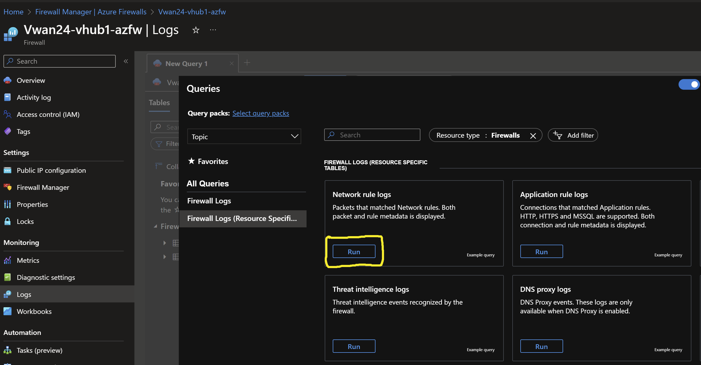

# Secure Virtual WAN - Dual Region <!-- omit from toc -->
## Lab: Vwan24 <!-- omit from toc -->

Contents
- [Overview](#overview)
- [Prerequisites](#prerequisites)
- [Deploy the Lab](#deploy-the-lab)
- [Troubleshooting](#troubleshooting)
- [Testing](#testing)
  - [1. Ping IP](#1-ping-ip)
  - [2. Ping DNS](#2-ping-dns)
  - [3. Curl DNS](#3-curl-dns)
  - [4. Private Link Service](#4-private-link-service)
  - [5. Virtual WAN Routes](#5-virtual-wan-routes)
  - [6. Azure Firewall](#6-azure-firewall)
  - [7. Onprem Routes](#7-onprem-routes)
- [Cleanup](#cleanup)

## Overview

This terraform code deploys a multi-hub (multi-region) Secured Virtual WAN (Vwan) testbed to observe traffic routing patterns. *Routing Intent* feature is enabled to allow traffic inspection on Azure firewalls for traffic between spokes and branches.


Standard Virtual Network (Vnet) hubs (`Hub1` and `Hub2`) connect to Vwan hubs (`vHub1` and `vHub2` respectively) via a Vwan connections. Direct spokes (`Spoke1` and `Spoke4`) are connected to their respective Vwan hubs via Vnet connections. `Spoke2` and `Spoke5` are indirect spokes from a Vwan perspective; and are connected via standard Vnet peering to `Hub1` and `Hub2` respectively. `Spoke2` and `Spoke5` use the Network Virtual Applinace (NVA) in the standard Vnet hubs as the next hop for traffic to all destinations.

The isolated spokes (`Spoke3` and `Spoke6`) do not have Vnet peering to their respective Vnet hubs (`Hub1` and `Hub2`), but are reachable via Private Link Service through a private endpoint in each respective hub.

`Branch1` and `Branch3` are on-premises networks which are simulated using Vnets. Multi-NIC Cisco-CSR-1000V NVA appliances connect to the Vwan hubs using IPsec VPN connections with dynamic (BGP) routing.

## Prerequisites

Ensure you meet all requirements in the [prerequisites](../../prerequisites/) before proceeding.

## Deploy the Lab

1. Clone the Git Repository for the Labs
```sh
git clone https://github.com/kaysalawu/azure-network-terraform.git
```

2. Navigate to the lab directory
```sh
cd azure-network-terraform/2-virtual-wan/4-vwan-sec-dual-region
```

3. Run the following terraform commands and type **yes** at the prompt:
```sh
terraform init
terraform plan
terraform apply
```

## Troubleshooting

See the [troubleshooting](../../troubleshooting/) section for tips on how to resolve common issues that may occur during the deployment of the lab.

## Testing

Each virtual machine is pre-configured with a shell [script](../../scripts/server.sh) to run various types of tests. Serial console access has been configured for all virtual mchines. You can [access the serial console](https://learn.microsoft.com/en-us/troubleshoot/azure/virtual-machines/serial-console-overview#access-serial-console-for-virtual-machines-via-azure-portal) of a virtual machine from the Azure portal.

Login to virtual machine `Vwan24-spoke1-vm` via the serial console.
- username = **azureuser**
- password = **Password123**


Run the following tests from inside the serial console session.

### 1. Ping IP

This script pings the IP addresses of some test virtual machines and reports reachability and round trip time.

Run the IP ping test
```sh
ping-ip
```
Sample output
```sh
azureuser@Vwan24-spoke1-vm:~$ ping-ip

 ping ip ...

branch1 - 10.10.0.5 -OK 7.328 ms
hub1    - 10.11.0.5 -OK 7.353 ms
spoke1  - 10.1.0.5 -OK 0.036 ms
spoke2  - 10.2.0.5 -OK 6.742 ms
branch3 - 10.30.0.5 -OK 24.036 ms
hub2    - 10.22.0.5 -OK 22.195 ms
spoke4  - 10.4.0.5 -OK 20.890 ms
spoke5  - 10.5.0.5 -OK 22.383 ms
internet - icanhazip.com -NA
```

### 2. Ping DNS

This script pings the DNS name of some test virtual machines and reports reachability and round trip time.

Run the DNS ping test
```sh
ping-dns
```

Sample output
```sh
azureuser@Vwan24-spoke1-vm:~$ ping-dns

 ping dns ...

vm.branch1.corp - 10.10.0.5 -OK 6.958 ms
vm.hub1.az.corp - 10.11.0.5 -OK 5.723 ms
vm.spoke1.az.corp - 10.1.0.5 -OK 0.035 ms
vm.spoke2.az.corp - 10.2.0.5 -OK 7.553 ms
vm.branch3.corp - 10.30.0.5 -OK 23.619 ms
vm.hub2.az.corp - 10.22.0.5 -OK 22.841 ms
vm.spoke4.az.corp - 10.4.0.5 -OK 21.905 ms
vm.spoke5.az.corp - 10.5.0.5 -OK 22.323 ms
icanhazip.com - 104.18.115.97 -NA
```

### 3. Curl DNS

This script uses curl to check reachability of web server (python Flask) on the test virtual machines. It reports HTTP response message, round trip time and IP address.

Run the DNS curl test
```sh
curl-dns
```

Sample output
```sh
azureuser@Vwan24-spoke5-vm:~$ curl-dns

 curl dns ...

200 (0.078060s) - 10.10.0.5 - vm.branch1.corp
200 (0.073887s) - 10.11.0.5 - vm.hub1.az.corp
200 (0.073334s) - 10.11.4.4 - spoke3.p.hub1.az.corp
200 (0.073351s) - 10.1.0.5 - vm.spoke1.az.corp
200 (0.073430s) - 10.2.0.5 - vm.spoke2.az.corp
000 (2.001282s) -  - vm.spoke3.az.corp
200 (0.030554s) - 10.30.0.5 - vm.branch3.corp
200 (0.023454s) - 10.22.0.5 - vm.hub2.az.corp
200 (0.020447s) - 10.22.4.4 - spoke6.p.hub2.az.corp
200 (0.027416s) - 10.4.0.5 - vm.spoke4.az.corp
200 (0.013789s) - 10.5.0.5 - vm.spoke5.az.corp
[  438.247378] cloud-init[1505]: 10.5.0.5 - - [16/Sep/2023 23:31:21] "GET / HTTP/1.1" 200 -
000 (2.001221s) -  - vm.spoke6.az.corp
200 (0.034621s) - 104.18.114.97 - icanhazip.com
```
We can see that spoke3 `vm.spoke3.az.corp` returns a **000** HTTP response code. This is expected since there is no Vnet peering to `Spoke3` from `Hub1`. But `Spoke3` web application is reachable via Private Link Service private endpoint `spoke3.p.hub1.az.corp`. The same explanation applies to `Spoke6` virtual machine `vm.spoke6.az.corp`

### 4. Private Link Service

Test access to `Spoke3` application using the private endpoint in `Hub1`.
```sh
curl spoke3.p.hub1.az.corp
```

Sample output
```sh
azureuser@Vwan24-spoke5-vm:~$ curl spoke3.p.hub1.az.corp
{
  "headers": {
    "Accept": "*/*",
    "Host": "spoke3.p.hub1.az.corp",
    "User-Agent": "curl/7.68.0"
  },
  "hostname": "Vwan24-spoke3-vm",
  "local-ip": "10.3.0.5",
  "remote-ip": "10.3.3.4"
}
```
Test access to `Spoke6` application using the private endpoint in `Hub2`.
```sh
curl spoke6.p.hub2.az.corp
```

Sample output
```sh
azureuser@Vwan24-spoke5-vm:~$ curl spoke6.p.hub2.az.corp
{
  "headers": {
    "Accept": "*/*",
    "Host": "spoke6.p.hub2.az.corp",
    "User-Agent": "curl/7.68.0"
  },
  "hostname": "Vwan24-spoke6-vm",
  "local-ip": "10.6.0.5",
  "remote-ip": "10.6.3.4"
}
```

The `Hostname` and `Local-IP` fields belong to the servers running the web application - in this case `Spoke3` and `Spoke6`virtual machines. The `Remote-IP` fields (as seen by the web servers) are the respective IP addresses in the Private Link Service NAT subnets.

Repeat steps 1-4 for all other virtual machines.

### 5. Virtual WAN Routes

1. Ensure you are in the lab directory `azure-network-terraform/2-virtual-wan/4-vwan-sec-dual-region`
2. Display the virtual WAN routing table(s)

```sh
bash ../../scripts/_routes.sh Vwan24RG
```

Sample output
```sh
4-vwan-sec-dual-region$ bash ../../scripts/_routes.sh Vwan24RG

Resource group: Vwan24RG

vHUB: Vwan24-vhub2-hub
Effective route table: defaultRouteTable
AddressPrefixes    NextHopType
-----------------  --------------
0.0.0.0/0          Azure Firewall
10.0.0.0/8         Azure Firewall
172.16.0.0/12      Azure Firewall
192.168.0.0/16     Azure Firewall

vHUB: Vwan24-vhub1-hub
Effective route table: defaultRouteTable
AddressPrefixes    NextHopType
-----------------  --------------
0.0.0.0/0          Azure Firewall
10.0.0.0/8         Azure Firewall
172.16.0.0/12      Azure Firewall
192.168.0.0/16     Azure Firewall
```
### 6. Azure Firewall

1. Run a tracepath `vm.spoke2.az.corp` (10.2.0.5) to observe the traffic flow through the Azure Firewall.

```sh
tracepath vm.spoke2.az.corp
```

Sample output
```sh
azureuser@Vwan24-spoke1-vm:~$ tracepath vm.spoke2.az.corp
 1?: [LOCALHOST]                      pmtu 1500
 1:  192.168.11.167                                        2.304ms
 1:  192.168.11.166                                        2.362ms
 2:  10.11.1.9                                             3.906ms
 3:  10.2.0.5                                              5.843ms reached
     Resume: pmtu 1500 hops 3 back 3
```

We can observe that the traffic flow from `Spoke1` to `Spoke2` goes through the Azure Firewall in `Hub1` (192.168.11.167 and 192.168.11.166 in this example). Traffic then flows via the Network Virtual Appliance (NVA) in `Hub1` (10.11.1.9) before reaching the destination `Spoke2` (10.2.0.5).

2. Check the Azure Firewall logs to observe the traffic flow.
- Select the Azure Firewall resource `Vwan24-azfw-hub1` in the Azure portal.
- Click on **Logs** in the left navigation pane.
- Click **Run** in the *Network rule log data* log category.


- On the *TargetIP* column deselect all IP addresses except spoke2 (10.2.0.5)


Observe how traffic from spoke1 (10.1.0.5) to spoke2 flows via the firewall as expected.

### 7. Onprem Routes

Let's login to the onprem router `Vwan24-branch1-nva` and observe its dynamic routes.

1. Login to virtual machine `Vwan24-branch1-nva` via the serial console.
2. Enter username and password
   - username = **azureuser**
   - password = **Password123**
3. Enter the Cisco enable mode
```sh
enable
```
4. Display the routing table by typing `show ip route` and pressing the space bar to show the complete output.
```sh
show ip route
```

Sample output
```sh
Vwan24-branch1-nva-vm#show ip route
...
[Truncated for brevity]
...
Gateway of last resort is 10.10.1.1 to network 0.0.0.0

S*    0.0.0.0/0 [1/0] via 10.10.1.1
      10.0.0.0/8 is variably subnetted, 16 subnets, 4 masks
B        10.1.0.0/16 [20/0] via 192.168.11.12, 02:02:25
B        10.2.0.0/16 [20/0] via 192.168.11.12, 01:58:52
B        10.4.0.0/16 [20/0] via 192.168.11.13, 02:01:33
B        10.5.0.0/16 [20/0] via 192.168.11.12, 01:58:33
S        10.10.0.0/24 [1/0] via 10.10.2.1
C        10.10.1.0/24 is directly connected, GigabitEthernet1
L        10.10.1.9/32 is directly connected, GigabitEthernet1
C        10.10.2.0/24 is directly connected, GigabitEthernet2
L        10.10.2.9/32 is directly connected, GigabitEthernet2
C        10.10.10.0/30 is directly connected, Tunnel0
L        10.10.10.1/32 is directly connected, Tunnel0
C        10.10.10.4/30 is directly connected, Tunnel1
L        10.10.10.5/32 is directly connected, Tunnel1
B        10.11.0.0/16 [20/0] via 192.168.11.13, 02:00:53
B        10.22.0.0/16 [20/0] via 192.168.11.13, 02:00:03
B        10.30.0.0/24 [20/0] via 192.168.11.12, 02:20:12
      168.63.0.0/32 is subnetted, 1 subnets
S        168.63.129.16 [254/0] via 10.10.1.1
      169.254.0.0/32 is subnetted, 1 subnets
S        169.254.169.254 [254/0] via 10.10.1.1
      192.168.10.0/32 is subnetted, 1 subnets
C        192.168.10.10 is directly connected, Loopback0
      192.168.11.0/24 is variably subnetted, 3 subnets, 2 masks
B        192.168.11.0/24 [20/0] via 192.168.11.12, 02:20:12
S        192.168.11.12/32 is directly connected, Tunnel0
S        192.168.11.13/32 is directly connected, Tunnel1
```

5. Display BGP information by typing `show ip bgp` and pressing the space bar to show the complete output.
```sh
show ip bgp
```

Sample output
```sh
Vwan24-branch1-nva-vm#show ip bgp
BGP table version is 11, local router ID is 192.168.10.10
Status codes: s suppressed, d damped, h history, * valid, > best, i - internal,
              r RIB-failure, S Stale, m multipath, b backup-path, f RT-Filter,
              x best-external, a additional-path, c RIB-compressed,
              t secondary path, L long-lived-stale,
Origin codes: i - IGP, e - EGP, ? - incomplete
RPKI validation codes: V valid, I invalid, N Not found

     Network          Next Hop            Metric LocPrf Weight Path
 r    0.0.0.0          192.168.11.12                          0 65515 i
 r>                    192.168.11.13                          0 65515 i
 *    10.1.0.0/16      192.168.11.13                          0 65515 i
 *>                    192.168.11.12                          0 65515 i
 *    10.2.0.0/16      192.168.11.13            0             0 65515 65010 i
 *>                    192.168.11.12            0             0 65515 65010 i
 *    10.4.0.0/16      192.168.11.12                          0 65515 65520 65520 e
 *>                    192.168.11.13                          0 65515 65520 65520 e
 *    10.5.0.0/16      192.168.11.13                          0 65515 65520 65520 65020 e
 *>                    192.168.11.12                          0 65515 65520 65520 65020 e
     Network          Next Hop            Metric LocPrf Weight Path
 *>   10.10.0.0/24     10.10.2.1                0         32768 i
 *    10.11.0.0/16     192.168.11.12                          0 65515 i
 *>                    192.168.11.13                          0 65515 i
 *    10.22.0.0/16     192.168.11.12                          0 65515 65520 65520 e
 *>                    192.168.11.13                          0 65515 65520 65520 e
 *>   10.30.0.0/24     192.168.11.12                          0 65515 65520 65520 65003 e
 *                     192.168.11.13                          0 65515 65520 65520 65003 e
 *>   192.168.11.0     192.168.11.12                          0 65515 i
 *                     192.168.11.13                          0 65515 i
```

## Cleanup

1. Make sure you are in the lab directory
```sh
cd azure-network-terraform/2-virtual-wan/4-vwan-sec-dual-region
```

2. Delete the resource group to remove all resources installed.\
Run the following Azure CLI command:

```sh
az group delete -g Vwan24RG --no-wait
```
