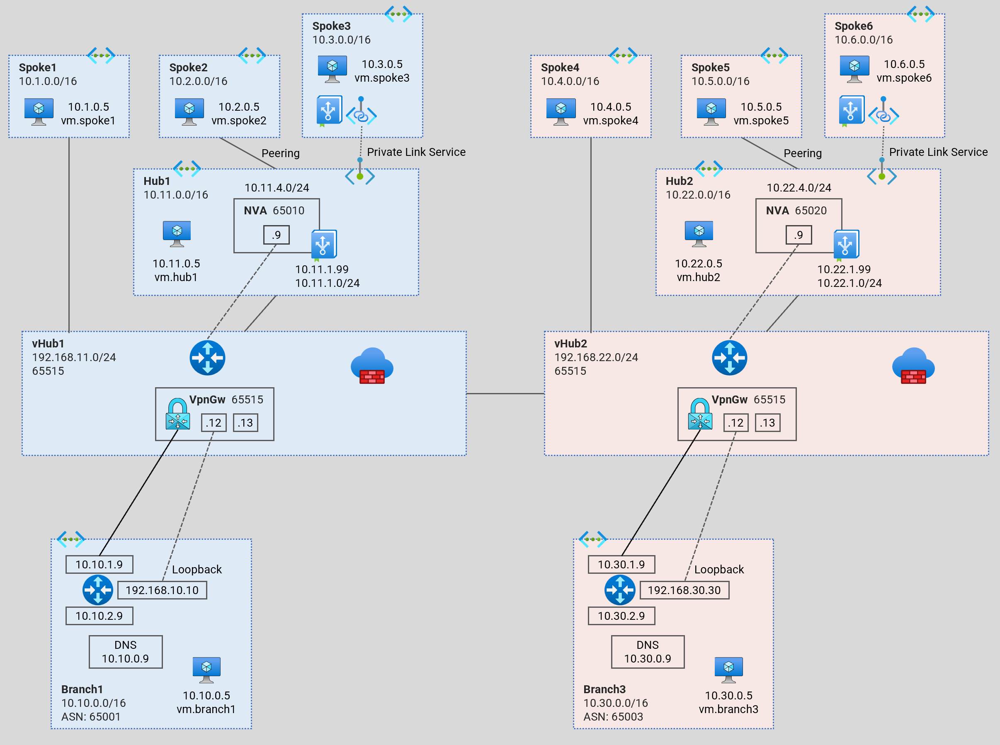
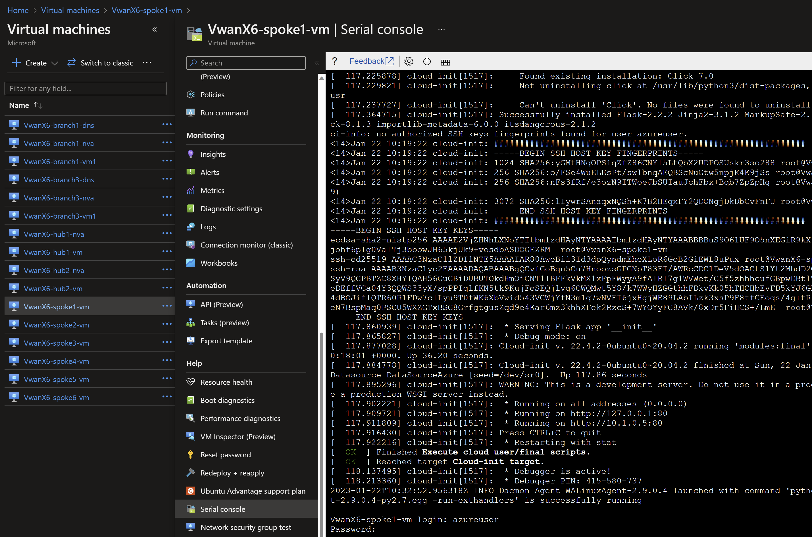

# Secure Virtual WAN - Dual Hub <!-- omit from toc -->

Contents
- [Overview](#overview)
- [Prerequisites](#prerequisites)
- [Deploy the Lab](#deploy-the-lab)
- [Troubleshooting](#troubleshooting)
- [Testing](#testing)
  - [1. Ping IP](#1-ping-ip)
  - [2. Ping DNS](#2-ping-dns)
  - [3. Curl DNS](#3-curl-dns)
  - [4. Private Link Service](#4-private-link-service)
  - [5. Virtual WAN Routes](#5-virtual-wan-routes)
  - [6. Onprem Routes](#6-onprem-routes)
- [Cleanup](#cleanup)

## Overview

This terraform code deploys a multi-hub (multi-region) virtual WAN architecture playground to observe dynamic routing patterns.

In this architecture, we integrate standard hubs (`hub1` and `hub2`) to the secure virtual WAN hubs (`vHub1` and `vHub2`) via a virtual WAN connections. Direct spokes (`Spoke1` and `Spoke4`) are connected to their respective virtual WAN hubs via VNET connections. `Spoke2` and `Spoke5` are indirect spokes from a virtual WAN perspective; are connected via standard VNET peering to `Hub1` and `Hub2` respectively. 

The isolated spokes (`Spoke3` and `Spoke6`) do not have VNET peering to their respective hubs (`Hub1` and `Hub2`), but are reachable via Private Link Service through a private endpoint in each hub.

`Branch1` and `Branch3`are the on-premises networks which are simulated in VNETs using multi-NIC Cisco-CSR-100V NVA appliances.



## Prerequisites

Ensure you meet all requirements in the [prerequisites](../../prerequisites/) before proceeding.

## Deploy the Lab

1. Clone the Git Repository for the Labs
```sh
git clone https://github.com/kaysalawu/azure-network-terraform.git
```

2. Navigate to the lab directory
```sh
cd azure-network-terraform/2-virtual-wan/6-secure-virtual-wan-dual-hub
```

3. Run the following terraform commands and type **yes** at the prompt:
```sh
terraform init
terraform plan
terraform apply
```

## Troubleshooting

## Testing

Each virtual machine is pre-configured with a shell [script](../../scripts/server.sh) to run various types of tests. Serial console access has been configured for all virtual mchines. You can [access the serial console](https://learn.microsoft.com/en-us/troubleshoot/azure/virtual-machines/serial-console-overview#access-serial-console-for-virtual-machines-via-azure-portal) of a virtual machine from the Azure portal. 

Login to virtual machine `VwanX6-spoke1-vm` via the serial console.
- username = **azureuser**
- password = **Password123**



Run the following tests from inside the serial console.

### 1. Ping IP

This script pings the IP addresses of some test virtual machines and reports reachability and round trip time.

Run the IP ping test
```sh
ping-ip
```

Sample output
```sh
azureuser@VwanX6-spoke1-vm:~$ ping-ip

 ping ip ...

branch1 - 10.10.0.5 -OK 7.759 ms
hub1    - 10.11.0.5 -OK 7.073 ms
spoke1  - 10.1.0.5 -OK 0.041 ms
spoke2  - 10.2.0.5 -OK 11.375 ms
branch3 - 10.30.0.5 -OK 22.602 ms
hub2    - 10.22.0.5 -OK 21.760 ms
spoke4  - 10.4.0.5 -OK 21.614 ms
spoke5  - 10.5.0.5 -OK 25.924 ms
```

### 2. Ping DNS

This script pings the DNS name of some test virtual machines and reports reachability and round trip time.

Run the DNS ping test
```sh
ping-dns
```

Sample output
```sh
azureuser@VwanX6-spoke1-vm:~$ ping-dns

 ping dns ...

vm.branch1.corp.net - 10.10.0.5 -OK 5.868 ms
vm.hub1.az.corp.net - 10.11.0.5 -OK 4.671 ms
vm.spoke1.az.corp.net - 10.1.0.5 -OK 0.030 ms
vm.spoke2.az.corp.net - 10.2.0.5 -OK 6.517 ms
vm.branch3.corp.net - 10.30.0.5 -OK 21.772 ms
vm.hub2.az.corp.net - 10.22.0.5 -OK 20.236 ms
vm.spoke4.az.corp.net - 10.4.0.5 -OK 20.519 ms
vm.spoke5.az.corp.net - 10.5.0.5 -OK 21.432 ms
```

### 3. Curl DNS

This script uses curl to check reachability of web server (python Flask) on the test virtual machines. It reports HTTP response message, round trip time and IP address.

Run the DNS curl test
```sh
curl-dns
```

Sample output
```sh
azureuser@VwanX6-spoke1-vm:~$ curl-dns

 curl dns ...

200 (0.039644s) - 10.10.0.5 - vm.branch1.corp.net
200 (0.023505s) - 10.11.0.5 - vm.hub1.az.corp.net
200 (0.025034s) - 10.11.4.4 - pep.hub1.az.corp.net
[10731.670464] cloud-init[1517]: 10.1.0.5 - - [22/Jan/2023 13:16:16] "GET / HTTP/1.1" 200 -
200 (0.013654s) - 10.1.0.5 - vm.spoke1.az.corp.net
200 (0.034781s) - 10.2.0.5 - vm.spoke2.az.corp.net
000 (2.001387s) -  - vm.spoke3.az.corp.net
200 (0.065534s) - 10.30.0.5 - vm.branch3.corp.net
200 (0.086772s) - 10.22.0.5 - vm.hub2.az.corp.net
200 (0.075901s) - 10.22.3.4 - pep.hub2.az.corp.net
200 (0.369310s) - 10.4.0.5 - vm.spoke4.az.corp.net
200 (0.386264s) - 10.5.0.5 - vm.spoke5.az.corp.net
000 (1.999749s) -  - vm.spoke6.az.corp.net
```
We can see that spoke3 `vm.spoke3.az.corp.net` returns a **000** HTTP response code. This is expected as there is no Vnet peering to `Spoke3` from `Hub1`. But `Spoke3` web application is reachable via Private Link Service private endpoint `pep.hub1.az.corp.net`. The same explanation applies to `Spoke6` virtual machine `vm.spoke6.az.corp.net` 

### 4. Private Link Service

Test access to `Spoke3` application using the private endpoint in `Hub1`.
```sh
curl pep.hub1.az.corp.net
```

Sample output
```sh
azureuser@VwanX6-spoke1-vm:~$ curl pep.hub1.az.corp.net
{
  "headers": {
    "Accept": "*/*",
    "Host": "pep.hub1.az.corp.net",
    "User-Agent": "curl/7.68.0"
  },
  "hostname": "VwanX6-spoke3-vm",
  "local-ip": "10.3.0.5",
  "remote-ip": "10.3.3.4"
}
```
Test access to `Spoke6` application using the private endpoint in `Hub2`.
```sh
curl pep.hub2.az.corp.net
```

Sample output
```sh
azureuser@VwanX6-spoke1-vm:~$ curl pep.hub2.az.corp.net
{
  "headers": {
    "Accept": "*/*",
    "Host": "pep.hub2.az.corp.net",
    "User-Agent": "curl/7.68.0"
  },
  "hostname": "VwanX6-spoke6-vm",
  "local-ip": "10.6.0.5",
  "remote-ip": "10.6.3.4"
}
``` 

The `hostname` and `local-ip` fields belong to the servers running the web application - in this case `Spoke3` and `Spoke6`virtual machines. The `remote-ip` fields (as seen by the web servers) are the respective IP addresses in the Private Link Service NAT subnets.

Repeat steps 1-4 for all other virtual machines.

### 5. Virtual WAN Routes

1. Ensure you are in the lab directory `azure-network-terraform/2-virtual-wan/6-secure-virtual-wan-dual-hub`
2. Display the virtual WAN routing table(s)

```sh
salawu$ bash ../../scripts/_routes.sh VwanX6RG
```

Sample output
```sh
salawu$ bash ../../scripts/_routes.sh VwanX6RG

Resource group: VwanX6RG

vHUB: VwanX6-vhub2-hub
Effective route table: defaultRouteTable
AddressPrefixes    AsPath             NextHopType
-----------------  -----------------  --------------------------
10.5.0.0/16        65020              HubBgpConnection
10.22.0.0/16                          Virtual Network Connection
10.4.0.0/16                           Virtual Network Connection
10.1.0.0/16        65520-65520        Remote Hub
10.10.0.0/24       65520-65520-65001  Remote Hub
10.2.0.0/16        65520-65520-65010  Remote Hub
10.11.0.0/16       65520-65520        Remote Hub
10.30.0.0/24       65003              VPN_S2S_Gateway

vHUB: VwanX6-vhub1-hub
Effective route table: defaultRouteTable
AddressPrefixes    AsPath             NextHopType
-----------------  -----------------  --------------------------
10.2.0.0/16        65010              HubBgpConnection
10.11.0.0/16                          Virtual Network Connection
10.1.0.0/16                           Virtual Network Connection
10.10.0.0/24       65001              VPN_S2S_Gateway
10.5.0.0/16        65520-65520-65020  Remote Hub
10.30.0.0/24       65520-65520-65003  Remote Hub
10.22.0.0/16       65520-65520        Remote Hub
10.4.0.0/16        65520-65520        Remote Hub
```

### 6. Onprem Routes

Let's login to the onprem router `VwanX6-branch1-nva` and observe its dynamic routes.

1. Login to virtual machine `VwanX6-branch1-nva` via the serial console. 
2. Enter username and password 
   - username = **azureuser**
   - password = **Password123**
3. Enter the Cisco enable mode
```sh
enable
```
1. Display the routing table
```sh
show ip route
```

Sample output
```sh
VwanX6-branch1-nva-vm#show ip route
[Truncated]
...
Gateway of last resort is 10.10.1.1 to network 0.0.0.0

S*    0.0.0.0/0 [1/0] via 10.10.1.1
      10.0.0.0/8 is variably subnetted, 16 subnets, 4 masks
B        10.1.0.0/16 [20/0] via 192.168.11.12, 02:01:57
B        10.2.0.0/16 [20/0] via 192.168.11.12, 02:01:57
B        10.4.0.0/16 [20/0] via 192.168.11.12, 02:01:57
B        10.5.0.0/16 [20/0] via 192.168.11.12, 02:01:57
S        10.10.0.0/24 [1/0] via 10.10.2.1
C        10.10.1.0/24 is directly connected, GigabitEthernet1
L        10.10.1.9/32 is directly connected, GigabitEthernet1
C        10.10.2.0/24 is directly connected, GigabitEthernet2
L        10.10.2.9/32 is directly connected, GigabitEthernet2
C        10.10.10.0/30 is directly connected, Tunnel0
L        10.10.10.1/32 is directly connected, Tunnel0
C        10.10.10.4/30 is directly connected, Tunnel1
L        10.10.10.5/32 is directly connected, Tunnel1
B        10.11.0.0/16 [20/0] via 192.168.11.12, 02:01:57
B        10.22.0.0/16 [20/0] via 192.168.11.12, 02:01:57
B        10.30.0.0/24 [20/0] via 192.168.11.12, 02:00:52
      168.63.0.0/32 is subnetted, 1 subnets
S        168.63.129.16 [254/0] via 10.10.1.1
      169.254.0.0/32 is subnetted, 1 subnets
S        169.254.169.254 [254/0] via 10.10.1.1
      192.168.10.0/32 is subnetted, 1 subnets
C        192.168.10.10 is directly connected, Loopback0
      192.168.11.0/24 is variably subnetted, 3 subnets, 2 masks
B        192.168.11.0/24 [20/0] via 192.168.11.12, 02:01:57
S        192.168.11.12/32 is directly connected, Tunnel1
S        192.168.11.13/32 is directly connected, Tunnel0
```

5. Show BGP information
```sh
VwanX6-branch1-nva-vm#show ip bgp
BGP table version is 10, local router ID is 192.168.10.10
Status codes: s suppressed, d damped, h history, * valid, > best, i - internal, 
              r RIB-failure, S Stale, m multipath, b backup-path, f RT-Filter, 
              x best-external, a additional-path, c RIB-compressed, 
              t secondary path, L long-lived-stale,
Origin codes: i - IGP, e - EGP, ? - incomplete
RPKI validation codes: V valid, I invalid, N Not found

     Network          Next Hop            Metric LocPrf Weight Path
 *>   10.1.0.0/16      192.168.11.12                          0 65515 i
 *                     192.168.11.13                          0 65515 i
 *>   10.2.0.0/16      192.168.11.12            0             0 65515 65010 i
 *                     192.168.11.13            0             0 65515 65010 i
 *>   10.4.0.0/16      192.168.11.12                          0 65515 65520 65520 e
 *                     192.168.11.13                          0 65515 65520 65520 e
 *>   10.5.0.0/16      192.168.11.12                          0 65515 65520 65520 65020 e
 *                     192.168.11.13                          0 65515 65520 65520 65020 e
 *>   10.10.0.0/24     10.10.2.1                0         32768 i
     Network          Next Hop            Metric LocPrf Weight Path
 *>   10.11.0.0/16     192.168.11.12                          0 65515 i
 *                     192.168.11.13                          0 65515 i
 *>   10.22.0.0/16     192.168.11.12                          0 65515 65520 65520 e
 *                     192.168.11.13                          0 65515 65520 65520 e
 *    10.30.0.0/24     192.168.11.13                          0 65515 65520 65520 65003 e
 *>                    192.168.11.12                          0 65515 65520 65520 65003 e
 *>   192.168.11.0     192.168.11.12                          0 65515 i
 *                     192.168.11.13                          0 65515 i
```

## Cleanup

1. Navigate to the lab directory
```sh
cd azure-network-terraform/2-virtual-wan/6-secure-virtual-wan-dual-hub
```

2. Delete the resource group to remove all resources installed.\
Run the following Azure CLI command:

```sh
az group delete -g VwanX6RG --no-wait
```
