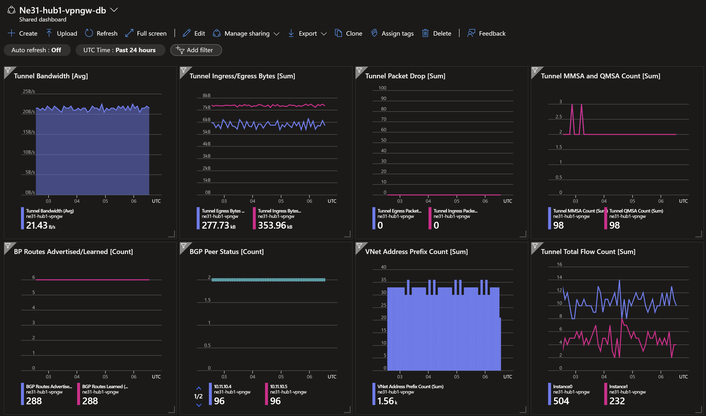
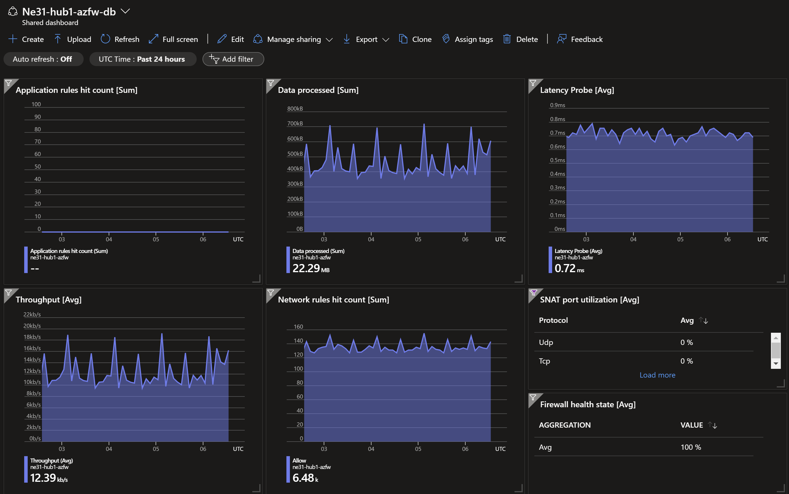
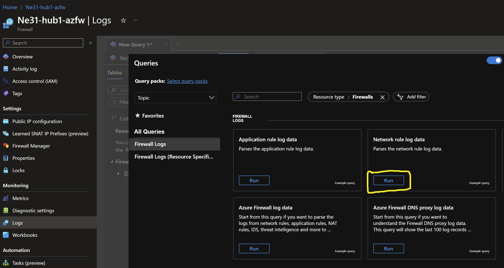

# Secured Hub and Spoke - Single Region (Virtual Network Manager) <!-- omit from toc -->

## Lab: Ne31 <!-- omit from toc -->

Contents

- [Overview](#overview)
- [Prerequisites](#prerequisites)
- [Deploy the Lab](#deploy-the-lab)
- [Troubleshooting](#troubleshooting)
- [Outputs](#outputs)
- [Dashboards (Optional)](#dashboards-optional)
- [Testing](#testing)
  - [1. Ping IP](#1-ping-ip)
  - [2. Ping DNS](#2-ping-dns)
  - [3. Curl DNS](#3-curl-dns)
  - [4. Private Link Service](#4-private-link-service)
  - [5. Private Link Access to Storage Account](#5-private-link-access-to-storage-account)
  - [6. Private Link Access to Storage Account from On-premises](#6-private-link-access-to-storage-account-from-on-premises)
  - [7. Azure Firewall (Optional)](#7-azure-firewall-optional)
  - [8. On-premises Routes](#8-on-premises-routes)
- [Cleanup](#cleanup)

## Overview

This lab deploys a single-region Hub and Spoke Secured Virtual Network (Vnet) topology using the [Azure Virtual Network Manager](https://learn.microsoft.com/en-us/azure/virtual-network-manager/concept-connectivity-configuration#hub-and-spoke-topology) (AVNM) service. Learn about traffic routing patterns, [hybrid DNS](https://learn.microsoft.com/en-us/azure/dns/private-resolver-hybrid-dns) resolution, firewall security policies, and [PrivateLink Services](https://learn.microsoft.com/en-us/azure/private-link/private-link-service-overview) access to IaaS, [PrivateLink](https://learn.microsoft.com/en-us/azure/private-link/private-link-overview) access to PaaS services.


***Hub1*** is a Vnet hub that has an Azure firewall used for inspection of traffic between an on-premises branches and Vnets. [User-Defined Routes](https://learn.microsoft.com/en-us/azure/virtual-network/virtual-networks-udr-overview#user-defined) (UDR) are used to influence the hub Vnet data plane to route traffic between the branches and spokes via the firewalls. An isolated spoke ***spoke3*** does not have Vnet peering to ***hub1***, but is reachable from the hub via [Private Link Service](https://learn.microsoft.com/en-us/azure/private-link/private-link-service-overview).

AVNM creates the hub and spoke topology using the following configuration flags:
* **topology**: `HubAndSpoke`
* **isGlobal**: `False` - this disables global mesh
* **useHubGateway**: `True` - this enables Gateway transit via the hub

***Branch1*** is our on-premises network simulated in a Vnet. A Multi-NIC Linux Network Virtual Appliance (NVA) connects to the ***hub1*** using an IPsec VPN connection with dynamic (BGP) routing.

## Prerequisites

Ensure you meet all requirements in the [prerequisites](../../prerequisites/README.md) before proceeding.

## Deploy the Lab

1. Clone the Git Repository for the Labs

   ```sh
   git clone https://github.com/kaysalawu/azure-network-terraform.git
   ```

2. Navigate to the lab directory

   ```sh
   cd azure-network-terraform/3-network-manager/1-hub-spoke-azfw-single-region
   ```

3. Run the following terraform commands and type ***yes*** at the prompt:

   ```sh
   terraform init
   terraform plan
   terraform apply -parallelism=50
   ```

## Troubleshooting

See the [troubleshooting](../../troubleshooting/README.md) section for tips on how to resolve common issues that may occur during the deployment of the lab.

## Outputs

The table below shows the auto-generated output files from the lab. They are located in the `output` directory.

| Item    | Description  | Location |
|--------|--------|--------|
| IP ranges and DNS | IP ranges and DNS hostname values | [output/values.md](./output/values.md) |
| Branch1 DNS | Authoritative DNS and forwarding | [output/branch1Dns.sh](./output/branch1Dns.sh) |
| Branch1 NVA | Linux Strongswan + FRR configuration | [output/branch1Nva.sh](./output/branch1Nva.sh) |
| Web server | Python Flask web server, test scripts | [output/server.sh](./output/server.sh) |
||||

## Dashboards (Optional)

This lab contains a number of pre-configured dashboards for monitoring gateways, VPN gateways, and Azure Firewall. To deploy the dashboards, set `enable_diagnostics = true` in the [`02-main.tf`](./02-main.tf) file. Then run `terraform apply` to update the deployment.

<details>

<summary>Sample Dashboards</summary>

To view the dashboards, follow the steps below:

1. From the Azure portal menu, select **Dashboard hub**.

2. Under **Browse**, select **Shared dashboards**.

3. Select the dashboard you want to view.

4. Click on a dashboard under **Go to dashboard** column.

   Sample dashboard for VPN gateway in ***hub1***.

    

    Sample dashboard for Azure Firewall in ***hub1***.

   

</details>
<p>

## Testing

Each virtual machine is pre-configured with a shell [script](../../scripts/server.sh) to run various types of network reachability tests. Serial console access has been configured for all virtual machines.

Login to virtual machine `Ne31-spoke1Vm` via the [serial console](https://learn.microsoft.com/en-us/troubleshoot/azure/virtual-machines/serial-console-overview#access-serial-console-for-virtual-machines-via-azure-portal):

- On Azure portal select *Virtual machines*
- Select the virtual machine `Ne31-spoke1Vm`
- Under ***Help*** section, select ***Serial console*** and wait for a login prompt
- Enter the login credentials
  - username = ***azureuser***
  - password = ***Password123***
- You should now be in a shell session `azureuser@Ne31-spoke1Vm:~$`

Type the following command to check the interfaces of `Ne31-spoke1Vm` to observe the dual-stack configuration.

```sh
ifconfig
```

<details>

<summary>Sample output</summary>

```sh
azureuser@spoke1Vm:~$ ip address
1: lo: <LOOPBACK,UP,LOWER_UP> mtu 65536 qdisc noqueue state UNKNOWN group default qlen 1000
    link/loopback 00:00:00:00:00:00 brd 00:00:00:00:00:00
    inet 127.0.0.1/8 scope host lo
       valid_lft forever preferred_lft forever
    inet6 ::1/128 scope host
       valid_lft forever preferred_lft forever
2: eth0: <BROADCAST,MULTICAST,UP,LOWER_UP> mtu 1500 qdisc mq state UP group default qlen 1000
    link/ether 00:22:48:99:7a:4a brd ff:ff:ff:ff:ff:ff
    inet 10.1.0.5/24 brd 10.1.0.255 scope global eth0
       valid_lft forever preferred_lft forever
    inet6 fd00:db8:1::5/128 scope global dynamic noprefixroute
       valid_lft 17279695sec preferred_lft 8639695sec
    inet6 fe80::222:48ff:fe99:7a4a/64 scope link
       valid_lft forever preferred_lft forever
3: docker0: <NO-CARRIER,BROADCAST,MULTICAST,UP> mtu 1500 qdisc noqueue state DOWN group default
    link/ether 02:42:3e:af:56:b1 brd ff:ff:ff:ff:ff:ff
    inet 172.17.0.1/16 brd 172.17.255.255 scope global docker0
       valid_lft forever preferred_lft forever
    inet6 fe80::42:3eff:feaf:56b1/64 scope link
       valid_lft forever preferred_lft forever
```

The interface ***eth0*** has both IPv4 and IPv6 addresses.

</details>
<p>

Run the following tests from inside the serial console session.

### 1. Ping IP

This script pings the IP addresses of some test virtual machines and reports reachability and round trip time.

**1.1.** Run the IP ping tests

```sh
ping-ipv4
ping-ipv6
```

<details>

<summary>Sample output</summary>

```sh
azureuser@spoke1Vm:~$ ping-ipv4

 ping ipv4 ...

branch1 - 10.10.0.5 -OK 5.134 ms
hub1    - 10.11.0.5 -OK 2.907 ms
spoke1  - 10.1.0.5 -OK 0.042 ms
spoke2  - 10.2.0.5 -OK 3.287 ms
internet - icanhazip.com -NA
```

```sh
azureuser@spoke1Vm:~$ ping-ipv6

 ping ipv6 ...

branch1 - fd00:db8:10::5 -NA
hub1    - fd00:db8:11::5 -OK 2.167 ms
spoke1  - fd00:db8:1::5 -OK 0.049 ms
spoke2  - fd00:db8:2::5 -NA
internet - icanhazip.com -NA
```

From `Spoke1Vm`, we can only reach IPv6 targets that do not use Azure firewall as next hop. Azure firewall currently does not support IPv6.

</details>
<p>

### 2. Ping DNS

This script pings the DNS name of some test virtual machines and reports reachability and round trip time. This tests hybrid DNS resolution between on-premises and Azure.

**2.1.** Run the DNS ping tests

```sh
ping-dns4
ping-dns6
```

<details>

<summary>Sample output</summary>

```sh
azureuser@spoke1Vm:~$ ping-dns4

 ping dns ipv4 ...

branch1vm.corp - 10.10.0.5 -OK 4.047 ms
hub1vm.eu.az.corp - 10.11.0.5 -OK 2.113 ms
spoke1vm.eu.az.corp - 10.1.0.5 -OK 0.038 ms
spoke2vm.eu.az.corp - 10.2.0.5 -OK 4.666 ms
icanhazip.com - 104.16.184.241 -NA
```

```sh
azureuser@spoke1Vm:~$ ping-dns6

 ping dns ipv6 ...

branch1vm.corp - fd00:db8:10::5 -NA
hub1vm.eu.az.corp - fd00:db8:11::5 -OK 1.648 ms
spoke1vm.eu.az.corp - fd00:db8:1::5 -OK 0.046 ms
spoke2vm.eu.az.corp - fd00:db8:2::5 -NA
icanhazip.com - 2606:4700::6810:b9f1 -NA
```

From `Spoke1Vm`, we can only reach IPv6 targets that do not use Azure firewall as next hop. Azure firewall currently does not support IPv6.

</details>
<p>

### 3. Curl DNS

This script uses curl to check reachability of web server (python Flask) on the test virtual machines. It reports HTTP response message, round trip time and IP address.

**3.1.** Run the DNS curl test

```sh
curl-dns4
curl-dns6
```

<details>

<summary>Sample output</summary>

```sh
azureuser@spoke1Vm:~$ curl-dns4

 curl dns ipv4 ...

200 (0.017566s) - 10.10.0.5 - branch1vm.corp
200 (0.018040s) - 10.11.0.5 - hub1vm.eu.az.corp
200 (0.005034s) - 10.11.7.88 - spoke3pls.eu.az.corp
200 (0.007520s) - 10.1.0.5 - spoke1vm.eu.az.corp
200 (0.015838s) - 10.2.0.5 - spoke2vm.eu.az.corp
200 (0.028660s) - 104.16.184.241 - icanhazip.com
200 (0.029879s) - 10.11.7.99 - https://ne31spoke3sac215.blob.core.windows.net/spoke3/spoke3.txt
```

```sh
azureuser@spoke1Vm:~$ curl-dns6

 curl dns ipv6 ...

 - branch1vm.corp
200 (0.015442s) - fd00:db8:11::5 - hub1vm.eu.az.corp
000 (0.018491s) -  - spoke3pls.eu.az.corp
200 (0.018874s) - fd00:db8:1::5 - spoke1vm.eu.az.corp
 - spoke2vm.eu.az.corp
000 (2.251000s) -  - icanhazip.com
000 (0.008017s) -  - https://ne31spoke3sac215.blob.core.windows.net/spoke3/spoke3.txt
```

</details>
<p>

### 4. Private Link Service

**4.1.** Test access to ***spoke3*** web application using the private endpoint in ***hub1***.

```sh
curl spoke3pls.eu.az.corp
```

<details>

<summary>Sample output</summary>

```json
azureuser@spoke1Vm:~$ curl spoke3pls.eu.az.corp
{
  "app": "SERVER",
  "hostname": "spoke3Vm",
  "server-ipv4": "10.3.0.5",
  "server-ipv6": "NotFound",
  "remote-addr": "10.3.6.4",
  "headers": {
    "host": "spoke3pls.eu.az.corp",
    "user-agent": "curl/7.68.0",
    "accept": "*/*"
  }
}
```

</details>
<p>

The `Hostname`, `server-ipv4` and `server-ipv6` fields identify the target web server - in this case ***spoke3*** virtual machine. The `remote-addr` field (as seen by the web server) is an IP address in the Private Link Service NAT subnet in ***spoke3***.

### 5. Private Link Access to Storage Account

A storage account with a container blob deployed and accessible via private endpoints in ***hub1***. The storage accounts have the following naming convention:

* ne31spoke3sa\<AAAA\>.blob.core.windows.net

Where ***\<AAAA\>*** is a randomly generated two-byte string.

**5.1.** On your Cloudshell (or local machine), get the storage account hostname and blob URL.

```sh
spoke3_storage_account=$(az storage account list -g Ne31_HubSpoke_Azfw_1Region_RG --query "[?contains(name, 'ne31spoke3sa')].name" -o tsv)

spoke3_sgtacct_host="$spoke3_storage_account.blob.core.windows.net"
spoke3_blob_url="https://$spoke3_sgtacct_host/spoke3/spoke3.txt"

echo -e "\n$spoke3_sgtacct_host\n" && echo
```

<details>

<summary>Sample output</summary>

```sh
ne31spoke3sac215.blob.core.windows.net
```

</details>
<p>

**5.2.** Resolve the hostname

```sh
nslookup $spoke3_sgtacct_host
```

<details>

<summary>Sample output</summary>

```sh
1-hub-spoke-azfw-single-region$ nslookup $spoke3_sgtacct_host
Server:         127.0.0.53
Address:        127.0.0.53#53

Non-authoritative answer:
ne31spoke3sac215.blob.core.windows.net  canonical name = ne31spoke3sac215.privatelink.blob.core.windows.net.
ne31spoke3sac215.privatelink.blob.core.windows.net      canonical name = blob.db4prdstr23a.store.core.windows.net.
Name:   blob.db4prdstr23a.store.core.windows.net
Address: 20.60.204.1
```

</details>
<p>

We can see that the endpoint is a public IP address, ***20.60.204.1***. We can see the CNAME `ne31spoke3sac215.privatelink.blob.core.windows.net.` created for the storage account which recursively resolves to the public IP address.

**5.3.** Test access to the storage account blob.

```sh
curl $spoke3_blob_url && echo
```

<details>

<summary>Sample output</summary>

```sh
Hello, World!
```

</details>
<p>

### 6. Private Link Access to Storage Account from On-premises

**6.1** Login to on-premises virtual machine `Ne31-branch1Vm` via the [serial console](https://learn.microsoft.com/en-us/troubleshoot/azure/virtual-machines/serial-console-overview#access-serial-console-for-virtual-machines-via-azure-portal):
  - username = ***azureuser***
  - password = ***Password123***

 We will test access from `Ne31-branch1Vm` to the storage account for ***spoke3*** via the private endpoint in ***hub1***.

**6.2.** Run `az login` using the VM's system-assigned managed identity.

```sh
az login --identity
```

<details>

<summary>Sample output</summary>

```json
azureuser@branch1Vm:~$ az login --identity
[
  {
    "environmentName": "AzureCloud",
    "homeTenantId": "aaa-bbb-ccc-ddd-eee",
    "id": "xxx-yyy-1234-1234-1234",
    "isDefault": true,
    "managedByTenants": [
      {
        "tenantId": "your-tenant-id"
      }
    ],
    "name": "some-random-name",
    "state": "Enabled",
    "tenantId": "your-tenant-id",
    "user": {
      "assignedIdentityInfo": "MSI",
      "name": "systemAssignedIdentity",
      "type": "servicePrincipal"
    }
  }
]
```

</details>
<p>

**6.3.** Get the storage account hostname and blob URL.

```sh
spoke3_storage_account=$(az storage account list -g Ne31_HubSpoke_Azfw_1Region_RG --query "[?contains(name, 'ne31spoke3sa')].name" -o tsv)

spoke3_sgtacct_host="$spoke3_storage_account.blob.core.windows.net"
spoke3_blob_url="https://$spoke3_sgtacct_host/spoke3/spoke3.txt"

echo -e "\n$spoke3_sgtacct_host\n" && echo
```

<details>

<summary>Sample output</summary>

```sh
ne31spoke3sac215.blob.core.windows.net
```

</details>
<p>

**6.4.** Resolve the storage account DNS name

```sh
nslookup $spoke3_sgtacct_host
```

<details>

<summary>Sample output</summary>

```sh
azureuser@branch1Vm:~$ nslookup $spoke3_sgtacct_host
Server:         127.0.0.53
Address:        127.0.0.53#53

Non-authoritative answer:
ne31spoke3sac215.blob.core.windows.net  canonical name = ne31spoke3sac215.privatelink.blob.core.windows.net.
Name:   ne31spoke3sac215.privatelink.blob.core.windows.net
Address: 10.11.7.99
```

</details>
<p>

We can see that the storage account hostname resolves to the private endpoint ***10.11.7.99*** in ***hub1***. The following is a summary of the DNS resolution from `Ne31-branch1Vm`:

- On-premises server `Ne31-branch1Vm` makes a DNS request for `ne31spoke3sac215.blob.core.windows.net`
- The request is received by on-premises DNS server `Ne31-branch1-dns`
- The DNS server resolves `ne31spoke3sac215.blob.core.windows.net` to the CNAME `ne31spoke3sac215.privatelink.blob.core.windows.net`
- The DNS server has a conditional DNS forwarding defined in the branch1 unbound DNS configuration file, [output/branch1Dns.sh](./output/branch1Dns.sh).

  ```sh
  forward-zone:
          name: "privatelink.blob.core.windows.net."
          forward-addr: 10.11.8.4
  ```

  DNS Requests matching `privatelink.blob.core.windows.net` will be forwarded to the private DNS resolver inbound endpoint in ***hub1*** (10.11.8.4).
- The DNS server forwards the DNS request to the private DNS resolver inbound endpoint in ***hub1*** - which returns the IP address of the storage account private endpoint in ***hub1*** (10.11.7.99)

**6.5.** Test access to the storage account blob.

```sh
curl $spoke3_blob_url && echo
```

<details>

<summary>Sample output</summary>

```sh
Hello, World!
```

</details>
<p>

### 7. Azure Firewall (Optional)

To view firewall logs, set `enable_diagnostics = true` in the [`02-main.tf`](./02-main.tf). Then run `terraform apply` to update the deployment. Wait for about 15 minutes to get some logs.

<details>

<summary>Sample Azure Firewall logs</summary>

**7.1.** Check the Azure Firewall logs to observe the traffic flow.

- Select the Azure Firewall resource `Ne31-hub1-azfw` in the Azure portal.
- Click on **Logs** in the left navigation pane.
- Click on **Firewall Logs (Resource Specific Tables)**.
- Click on **Run** in the log category *Network rule logs*.



Observe the firewall logs based on traffic flows generated from our tests.


</details>
<p>

### 8. On-premises Routes

**8.1** Login to on-premises virtual machine `Ne31-branch1Nva` via the [serial console](https://learn.microsoft.com/en-us/troubleshoot/azure/virtual-machines/serial-console-overview#access-serial-console-for-virtual-machines-via-azure-portal):
  - username = ***azureuser***
  - password = ***Password123***

**8.2.** Enter the VTY shell for the FRRouting daemon.

```sh
sudo vtysh
```

<details>

<summary>Sample output</summary>

```sh
azureuser@branch1Nva:~$ sudo vtysh

Hello, this is FRRouting (version 7.2.1).
Copyright 1996-2005 Kunihiro Ishiguro, et al.
```

</details>
<p>

**8.3.** Display the routing table by typing `show ip route` and pressing the space bar to show the complete output.

```sh
show ip route
show ipv6 route
```

<details>

<summary>Sample output</summary>

```sh
azureuser@branch1Nva:~$ sudo vtysh

Hello, this is FRRouting (version 7.2.1).
Copyright 1996-2005 Kunihiro Ishiguro, et al.

branch1Nva# show ip route
Codes: K - kernel route, C - connected, S - static, R - RIP,
       O - OSPF, I - IS-IS, B - BGP, E - EIGRP, N - NHRP,
       T - Table, v - VNC, V - VNC-Direct, A - Babel, D - SHARP,
       F - PBR, f - OpenFabric,
       > - selected route, * - FIB route, q - queued route, r - rejected route

S   0.0.0.0/0 [1/0] via 10.10.1.1, eth0, 01:20:48
K>* 0.0.0.0/0 [0/100] via 10.10.1.1, eth0, src 10.10.1.9, 01:20:49
B>* 10.1.0.0/16 [20/0] via 10.11.16.6, vti1, 00:03:17
  *                    via 10.11.16.7, vti0, 00:03:17
B>* 10.2.0.0/16 [20/0] via 10.11.16.6, vti1, 00:03:17
  *                    via 10.11.16.7, vti0, 00:03:17
S>* 10.10.0.0/24 [1/0] via 10.10.1.1, eth0, 01:20:48
C>* 10.10.1.0/24 is directly connected, eth0, 01:20:49
C>* 10.10.2.0/24 is directly connected, eth1, 01:20:49
B>* 10.11.0.0/16 [20/0] via 10.11.16.6, vti1, 00:03:17
  *                     via 10.11.16.7, vti0, 00:03:17
S   10.11.16.6/32 [1/0] is directly connected, vti1, 00:03:17
C>* 10.11.16.6/32 is directly connected, vti1, 00:03:17
S   10.11.16.7/32 [1/0] is directly connected, vti0, 00:03:17
C>* 10.11.16.7/32 is directly connected, vti0, 00:03:17
K>* 168.63.129.16/32 [0/100] via 10.10.1.1, eth0, src 10.10.1.9, 01:20:49
K>* 169.254.169.254/32 [0/100] via 10.10.1.1, eth0, src 10.10.1.9, 01:20:49
C>* 192.168.10.10/32 is directly connected, lo, 01:20:49
```

We can see the Vnet ranges learned dynamically via BGP.

```sh
branch1Nva# show ipv6 route
Codes: K - kernel route, C - connected, S - static, R - RIPng,
       O - OSPFv3, I - IS-IS, B - BGP, N - NHRP, T - Table,
       v - VNC, V - VNC-Direct, A - Babel, D - SHARP, F - PBR,
       f - OpenFabric,
       > - selected route, * - FIB route, q - queued route, r - rejected route

K * ::/0 [0/200] via fe80::1234:5678:9abc, eth1, 00:54:46
K>* ::/0 [0/100] via fe80::1234:5678:9abc, eth0, 00:55:28
K>* fd00:db8:10:1::/64 [0/100] is directly connected, eth0, 00:55:28
C>* fd00:db8:10:1::9/128 is directly connected, eth0, 00:55:27
K>* fd00:db8:10:2::/64 [0/200] is directly connected, eth1, 00:54:46
C>* fd00:db8:10:2::9/128 is directly connected, eth1, 00:54:45
C * fe80::/64 is directly connected, vti0, 00:03:32
C * fe80::/64 is directly connected, vti1, 00:03:32
C * fe80::/64 is directly connected, eth1, 01:21:04
C>* fe80::/64 is directly connected, eth0, 01:21:04
```

IPv6 is not yet configured for BGP but we can see static and connected IPv6 routes.

</details>
<p>

**8.4.** Display BGP information by typing `show ip bgp` and pressing the space bar to show the complete output.

```sh
show ip bgp
```

<details>

<summary>Sample output</summary>

```sh
branch1Nva# show ip bgp
BGP table version is 39, local router ID is 192.168.10.10, vrf id 0
Default local pref 100, local AS 65001
Status codes:  s suppressed, d damped, h history, * valid, > best, = multipath,
               i internal, r RIB-failure, S Stale, R Removed
Nexthop codes: @NNN nexthop's vrf id, < announce-nh-self
Origin codes:  i - IGP, e - EGP, ? - incomplete

   Network          Next Hop            Metric LocPrf Weight Path
*> 10.1.0.0/16      10.11.16.6                             0 65515 i
*=                  10.11.16.7                             0 65515 i
*> 10.2.0.0/16      10.11.16.6                             0 65515 i
*=                  10.11.16.7                             0 65515 i
*> 10.10.0.0/24     0.0.0.0                  0         32768 i
*> 10.11.0.0/16     10.11.16.6                             0 65515 i
*=                  10.11.16.7                             0 65515 i

Displayed  4 routes and 7 total paths
```

We can see the hub and spoke Vnet ranges being learned dynamically in the BGP table.

</details>
<p>

**8.5.** Exit the vtysh shell by typing `exit` and pressing `Enter`.

```sh
exit
```

**8.6.** Display linux kernel route tables.

```sh
netstat -rn
netstat -rn -A inet6
```

<details>

<summary>Sample output</summary>

```sh
azureuser@branch1Nva:~$ netstat -rn
Kernel IP routing table
Destination     Gateway         Genmask         Flags   MSS Window  irtt Iface
0.0.0.0         10.10.1.1       0.0.0.0         UG        0 0          0 eth0
10.1.0.0        10.11.16.6      255.255.0.0     UG        0 0          0 vti1
10.2.0.0        10.11.16.6      255.255.0.0     UG        0 0          0 vti1
10.10.0.0       10.10.1.1       255.255.255.0   UG        0 0          0 eth0
10.10.1.0       0.0.0.0         255.255.255.0   U         0 0          0 eth0
10.10.2.0       0.0.0.0         255.255.255.0   U         0 0          0 eth1
10.11.0.0       10.11.16.6      255.255.0.0     UG        0 0          0 vti1
10.11.16.6      0.0.0.0         255.255.255.255 UH        0 0          0 vti1
10.11.16.7      0.0.0.0         255.255.255.255 UH        0 0          0 vti0
168.63.129.16   10.10.1.1       255.255.255.255 UGH       0 0          0 eth0
169.254.169.254 10.10.1.1       255.255.255.255 UGH       0 0          0 eth0
```

```sh
azureuser@branch1Nva:~$ netstat -rn -A inet6
Kernel IPv6 routing table
Destination                    Next Hop                   Flag Met Ref Use If
::/0                           ::                         !n   -1  1     0 lo
::1/128                        ::                         U    256 1     0 lo
fd00:db8:10:1::/64             ::                         U    100 2     0 eth0
fd00:db8:10:2::/64             ::                         U    200 1     0 eth1
fe80::/64                      ::                         U    256 2     0 eth1
fe80::/64                      ::                         U    256 1     0 eth0
fe80::/64                      ::                         U    256 1     0 vti1
fe80::/64                      ::                         U    256 1     0 vti0
::/0                           fe80::1234:5678:9abc       UGe  100 2     0 eth0
::/0                           fe80::1234:5678:9abc       UGe  200 1     0 eth1
::1/128                        ::                         Un   0   4     0 lo
fd00:db8:10:1::9/128           ::                         Un   0   4     0 eth0
fd00:db8:10:2::9/128           ::                         Un   0   2     0 eth1
fe80::/128                     ::                         Un   0   5     0 eth0
fe80::/128                     ::                         Un   0   3     0 eth1
fe80::/128                     ::                         Un   0   3     0 vti1
fe80::/128                     ::                         Un   0   3     0 vti0
fe80::5efe:a0a:109/128         ::                         Un   0   2     0 vti1
fe80::5efe:a0a:109/128         ::                         Un   0   2     0 vti0
fe80::6245:bdff:fedd:d4db/128  ::                         Un   0   3     0 eth1
fe80::6245:bdff:fedd:de8d/128  ::                         Un   0   4     0 eth0
ff00::/8                       ::                         U    256 5     0 eth1
ff00::/8                       ::                         U    256 3     0 eth0
ff00::/8                       ::                         U    256 1     0 vti1
ff00::/8                       ::                         U    256 1     0 vti0
::/0                           ::                         !n   -1  1     0 lo
```

</details>
<p>

**8.6.** Display detailed linux kernel routes

```sh
ip route show table all
```

<details>

<summary>Sample output</summary>

```sh
azureuser@branch1Nva:~$ ip route show table all
168.63.129.16 via 10.10.2.1 dev eth1 table rt1
default via 10.10.1.1 dev eth0 proto dhcp src 10.10.1.9 metric 100
10.1.0.0/16 proto bgp metric 20
        nexthop via 10.11.16.6 dev vti1 weight 1
        nexthop via 10.11.16.7 dev vti0 weight 1
10.2.0.0/16 proto bgp metric 20
        nexthop via 10.11.16.6 dev vti1 weight 1
        nexthop via 10.11.16.7 dev vti0 weight 1
10.10.0.0/24 via 10.10.1.1 dev eth0 proto static metric 20
10.10.1.0/24 dev eth0 proto kernel scope link src 10.10.1.9
10.10.2.0/24 dev eth1 proto kernel scope link src 10.10.2.9
10.11.0.0/16 proto bgp metric 20
        nexthop via 10.11.16.6 dev vti1 weight 1
        nexthop via 10.11.16.7 dev vti0 weight 1
10.11.16.6 dev vti1 proto kernel scope link src 10.10.10.5
10.11.16.7 dev vti0 proto kernel scope link src 10.10.10.1
168.63.129.16 via 10.10.1.1 dev eth0 proto dhcp src 10.10.1.9 metric 100
169.254.169.254 via 10.10.1.1 dev eth0 proto dhcp src 10.10.1.9 metric 100
local 10.10.1.9 dev eth0 table local proto kernel scope host src 10.10.1.9
broadcast 10.10.1.255 dev eth0 table local proto kernel scope link src 10.10.1.9
local 10.10.2.9 dev eth1 table local proto kernel scope host src 10.10.2.9
broadcast 10.10.2.255 dev eth1 table local proto kernel scope link src 10.10.2.9
local 10.10.10.1 dev vti0 table local proto kernel scope host src 10.10.10.1
local 10.10.10.5 dev vti1 table local proto kernel scope host src 10.10.10.5
local 127.0.0.0/8 dev lo table local proto kernel scope host src 127.0.0.1
local 127.0.0.1 dev lo table local proto kernel scope host src 127.0.0.1
broadcast 127.255.255.255 dev lo table local proto kernel scope link src 127.0.0.1
local 192.168.10.10 dev lo table local proto kernel scope host src 192.168.10.10
broadcast 192.168.10.10 dev lo table local proto kernel scope link src 192.168.10.10
::1 dev lo proto kernel metric 256 pref medium
fd00:db8:10:1::/64 dev eth0 proto ra metric 100 pref medium
fd00:db8:10:2::/64 dev eth1 proto ra metric 200 pref medium
fe80::/64 dev eth1 proto kernel metric 256 pref medium
fe80::/64 dev eth0 proto kernel metric 256 pref medium
fe80::/64 dev vti1 proto kernel metric 256 pref medium
fe80::/64 dev vti0 proto kernel metric 256 pref medium
default via fe80::1234:5678:9abc dev eth0 proto ra metric 100 expires 8998sec pref medium
default via fe80::1234:5678:9abc dev eth1 proto ra metric 200 expires 8998sec pref medium
local ::1 dev lo table local proto kernel metric 0 pref medium
local fd00:db8:10:1::9 dev eth0 table local proto kernel metric 0 pref medium
local fd00:db8:10:2::9 dev eth1 table local proto kernel metric 0 pref medium
anycast fe80:: dev eth0 table local proto kernel metric 0 pref medium
anycast fe80:: dev eth1 table local proto kernel metric 0 pref medium
anycast fe80:: dev vti1 table local proto kernel metric 0 pref medium
anycast fe80:: dev vti0 table local proto kernel metric 0 pref medium
local fe80::5efe:a0a:109 dev vti1 table local proto kernel metric 0 pref medium
local fe80::5efe:a0a:109 dev vti0 table local proto kernel metric 0 pref medium
local fe80::6245:bdff:fedd:d4db dev eth1 table local proto kernel metric 0 pref medium
local fe80::6245:bdff:fedd:de8d dev eth0 table local proto kernel metric 0 pref medium
multicast ff00::/8 dev eth1 table local proto kernel metric 256 pref medium
multicast ff00::/8 dev eth0 table local proto kernel metric 256 pref medium
multicast ff00::/8 dev vti1 table local proto kernel metric 256 pref medium
multicast ff00::/8 dev vti0 table local proto kernel metric 256 pref medium
```

</details>
<p>

## Cleanup

1\. (Optional) Navigate back to the lab directory (if you are not already there)

```sh
cd azure-network-terraform/3-network-manager/1-hub-spoke-azfw-single-region
```

2\. (Optional) This is not required if `enable_diagnostics = false` in the [`02-main.tf`](./02-main.tf). If you deployed the lab with `enable_diagnostics = true`, in order to avoid terraform errors when re-deploying this lab, run a cleanup script to remove diagnostic settings that are not removed after the resource group is deleted.

```sh
bash ../../scripts/_cleanup.sh Ne31_HubSpoke_Azfw_1Region_RG
```

<details>

<summary>Sample output</summary>

```sh
1-hub-spoke-azfw-single-region$    bash ../../scripts/_cleanup.sh Ne31_HubSpoke_Azfw_1Region_RG

Resource group: Ne31_HubSpoke_Azfw_1Region_RG

⏳ Checking for diagnostic settings on resources in Ne31_HubSpoke_Azfw_1Region_RG ...
➜  Checking firewall ...
    ❌ Deleting: diag setting [Ne31-hub1-azfw-diag] for firewall [Ne31-hub1-azfw] ...
➜  Checking vnet gateway ...
    ❌ Deleting: diag setting [Ne31-hub1-vpngw-diag] for vnet gateway [Ne31-hub1-vpngw] ...
➜  Checking vpn gateway ...
➜  Checking er gateway ...
➜  Checking app gateway ...
⏳ Checking for azure policies in Ne31_HubSpoke_Azfw_1Region_RG ...
    ❌ Deleting: policy assignment [Ne31-ng-mesh-global] ...
    ❌ Deleting: policy definition [Ne31-ng-mesh-global] ...
    ❌ Deleting: policy assignment [Ne31-ng-hubspoke-region1] ...
    ❌ Deleting: policy definition [Ne31-ng-hubspoke-region1] ...
Done!
```

</details>
<p>

3\. Delete the resource group to remove all resources installed.

```sh
az group delete -g Ne31_HubSpoke_Azfw_1Region_RG --no-wait
```

4\. Delete terraform state files and other generated files.

```sh
rm -rf .terraform*
rm terraform.tfstate*
```
