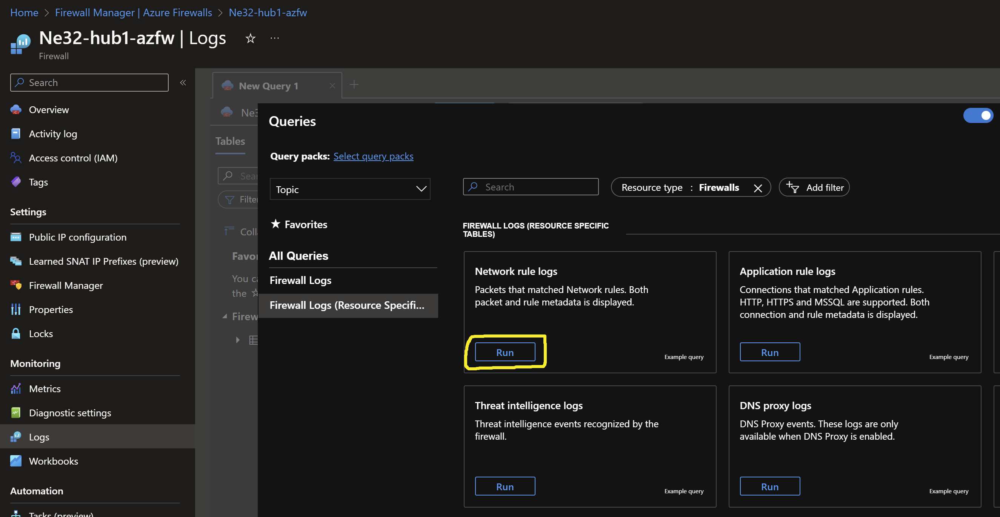
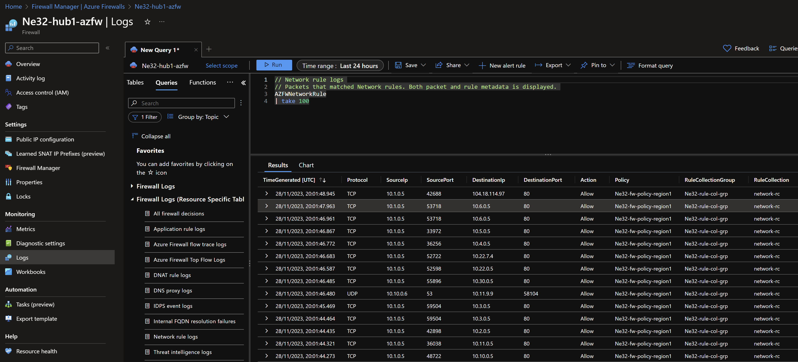

# Secured Hub and Spoke - Dual Region (Virtual Network Manager) <!-- omit from toc -->

## Lab: Ne32 <!-- omit from toc -->

Contents

- [Overview](#overview)
- [Prerequisites](#prerequisites)
- [Deploy the Lab](#deploy-the-lab)
- [Troubleshooting](#troubleshooting)
- [Outputs](#outputs)
- [Dashboards (Optional)](#dashboards-optional)
- [Testing](#testing)
  - [1. Ping IP](#1-ping-ip)
  - [2. Ping DNS](#2-ping-dns)
  - [3. Curl DNS](#3-curl-dns)
  - [4. Private Link Service](#4-private-link-service)
  - [5. Private Link Access to Storage Account](#5-private-link-access-to-storage-account)
  - [6. Private Link Access to Storage Account from On-premises](#6-private-link-access-to-storage-account-from-on-premises)
  - [7. Azure Firewall (Optional)](#7-azure-firewall-optional)
  - [8. On-premises Routes](#8-on-premises-routes)
- [Cleanup](#cleanup)

## Overview

This lab deploys a dual-region Hub and Spoke Secured Virtual Network (Vnet) topology using the [Azure Virtual Network Manager](https://learn.microsoft.com/en-us/azure/virtual-network-manager/concept-connectivity-configuration#hub-and-spoke-topology) (AVNM) service. The lab demonstrates multi-region traffic routing patterns, [hybrid DNS](https://learn.microsoft.com/en-us/azure/dns/private-resolver-hybrid-dns) resolution, firewall security policies, and [PrivateLink Services](https://learn.microsoft.com/en-us/azure/private-link/private-link-service-overview) access to IaaS, [PrivateLink](https://learn.microsoft.com/en-us/azure/private-link/private-link-overview) access to PaaS services.


<p>

***Hub1*** is a Vnet hub that has an Azure firewall used for inspection of traffic between an on-premises branches and Vnets. [User-Defined Routes](https://learn.microsoft.com/en-us/azure/virtual-network/virtual-networks-udr-overview#user-defined) (UDR) are used to influence the hub Vnet data plane to route traffic between the branches and spokes via the firewalls. An isolated spoke ***spoke3*** does not have Vnet peering to ***hub1***, but is reachable from the hub via [Private Link Service](https://learn.microsoft.com/en-us/azure/private-link/private-link-service-overview).

Similarly, ***hub2*** has an Azure firewall used for inspection of traffic between branch and spokes. ***Spoke6*** does not have Vnet peering to ***hub2***, but is reachable from the hub via Private Link Service.

AVNM creates the hub and spoke topology using the following configuration flags:
* **topology**: `HubAndSpoke`
* **isGlobal**: `False` - this disables global mesh
* **useHubGateway**: `True` - this enables Gateway transit via the hub

The hubs are connected together via standard Vnet peering to allow inter-hub network reachability.

***Branch1*** and ***branch3*** are on-premises networks simulated using Vnets. Multi-NIC Linux NVA appliances connect to the hubs using IPsec VPN connections with dynamic (BGP) routing. A simulated on-premises Wide Area Network (WAN) is created using Vnet peering between ***branch1*** and ***branch3*** as the underlay connectivity, and IPsec with BGP as the overlay connection.

Each branch connects to Vnet spokes in their local regions through the directly connected hub. However, each branch connects to spokes in the remote region via the on-premises WAN network. For example, ***branch1*** only receives dynamic routes for ***spoke1***, ***spoke2*** and ***hub1*** through the IPsec VPN connection to ***hub1***. ***Branch1*** uses the simulated on-premises network via ***branch3*** to reach ***spoke4***, ***spoke5*** and ***hub2***.

> ***_NOTE:_*** It is possible for a branch to use a single hub to reach all Azure destinations, but that is not the focus of this lab.

## Prerequisites

Ensure you meet all requirements in the [prerequisites](../../prerequisites/README.md) before proceeding.

## Deploy the Lab

1. Clone the Git Repository for the Labs

   ```sh
   git clone https://github.com/kaysalawu/azure-network-terraform.git
   ```

2. Navigate to the lab directory

   ```sh
   cd azure-network-terraform/3-network-manager/2-hub-spoke-azfw-dual-region
   ```

3. Run the following terraform commands and type ***yes*** at the prompt:

   ```sh
   terraform init
   terraform plan
   terraform apply -parallelism=50
   ```

## Troubleshooting

See the [troubleshooting](../../troubleshooting/README.md) section for tips on how to resolve common issues that may occur during the deployment of the lab.

## Outputs

The table below shows the auto-generated output files from the lab. They are located in the `output` directory.

| Item    | Description  | Location |
|--------|--------|--------|
| IP ranges and DNS | IP ranges and DNS hostname values | [output/values.md](./output/values.md) |
| Branch1 DNS | Authoritative DNS and forwarding | [output/branch1Dns.sh](./output/branch1Dns.sh) |
| Branch3 DNS | Authoritative DNS and forwarding | [output/branch3Dns.sh](./output/branch3Dns.sh) |
| Branch1 NVA | Linux Strongswan + FRR configuration | [output/branch1Nva.sh](./output/branch1Nva.sh) |
| Branch3 NVA | Linux Strongswan + FRR configuration | [output/branch3Nva.sh](./output/branch3Nva.sh) |
| Web server | Python Flask web server, test scripts | [output/server.sh](./output/server.sh) |
||||

## Dashboards (Optional)

This lab contains a number of pre-configured dashboards for monitoring gateways, VPN gateways, and Azure Firewall. To deploy the dashboards, set `enable_diagnostics = true` in the [`main.tf`](./02-main.tf) file. Then run `terraform apply` to update the deployment.

<details>

<summary>Sample Dashboards</summary>

To view the dashboards, follow the steps below:

1. From the Azure portal menu, select **Dashboard hub**.

2. Under **Browse**, select **Shared dashboards**.

3. Select the dashboard you want to view.

   

4. Click on a dashboard under **Go to dashboard** column.

   Sample dashboard for VPN gateway in ***hub1***.

    

    Sample dashboard for Azure Firewall in ***hub1***.

   

</details>
<p>

## Testing

Each virtual machine is pre-configured with a shell [script](../../scripts/server.sh) to run various types of network reachability tests. Serial console access has been configured for all virtual machines.

Login to virtual machine `Vwan24-spoke1Vm` via the [serial console](https://learn.microsoft.com/en-us/troubleshoot/azure/virtual-machines/serial-console-overview#access-serial-console-for-virtual-machines-via-azure-portal):

- On Azure portal select *Virtual machines*
- Select the virtual machine `Ne32-spoke1Vm`
- Under ***Help*** section, select ***Serial console*** and wait for a login prompt
- Enter the login credentials
  - username = ***azureuser***
  - password = ***Password123***
- You should now be in a shell session `azureuser@Ne32-spoke1Vm:~$`

Run the following tests from inside the serial console session.

### 1. Ping IP

This script pings the IP addresses of some test virtual machines and reports reachability and round trip time.

**1.1.** Run the IP ping test

```sh
ping-ip
```

<details>

<summary>Sample output</summary>

```sh
azureuser@spoke1Vm:~$ ping-ip

 ping ip ...

branch1 - 10.10.0.5 -OK 3.800 ms
hub1    - 10.11.0.5 -OK 2.371 ms
spoke1  - 10.1.0.5 -OK 0.024 ms
spoke2  - 10.2.0.5 -OK 2.472 ms
branch3 - 10.30.0.5 -OK 71.221 ms
hub2    - 10.22.0.5 -OK 69.754 ms
spoke4  - 10.4.0.5 -OK 69.476 ms
spoke5  - 10.5.0.5 -OK 70.993 ms
internet - icanhazip.com -NA
```

</details>
<p>

### 2. Ping DNS

This script pings the DNS name of some test virtual machines and reports reachability and round trip time. This tests hybrid DNS resolution between on-premises and Azure.

**2.1.** Run the DNS ping test

```sh
ping-dns
```

<details>

<summary>Sample output</summary>

```sh
azureuser@spoke1Vm:~$ ping-dns

 ping dns ...

branch1vm.corp - 10.10.0.5 -OK 3.526 ms
hub1vm.eu.az.corp - 10.11.0.5 -OK 2.196 ms
spoke1vm.eu.az.corp - 10.1.0.5 -OK 0.029 ms
spoke2vm.eu.az.corp - 10.2.0.5 -OK 2.338 ms
branch3vm.corp - 10.30.0.5 -OK 71.717 ms
hub2vm.us.az.corp - 10.22.0.5 -OK 69.943 ms
spoke4vm.us.az.corp - 10.4.0.5 -OK 69.908 ms
spoke5vm.us.az.corp - 10.5.0.5 -OK 70.149 ms
icanhazip.com - 104.16.184.241 -NA
```

</details>
<p>

### 3. Curl DNS

This script uses curl to check reachability of web server (python Flask) on the test virtual machines. It reports HTTP response message, round trip time and IP address.

**3.1.** Run the DNS curl test

```sh
curl-dns
```

<details>

<summary>Sample output</summary>

```sh
azureuser@spoke1Vm:~$ curl-dns

 curl dns ...

200 (0.031833s) - 10.10.0.5 - branch1vm.corp
200 (0.018412s) - 10.11.0.5 - hub1vm.eu.az.corp
200 (0.013369s) - 10.11.7.88 - spoke3pls.eu.az.corp
200 (0.010474s) - 10.1.0.5 - spoke1vm.eu.az.corp
200 (0.016119s) - 10.2.0.5 - spoke2vm.eu.az.corp
200 (0.171997s) - 10.30.0.5 - branch3vm.corp
200 (0.167102s) - 10.22.0.5 - hub2vm.us.az.corp
200 (0.163101s) - 10.22.7.88 - spoke6pls.us.az.corp
200 (0.169703s) - 10.4.0.5 - spoke4vm.us.az.corp
200 (0.175995s) - 10.5.0.5 - spoke5vm.us.az.corp
200 (0.011997s) - 104.16.185.241 - icanhazip.com
200 (0.037567s) - 10.11.7.99 - https://ne32spoke3sa72e9.blob.core.windows.net/spoke3/spoke3.txt
200 (0.297319s) - 10.22.7.99 - https://ne32spoke6sa72e9.blob.core.windows.net/spoke6/spoke6.txt
```

</details>
<p>

### 4. Private Link Service

**4.1.** Test access to ***spoke3*** web application using the private endpoint in ***hub1***.

```sh
curl spoke3pls.eu.az.corp
```

<details>

<summary>Sample output</summary>

```json
azureuser@spoke1Vm:~$ curl spoke3pls.eu.az.corp
{
  "Headers": {
    "Accept": "*/*",
    "Host": "spoke3pls.eu.az.corp",
    "User-Agent": "curl/7.68.0"
  },
  "Hostname": "spoke3Vm",
  "Local-IP": "10.3.0.5",
  "Remote-IP": "10.3.6.4"
}
```

</details>
<p>

**4.2.** Test access to ***spoke6*** web application using the private endpoint in ***hub2***.

```sh
curl spoke6pls.us.az.corp
```

<details>

<summary>Sample output</summary>

```json
azureuser@spoke1Vm:~$ curl spoke6pls.us.az.corp
{
  "Headers": {
    "Accept": "*/*",
    "Host": "spoke6pls.us.az.corp",
    "User-Agent": "curl/7.68.0"
  },
  "Hostname": "spoke6Vm",
  "Local-IP": "10.6.0.5",
  "Remote-IP": "10.6.6.4"
}
```

</details>
<p>

The `Hostname` and `Local-IP` fields identify the backend web servers - in this case `spoke3Vm` and `spoke6Vm` virtual machines. The `Remote-IP` fields (as seen by the web servers) are IP addresses in the Private Link Service NAT subnets in ***spoke3*** and ***spoke6*** Vnets respectively.

### 5. Private Link Access to Storage Account

Storage accounts with container blobs are deployed and accessible via private endpoints in ***hub1*** and ***hub2*** Vnets respectively. The storage accounts have the following naming convention:

* ne32spoke3sa\<AAAA\>.blob.core.windows.net
* ne32spoke6sa\<BBBB\>.blob.core.windows.net

Where ***\<AAAA\>*** and ***\<BBBB\>*** are randomly generated two-byte strings.

**5.1.** On your Cloudshell (or local machine), get the storage account hostname and blob URL.

```sh
spoke3_storage_account=$(az storage account list -g Ne32_HubSpoke_Azfw_2Region_RG --query "[?contains(name, 'ne32spoke3sa')].name" -o tsv)

spoke3_sgtacct_host="$spoke3_storage_account.blob.core.windows.net"
spoke3_blob_url="https://$spoke3_sgtacct_host/spoke3/spoke3.txt"

echo -e "\n$spoke3_sgtacct_host\n" && echo
```

<details>

<summary>Sample output</summary>

```sh
ne32spoke3sa72e9.blob.core.windows.net
```

</details>
<p>

**5.2.** Resolve the hostname

```sh
nslookup $spoke3_sgtacct_host
```

<details>

<summary>Sample output</summary>

```sh
2-hub-spoke-azfw-dual-region$ nslookup $spoke3_sgtacct_host
Server:         8.8.8.8
Address:        8.8.8.8#53

Non-authoritative answer:
ne32spoke3sa72e9.blob.core.windows.net  canonical name = ne32spoke3sa72e9.privatelink.blob.core.windows.net.
ne32spoke3sa72e9.privatelink.blob.core.windows.net      canonical name = blob.db3prdstr20a.store.core.windows.net.
Name:   blob.db3prdstr20a.store.core.windows.net
Address: 20.150.84.164
```

</details>
<p>

We can see that the endpoint is a public IP address, **20.150.84.164**. We can see the CNAME `ne32spoke3sa72e9.privatelink.blob.core.windows.net.` created for the storage account which recursively resolves to the public IP address.

**5.3.** Test access to the storage account blob.

```sh
curl $spoke3_blob_url && echo
```

<details>

<summary>Sample output</summary>

```sh
Hello, World!
```

</details>
<p>

### 6. Private Link Access to Storage Account from On-premises

**6.1** Login to on-premises virtual machine `Ne32-branch1Vm` via the [serial console](https://learn.microsoft.com/en-us/troubleshoot/azure/virtual-machines/serial-console-overview#access-serial-console-for-virtual-machines-via-azure-portal):
  - username = ***azureuser***
  - password = ***Password123***

 We will test access from `Ne32-branch1Vm` to the storage account for ***spoke3*** via the private endpoint in ***hub1***.

**6.2.** Run `az login` using the VM's system-assigned managed identity.

```sh
az login --identity
```

<details>

<summary>Sample output</summary>

```json
azureuser@branch1Vm:~$ az login --identity
[
  {
    "environmentName": "AzureCloud",
    "homeTenantId": "aaa-bbb-ccc-ddd-eee",
    "id": "xxx-yyy-1234-1234-1234",
    "isDefault": true,
    "managedByTenants": [
      {
        "tenantId": "your-tenant-id"
      }
    ],
    "name": "some-random-name",
    "state": "Enabled",
    "tenantId": "your-tenant-id",
    "user": {
      "assignedIdentityInfo": "MSI",
      "name": "systemAssignedIdentity",
      "type": "servicePrincipal"
    }
  }
]
```

</details>
<p>

**6.3.** Get the storage account hostname and blob URL.

```sh
spoke3_storage_account=$(az storage account list -g Ne32_HubSpoke_Azfw_2Region_RG --query "[?contains(name, 'ne32spoke3sa')].name" -o tsv)

spoke3_sgtacct_host="$spoke3_storage_account.blob.core.windows.net"
spoke3_blob_url="https://$spoke3_sgtacct_host/spoke3/spoke3.txt"

echo -e "\n$spoke3_sgtacct_host\n" && echo
```

<details>

<summary>Sample output</summary>

```sh
ne32spoke3sa72e9.blob.core.window.net
```

</details>
<p>

**6.4.** Resolve the storage account DNS name

```sh
nslookup $spoke3_sgtacct_host
```

<details>

<summary>Sample output</summary>

```sh
azureuser@branch1Vm:~$ nslookup $spoke3_sgtacct_host
Server:         127.0.0.53
Address:        127.0.0.53#53

Non-authoritative answer:
ne32spoke3sa72e9.blob.core.windows.net  canonical name = ne32spoke3sa72e9.privatelink.blob.core.windows.net.
Name:   ne32spoke3sa72e9.privatelink.blob.core.windows.net
Address: 10.11.7.99
```

</details>
<p>

We can see that the storage account hostname resolves to the private endpoint ***10.11.7.99*** in ***hub1***. The following is a summary of the DNS resolution from `Ne32-branch1Vm`:

- On-premises server `Ne32-branch1Vm` makes a DNS request for `ne32spoke3sa72e9.blob.core.windows.net`
- The request is received by on-premises DNS server `Ne32-branch1-dns`
- The DNS server resolves `ne32spoke3sa72e9.blob.core.windows.net` to the CNAME `ne32spoke3sa72e9.privatelink.blob.core.windows.net`
- The DNS server has a conditional DNS forwarding defined in the branch1 unbound DNS configuration file, [output/branch1Dns.sh](./output/branch1Dns.sh).

  ```sh
  forward-zone:
          name: "privatelink.blob.core.windows.net."
          forward-addr: 10.11.8.4
  ```

  DNS Requests matching `privatelink.blob.core.windows.net` will be forwarded to the private DNS resolver inbound endpoint in ***hub1*** (10.11.8.4).
- The DNS server forwards the DNS request to the private DNS resolver inbound endpoint in ***hub1*** - which returns the IP address of the storage account private endpoint in ***hub1*** (10.11.7.99)

**6.5.** Test access to the storage account blob.

```sh
curl $spoke3_blob_url && echo
```

<details>

<summary>Sample output</summary>

```sh
Hello, World!
```

</details>
<p>

### 7. Azure Firewall (Optional)

To view firewall logs, set `enable_diagnostics = true` in the [`main.tf`](./02-main.tf). Then run `terraform apply` to update the deployment. Wait for about 15 minutes to get some logs.

<details>

<summary>Sample Azure Firewall logs</summary>

**7.1.** Check the Azure Firewall logs to observe the traffic flow.

- Select the Azure Firewall resource `Ne32-hub1-azfw` in the Azure portal.
- Click on **Logs** in the left navigation pane.
- Click on **Firewall Logs (Resource Specific Tables)**.
- Click on **Run** in the log category *Network rule logs*.



Observe the firewall logs based on traffic flows generated from our tests.



</details>
<p>

### 8. On-premises Routes

**8.1** Login to on-premises virtual machine `Ne32-branch1Nva` via the [serial console](https://learn.microsoft.com/en-us/troubleshoot/azure/virtual-machines/serial-console-overview#access-serial-console-for-virtual-machines-via-azure-portal):
  - username = ***azureuser***
  - password = ***Password123***

**8.2.** Enter the VTY shell for the FRRouting daemon.

```sh
sudo vtysh
```

<details>

<summary>Sample output</summary>

```sh
azureuser@branch1Nva:~$ sudo vtysh

Hello, this is FRRouting (version 7.2.1).
Copyright 1996-2005 Kunihiro Ishiguro, et al.
```

</details>
<p>

**8.3.** Display the routing table by typing `show ip route` and pressing the space bar to show the complete output.

```sh
show ip route
```

<details>

<summary>Sample output</summary>

```sh
branch1Nva# show ip route
Codes: K - kernel route, C - connected, S - static, R - RIP,
       O - OSPF, I - IS-IS, B - BGP, E - EIGRP, N - NHRP,
       T - Table, v - VNC, V - VNC-Direct, A - Babel, D - SHARP,
       F - PBR, f - OpenFabric,
       > - selected route, * - FIB route, q - queued route, r - rejected route

K>* 0.0.0.0/0 [0/100] via 10.10.1.1, eth0, src 10.10.1.9, 01:20:55
B>* 10.1.0.0/20 [20/0] via 10.11.16.4, vti1, 00:24:38
  *                    via 10.11.16.5, vti0, 00:24:38
B>* 10.2.0.0/20 [20/0] via 10.11.16.4, vti1, 00:24:38
  *                    via 10.11.16.5, vti0, 00:24:38
B>  10.4.0.0/20 [20/0] via 192.168.30.30 (recursive), 00:26:39
  *                      via 192.168.30.30, vti2 onlink, 00:26:39
B>  10.5.0.0/20 [20/0] via 192.168.30.30 (recursive), 00:26:39
  *                      via 192.168.30.30, vti2 onlink, 00:26:39
S>* 10.10.0.0/24 [1/0] via 10.10.1.1, eth0, 01:20:55
C>* 10.10.1.0/24 is directly connected, eth0, 01:20:55
C>* 10.10.2.0/24 is directly connected, eth1, 01:20:55
C>* 10.10.10.10/32 is directly connected, vti2, 00:26:39
B>* 10.11.0.0/20 [20/0] via 10.11.16.4, vti1, 00:24:38
  *                     via 10.11.16.5, vti0, 00:24:38
B>* 10.11.16.0/20 [20/0] via 10.11.16.4, vti1, 00:24:38
  *                      via 10.11.16.5, vti0, 00:24:38
S   10.11.16.4/32 [1/0] is directly connected, vti1, 00:26:28
C>* 10.11.16.4/32 is directly connected, vti1, 00:26:28
S   10.11.16.5/32 [1/0] is directly connected, vti0, 00:24:38
C>* 10.11.16.5/32 is directly connected, vti0, 00:24:38
B>  10.22.0.0/20 [20/0] via 192.168.30.30 (recursive), 00:26:39
  *                       via 192.168.30.30, vti2 onlink, 00:26:39
B>  10.22.16.0/20 [20/0] via 192.168.30.30 (recursive), 00:26:39
  *                        via 192.168.30.30, vti2 onlink, 00:26:39
B>  10.30.0.0/24 [20/0] via 192.168.30.30 (recursive), 00:26:39
  *                       via 192.168.30.30, vti2 onlink, 00:26:39
K>* 168.63.129.16/32 [0/100] via 10.10.1.1, eth0, src 10.10.1.9, 01:20:55
K>* 169.254.169.254/32 [0/100] via 10.10.1.1, eth0, src 10.10.1.9, 01:20:55
C>* 192.168.10.10/32 is directly connected, lo, 01:20:55
S>* 192.168.30.30/32 [1/0] is directly connected, vti2, 00:26:39
```

We can see the Vnet ranges learned dynamically via BGP.

</details>
<p>

**8.4.** Display BGP information by typing `show ip bgp` and pressing the space bar to show the complete output.

```sh
show ip bgp
```

<details>

<summary>Sample output</summary>

```sh
branch1Nva# show ip bgp
BGP table version is 24, local router ID is 192.168.10.10, vrf id 0
Default local pref 100, local AS 65001
Status codes:  s suppressed, d damped, h history, * valid, > best, = multipath,
               i internal, r RIB-failure, S Stale, R Removed
Nexthop codes: @NNN nexthop's vrf id, < announce-nh-self
Origin codes:  i - IGP, e - EGP, ? - incomplete

   Network          Next Hop            Metric LocPrf Weight Path
*= 10.1.0.0/20      10.11.16.5                             0 65515 i
*>                  10.11.16.4                             0 65515 i
*= 10.2.0.0/20      10.11.16.5                             0 65515 i
*>                  10.11.16.4                             0 65515 i
*> 10.4.0.0/20      192.168.30.30                          0 65003 65515 i
*> 10.5.0.0/20      192.168.30.30                          0 65003 65515 i
*> 10.10.0.0/24     0.0.0.0                  0         32768 i
*= 10.11.0.0/20     10.11.16.4                             0 65515 i
*>                  10.11.16.5                             0 65515 i
*= 10.11.16.0/20    10.11.16.4                             0 65515 i
*>                  10.11.16.5                             0 65515 i
*> 10.22.0.0/20     192.168.30.30                          0 65003 65515 i
*> 10.22.16.0/20    192.168.30.30                          0 65003 65515 i
*> 10.30.0.0/24     192.168.30.30            0             0 65003 i

Displayed  10 routes and 14 total paths
```

We can see the hub and spoke Vnet ranges being learned dynamically in the BGP table.

</details>
<p>

## Cleanup

1\. (Optional) Navigate back to the lab directory (if you are not already there)

```sh
cd azure-network-terraform/3-network-manager/2-hub-spoke-azfw-dual-region
```

2\. (Optional) This is not required if `enable_diagnostics = false` in the [`main.tf`](./02-main.tf). If you deployed the lab with `enable_diagnostics = true`, in order to avoid terraform errors when re-deploying this lab, run a cleanup script to remove diagnostic settings that are not removed after the resource group is deleted.

```sh
bash ../../scripts/_cleanup.sh Ne32_HubSpoke_Azfw_2Region_RG
```

<details>

<summary>Sample output</summary>

```sh
2-hub-spoke-azfw-dual-region$    bash ../../scripts/_cleanup.sh Ne32_HubSpoke_Azfw_2Region_RG

Resource group: Ne32_HubSpoke_Azfw_2Region_RG

⏳ Checking for diagnostic settings on resources in Ne32_HubSpoke_Azfw_2Region_RG ...
➜  Checking firewall ...
    ❌ Deleting: diag setting [Ne32-hub1-azfw-diag] for firewall [Ne32-hub1-azfw] ...
    ❌ Deleting: diag setting [Ne32-hub2-azfw-diag] for firewall [Ne32-hub2-azfw] ...
➜  Checking vnet gateway ...
    ❌ Deleting: diag setting [Ne32-hub1-vpngw-diag] for vnet gateway [Ne32-hub1-vpngw] ...
    ❌ Deleting: diag setting [Ne32-hub2-vpngw-diag] for vnet gateway [Ne32-hub2-vpngw] ...
➜  Checking vpn gateway ...
➜  Checking er gateway ...
➜  Checking app gateway ...
⏳ Checking for azure policies in Ne32_HubSpoke_Azfw_2Region_RG ...
Done!
```

</details>
<p>

3\. Delete the resource group to remove all resources installed.

```sh
az group delete -g Ne32_HubSpoke_Azfw_2Region_RG --no-wait
```

1. Delete terraform state files and other generated files.

```sh
rm -rf .terraform*
rm terraform.tfstate*
```
