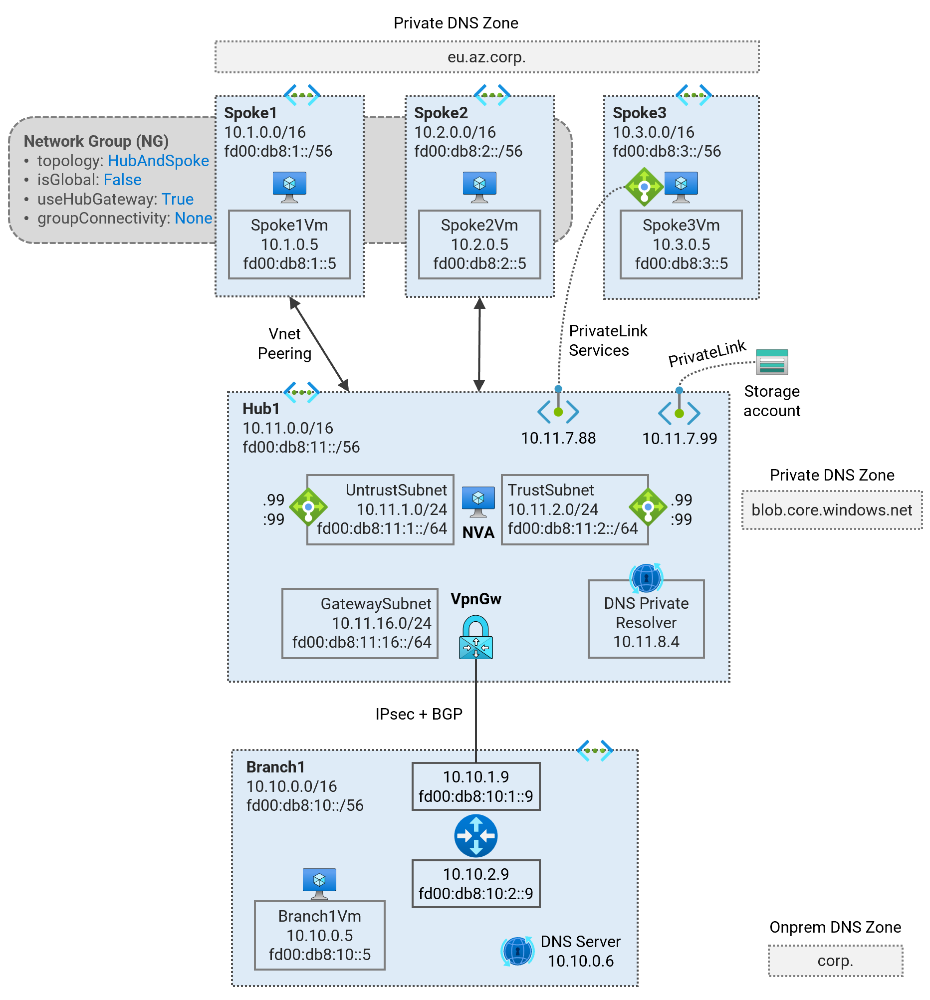
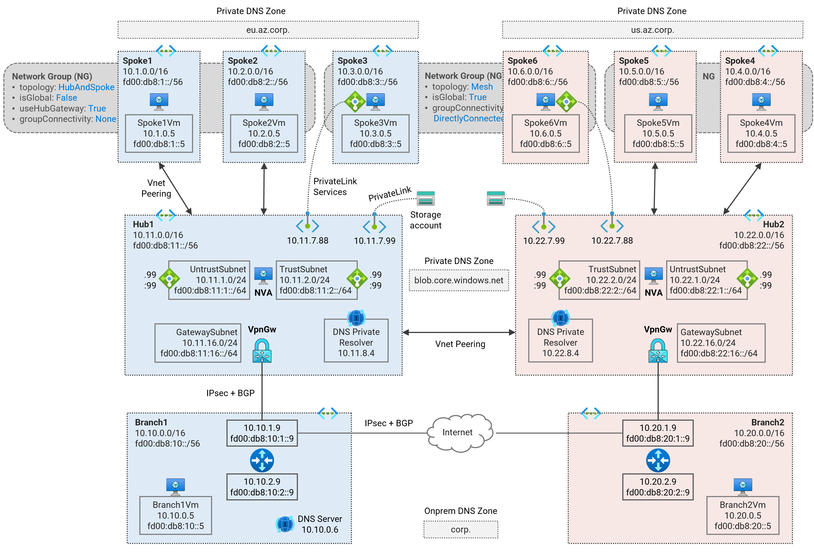

# Virtual Network Manager <!-- omit from toc -->

Contents
<!-- TOC -->
- [1. Secured Hub and Spoke - Single Region (Virtual Network Manager)](#1-secured-hub-and-spoke---single-region-virtual-network-manager)
- [2. Secured Hub and Spoke - Dual Region (Virtual Network Manager)](#2-secured-hub-and-spoke---dual-region-virtual-network-manager)
<!-- /TOC -->

Terraform codes in this collection cover different hub and spoke network patterns using standard VNET solutions.

## 1. Secured Hub and Spoke - Single Region (Virtual Network Manager)

[⚙️ **Deploy Terraform Code**](./1-hub-spoke-azfw-single-region/)

Deploy a single-region Hub and Spoke Secured Virtual Network (Vnet) topology using the [Azure Virtual Network Manager](https://learn.microsoft.com/en-us/azure/virtual-network-manager/concept-connectivity-configuration#hub-and-spoke-topology) (AVNM) service. Learn about traffic routing patterns, [hybrid DNS](https://learn.microsoft.com/en-us/azure/dns/private-resolver-hybrid-dns) resolution, firewall security policies, and [PrivateLink Services](https://learn.microsoft.com/en-us/azure/private-link/private-link-service-overview) access to IaaS, [PrivateLink](https://learn.microsoft.com/en-us/azure/private-link/private-link-overview) access to PaaS services.

## 2. Secured Hub and Spoke - Dual Region (Virtual Network Manager)

[⚙️ **Deploy Terraform Code**](./2-hub-spoke-azfw-dual-region/)

Deploy a dual-region Hub and Spoke Secured Virtual Network (Vnet) topology using the [Azure Virtual Network Manager](https://learn.microsoft.com/en-us/azure/virtual-network-manager/concept-connectivity-configuration#hub-and-spoke-topology) (AVNM) service. Learn about traffic routing patterns, [hybrid DNS](https://learn.microsoft.com/en-us/azure/dns/private-resolver-hybrid-dns) resolution, firewall security policies, and [PrivateLink Services](https://learn.microsoft.com/en-us/azure/private-link/private-link-service-overview) access to IaaS, [PrivateLink](https://learn.microsoft.com/en-us/azure/private-link/private-link-overview) access to PaaS services.

