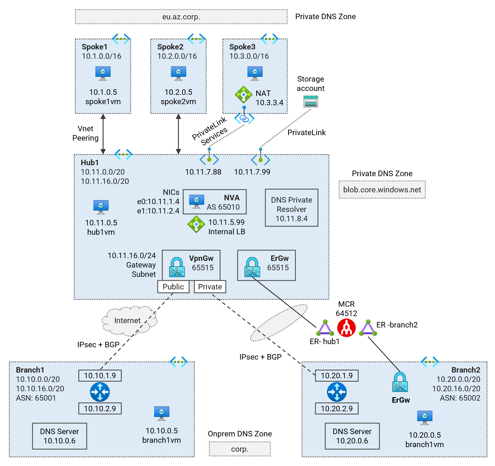

# Lab01 - IPsec over ExpressRoute <!-- omit from toc -->

Contents

- [Overview](#overview)
- [Prerequisites](#prerequisites)
- [Deploy the Lab](#deploy-the-lab)
- [Results](#results)
  - [1. Spoke1](#1-spoke1)
  - [2. Branch2 VM](#2-branch2-vm)
  - [3. Branch2 NVA](#3-branch2-nva)
  - [4. Hub1](#4-hub1)
  - [6. Vnet Gateways](#6-vnet-gateways)
  - [6. Express Route Circuits](#6-express-route-circuits)
- [Troubleshooting](#troubleshooting)
- [Cleanup](#cleanup)

## Overview

This lab deploys a single region hub and spoke topology to demonstrate IPsec over ExpressRoute to an on-premises branch location. Megaport is used as the ExpressRoute provider.

Related articles and documentation:
* [Lab - Virtual WAN Scenario: IPsec VPN over ER](https://github.com/kaysalawu/azure-virtualwan/tree/main/vpn-over-er)
* [Configure a Site-to-Site VPN connection over ExpressRoute private peering](https://learn.microsoft.com/en-us/azure/vpn-gateway/site-to-site-vpn-private-peering)

  

## Prerequisites

Ensure you meet all requirements in the [prerequisites](../../prerequisites/README.md) before proceeding. You will need a Megaport account to deploy the lab.

> **NOTE**: You need to have an active [megaport](https://www.megaport.com/) account. You will need to supply the megaport credentials in order to deploy the lab:
* `megaport_access_key`
* `megaport_secret_key`

## Deploy the Lab

1. Clone the Git Repository for the Labs

   ```sh
   git clone https://github.com/kaysalawu/azure-network-terraform.git
   ```

2. Navigate to the lab directory

   ```sh
   cd azure-network-terraform/4-general/01-ipsec-over-er
   ```

3. Run the following terraform commands and type ***yes*** at the prompt:

   ```sh
   terraform init
   terraform plan
   terraform apply
   ```

4. Manually configure the secondary express route connection in Megaport portal.

## Results

### 1. Spoke1

All packets from `spoke1Vm` to `branch2Vm` are routed through the NVA in the hub; and then via the VPN gateway where the traffic is encrypted and sent over the ExpressRoute circuit to branch2.

<details>
<summary>Spoke1Vm - Curl DNS</summary>

```sh
azureuser@spoke1Vm:~$ curl-dns4

 curl dns ipv4 ...

200 (0.019035s) - 10.10.0.5 - branch1vm.corp
200 (0.015482s) - 10.11.0.5 - hub1vm.eu.az.corp
200 (0.010227s) - 10.11.7.88 - spoke3pls.eu.az.corp
200 (0.009985s) - 10.1.0.5 - spoke1vm.eu.az.corp
200 (0.016568s) - 10.2.0.5 - spoke2vm.eu.az.corp
200 (0.039737s) - 104.16.185.241 - icanhazip.com
200 (0.028677s) - 10.11.7.99 - https://lab01spoke3saf69f.blob.core.windows.net/spoke3/spoke3.txt
```

</details>
<p>

<details>
<summary>Spoke1Vm - Tracepath</summary>

```sh
azureuser@spoke1Vm:~$ trace-ipv4

 trace ipv4 ...


branch1
-------------------------------------
 1?: [LOCALHOST]                      pmtu 1500
 1:  10.11.1.4                                             1.794ms
 1:  10.11.1.4                                             2.433ms
 2:  10.10.10.5                                           16.922ms
 3:  10.10.0.5                                             5.098ms reached
     Resume: pmtu 1500 hops 3 back 3

hub1
-------------------------------------
 1?: [LOCALHOST]                      pmtu 1500
 1:  10.11.1.4                                             5.944ms
 1:  10.11.1.4                                             2.561ms
 2:  10.11.0.5                                             2.355ms reached
     Resume: pmtu 1500 hops 2 back 2

spoke1
-------------------------------------
 1:  spoke1vm.internal.cloudapp.net                        0.080ms reached
     Resume: pmtu 65535 hops 1 back 1

spoke2
-------------------------------------
 1?: [LOCALHOST]                      pmtu 1500
 1:  10.11.1.4                                             1.336ms
 1:  10.11.1.4                                             1.133ms
 2:  10.2.0.5                                              3.507ms reached
     Resume: pmtu 1500 hops 2 back 2

internet
-------------------------------------
 1?: [LOCALHOST]                      pmtu 1500
 1:  10.11.1.4                                             1.607ms
 2:  no reply
 3:  no reply
```

</details>
<p>

<details>
<summary>Spoke1Vm - Effective Routes</summary>

```sh
Effective routes for Lab01-spoke1-vm-main-nic

Source    Prefix         State    NextHopType        NextHopIP
--------  -------------  -------  -----------------  -----------
Default   10.1.0.0/16    Active   VnetLocal
Default   10.11.0.0/16   Invalid  VNetPeering
Default   0.0.0.0/0      Invalid  Internet
User      10.11.0.0/16   Active   VirtualAppliance   10.11.2.99
User      0.0.0.0/0      Active   VirtualAppliance   10.11.2.99
Default   10.11.7.99/32  Invalid  InterfaceEndpoint
Default   10.11.7.88/32  Invalid  InterfaceEndpoint
```

</details>
<p>

### 2. Branch2 VM

<details>
<summary>Branch2Vm - Curl DNS</summary>

```sh
azureuser@branch2Vm:~$ curl-dns4

 curl dns ipv4 ...

200 (0.051003s) - 10.10.0.5 - branch1vm.corp
200 (0.083165s) - 10.11.0.5 - hub1vm.eu.az.corp
200 (0.052173s) - 10.11.7.88 - spoke3pls.eu.az.corp
200 (0.084521s) - 10.1.0.5 - spoke1vm.eu.az.corp
200 (0.077546s) - 10.2.0.5 - spoke2vm.eu.az.corp
200 (0.056096s) - 104.16.184.241 - icanhazip.com
200 (0.120274s) - 10.11.7.99 - https://lab01spoke3saf69f.blob.core.windows.net/spoke3/spoke3.txt
```

</details>
<p>

<details>
<summary>Branch2Vm - Tracepath</summary>

```sh
azureuser@branch2Vm:~$ trace-ipv4

 trace ipv4 ...


branch1
-------------------------------------
 1?: [LOCALHOST]                      pmtu 1500
 1:  10.20.1.9                                             1.621ms
 1:  10.20.1.9                                             5.235ms
 2:  10.20.1.9                                             1.205ms pmtu 1436
 2:  no reply
 3:  10.10.0.5                                            25.104ms reached
     Resume: pmtu 1436 hops 3 back 3

hub1
-------------------------------------
 1?: [LOCALHOST]                      pmtu 1500
 1:  10.20.1.9                                             1.458ms
 1:  10.20.1.9                                             1.624ms
 2:  10.20.1.9                                             1.155ms pmtu 1436
 2:  10.11.1.4                                            23.947ms
 3:  10.11.0.5                                            24.433ms reached
     Resume: pmtu 1436 hops 3 back 3

spoke1
-------------------------------------
 1?: [LOCALHOST]                      pmtu 1500
 1:  10.20.1.9                                             1.443ms
 1:  10.20.1.9                                             1.647ms
 2:  10.20.1.9                                             1.280ms pmtu 1436
 2:  10.11.1.4                                            28.734ms
 3:  10.1.0.5                                             27.187ms reached
     Resume: pmtu 1436 hops 3 back 3

spoke2
-------------------------------------
 1?: [LOCALHOST]                      pmtu 1500
 1:  10.20.1.9                                             1.391ms
 1:  10.20.1.9                                             1.315ms
 2:  10.20.1.9                                             1.311ms pmtu 1436
 2:  10.11.1.4                                            22.552ms
 3:  10.2.0.5                                             26.385ms reached
     Resume: pmtu 1436 hops 3 back 3

internet
-------------------------------------
 1?: [LOCALHOST]                      pmtu 1500
 1:  no reply
 2:  no reply
```

</details>
<p>

### 3. Branch2 NVA

Run `sudo vtysh` to enter the FRR shell.

<details>
<summary>Branch2Nva - IP Interfaces</summary>

```sh
branch2Nva# show interface brief
Interface       Status  VRF             Addresses
---------       ------  ---             ---------
eth0            up      default         10.20.1.9/24
eth1            up      default         10.20.2.9/24
ip_vti0         down    default
lo              up      default         192.168.20.20/32
vti0            up      default         10.10.10.9/32
vti1            up      default         10.10.10.13/32
```

</details>
<p>

<details>
<summary>Branch2Nva - IP routes</summary>

```sh
branch2Nva# show ip route
Codes: K - kernel route, C - connected, S - static, R - RIP,
       O - OSPF, I - IS-IS, B - BGP, E - EIGRP, N - NHRP,
       T - Table, v - VNC, V - VNC-Direct, A - Babel, D - SHARP,
       F - PBR, f - OpenFabric,
       > - selected route, * - FIB route, q - queued route, r - rejected route

S   0.0.0.0/0 [1/0] via 10.20.1.1, eth0, 01:03:34
K>* 0.0.0.0/0 [0/100] via 10.20.1.1, eth0, src 10.20.1.9, 01:03:35
B>* 10.1.0.0/16 [20/0] via 10.11.16.14, vti1, 00:06:56
  *                    via 10.11.16.15, vti0, 00:06:56
B>* 10.2.0.0/16 [20/0] via 10.11.16.14, vti1, 00:06:56
  *                    via 10.11.16.15, vti0, 00:06:56
B>* 10.10.0.0/24 [20/0] via 10.11.16.14, vti1, 00:06:56
  *                     via 10.11.16.15, vti0, 00:06:56
B>* 10.11.0.0/16 [20/0] via 10.11.16.14, vti1, 00:06:56
  *                     via 10.11.16.15, vti0, 00:06:56
S>* 10.11.16.4/32 [1/0] via 10.20.1.1, eth0, 01:03:34
S>* 10.11.16.5/32 [1/0] via 10.20.1.1, eth0, 01:03:34
S   10.11.16.14/32 [1/0] is directly connected, vti1, 00:06:56
C>* 10.11.16.14/32 is directly connected, vti1, 00:06:56
S   10.11.16.15/32 [1/0] is directly connected, vti0, 00:08:13
C>* 10.11.16.15/32 is directly connected, vti0, 00:08:13
S>* 10.20.0.0/24 [1/0] via 10.20.1.1, eth0, 01:03:34
C>* 10.20.1.0/24 is directly connected, eth0, 01:03:35
C>* 10.20.2.0/24 is directly connected, eth1, 01:03:35
K>* 168.63.129.16/32 [0/100] via 10.20.1.1, eth0, src 10.20.1.9, 01:03:35
K>* 169.254.169.254/32 [0/100] via 10.20.1.1, eth0, src 10.20.1.9, 01:03:35
B>* 192.168.10.10/32 [20/0] via 10.11.16.14, vti1, 00:06:56
C>* 192.168.20.20/32 is directly connected, lo, 01:03:35
```

</details>
<p>

<details>
<summary>Branch2Nva - BGP table detailed</summary>

```sh
branch2Nva# show ip bgp
BGP table version is 10, local router ID is 192.168.20.20, vrf id 0
Default local pref 100, local AS 65002
Status codes:  s suppressed, d damped, h history, * valid, > best, = multipath,
               i internal, r RIB-failure, S Stale, R Removed
Nexthop codes: @NNN nexthop's vrf id, < announce-nh-self
Origin codes:  i - IGP, e - EGP, ? - incomplete

   Network          Next Hop            Metric LocPrf Weight Path
*= 10.1.0.0/16      10.11.16.15                            0 65515 i
*>                  10.11.16.14                            0 65515 i
*= 10.2.0.0/16      10.11.16.15                            0 65515 i
*>                  10.11.16.14                            0 65515 i
*= 10.10.0.0/24     10.11.16.15                            0 65515 65001 i
*>                  10.11.16.14                            0 65515 65001 i
*= 10.11.0.0/16     10.11.16.15                            0 65515 i
*>                  10.11.16.14                            0 65515 i
*> 10.20.0.0/24     0.0.0.0                  0         32768 i
*> 192.168.10.10/32 10.11.16.14                            0 65515 i

Displayed  6 routes and 10 total paths
```

</details>
<p>

### 4. Hub1

<details>
<summary>Hub1Nva Untrust NIC - Effective Routes</summary>

```sh
Effective routes for Lab01-hub1-nva-untrust-nic

Source                 Prefix         State    NextHopType            NextHopIP
---------------------  -------------  -------  ---------------------  -----------
Default                10.11.0.0/16   Active   VnetLocal
Default                10.1.0.0/16    Active   VNetPeering
Default                10.2.0.0/16    Active   VNetPeering
VirtualNetworkGateway  10.10.0.0/24   Active   VirtualNetworkGateway  10.11.16.14
VirtualNetworkGateway  10.10.0.0/24   Active   VirtualNetworkGateway  10.11.16.15
VirtualNetworkGateway  10.20.0.0/24   Active   VirtualNetworkGateway  10.11.16.14
VirtualNetworkGateway  10.20.0.0/24   Active   VirtualNetworkGateway  10.11.16.15
VirtualNetworkGateway  10.20.0.0/16   Active   VirtualNetworkGateway  10.2.146.52
VirtualNetworkGateway  10.20.0.0/16   Active   VirtualNetworkGateway  10.2.146.53
Default                0.0.0.0/0      Active   Internet
Default                10.11.7.99/32  Active   InterfaceEndpoint
Default                10.11.7.88/32  Active   InterfaceEndpoint
```

</details>
<p>

From **hub1**, the more specific prefixes for **branch2** **(10.10.0.0/24)**, are seen over the VPN tunnel. The wider **branch2** range **(10.20.0.0/16)** is seen over the ExpressRoute circuit.

### 6. Vnet Gateways

<details>
<summary>Vnet Gateway Route Tables</summary>

```sh
01-ipsec-over-er$ ../../scripts/vnet-gateway/get_route_tables.sh Lab01_IPsecOverER_RG

Resource group: Lab01_IPsecOverER_RG

Gateway: Lab01-branch2-ergw
Route tables:
Network           NextHop     Origin    SourcePeer    AsPath       Weight
----------------  ----------  --------  ------------  -----------  --------
10.20.0.0/16                  Network   10.20.16.12                32768
fd00:db8:20::/56              Network   10.20.16.12                32768
10.11.0.0/16      10.20.16.5  EBgp      10.20.16.5    12076-12076  32769
10.11.0.0/16      10.20.16.4  EBgp      10.20.16.4    12076-12076  32769
10.1.0.0/16       10.20.16.5  EBgp      10.20.16.5    12076-12076  32769
10.1.0.0/16       10.20.16.4  EBgp      10.20.16.4    12076-12076  32769
10.2.0.0/16       10.20.16.5  EBgp      10.20.16.5    12076-12076  32769
10.2.0.0/16       10.20.16.4  EBgp      10.20.16.4    12076-12076  32769

Gateway: Lab01-hub1-ergw
Route tables:
Network           NextHop      Origin    SourcePeer    AsPath       Weight
----------------  -----------  --------  ------------  -----------  --------
10.11.0.0/16                   Network   10.11.16.12                32768
fd00:db8:11::/56               Network   10.11.16.12                32768
10.1.0.0/16                    Network   10.11.16.12                32768
fd00:db8:1::/56                Network   10.11.16.12                32768
10.10.0.0/24      10.11.16.14  IBgp      10.11.16.14   65001        32768
10.10.0.0/24      10.11.16.15  IBgp      10.11.16.15   65001        32768
10.2.0.0/16                    Network   10.11.16.12                32768
fd00:db8:2::/56                Network   10.11.16.12                32768
10.20.0.0/16      10.11.16.6   EBgp      10.11.16.6    12076-12076  32769
10.20.0.0/16      10.11.16.7   EBgp      10.11.16.7    12076-12076  32769
10.20.0.0/24      10.11.16.14  IBgp      10.11.16.14   65002        32768
10.20.0.0/24      10.11.16.15  IBgp      10.11.16.15   65002        32768

Gateway: Lab01-hub1-vpngw
Route tables:
Network           NextHop        Origin    SourcePeer     AsPath    Weight
----------------  -------------  --------  -------------  --------  --------
10.11.0.0/16      10.11.16.12    IBgp      10.11.16.12              32769
10.11.0.0/16      10.11.16.13    IBgp      10.11.16.13              32769
10.1.0.0/16       10.11.16.12    IBgp      10.11.16.12              32769
10.1.0.0/16       10.11.16.13    IBgp      10.11.16.13              32769
192.168.10.10/32                 Network   10.11.16.14              32768
192.168.10.10/32  10.11.16.15    IBgp      10.11.16.15              32768
10.10.0.0/24      192.168.10.10  EBgp      192.168.10.10  65001     32768
10.10.0.0/24      10.11.16.15    IBgp      10.11.16.15    65001     32768
10.2.0.0/16       10.11.16.12    IBgp      10.11.16.12              32769
10.2.0.0/16       10.11.16.13    IBgp      10.11.16.13              32769
192.168.20.20/32                 Network   10.11.16.14              32768
192.168.20.20/32  10.11.16.15    IBgp      10.11.16.15              32768
10.20.0.0/24      192.168.20.20  EBgp      192.168.20.20  65002     32768
10.20.0.0/24      10.11.16.15    IBgp      10.11.16.15    65002     32768
10.11.0.0/16                     Network   10.11.16.14              32768
10.1.0.0/16                      Network   10.11.16.14              32768
10.2.0.0/16                      Network   10.11.16.14              32768
10.11.0.0/16      10.11.16.12    IBgp      10.11.16.12              32769
10.11.0.0/16      10.11.16.13    IBgp      10.11.16.13              32769
10.1.0.0/16       10.11.16.12    IBgp      10.11.16.12              32769
10.1.0.0/16       10.11.16.13    IBgp      10.11.16.13              32769
192.168.10.10/32                 Network   10.11.16.15              32768
192.168.10.10/32  10.11.16.14    IBgp      10.11.16.14              32768
10.10.0.0/24      192.168.10.10  EBgp      192.168.10.10  65001     32768
10.10.0.0/24      10.11.16.14    IBgp      10.11.16.14    65001     32768
10.2.0.0/16       10.11.16.12    IBgp      10.11.16.12              32769
10.2.0.0/16       10.11.16.13    IBgp      10.11.16.13              32769
192.168.20.20/32                 Network   10.11.16.15              32768
192.168.20.20/32  10.11.16.14    IBgp      10.11.16.14              32768
10.20.0.0/24      192.168.20.20  EBgp      192.168.20.20  65002     32768
10.20.0.0/24      10.11.16.14    IBgp      10.11.16.14    65002     32768
10.11.0.0/16                     Network   10.11.16.15              32768
10.1.0.0/16                      Network   10.11.16.15              32768
10.2.0.0/16                      Network   10.11.16.15              32768
```

</details>
<p>

<details>
<summary>Vnet Gateway -  BGP Peers</summary>

```sh
01-ipsec-over-er$ ../../scripts/vnet-gateway/get_bgp_peer_status.sh Lab01_IPsecOverER_RG

Resource group: Lab01_IPsecOverER_RG

Gateway: Lab01-branch2-ergw
Route tables:
Neighbor    ASN    LocalAddress    RoutesReceived    State
----------  -----  --------------  ----------------  ---------
10.20.16.4  12076  10.20.16.13     8                 Connected
10.20.16.5  12076  10.20.16.13     8                 Connected

Gateway: Lab01-hub1-ergw
Route tables:
Neighbor     ASN    LocalAddress    RoutesReceived    State
-----------  -----  --------------  ----------------  ---------
10.11.16.6   12076  10.11.16.12     6                 Connected
10.11.16.7   12076  10.11.16.12     6                 Connected
10.11.16.14  65515  10.11.16.12     2                 Connected
10.11.16.15  65515  10.11.16.12     2                 Connected

Gateway: Lab01-hub1-vpngw
Route tables:
Neighbor       ASN    LocalAddress    RoutesReceived    State
-------------  -----  --------------  ----------------  ---------
192.168.20.20  65002  10.11.16.14     1                 Connected
192.168.10.10  65001  10.11.16.14     1                 Connected
10.11.16.13    65515  10.11.16.14     4                 Connected
10.11.16.12    65515  10.11.16.14     4                 Connected
10.11.16.14    65515  10.11.16.14     0                 Unknown
10.11.16.15    65515  10.11.16.14     4                 Connected
192.168.20.20  65002  10.11.16.15     1                 Connected
192.168.10.10  65001  10.11.16.15     1                 Connected
10.11.16.13    65515  10.11.16.15     4                 Connected
10.11.16.12    65515  10.11.16.15     4                 Connected
10.11.16.14    65515  10.11.16.15     4                 Connected
10.11.16.15    65515  10.11.16.15     0                 Unknown
```

</details>
<p>

### 6. Express Route Circuits

<details>
<summary>Express Route Circuit - Route Tables</summary>

```sh
01-ipsec-over-er$ ../../scripts/vnet-gateway/get_er_route_tables.sh Lab01_IPsecOverER_RG

Resource group: Lab01_IPsecOverER_RG


⏳ AzurePrivatePeering (Primary): Lab01-er1
LocPrf    Network       NextHop       Path     Weight
--------  ------------  ------------  -------  --------
100       10.1.0.0/16   10.11.16.12*  65515 I  0
100       10.1.0.0/16   10.11.16.13   65515 I  0
100       10.2.0.0/16   10.11.16.12*  65515 I  0
100       10.2.0.0/16   10.11.16.13   65515 I  0
100       10.11.0.0/16  10.11.16.12*  65515 I  0
100       10.11.0.0/16  10.11.16.13   65515 I  0
100       10.20.0.0/16  10.20.16.12*  65515 I  0
100       10.20.0.0/16  10.20.16.13   65515 I  0

⏳ AzurePrivatePeering (Secondary): Lab01-er1
LocPrf    Network       NextHop       Path     Weight
--------  ------------  ------------  -------  --------
100       10.1.0.0/16   10.11.16.13*  65515 I  0
100       10.1.0.0/16   10.11.16.12   65515 I  0
100       10.2.0.0/16   10.11.16.13*  65515 I  0
100       10.2.0.0/16   10.11.16.12   65515 I  0
100       10.11.0.0/16  10.11.16.13*  65515 I  0
100       10.11.0.0/16  10.11.16.12   65515 I  0
100       10.20.0.0/16  10.20.16.12*  65515 I  0
100       10.20.0.0/16  10.20.16.13   65515 I  0
⭐ Done!
```

</details>
<p>

## Troubleshooting

See the [troubleshooting](../../troubleshooting/README.md) section for tips on how to resolve common issues that may occur during the deployment of the lab.

## Cleanup

1\. (Optional) Navigate back to the lab directory (if you are not already there)

```sh
cd azure-network-terraform/4-general/01-ipsec-over-er
```

2\. (Optional) This is not required if `enable_diagnostics = false` in the [`02-main.tf`](./02-main.tf). If you deployed the lab with `enable_diagnostics = true`, in order to avoid terraform errors when re-deploying this lab, run a cleanup script to remove diagnostic settings that are not removed after the resource group is deleted.

```sh
bash ../../scripts/_cleanup.sh Lab01_IPsecOverER_RG
```

<details>

<summary>Sample output</summary>

```sh
01-ipsec-over-er$ bash ../../scripts/_cleanup.sh Lab01_IPsecOverER_RG

Resource group: Lab01_IPsecOverER_RG

⏳ Checking for diagnostic settings on resources in Lab01_IPsecOverER_RG ...
➜  Checking firewall ...
➜  Checking vnet gateway ...
    ❌ Deleting: diag setting [Lab01-hub1-ergw-diag] for vnet gateway [Lab01-hub1-ergw] ...
    ❌ Deleting: diag setting [Lab01-hub1-vpngw-diag] for vnet gateway [Lab01-hub1-vpngw] ...
➜  Checking vpn gateway ...
➜  Checking er gateway ...
➜  Checking app gateway ...
⏳ Checking for azure policies in Lab01_IPsecOverER_RG ...
Done!
```

</details>
<p>

3\. Set the local variable `deploy = false` in the file [`svc-er-hub1-branch2-ipsec.tf`](./svc-er-hub1-branch2-ipsec.tf#L3) and re-apply terraform to delete all ExpressRoute and Megaport resources.

```sh
terraform plan
terraform apply -parallelism=50
```

4\. Set the local variable `deploy = true` in the file [`svc-er-hub1-branch2-ipsec.tf`](./svc-er-hub1-branch2-ipsec.tf#L3) to allow deployment on the next run.


5\. Delete the resource group to remove all resources installed.

```sh
az group delete -g Lab01_IPsecOverER_RG --no-wait
```

6\. Delete terraform state files and other generated files.

```sh
rm -rf .terraform*
rm terraform.tfstate*
```
