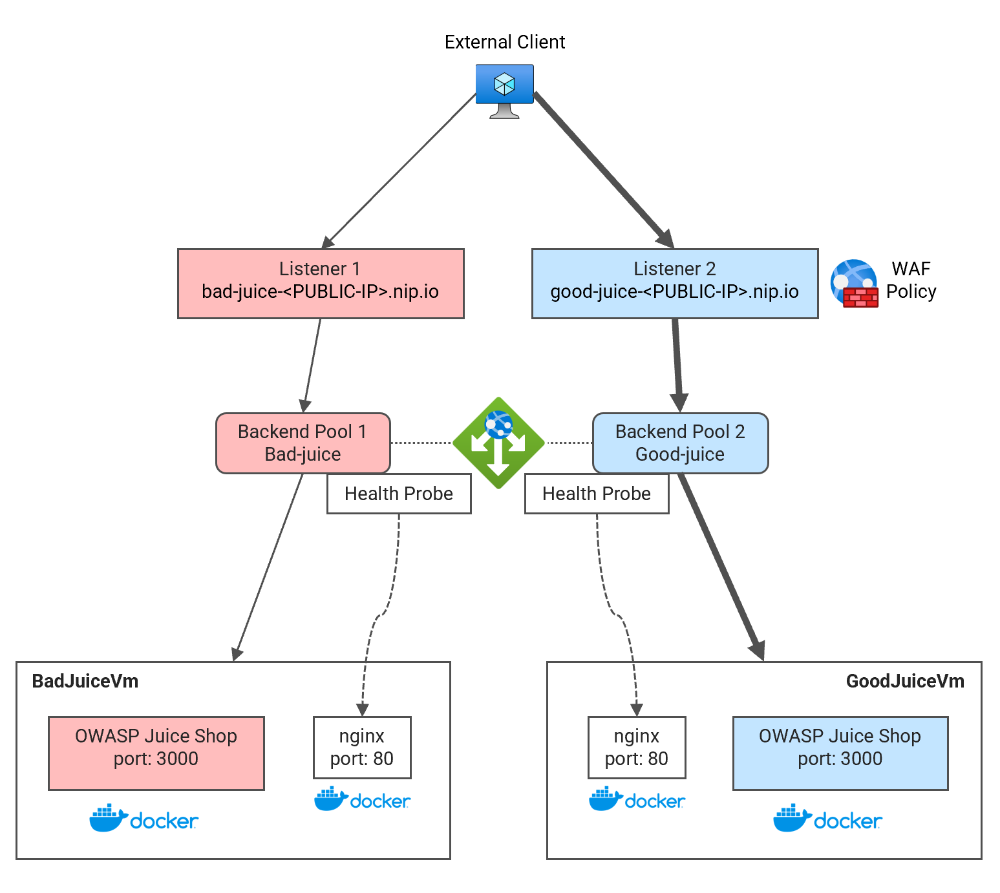

# Lab03 - Application Gateway - WAF <!-- omit from toc -->

⚠️ Document update in progress ...

Contents

- [Overview](#overview)

## Overview

This lab deploys an Application Gateway with Web Application Firewall (WAF) to protect a web application. The web application is based on OWASP Juice Shop, a vulnerable web application that is used to test web application security scanners. The lab deploys two instances of the Juice Shop web application, one with the WAF enabled and the other without the WAF. The WAF is configured using managed ruleset OWASP 3.2.




## Prerequisites

Ensure you meet all requirements in the [prerequisites](../../prerequisites/README.md) before proceeding.

## Deploy the Lab

1. Clone the Git Repository for the Labs

   ```sh
   git clone https://github.com/kaysalawu/azure-network-terraform.git
   ```

2. Navigate to the lab directory

   ```sh
   cd azure-network-terraform/4-general/03-appgw-waf
   ```

3. Run the following terraform commands and type ***yes*** at the prompt:

   ```sh
   terraform init
   terraform plan
   terraform apply -parallelism=50
   ```

## Troubleshooting

See the [troubleshooting](../../troubleshooting/README.md) section for tips on how to resolve common issues that may occur during the deployment of the lab.


## Testing

**1.** Run terraform output to get the dns of our test endpoints

```sh
terraform output
```

Sample output:

```sh
03-appgw-waf$ terraform output
values = {
  "hub1_appgw_pip" = "52.169.200.131"
  "hub1_host_bad_juice" = "bad-juice-52.169.200.131.nip.io"
  "hub1_host_good_juice" = "good-juice-52.169.200.131.nip.io"
}
```

In this example, we have the following endpoints:
- `bad-juice-52.169.200.131.nip.io` - unprotected web application
- `good-juice-52.169.200.131.nip.io` - web application protected by the WAF


**2.** Run the client script

Test each of the 2 endpoints against the [OWASP juice shop challenges](https://owasp.org/www-project-juice-shop/). The listener `bad-juice-52.169.200.131.nip.io` should show vulnerabilities while the listener `good-juice-52.169.200.131.nip.io` should be protected by the WAF.

### ⚠️ Document update in progress ...


## Cleanup

1\. (Optional) Navigate back to the lab directory (if you are not already there)

```sh
cd azure-network-terraform/4-general/03-appgw-waf
```

2\. (Optional) This is not required if `enable_diagnostics = false` in the [`02-main.tf`](./02-main.tf). If you deployed the lab with `enable_diagnostics = true`, in order to avoid terraform errors when re-deploying this lab, run a cleanup script to remove diagnostic settings that are not removed after the resource group is deleted.

```sh
bash ../../scripts/_cleanup.sh Lab03_AppGwWaf_RG
```

<details>

<summary>Sample output</summary>

```sh
04-appgw-websocket$ bash ../../scripts/_cleanup.sh Lab03_AppGwWaf_RG

Resource group: Lab03_AppGwWaf_RG

⏳ Checking for diagnostic settings on resources in Lab03_AppGwWaf_RG ...
➜  Checking firewall ...
➜  Checking vnet gateway ...
➜  Checking vpn gateway ...
➜  Checking er gateway ...
➜  Checking app gateway ...
⏳ Checking for azure policies in Lab03_AppGwWaf_RG ...
Done!
```

</details>
<p>

3\. Delete the resource group to remove all resources installed.

```sh
az group delete -g Lab03_AppGwWaf_RG --no-wait
```

4\. Delete terraform state files and other generated files.

```sh
rm -rf .terraform*
rm terraform.tfstate*
```

