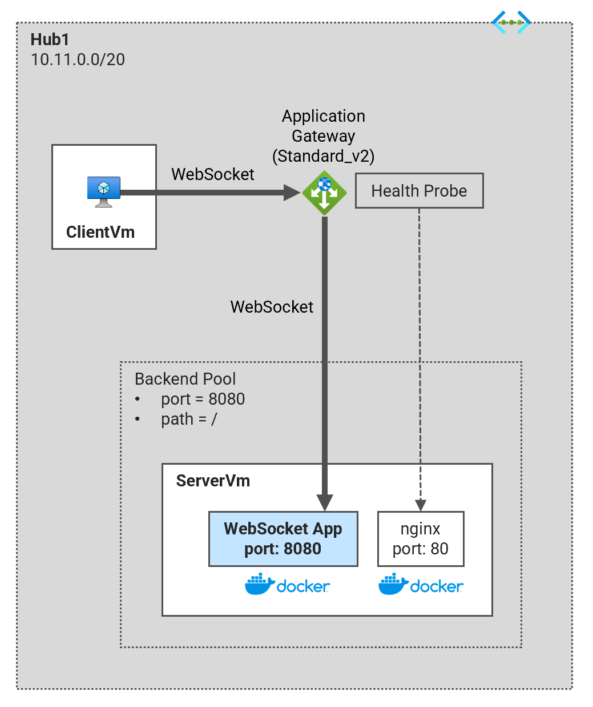

# Lab04 - Application Gateway - Web Socket <!-- omit from toc -->

Contents

- [Overview](#overview)
- [Prerequisites](#prerequisites)
- [Deploy the Lab](#deploy-the-lab)
- [Troubleshooting](#troubleshooting)
- [Testing](#testing)
- [Cleanup](#cleanup)

## Overview

Deploy an application gateway with a web socket configuration. The application gateway is configured with a backend pool of a virtual machine hosting a simple web socket server. The web socket server is a simple [python Flask web application](https://hub.docker.com/r/ksalawu/web) that returns the HTTP headers, hostname and IP addresses of the server running the application.



## Prerequisites

Ensure you meet all requirements in the [prerequisites](../../prerequisites/README.md) before proceeding.

## Deploy the Lab

1. Clone the Git Repository for the Labs

   ```sh
   git clone https://github.com/kaysalawu/azure-network-terraform.git
   ```

2. Navigate to the lab directory

   ```sh
   cd azure-network-terraform/4-general/04-appgw-websocket
   ```

3. Run the following terraform commands and type ***yes*** at the prompt:

   ```sh
   terraform init
   terraform plan
   terraform apply -parallelism=50
   ```

## Troubleshooting

See the [troubleshooting](../../troubleshooting/README.md) section for tips on how to resolve common issues that may occur during the deployment of the lab.


## Testing

The lab consists of 2 virtual machines, `Lab04-serverVm` which is our websocket server and `Lab04-clientVm` which is our client. The client is a simple python script that connects to the websocket server and sends a message. The server responds with a message.

**1.** Login to virtual machine `Lab04-serverVm` via the [serial console](https://learn.microsoft.com/en-us/troubleshoot/azure/virtual-machines/serial-console-overview#access-serial-console-for-virtual-machines-via-azure-portal):

- On Azure portal select *Virtual machines*
- Select the virtual machine `Lab04-serverVm`
- Under ***Help*** section, select ***Serial console*** and wait for a login prompt
- Enter the login credentials
  - username = ***azureuser***
  - password = ***Password123***
- You should now be in a shell session `azureuser@serverVm:~$`

**2.** Confirm the websocket and nginx docker containers are running

```sh
sudo docker ps
```

<details>

<summary>Output</summary>

```sh
azureuser@serverVm:~$ sudo docker ps
CONTAINER ID   IMAGE     COMMAND                  CREATED       STATUS       PORTS                                       NAMES
dfd7a1c83292   nginx     "/docker-entrypoint.…"   2 hours ago   Up 2 hours   0.0.0.0:80->80/tcp, :::80->80/tcp           nginx
a42dd0de63ff   server    "python3 main.py"        2 hours ago   Up 2 hours   0.0.0.0:8080->8080/tcp, :::8080->8080/tcp   server
```

</details>
<p>

The nginx container is used for our appliaction gateway health probe. The server container is our websocket server.


**3.** Login to virtual machine `Lab04-clientVm` via the [serial console](https://learn.microsoft.com/en-us/troubleshoot/azure/virtual-machines/serial-console-overview#access-serial-console-for-virtual-machines-via-azure-portal):

- On Azure portal select *Virtual machines*
- Select the virtual machine `Lab04-clientVm`
- Under ***Help*** section, select ***Serial console*** and wait for a login prompt
- Enter the login credentials
  - username = ***azureuser***
  - password = ***Password123***
- You should now be in a shell session `azureuser@clientVm:~$`

**4.** Run terraform output to get the dns of application gateway

```sh
terraform output
```

Sample output:

```sh
04-appgw-websocket$ terraform output
values = {
  "hub1_appgw_pip" = "52.138.208.182"
  "hub1_host_server" = "server-52.138.208.182.nip.io"
}
```

In this example, the application gateway dns is `server-52.138.208.182.nip.io`


**5.** Run the client script

```sh
cd /var/lib/azure/
sudo python3 -m venv .
source bin/activate
pip install -r requirements.txt
python3 main.py
```

Sample output:

```sh
azureuser@clientVm:/var/lib/azure$ python3 main.py
Enter target server's address (IP or DNS): server-52.138.208.182.nip.io
Sent message to server
Received from server: {"success": "busy"}
Received from server: {'success': 'true'}
```

We can see the client and server sending and receiving messages over the websocket connection.

## Cleanup

1\. (Optional) Navigate back to the lab directory (if you are not already there)

```sh
cd azure-network-terraform/4-general/04-appgw-websocket
```

2\. (Optional) This is not required if `enable_diagnostics = false` in the [`main.tf`](./02-main.tf). If you deployed the lab with `enable_diagnostics = true`, in order to avoid terraform errors when re-deploying this lab, run a cleanup script to remove diagnostic settings that are not removed after the resource group is deleted.

```sh
bash ../../scripts/_cleanup.sh Lab04_AppGwWebsocket_RG
```

<details>

<summary>Sample output</summary>

```sh
04-appgw-websocket$ bash ../../scripts/_cleanup.sh Lab04_AppGwWebsocket_RG

Resource group: Lab04_AppGwWebsocket_RG

⏳ Checking for diagnostic settings on resources in Lab04_AppGwWebsocket_RG ...
➜  Checking firewall ...
➜  Checking vnet gateway ...
➜  Checking vpn gateway ...
➜  Checking er gateway ...
➜  Checking app gateway ...
⏳ Checking for azure policies in Lab04_AppGwWebsocket_RG ...
Done!
```

</details>
<p>

3\. Delete the resource group to remove all resources installed.

```sh
az group delete -g Lab04_AppGwWebsocket_RG --no-wait
```

4\. Delete terraform state files and other generated files.

```sh
rm -rf .terraform*
rm terraform.tfstate*
```

