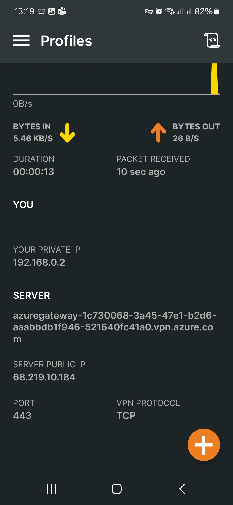

# Lab05 - Point-to-Site VPN <!-- omit from toc -->

- [Overview](#overview)

## Overview

This lab deploys a Point-to-Site (P2S) VPN solution on Azure virtual network. The P2S VPN solution allows a client to connect to the virtual network over the internet.

  


## Prerequisites

Ensure you meet all requirements in the [prerequisites](../../prerequisites/README.md) before proceeding.

## Deploy the Lab

1. Clone the Git Repository for the Labs

   ```sh
   git clone https://github.com/kaysalawu/azure-network-terraform.git
   ```

2. Navigate to the lab directory

   ```sh
   cd azure-network-terraform/4-general/05-p2s-client
   ```

3. Run the following terraform commands and type ***yes*** at the prompt:

   ```sh
   terraform init
   terraform plan
   terraform apply -parallelism=50
   ```

## Troubleshooting

See the [troubleshooting](../../troubleshooting/README.md) section for tips on how to resolve common issues that may occur during the deployment of the lab.

## Outputs

The table below shows the auto-generated output files from the lab. They are located in the `output` directory.

| Item    | Description  | Location |
|--------|--------|--------|
| IP ranges and DNS | IP ranges and DNS hostname values | [output/values.md](./output/values.md) |
| Branch1 DNS | Authoritative DNS and forwarding | [output/branch1Dns.sh](./output/branch1Dns.sh) |
| Branch1 NVA | Linux Strongswan + FRR configuration | [output/branch1Nva.sh](./output/branch1Nva.sh) |
| Web server | Python Flask web server, test scripts | [output/server.sh](./output/server.sh) |
||||

## OVPN Client (Android)

1\. Navigate to the directory that contains the client point-to-site certificate files.

```sh
cd output/p2s/client1
```

2\. Create client configuration files using the script below.

```sh
bash ../../../../../scripts/p2s/client-config.sh Lab05_P2sClient_RG Lab05-hub1-vpngw
```

<details>
<summary>Sample output</summary>

```sh
client1$ bash ../../../../../scripts/p2s/client-config.sh Lab05_P2sClient_RG Lab05-hub1-vpngw

checking vnet gateway...

  % Total    % Received % Xferd  Average Speed   Time    Time     Time  Current
                                 Dload  Upload   Total   Spent    Left  Speed
100  298k  100  298k    0     0  1386k      0 --:--:-- --:--:-- --:--:-- 1386k
Archive:  vpnClient.zip
warning:  vpnClient.zip appears to use backslashes as path separators
  inflating: vpnClient/Generic/VpnSettings.xml
  inflating: vpnClient/Generic/VpnServerRoot.cer_0
  inflating: vpnClient/OpenVPN/vpnconfig.ovpn
  inflating: vpnClient/AzureVPN/azurevpnconfig.xml
  inflating: vpnClient/WindowsAmd64/VpnClientSetupAmd64.exe
  inflating: vpnClient/WindowsX86/VpnClientSetupX86.exe
  inflating: vpnClient/WindowsPowershell/VpnProfileSetup.ps1
sudo openvpn --config ./vpnClient/OpenVPN/vpnconfig.ovpn
[sudo] password for salawu: ps aux | grep [o]penvpn
root      124369  0.0  0.0  10420  4936 pts/86   S+   14:31   0:00 sudo openvpn --config ./vpnClient/OpenVPN/vpnconfig.ovpn
```

</details>
<p>

There should be a new directory created in the current directory named `vpnClient`. This directory contains the client configuration files.

```sh
05-p2s-client$ tree output/p2s/client1/
output/p2s/client1/
├── client1_cert.pem
├── client1_key.pem
├── client1_password.txt
└── vpnClient
    ├── AzureVPN
    │   └── azurevpnconfig.xml
    ├── Generic
    │   ├── VpnServerRoot.cer_0
    │   └── VpnSettings.xml
    ├── OpenVPN
    │   └── vpnconfig.ovpn
    ├── WindowsAmd64
    │   └── VpnClientSetupAmd64.exe
    ├── WindowsPowershell
    │   └── VpnProfileSetup.ps1
    └── WindowsX86
        └── VpnClientSetupX86.exe
```

3\. Install the OpenVPN Connect app on your Android device from the Google Play Store.

4\. Copy the `vpnClient/OpenVPN/vpnconfig.ovpn` file to your Android device.

5\. Open the OpenVPN Connect app and import the `vpnconfig.ovpn` file.

|  |  |  |
|---|---|---|
|  |  |  |

You should now be connected to the virtual network. In this example, the client IP address is `192.168.0.2`.

### OVPN Client on Azure VM (Linux)

Login to virtual machine `Lab05-client1` via the [serial console](https://learn.microsoft.com/en-us/troubleshoot/azure/virtual-machines/serial-console-overview#access-serial-console-for-virtual-machines-via-azure-portal):

- On Azure portal select *Virtual machines*
- Select the virtual machine `Lab05-client1`
- Under ***Help*** section, select ***Serial console*** and wait for a login prompt
- Enter the login credentials
  - username = ***azureuser***
  - password = ***Password123***
- You should now be in a shell session `azureuser@client1:~$`

1\. Navigate to the directory that contains the client point-to-site certificate files.

```sh
cd /var/lib/azure/
ls -la
```

<details>

<summary>Sample output</summary>

```sh
azureuser@client1:~$ cd /var/lib/azure/
azureuser@client1:/var/lib/azure$ ls -la
total 84
drwxr-xr-x  4 root root  4096 Apr  3 12:15 .
drwxr-xr-x 49 root root  4096 Apr  3 11:37 ..
-rw-r--r--  1 root root    73 Apr  3 11:40 .env
-rwxr--r--  1 root root  1333 Apr  3 11:34 client-config.sh
-r--------  1 root root  1493 Apr  3 11:34 client1_cert.pem
-r--------  1 root root  1679 Apr  3 11:34 client1_key.pem
-rwxr--r--  1 root root   138 Apr  3 11:34 docker-compose.yml
-rw-r--r--  1 root root 14567 Apr  3 11:40 log_init.txt
-rw-r--r--  1 root root   462 Apr  3 11:40 log_service.txt
-rw-------  1 root root  5795 Apr  3 13:10 openvpn.log
-rwxr--r--  1 root root  5564 Apr  3 11:34 server.sh
-rwxr--r--  1 root root  3126 Apr  3 11:34 service.sh
-rwxr--r--  1 root root  1113 Apr  3 11:34 start.sh
-rwxr--r--  1 root root  1195 Apr  3 11:34 stop.sh
drwxr-xr-x  8 root root  4096 Apr  3 12:15 vpnClient
drwxr-xr-x  2 root root  4096 Apr  3 11:34 web
```

</details>
<p>

2\. Run the client configuration script to set up the OpenVPN client.

```sh
sudo bash client-config.sh
```

<details>
<summary>Sample output</summary>

```sh
azureuser@client1:/var/lib/azure$ sudo bash client-config.sh

checking vnet gateway...

  % Total    % Received % Xferd  Average Speed   Time    Time     Time  Current
                                 Dload  Upload   Total   Spent    Left  Speed
100  298k  100  298k    0     0  1620k      0 --:--:-- --:--:-- --:--:-- 1629k
Archive:  vpnClient.zip
warning:  vpnClient.zip appears to use backslashes as path separators
  inflating: vpnClient/Generic/VpnSettings.xml
  inflating: vpnClient/Generic/VpnServerRoot.cer_0
  inflating: vpnClient/OpenVPN/vpnconfig.ovpn
  inflating: vpnClient/AzureVPN/azurevpnconfig.xml
  inflating: vpnClient/WindowsAmd64/VpnClientSetupAmd64.exe
  inflating: vpnClient/WindowsX86/VpnClientSetupX86.exe
  inflating: vpnClient/WindowsPowershell/VpnProfileSetup.ps1
sudo openvpn --config ./vpnClient/OpenVPN/vpnconfig.ovpn
ps aux | grep [o]penvpn
root       29989  0.0  0.1  11592  4756 ttyS0    S+   12:15   0:00 sudo openvpn --config ./vpnClient/OpenVPN/vpnconfig.ovpn
root       29991  0.0  0.1  10064  7508 ttyS0    S+   12:15   0:00 openvpn --config ./vpnClient/OpenVPN/vpnconfig.ovpn
```

</details>
<p>

3\. Check the IP address of the client.

```sh
ip address
```

<details>

<summary>Sample output</summary>

```sh
azureuser@client1:/var/lib/azure$ ip address
1: lo: <LOOPBACK,UP,LOWER_UP> mtu 65536 qdisc noqueue state UNKNOWN group default qlen 1000
    link/loopback 00:00:00:00:00:00 brd 00:00:00:00:00:00
    inet 127.0.0.1/8 scope host lo
       valid_lft forever preferred_lft forever
    inet6 ::1/128 scope host
       valid_lft forever preferred_lft forever
2: eth0: <BROADCAST,MULTICAST,UP,LOWER_UP> mtu 1500 qdisc mq state UP group default qlen 1000
    link/ether 00:0d:3a:dc:a1:e0 brd ff:ff:ff:ff:ff:ff
    inet 10.10.1.4/24 brd 10.10.1.255 scope global eth0
       valid_lft forever preferred_lft forever
    inet6 fe80::20d:3aff:fedc:a1e0/64 scope link
       valid_lft forever preferred_lft forever
3: eth1: <BROADCAST,MULTICAST,UP,LOWER_UP> mtu 1500 qdisc mq state UP group default qlen 1000
    link/ether 00:0d:3a:dc:a8:0f brd ff:ff:ff:ff:ff:ff
    inet 10.10.2.4/24 brd 10.10.2.255 scope global eth1
       valid_lft forever preferred_lft forever
    inet6 fe80::20d:3aff:fedc:a80f/64 scope link
       valid_lft forever preferred_lft forever
4: docker0: <NO-CARRIER,BROADCAST,MULTICAST,UP> mtu 1500 qdisc noqueue state DOWN group default
    link/ether 02:42:fc:f9:28:8c brd ff:ff:ff:ff:ff:ff
    inet 172.17.0.1/16 brd 172.17.255.255 scope global docker0
       valid_lft forever preferred_lft forever
    inet6 fe80::42:fcff:fef9:288c/64 scope link
       valid_lft forever preferred_lft forever
7: tun0: <POINTOPOINT,MULTICAST,NOARP,UP,LOWER_UP> mtu 1500 qdisc fq_codel state UNKNOWN group default qlen 100
    link/none
    inet 192.168.0.3/24 brd 192.168.0.255 scope global tun0
       valid_lft forever preferred_lft forever
    inet6 fe80::c4d9:4929:317:3b1/64 scope link stable-privacy
       valid_lft forever preferred_lft forever
```

</details>
<p>

In this example, we see `tun0` with an IP address of `192.168.0.3`.


4\. Ping the Android OVPN client IP address `192.168.0.2`.

```sh
azureuser@client1:/var/lib/azure$ ping -c4 192.168.0.2
PING 192.168.0.2 (192.168.0.2) 56(84) bytes of data.
64 bytes from 192.168.0.2: icmp_seq=1 ttl=64 time=139 ms
64 bytes from 192.168.0.2: icmp_seq=2 ttl=64 time=61.8 ms
64 bytes from 192.168.0.2: icmp_seq=3 ttl=64 time=86.9 ms
64 bytes from 192.168.0.2: icmp_seq=4 ttl=64 time=109 ms

--- 192.168.0.2 ping statistics ---
4 packets transmitted, 4 received, 0% packet loss, time 3004ms
rtt min/avg/max/mdev = 61.789/99.064/138.709/28.302 ms
```

We see that the client is reachable from `Lab05-client1`.

5\. Check the routing table on `Lab05-client1`.

```sh
azureuser@client1:/var/lib/azure$ netstat -rn
```

<details>
<summary>Sample output</summary>

```sh
azureuser@client1:/var/lib/azure$ netstat -rn
Kernel IP routing table
Destination     Gateway         Genmask         Flags   MSS Window  irtt Iface
0.0.0.0         10.10.1.1       0.0.0.0         UG        0 0          0 eth0
8.8.8.8         192.168.0.1     255.255.255.255 UGH       0 0          0 tun0
10.10.1.0       0.0.0.0         255.255.255.0   U         0 0          0 eth0
10.10.2.0       0.0.0.0         255.255.255.0   U         0 0          0 eth1
10.11.0.0       192.168.0.1     255.255.240.0   UG        0 0          0 tun0
10.11.16.0      192.168.0.1     255.255.240.0   UG        0 0          0 tun0
168.63.129.16   10.10.1.1       255.255.255.255 UGH       0 0          0 eth0
169.254.169.254 10.10.1.1       255.255.255.255 UGH       0 0          0 eth0
172.17.0.0      0.0.0.0         255.255.0.0     U         0 0          0 docker0
192.168.0.0     0.0.0.0         255.255.255.0   U         0 0          0 tun0
```

</details>
<p>

We can see that the route to Azure destinations `10.11.0.0`, `10.11.16.0` and `8.8.8.8` all go through the OVPN `tun0` interface.

## Cleanup

1\. (Optional) Navigate back to the lab directory (if you are not already there)

```sh
cd azure-network-terraform/4-general/05-p2s-client
```

2\. (Optional) This is not required if `enable_diagnostics = false` in the [`main.tf`](./02-main.tf). If you deployed the lab with `enable_diagnostics = true`, in order to avoid terraform errors when re-deploying this lab, run a cleanup script to remove diagnostic settings that are not removed after the resource group is deleted.

```sh
bash ../../scripts/_cleanup.sh Lab05_P2sClient_RG
```

<details>

<summary>Sample output</summary>

```sh
05-p2s-client$ bash ../../scripts/_cleanup.sh Lab05_P2sClient_RG

Resource group: Lab05_P2sClient_RG

⏳ Checking for diagnostic settings on resources in Lab05_P2sClient_RG ...
➜  Checking firewall ...
➜  Checking vnet gateway ...
➜  Checking vpn gateway ...
➜  Checking er gateway ...
➜  Checking app gateway ...
⏳ Checking for azure policies in Lab05_P2sClient_RG ...
Done!
```

</details>
<p>

3\. Delete the resource group to remove all resources installed.

```sh
az group delete -g Lab05_P2sClient_RG --no-wait
```

4\. Delete terraform state files and other generated files.

```sh
rm -rf .terraform*
rm terraform.tfstate*
```
