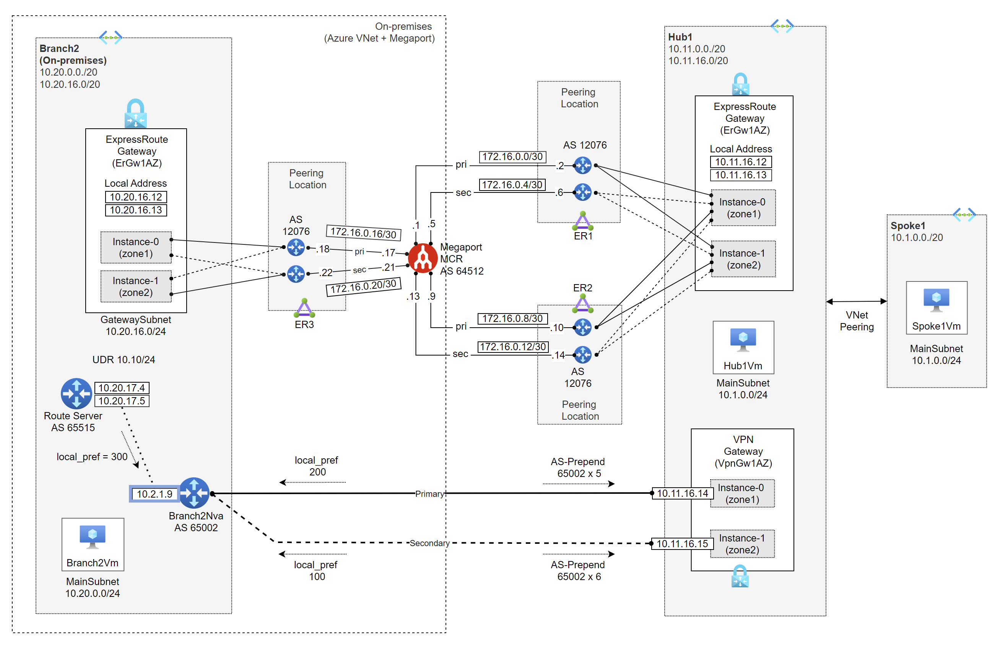
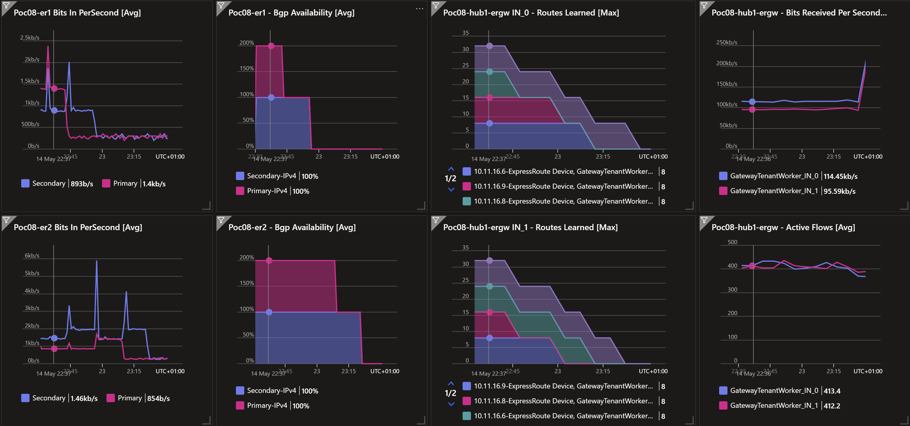

# Azure Network Reliability (High SLA) <!-- omit from toc -->

## Lab08 <!-- omit from toc -->

Contents

- [Overview](#overview)
- [Prerequisites](#prerequisites)
- [Deploy the Lab](#deploy-the-lab)
- [Troubleshooting](#troubleshooting)
- [Outputs](#outputs)
- [Testing](#testing)
  - [1. Ping IP](#1-ping-ip)
  - [2. Ping DNS](#2-ping-dns)
  - [3. Curl DNS](#3-curl-dns)
  - [4. On-premises Routes](#4-on-premises-routes)
- [Detailed Network Tests](#detailed-network-tests)
- [Cleanup](#cleanup)

## Overview

This lab deploys a simple hub and spoke architecture to demonstrate high availability network connectivity to Azure using ExpressRoute and VPN gateways. The overall aim is to get a composite SLA higher than the individual SLAs of ExpressRoute and VPN gateways.



The dashboard marker shows that the primary and secondary links of ExpressRoute circuits `Lab08-er1` and `Lab08-er2` are up. The ExpressRoute gateway `Lab08-hub1-ergw` is zone-redundant and has two instances of the gateway in different availability zones. The dashboard shows active traffic flow across the two instances.



## Prerequisites

Ensure you meet all requirements in the [prerequisites](../../prerequisites/README.md) before proceeding.

## Deploy the Lab

1. Clone the Git Repository for the Labs

   ```sh
   git clone https://github.com/kaysalawu/azure-network-terraform.git
   ```

2. Navigate to the lab directory

   ```sh
   cd azure-network-terraform/4-general/08-network-paths-er-vpn
   ```

3. Run the following terraform commands and type ***yes*** at the prompt:

   ```sh
   terraform init
   terraform plan
   terraform apply -parallelism=50
   ```

## Troubleshooting

See the [troubleshooting](../../troubleshooting/README.md) section for tips on how to resolve common issues that may occur during the deployment of the lab.

## Outputs

The table below shows the auto-generated output files from the lab. They are located in the `output` directory.

| Item    | Description  | Location |
|--------|--------|--------|
| IP ranges and DNS | IP ranges and DNS hostname values | [output/values.md](./output/values.md) |
| Branch2 DNS | Authoritative DNS and forwarding | [output/branch2Dns.sh](./output/branch2Dns.sh) |
| Branch2 NVA | Linux Strongswan + FRR configuration | [output/branch2Nva.sh](./output/branch2Nva.sh) |
| Web server | Python Flask web server, test scripts | [output/server.sh](./output/server.sh) |
||||

## Testing

Each virtual machine is pre-configured with a shell [script](../../scripts/server.sh) to run various types of network reachability tests. Serial console access has been configured for all virtual machines.

Login to virtual machine `Lab08-spoke1Vm` via the [serial console](https://learn.microsoft.com/en-us/troubleshoot/azure/virtual-machines/serial-console-overview#access-serial-console-for-virtual-machines-via-azure-portal):

- On Azure portal select *Virtual machines*
- Select the virtual machine `Lab08-spoke1Vm`
- Under ***Help*** section, select ***Serial console*** and wait for a login prompt
- Enter the login credentials
  - username = ***azureuser***
  - password = ***Password123***
- You should now be in a shell session `azureuser@Lab08-spoke1Vm:~$`

### 1. Ping IP

**1.1.** Run the IP ping tests

```sh
ping-ipv4
```

<details>

<summary>Sample output</summary>

```sh
azureuser@spoke1Vm:~$ ping-ipv4

 ping ipv4 ...

branch2 - 10.20.0.5 -OK 29.331 ms
hub1    - 10.11.0.5 -OK 4.083 ms
spoke1  - 10.1.0.5 -OK 0.045 ms
internet - icanhazip.com -NA
```

</details>
<p>

### 2. Ping DNS

This script pings the DNS name of some test virtual machines and reports reachability and round trip time. This tests hybrid DNS resolution between on-premises and Azure.

**2.1.** Run the DNS ping tests

```sh
ping-dns4
```

<details>

<summary>Sample output</summary>

```sh
azureuser@spoke1Vm:~$ ping-dns4

 ping dns ipv4 ...

branch2vm.corp - 10.20.0.5 -OK 26.033 ms
hub1vm.eu.az.corp - 10.11.0.5 -OK 1.584 ms
spoke1vm.eu.az.corp - 10.1.0.5 -OK 0.046 ms
icanhazip.com - 104.16.184.241 -NA
```

</details>
<p>

### 3. Curl DNS

This script uses curl to check reachability of web server (python Flask) on the test virtual machines. It reports HTTP response message, round trip time and IP address.

**3.1.** Run the DNS curl test

```sh
curl-dns4
```

<details>

<summary>Sample output</summary>

```sh
azureuser@spoke1Vm:~$ curl-dns4

 curl dns ipv4 ...

200 (0.053974s) - 10.20.0.5 - branch2vm.corp
200 (0.011361s) - 10.11.0.5 - hub1vm.eu.az.corp
200 (0.006002s) - 10.1.0.5 - spoke1vm.eu.az.corp
200 (0.022728s) - 104.16.185.241 - icanhazip.com
```

</details>
<p>

### 4. On-premises Routes

**4.1** Login to on-premises virtual machine `Lab08-branch2Nva` via the [serial console](https://learn.microsoft.com/en-us/troubleshoot/azure/virtual-machines/serial-console-overview#access-serial-console-for-virtual-machines-via-azure-portal):
  - username = ***azureuser***
  - password = ***Password123***

**4.2.** Enter the VTY shell for the FRRouting daemon.

```sh
sudo vtysh
```

<details>

<summary>Sample output</summary>

```sh
azureuser@branch2Nva:~$ sudo vtysh

Hello, this is FRRouting (version 7.2.1).
Copyright 1996-2005 Kunihiro Ishiguro, et al.
```

</details>
<p>

**4.3.** Display the routing table by typing `show ip route` and pressing the space bar to show the complete output.

```sh
show ip route
```

<details>

<summary>Sample output</summary>

```sh
branch2Nva# show ip route
Codes: K - kernel route, C - connected, S - static, R - RIP,
       O - OSPF, I - IS-IS, B - BGP, E - EIGRP, N - NHRP,
       T - Table, v - VNC, V - VNC-Direct, A - Babel, D - SHARP,
       F - PBR, f - OpenFabric,
       > - selected route, * - FIB route, q - queued route, r - rejected route

S   0.0.0.0/0 [1/0] via 10.20.1.1, eth0, 1d14h40m
K>* 0.0.0.0/0 [0/100] via 10.20.1.1, eth0, src 10.20.1.9, 1d14h40m
B>  10.1.0.0/20 [20/0] via 10.20.17.4 (recursive), 21:12:45
  *                      via 10.20.1.1, eth0, 21:12:45
                       via 10.20.17.5 (recursive), 21:12:45
                         via 10.20.1.1, eth0, 21:12:45
B>  10.11.0.0/20 [20/0] via 10.20.17.4 (recursive), 21:12:45
  *                       via 10.20.1.1, eth0, 21:12:45
                        via 10.20.17.5 (recursive), 21:12:45
                          via 10.20.1.1, eth0, 21:12:45
B>  10.11.16.0/20 [20/0] via 10.20.17.4 (recursive), 21:12:45
  *                        via 10.20.1.1, eth0, 21:12:45
                         via 10.20.17.5 (recursive), 21:12:45
                           via 10.20.1.1, eth0, 21:12:45
S>* 10.20.0.0/24 [1/0] via 10.20.1.1, eth0, 1d14h40m
C>* 10.20.1.0/24 is directly connected, eth0, 1d14h40m
C>* 10.20.2.0/24 is directly connected, eth1, 1d14h40m
S>* 10.20.17.4/32 [1/0] via 10.20.1.1, eth0, 1d14h40m
S>* 10.20.17.5/32 [1/0] via 10.20.1.1, eth0, 1d14h40m
K>* 168.63.129.16/32 [0/100] via 10.20.1.1, eth0, src 10.20.1.9, 1d14h40m
K>* 169.254.169.254/32 [0/100] via 10.20.1.1, eth0, src 10.20.1.9, 1d14h40m
C>* 192.168.20.20/32 is directly connected, lo, 1d14h40m
```

We can see the Vnet ranges learned dynamically via BGP.

</details>
<p>

**4.4.** Display BGP information by typing `show ip bgp` and pressing the space bar to show the complete output.

```sh
show ip bgp
```

<details>

<summary>Sample output</summary>

```sh
branch2Nva# show ip bgp
BGP table version is 214, local router ID is 192.168.20.20, vrf id 0
Default local pref 100, local AS 65002
Status codes:  s suppressed, d damped, h history, * valid, > best, = multipath,
               i internal, r RIB-failure, S Stale, R Removed
Nexthop codes: @NNN nexthop's vrf id, < announce-nh-self
Origin codes:  i - IGP, e - EGP, ? - incomplete

   Network          Next Hop            Metric LocPrf Weight Path
*= 10.1.0.0/20      10.20.17.5                    300      0 65515 12076 64512 12076 i
*>                  10.20.17.4                    300      0 65515 12076 64512 12076 i
*= 10.11.0.0/20     10.20.17.5                    300      0 65515 12076 64512 12076 i
*>                  10.20.17.4                    300      0 65515 12076 64512 12076 i
*= 10.11.16.0/20    10.20.17.5                    300      0 65515 12076 64512 12076 i
*>                  10.20.17.4                    300      0 65515 12076 64512 12076 i
*> 10.20.0.0/24     0.0.0.0                  0         32768 i

Displayed  4 routes and 7 total paths
```

We can see the hub and spoke Vnet ranges being learned dynamically in the BGP table.

</details>
<p>

**4.5.** Exit the vtysh shell by typing `exit` and pressing `Enter`.

```sh
exit
```

**4.6.** Display linux kernel route tables.

```sh
netstat -rn
```

<details>

<summary>Sample output</summary>

```sh
azureuser@branch2Nva:~$ netstat -rn
Kernel IP routing table
Destination     Gateway         Genmask         Flags   MSS Window  irtt Iface
0.0.0.0         10.20.1.1       0.0.0.0         UG        0 0          0 eth0
10.1.0.0        10.20.1.1       255.255.240.0   UG        0 0          0 eth0
10.11.0.0       10.20.1.1       255.255.240.0   UG        0 0          0 eth0
10.11.16.0      10.20.1.1       255.255.240.0   UG        0 0          0 eth0
10.20.0.0       10.20.1.1       255.255.255.0   UG        0 0          0 eth0
10.20.1.0       0.0.0.0         255.255.255.0   U         0 0          0 eth0
10.20.2.0       0.0.0.0         255.255.255.0   U         0 0          0 eth1
10.20.17.4      10.20.1.1       255.255.255.255 UGH       0 0          0 eth0
10.20.17.5      10.20.1.1       255.255.255.255 UGH       0 0          0 eth0
168.63.129.16   10.20.1.1       255.255.255.255 UGH       0 0          0 eth0
169.254.169.254 10.20.1.1       255.255.255.255 UGH       0 0          0 eth0
```

</details>
<p>

**4.7.** Display detailed linux kernel routes

```sh
ip route show table all
```

<details>

<summary>Sample output</summary>

```sh
azureuser@branch2Nva:~$ ip route show table all
168.63.129.16 via 10.20.2.1 dev eth1 table rt1
default via 10.20.1.1 dev eth0 proto dhcp src 10.20.1.9 metric 100
10.1.0.0/20 via 10.20.1.1 dev eth0 proto bgp metric 20
10.11.0.0/20 via 10.20.1.1 dev eth0 proto bgp metric 20
10.11.16.0/20 via 10.20.1.1 dev eth0 proto bgp metric 20
10.20.0.0/24 via 10.20.1.1 dev eth0 proto static metric 20
10.20.1.0/24 dev eth0 proto kernel scope link src 10.20.1.9
10.20.2.0/24 dev eth1 proto kernel scope link src 10.20.2.9
10.20.17.4 via 10.20.1.1 dev eth0 proto static metric 20
10.20.17.5 via 10.20.1.1 dev eth0 proto static metric 20
168.63.129.16 via 10.20.1.1 dev eth0 proto dhcp src 10.20.1.9 metric 100
169.254.169.254 via 10.20.1.1 dev eth0 proto dhcp src 10.20.1.9 metric 100
local 10.20.1.9 dev eth0 table local proto kernel scope host src 10.20.1.9
broadcast 10.20.1.255 dev eth0 table local proto kernel scope link src 10.20.1.9
local 10.20.2.9 dev eth1 table local proto kernel scope host src 10.20.2.9
broadcast 10.20.2.255 dev eth1 table local proto kernel scope link src 10.20.2.9
local 127.0.0.0/8 dev lo table local proto kernel scope host src 127.0.0.1
local 127.0.0.1 dev lo table local proto kernel scope host src 127.0.0.1
broadcast 127.255.255.255 dev lo table local proto kernel scope link src 127.0.0.1
local 192.168.20.20 dev lo table local proto kernel scope host src 192.168.20.20
broadcast 192.168.20.20 dev lo table local proto kernel scope link src 192.168.20.20
::1 dev lo proto kernel metric 256 pref medium
fe80::/64 dev eth1 proto kernel metric 256 pref medium
fe80::/64 dev eth0 proto kernel metric 256 pref medium
local ::1 dev lo table local proto kernel metric 0 pref medium
anycast fe80:: dev eth0 table local proto kernel metric 0 pref medium
anycast fe80:: dev eth1 table local proto kernel metric 0 pref medium
local fe80::20d:3aff:fedd:6043 dev eth0 table local proto kernel metric 0 pref medium
local fe80::20d:3aff:fedd:63b3 dev eth1 table local proto kernel metric 0 pref medium
multicast ff00::/8 dev eth1 table local proto kernel metric 256 pref medium
multicast ff00::/8 dev eth0 table local proto kernel metric 256 pref medium
```

</details>
<p>

## Detailed Network Tests

Proceed to the section, [1. ER1-primary-circuit-only](./tests/1.%20ER1-primary-circuit-only.md) for detailed network tests on the ExpressRoute and VPN paths. Return back here to cleanup the lab when done.

## Cleanup

1\. (Optional) Navigate back to the lab directory (if you are not already there)

```sh
cd azure-network-terraform/4-general/08-network-paths-er-vpn
```

2\. (Optional) This is not required if `enable_diagnostics = false` in the [`main.tf`](./02-main.tf). If you deployed the lab with `enable_diagnostics = true`, in order to avoid terraform errors when re-deploying this lab, run a cleanup script to remove diagnostic settings that are not removed after the resource group is deleted.

```sh
bash ../../scripts/_cleanup.sh Lab08_ExR_VPN_RG
```

<details>

<summary>Sample output</summary>

```sh
08-network-paths-er-vpn$ bash ../../scripts/_cleanup.sh Lab08_ExR_VPN_RG

Resource group: Lab08_ExR_VPN_RG

⏳ Checking for diagnostic settings on resources in Lab08_ExR_VPN_RG ...
➜  Checking firewall ...
➜  Checking vnet gateway ...
    ❌ Deleting: diag setting [Lab08-branch2-ergw-diag] for vnet gateway [Lab08-branch2-ergw] ...
    ❌ Deleting: diag setting [Lab08-hub1-ergw-diag] for vnet gateway [Lab08-hub1-ergw] ...
    ❌ Deleting: diag setting [Lab08-hub1-vpngw-diag] for vnet gateway [Lab08-hub1-vpngw] ...
➜  Checking vpn gateway ...
➜  Checking er gateway ...
➜  Checking app gateway ...
⏳ Checking for azure policies in Lab08_ExR_VPN_RG ...
Done!
```

</details>
<p>

3\. Delete ExpressRoute connections, peerings, circuits and Megaport configuration.

```sh
bash ../../scripts/express-route/delete_ergw_connections.sh Lab08_ExR_VPN_RG
bash ../../scripts/express-route/delete_private_peerings.sh Lab08_ExR_VPN_RG
bash ../../scripts/express-route/delete_er_circuits.sh Lab08_ExR_VPN_RG
terraform destroy -target=module.megaport --auto-approve
```

<details>

<summary>Sample output</summary>

```sh
08-network-paths-er-vpn$ bash ../../scripts/express-route/delete_ergw_connections.sh Lab08_ExR_VPN_RG

#######################################
Script: delete_ergw_connections.sh
#######################################

Resource group: Lab08_ExR_VPN_RG

⏳ Processing gateway: Lab08-branch2-ergw
❓ Deleting connection: Lab08-er3
❌ Deleted connection: Lab08-er3
⏳ Processing gateway: Lab08-hub1-ergw
❓ Deleting connection: Lab08-er2
❌ Deleted connection: Lab08-er2
❓ Deleting connection: Lab08-er1
❌ Deleted connection: Lab08-er1
⏳ Processing gateway: Lab08-hub1-vpngw
⏳ Checking status of gateway connections ...
     - ⏳ Waiting for gateway/conn Lab08-branch2-ergw/Lab08-er3 to delete...
     - ⏳ Waiting for gateway/conn Lab08-hub1-ergw/Lab08-er2 to delete...
     - ⏳ Waiting for gateway/conn Lab08-hub1-ergw/Lab08-er1 to delete...
   ➜ Gateway connections are still deleting. Checking again in 30 seconds...
     - ⏳ Waiting for gateway/conn Lab08-branch2-ergw/Lab08-er3 to delete...
     - ⏳ Waiting for gateway/conn Lab08-hub1-ergw/Lab08-er2 to delete...
     - ⏳ Waiting for gateway/conn Lab08-hub1-ergw/Lab08-er1 to delete...
   ➜ Gateway connections are still deleting. Checking again in 30 seconds...
     - ⏳ Waiting for gateway/conn Lab08-branch2-ergw/Lab08-er3 to delete...
     - ⏳ Waiting for gateway/conn Lab08-hub1-ergw/Lab08-er2 to delete...
     - ⏳ Waiting for gateway/conn Lab08-hub1-ergw/Lab08-er1 to delete...
   ➜ Gateway connections are still deleting. Checking again in 30 seconds...
     - ⏳ Waiting for gateway/conn Lab08-branch2-ergw/Lab08-er3 to delete...
     - ⏳ Waiting for gateway/conn Lab08-hub1-ergw/Lab08-er1 to delete...
   ➜ Gateway connections are still deleting. Checking again in 30 seconds...
     - ⏳ Waiting for gateway/conn Lab08-branch2-ergw/Lab08-er3 to delete...
     - ⏳ Waiting for gateway/conn Lab08-hub1-ergw/Lab08-er1 to delete...
   ➜ Gateway connections are still deleting. Checking again in 30 seconds...
   ✔ All gateway connections deleted successfully.
```

```sh
#######################################
Script: delete_private_peerings.sh
#######################################

Resource group: Lab08_ExR_VPN_RG

⏳ Processing circuit: Lab08-er1
⏳ Processing circuit: Lab08-er2
⏳ Processing circuit: Lab08-er3
⏳ Checking status of peerings ...
   ✔ All peerings deleted successfully.
```

```sh
08-network-paths-er-vpn$ bash ../../scripts/express-route/delete_er_circuits.sh Lab08_ExR_VPN_RG

#######################################
Script: delete_er_circuits.sh
#######################################

Resource group: Lab08_ExR_VPN_RG

⏳ Deleting circuit: Lab08-er1
⏳ Deleting circuit: Lab08-er2
⏳ Deleting circuit: Lab08-er3
⏳ Checking status of circuits ...
     - Lab08-er1 still deleting ...
     - Lab08-er2 still deleting ...
     - Lab08-er3 still deleting ...
   ➜ Circuits are still deleting. Checking again in 10 seconds...
   ✔ All circuits deleted successfully.
```

</details>
<p>

4\. Delete the resource group to remove all resources installed.

```sh
az group delete -g Lab08_ExR_VPN_RG --no-wait
```


5\. Delete terraform state files and other generated files.

```sh
rm -rf .terraform*
rm terraform.tfstate*
```
