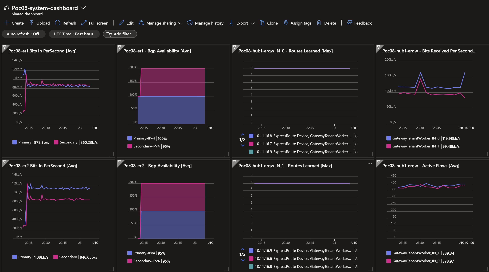

## 1. ExpressRoute and VPN Co-existence <!-- omit from toc -->

[← Home](../README.md) ✤ [ Next → ](./1.%20ER1-primary-down.md)

Contents
- [Overview](#overview)
- [1. Enable All ExpressRoute and VPN Paths](#1-enable-all-expressroute-and-vpn-paths)
- [2. Path Trace from Branch2](#2-path-trace-from-branch2)
- [3. Path Trace from Spoke1](#3-path-trace-from-spoke1)
- [4. Gateway BGP Peers](#4-gateway-bgp-peers)
- [5. Gateway Route Tables](#5-gateway-route-tables)
- [6. ExpressRoute Circuit Route Tables](#6-expressroute-circuit-route-tables)
- [7. Verify Effective Routes](#7-verify-effective-routes)
- [8. Megaport Routes](#8-megaport-routes)
- [9. NVA Routes](#9-nva-routes)
- [Review](#review)

## Overview

In this section, we'll talke a look at the network connectivity paths with both ExpressRoute and VPN configured. We'll also test connectivity from `P08-Branch2Vm` to `P08-Spoke1Vm` under certian fault conditions as we turn off ExpressRoute circuit peerings to see how our dynamic routing behaves.


The dashboard below shows the state of network after 15 minutes.




## 1. Enable All ExpressRoute and VPN Paths

By default, all paths are enabled when the terraform configuration is applied.

## 2. Path Trace from Branch2

Login to virtual machine `Poc08-branch2Vm` via the [serial console](https://learn.microsoft.com/en-us/troubleshoot/azure/virtual-machines/serial-console-overview#access-serial-console-for-virtual-machines-via-azure-portal):

- On Azure portal select *Virtual machines*
- Select the virtual machine `Poc08-branch2Vm`
- Under ***Help*** section, select ***Serial console*** and wait for a login prompt
- Enter the login credentials
  - username = ***azureuser***
  - password = ***Password123***
- You should now be in a shell session `azureuser@Poc08-branch2Vm:~$`

Run the path trace command.

```bash
trace-ipv4
```

<details>

<summary>Sample output</summary>

```bash
azureuser@branch2Vm:~$ trace-ipv4

 trace ipv4 ...


branch2
-------------------------------------
 1:  branch2Vm                                             0.088ms reached
     Resume: pmtu 65535 hops 1 back 1

hub1
-------------------------------------
 1?: [LOCALHOST]                      pmtu 1500
 1:  10.20.1.9                                             1.151ms
 1:  10.20.1.9                                             0.947ms
 2:  10.20.16.4                                            3.619ms asymm  3
 3:  172.16.0.17                                          12.740ms asymm  4
 4:  172.16.0.14                                          23.216ms asymm  5
 5:  no reply
 6:  10.11.0.5                                            25.837ms reached
     Resume: pmtu 1500 hops 6 back 6

spoke1
-------------------------------------
 1?: [LOCALHOST]                      pmtu 1500
 1:  10.20.1.9                                             0.875ms
 1:  10.20.1.9                                             0.711ms
 2:  10.20.16.4                                            4.072ms asymm  3
 3:  172.16.0.21                                          12.361ms asymm  4
 4:  172.16.0.10                                          24.259ms asymm  5
 5:  no reply
 6:  10.1.0.5                                             26.179ms reached
     Resume: pmtu 1500 hops 6 back 6

internet
-------------------------------------
 1?: [LOCALHOST]                      pmtu 1500
 1:  no reply
 2:  no reply
```

 </details>
<p>

## 3. Path Trace from Spoke1

Login to virtual machine `Poc08-spoke1Vm` via the [serial console](https://learn.microsoft.com/en-us/troubleshoot/azure/virtual-machines/serial-console-overview#access-serial-console-for-virtual-machines-via-azure-portal)


Run the path trace command.

```bash
trace-ipv4
```

<details>

<summary>Sample output</summary>

```bash
azureuser@spoke1Vm:~$ trace-ipv4

 trace ipv4 ...


branch2
-------------------------------------
 1?: [LOCALHOST]                      pmtu 1500
 1:  10.11.16.9                                            2.349ms asymm  2
 1:  10.11.16.6                                            2.229ms asymm  2
 2:  172.16.0.13                                          12.870ms asymm  3
 3:  172.16.0.18                                          22.452ms asymm  4
 4:  no reply
 5:  10.20.1.9                                            24.029ms
 6:  10.20.0.5                                            25.438ms reached
     Resume: pmtu 1500 hops 6 back 6

hub1
-------------------------------------
 1?: [LOCALHOST]                      pmtu 1500
 1:  10.11.0.5                                             2.343ms reached
 1:  10.11.0.5                                             0.998ms reached
     Resume: pmtu 1500 hops 1 back 1

spoke1
-------------------------------------
 1:  spoke1vm.internal.cloudapp.net                        0.058ms reached
     Resume: pmtu 65535 hops 1 back 1

internet
-------------------------------------
 1?: [LOCALHOST]                      pmtu 1500
 1:  no reply
 2:  no reply
```

</details>
<p>

## 4. Gateway BGP Peers

Run the following command to verify the BGP peer status on the gateways.

```bash
bash ../../scripts/vnet-gateway/get_bgp_peer_status.sh Poc08_Network_SRE_RG
```

<details>

<summary>Sample output</summary>

```bash
08-network-reliability$ bash ../../scripts/vnet-gateway/get_bgp_peer_status.sh Poc08_Network_SRE_RG

Resource group: Poc08_Network_SRE_RG

Gateway: Poc08-branch2-ergw
Route tables:
Neighbor    ASN    LocalAddress    RoutesReceived    State
----------  -----  --------------  ----------------  ---------
10.20.16.4  12076  10.20.16.13     9                 Connected
10.20.16.5  12076  10.20.16.13     9                 Connected
10.20.17.4  65515  10.20.16.13     9                 Connected
10.20.17.5  65515  10.20.16.13     9                 Connected

Gateway: Poc08-hub1-ergw
Route tables:
Neighbor     ASN    LocalAddress    RoutesReceived    State
-----------  -----  --------------  ----------------  ---------
10.11.16.6   12076  10.11.16.13     8                 Connected
10.11.16.7   12076  10.11.16.13     8                 Connected
10.11.16.8   12076  10.11.16.13     8                 Connected
10.11.16.9   12076  10.11.16.13     8                 Connected
10.11.16.14  65515  10.11.16.13     1                 Connected
10.11.16.15  65515  10.11.16.13     0                 Connected

Gateway: Poc08-hub1-vpngw
Route tables:
Neighbor       ASN    LocalAddress    RoutesReceived    State
-------------  -----  --------------  ----------------  ---------
192.168.20.20  65002  10.11.16.14     1                 Connected
10.11.16.14    65515  10.11.16.14     0                 Unknown
10.11.16.15    65515  10.11.16.14     1                 Connected
10.11.16.13    65515  10.11.16.14     3                 Connected
10.11.16.12    65515  10.11.16.14     3                 Connected
192.168.20.20  65002  10.11.16.15     1                 Connected
10.11.16.14    65515  10.11.16.15     2                 Connected
10.11.16.15    65515  10.11.16.15     0                 Unknown
10.11.16.13    65515  10.11.16.15     3                 Connected
10.11.16.12    65515  10.11.16.15     3                 Connected
```

</details>
<p>

## 5. Gateway Route Tables

Run the following command to verify the route tables on the gateways.

```bash
bash ../../scripts/vnet-gateway/get_route_tables.sh Poc08_Network_SRE_RG
```

<details>

<summary>Sample output</summary>

```bash
08-network-reliability$ bash ../../scripts/vnet-gateway/get_route_tables.sh Poc08_Network_SRE_RG

Resource group: Poc08_Network_SRE_RG

Gateway: Poc08-branch2-ergw
Route tables:
Network         NextHop     Origin    SourcePeer    AsPath             Weight
--------------  ----------  --------  ------------  -----------------  --------
10.20.0.0/20                Network   10.20.16.12                      32768
10.20.16.0/20               Network   10.20.16.12                      32768
172.16.0.20/30  10.20.16.4  EBgp      10.20.16.4    12076-64512        32769
172.16.0.20/30  10.20.16.5  EBgp      10.20.16.5    12076-64512        32769
172.16.0.12/30  10.20.16.4  EBgp      10.20.16.4    12076-64512        32769
172.16.0.12/30  10.20.16.5  EBgp      10.20.16.5    12076-64512        32769
172.16.0.4/30   10.20.16.4  EBgp      10.20.16.4    12076-64512        32769
172.16.0.4/30   10.20.16.5  EBgp      10.20.16.5    12076-64512        32769
172.16.0.16/30  10.20.16.4  EBgp      10.20.16.4    12076-64512        32769
172.16.0.16/30  10.20.16.5  EBgp      10.20.16.5    12076-64512        32769
172.16.0.8/30   10.20.16.4  EBgp      10.20.16.4    12076-64512        32769
172.16.0.8/30   10.20.16.5  EBgp      10.20.16.5    12076-64512        32769
172.16.0.0/30   10.20.16.4  EBgp      10.20.16.4    12076-64512        32769
172.16.0.0/30   10.20.16.5  EBgp      10.20.16.5    12076-64512        32769
10.1.0.0/20     10.20.16.4  EBgp      10.20.16.4    12076-64512-12076  32769
10.1.0.0/20     10.20.16.5  EBgp      10.20.16.5    12076-64512-12076  32769
10.11.0.0/20    10.20.16.4  EBgp      10.20.16.4    12076-64512-12076  32769
10.11.0.0/20    10.20.16.5  EBgp      10.20.16.5    12076-64512-12076  32769
10.11.16.0/20   10.20.16.4  EBgp      10.20.16.4    12076-64512-12076  32769
10.11.16.0/20   10.20.16.5  EBgp      10.20.16.5    12076-64512-12076  32769

Gateway: Poc08-hub1-ergw
Route tables:
Network          NextHop      Origin    SourcePeer    AsPath                               Weight
---------------  -----------  --------  ------------  -----------------------------------  --------
10.11.0.0/20                  Network   10.11.16.13                                        32768
10.11.16.0/20                 Network   10.11.16.13                                        32768
10.1.0.0/20                   Network   10.11.16.13                                        32768
fd00:db8:1::/56               Network   10.11.16.13                                        32768
172.16.0.0/30    10.11.16.6   EBgp      10.11.16.6    12076-64512                          32769
172.16.0.0/30    10.11.16.9   EBgp      10.11.16.9    12076-64512                          32769
172.16.0.0/30    10.11.16.8   EBgp      10.11.16.8    12076-64512                          32769
172.16.0.0/30    10.11.16.7   EBgp      10.11.16.7    12076-64512                          32769
10.20.16.0/20    10.11.16.6   EBgp      10.11.16.6    12076-64512-12076                    32769
10.20.16.0/20    10.11.16.9   EBgp      10.11.16.9    12076-64512-12076                    32769
10.20.16.0/20    10.11.16.8   EBgp      10.11.16.8    12076-64512-12076                    32769
10.20.16.0/20    10.11.16.7   EBgp      10.11.16.7    12076-64512-12076                    32769
10.20.0.0/20     10.11.16.6   EBgp      10.11.16.6    12076-64512-12076                    32769
10.20.0.0/20     10.11.16.7   EBgp      10.11.16.7    12076-64512-12076                    32769
10.20.0.0/20     10.11.16.9   EBgp      10.11.16.9    12076-64512-12076                    32769
10.20.0.0/20     10.11.16.8   EBgp      10.11.16.8    12076-64512-12076                    32769
172.16.0.16/30   10.11.16.6   EBgp      10.11.16.6    12076-64512                          32769
172.16.0.16/30   10.11.16.9   EBgp      10.11.16.9    12076-64512                          32769
172.16.0.16/30   10.11.16.8   EBgp      10.11.16.8    12076-64512                          32769
172.16.0.16/30   10.11.16.7   EBgp      10.11.16.7    12076-64512                          32769
172.16.0.8/30    10.11.16.6   EBgp      10.11.16.6    12076-64512                          32769
172.16.0.8/30    10.11.16.9   EBgp      10.11.16.9    12076-64512                          32769
172.16.0.8/30    10.11.16.8   EBgp      10.11.16.8    12076-64512                          32769
172.16.0.8/30    10.11.16.7   EBgp      10.11.16.7    12076-64512                          32769
172.16.0.20/30   10.11.16.6   EBgp      10.11.16.6    12076-64512                          32769
172.16.0.20/30   10.11.16.9   EBgp      10.11.16.9    12076-64512                          32769
172.16.0.20/30   10.11.16.8   EBgp      10.11.16.8    12076-64512                          32769
172.16.0.20/30   10.11.16.7   EBgp      10.11.16.7    12076-64512                          32769
172.16.0.12/30   10.11.16.6   EBgp      10.11.16.6    12076-64512                          32769
172.16.0.12/30   10.11.16.9   EBgp      10.11.16.9    12076-64512                          32769
172.16.0.12/30   10.11.16.8   EBgp      10.11.16.8    12076-64512                          32769
172.16.0.12/30   10.11.16.7   EBgp      10.11.16.7    12076-64512                          32769
172.16.0.4/30    10.11.16.6   EBgp      10.11.16.6    12076-64512                          32769
172.16.0.4/30    10.11.16.9   EBgp      10.11.16.9    12076-64512                          32769
172.16.0.4/30    10.11.16.8   EBgp      10.11.16.8    12076-64512                          32769
172.16.0.4/30    10.11.16.7   EBgp      10.11.16.7    12076-64512                          32769
10.20.0.0/20     10.11.16.14  IBgp      10.11.16.14   65002-65002-65002-65002-65002-65002  32768

Gateway: Poc08-hub1-vpngw
Route tables:
Network           NextHop        Origin    SourcePeer     AsPath                                     Weight
----------------  -------------  --------  -------------  -----------------------------------------  --------
10.11.0.0/20      10.11.16.12    IBgp      10.11.16.12                                               32769
10.11.0.0/20      10.11.16.13    IBgp      10.11.16.13                                               32769
10.11.16.0/20     10.11.16.12    IBgp      10.11.16.12                                               32769
10.11.16.0/20     10.11.16.13    IBgp      10.11.16.13                                               32769
10.1.0.0/20       10.11.16.12    IBgp      10.11.16.12                                               32769
10.1.0.0/20       10.11.16.13    IBgp      10.11.16.13                                               32769
192.168.20.20/32                 Network   10.11.16.15                                               32768
192.168.20.20/32  10.11.16.14    IBgp      10.11.16.14                                               32768
10.20.0.0/20      10.11.16.14    IBgp      10.11.16.14    65002-65002-65002-65002-65002-65002        32768
10.11.0.0/20                     Network   10.11.16.15                                               32768
10.11.16.0/20                    Network   10.11.16.15                                               32768
10.1.0.0/20                      Network   10.11.16.15                                               32768
10.20.0.0/20      192.168.20.20  EBgp      192.168.20.20  65002-65002-65002-65002-65002-65002-65002  32768
10.11.0.0/20      10.11.16.12    IBgp      10.11.16.12                                               32769
10.11.0.0/20      10.11.16.13    IBgp      10.11.16.13                                               32769
10.11.16.0/20     10.11.16.12    IBgp      10.11.16.12                                               32769
10.11.16.0/20     10.11.16.13    IBgp      10.11.16.13                                               32769
10.1.0.0/20       10.11.16.13    IBgp      10.11.16.13                                               32769
10.1.0.0/20       10.11.16.12    IBgp      10.11.16.12                                               32769
10.20.0.0/20      192.168.20.20  EBgp      192.168.20.20  65002-65002-65002-65002-65002-65002        32768
192.168.20.20/32                 Network   10.11.16.14                                               32768
192.168.20.20/32  10.11.16.15    IBgp      10.11.16.15                                               32768
10.11.0.0/20                     Network   10.11.16.14                                               32768
10.11.16.0/20                    Network   10.11.16.14                                               32768
10.1.0.0/20                      Network   10.11.16.14                                               32768
```

</details>
<p>

## 6. ExpressRoute Circuit Route Tables

Run the following command to verify the route tables on the express route circuits.

```bash
bash ../../scripts/vnet-gateway/get_er_route_tables.sh Poc08_Network_SRE_RG
```

<details>

<summary>Sample output</summary>

```bash
08-network-reliability$ bash ../../scripts/vnet-gateway/get_er_route_tables.sh Poc08_Network_SRE_RG

Resource group: Poc08_Network_SRE_RG


⏳ AzurePrivatePeering (Primary): Poc08-er1
LocPrf    Network         NextHop       Path         Weight
--------  --------------  ------------  -----------  --------
          10.1.0.0/20     10.11.16.12   65515        0
          10.1.0.0/20     10.11.16.13*  65515        0
          10.11.0.0/20    10.11.16.12   65515        0
          10.11.0.0/20    10.11.16.13*  65515        0
          10.11.16.0/20   10.11.16.12   65515        0
          10.11.16.0/20   10.11.16.13*  65515        0
          10.20.0.0/20    172.16.0.1    64512 12076  0
          10.20.16.0/20   172.16.0.1    64512 12076  0
          172.16.0.4/30   172.16.0.1    64512 ?      0
          172.16.0.8/30   172.16.0.1    64512 ?      0
          172.16.0.12/30  172.16.0.1    64512 ?      0
          172.16.0.16/30  172.16.0.1    64512 ?      0
          172.16.0.20/30  172.16.0.1    64512 ?      0

⏳ AzurePrivatePeering (Secondary): Poc08-er1
LocPrf    Network         NextHop       Path         Weight
--------  --------------  ------------  -----------  --------
          10.1.0.0/20     172.16.0.5    64512 12076  0
          10.1.0.0/20     10.11.16.13   65515        0
          10.1.0.0/20     10.11.16.12*  65515        0
          10.11.0.0/20    172.16.0.5    64512 12076  0
          10.11.0.0/20    10.11.16.13   65515        0
          10.11.0.0/20    10.11.16.12*  65515        0
          10.11.16.0/20   172.16.0.5    64512 12076  0
          10.11.16.0/20   10.11.16.13   65515        0
          10.11.16.0/20   10.11.16.12*  65515        0
          10.20.0.0/20    172.16.0.5    64512 12076  0
          10.20.16.0/20   172.16.0.5    64512 12076  0
          172.16.0.0/30   172.16.0.5    64512 ?      0
          172.16.0.8/30   172.16.0.5    64512 ?      0
          172.16.0.12/30  172.16.0.5    64512 ?      0
          172.16.0.16/30  172.16.0.5    64512 ?      0
          172.16.0.20/30  172.16.0.5    64512 ?      0

⏳ AzurePrivatePeering (Primary): Poc08-er2
LocPrf    Network         NextHop       Path         Weight
--------  --------------  ------------  -----------  --------
          10.1.0.0/20     172.16.0.9    64512 12076  0
          10.1.0.0/20     10.11.16.13   65515        0
          10.1.0.0/20     10.11.16.12*  65515        0
          10.11.0.0/20    172.16.0.9    64512 12076  0
          10.11.0.0/20    10.11.16.13   65515        0
          10.11.0.0/20    10.11.16.12*  65515        0
          10.11.16.0/20   172.16.0.9    64512 12076  0
          10.11.16.0/20   10.11.16.13   65515        0
          10.11.16.0/20   10.11.16.12*  65515        0
          10.20.0.0/20    172.16.0.9    64512 12076  0
          10.20.16.0/20   172.16.0.9    64512 12076  0
          172.16.0.0/30   172.16.0.9    64512 ?      0
          172.16.0.4/30   172.16.0.9    64512 ?      0
          172.16.0.12/30  172.16.0.9    64512 ?      0
          172.16.0.16/30  172.16.0.9    64512 ?      0
          172.16.0.20/30  172.16.0.9    64512 ?      0

⏳ AzurePrivatePeering (Secondary): Poc08-er2
LocPrf    Network         NextHop       Path         Weight
--------  --------------  ------------  -----------  --------
          10.1.0.0/20     172.16.0.13   64512 12076  0
          10.1.0.0/20     10.11.16.12   65515        0
          10.1.0.0/20     10.11.16.13*  65515        0
          10.11.0.0/20    172.16.0.13   64512 12076  0
          10.11.0.0/20    10.11.16.12   65515        0
          10.11.0.0/20    10.11.16.13*  65515        0
          10.11.16.0/20   172.16.0.13   64512 12076  0
          10.11.16.0/20   10.11.16.12   65515        0
          10.11.16.0/20   10.11.16.13*  65515        0
          10.20.0.0/20    172.16.0.13   64512 12076  0
          10.20.16.0/20   172.16.0.13   64512 12076  0
          172.16.0.0/30   172.16.0.13   64512 ?      0
          172.16.0.4/30   172.16.0.13   64512 ?      0
          172.16.0.8/30   172.16.0.13   64512 ?      0
          172.16.0.16/30  172.16.0.13   64512 ?      0
          172.16.0.20/30  172.16.0.13   64512 ?      0

⏳ AzurePrivatePeering (Primary): Poc08-er3
LocPrf    Network         NextHop       Path         Weight
--------  --------------  ------------  -----------  --------
          10.1.0.0/20     172.16.0.17   64512 12076  0
          10.11.0.0/20    172.16.0.17   64512 12076  0
          10.11.16.0/20   172.16.0.17   64512 12076  0
          10.20.0.0/20    10.20.16.13   65515        0
          10.20.0.0/20    10.20.16.12*  65515        0
          10.20.16.0/20   10.20.16.13   65515        0
          10.20.16.0/20   10.20.16.12*  65515        0
          172.16.0.0/30   172.16.0.17   64512 ?      0
          172.16.0.4/30   172.16.0.17   64512 ?      0
          172.16.0.8/30   172.16.0.17   64512 ?      0
          172.16.0.12/30  172.16.0.17   64512 ?      0
          172.16.0.20/30  172.16.0.17   64512 ?      0

⏳ AzurePrivatePeering (Secondary): Poc08-er3
LocPrf    Network         NextHop       Path         Weight
--------  --------------  ------------  -----------  --------
          10.1.0.0/20     172.16.0.21   64512 12076  0
          10.11.0.0/20    172.16.0.21   64512 12076  0
          10.11.16.0/20   172.16.0.21   64512 12076  0
          10.20.0.0/20    10.20.16.12   65515        0
          10.20.0.0/20    10.20.16.13*  65515        0
          10.20.0.0/20    172.16.0.21   64512 12076  0
          10.20.16.0/20   10.20.16.12   65515        0
          10.20.16.0/20   10.20.16.13*  65515        0
          10.20.16.0/20   172.16.0.21   64512 12076  0
          172.16.0.0/30   172.16.0.21   64512 ?      0
          172.16.0.4/30   172.16.0.21   64512 ?      0
          172.16.0.8/30   172.16.0.21   64512 ?      0
          172.16.0.12/30  172.16.0.21   64512 ?      0
          172.16.0.16/30  172.16.0.21   64512 ?      0
⭐ Done!
```

</details>
<p>


## 7. Verify Effective Routes

 **7.1** Verify effective routes of `Poc08-branch2-vm-main-nic`.

```bash
bash ../../scripts/_routes_nic.sh Poc08_Network_SRE_RG
```

<details>

<summary>Sample output</summary>

```bash
Effective routes for Poc08-branch2-vm-main-nic

Source    Prefix         State    NextHopType       NextHopIP
--------  -------------  -------  ----------------  -----------
Default   10.20.0.0/20   Active   VnetLocal
Default   10.20.16.0/20  Active   VnetLocal
Default   0.0.0.0/0      Active   Internet
User      10.0.0.0/8     Active   VirtualAppliance  10.20.1.9
```

The virtual appliance is the next hop for all traffic in prefix `10.0.0.0/8`; which includes **spoke1**.

</details>
<p>

**7.2** Verify effective routes of `Poc08-branch2-nva-untrust-nic`.

```bash
bash ../../scripts/_routes_nic.sh Poc08_Network_SRE_RG
```

<details>

<summary>Sample output</summary>

```bash
Effective routes for Poc08-branch2-nva-untrust-nic

Source                 Prefix          State    NextHopType            NextHopIP
---------------------  --------------  -------  ---------------------  ------------
Default                10.20.0.0/20    Active   VnetLocal
Default                10.20.16.0/20   Active   VnetLocal
VirtualNetworkGateway  10.11.16.0/20   Active   VirtualNetworkGateway  10.20.88.110
VirtualNetworkGateway  172.16.0.12/30  Active   VirtualNetworkGateway  10.20.88.110
VirtualNetworkGateway  10.11.0.0/20    Active   VirtualNetworkGateway  10.20.88.110
VirtualNetworkGateway  172.16.0.8/30   Active   VirtualNetworkGateway  10.20.88.110
VirtualNetworkGateway  10.1.0.0/20     Active   VirtualNetworkGateway  10.20.88.110
VirtualNetworkGateway  172.16.0.20/30  Active   VirtualNetworkGateway  10.20.88.110
VirtualNetworkGateway  172.16.0.4/30   Active   VirtualNetworkGateway  10.20.88.110
VirtualNetworkGateway  172.16.0.16/30  Active   VirtualNetworkGateway  10.20.88.110
VirtualNetworkGateway  172.16.0.0/30   Active   VirtualNetworkGateway  10.20.88.110
Default                0.0.0.0/0       Active   Internet
```

The express route circuit is teh next hop for traffic to **spoke1** (10.1.0.0/20)

</details>
<p>

**7.3** Verify effective routes of `Poc08-spoke1-vm-main-nic`.

```bash
bash ../../scripts/_routes_nic.sh Poc08_Network_SRE_RG
```

<details>

<summary>Sample output</summary>

```bash
Effective routes for Poc08-spoke1-vm-main-nic

Source                 Prefix          State    NextHopType            NextHopIP
---------------------  --------------  -------  ---------------------  -------------
Default                10.1.0.0/20     Active   VnetLocal
Default                10.11.0.0/20    Active   VNetPeering
Default                10.11.16.0/20   Active   VNetPeering
VirtualNetworkGateway  172.16.0.16/30  Active   VirtualNetworkGateway  10.63.110.248
VirtualNetworkGateway  172.16.0.16/30  Active   VirtualNetworkGateway  10.63.110.252
VirtualNetworkGateway  172.16.0.16/30  Active   VirtualNetworkGateway  10.20.88.110
VirtualNetworkGateway  172.16.0.16/30  Active   VirtualNetworkGateway  10.20.88.111
VirtualNetworkGateway  172.16.0.20/30  Active   VirtualNetworkGateway  10.63.110.248
VirtualNetworkGateway  172.16.0.20/30  Active   VirtualNetworkGateway  10.63.110.252
VirtualNetworkGateway  172.16.0.20/30  Active   VirtualNetworkGateway  10.20.88.110
VirtualNetworkGateway  172.16.0.20/30  Active   VirtualNetworkGateway  10.20.88.111
VirtualNetworkGateway  172.16.0.4/30   Active   VirtualNetworkGateway  10.63.110.248
VirtualNetworkGateway  172.16.0.4/30   Active   VirtualNetworkGateway  10.63.110.252
VirtualNetworkGateway  172.16.0.4/30   Active   VirtualNetworkGateway  10.20.88.110
VirtualNetworkGateway  172.16.0.4/30   Active   VirtualNetworkGateway  10.20.88.111
VirtualNetworkGateway  10.20.0.0/20    Active   VirtualNetworkGateway  10.63.110.248
VirtualNetworkGateway  10.20.0.0/20    Active   VirtualNetworkGateway  10.63.110.252
VirtualNetworkGateway  10.20.0.0/20    Active   VirtualNetworkGateway  10.20.88.110
VirtualNetworkGateway  10.20.0.0/20    Active   VirtualNetworkGateway  10.20.88.111
VirtualNetworkGateway  10.20.16.0/20   Active   VirtualNetworkGateway  10.63.110.248
VirtualNetworkGateway  10.20.16.0/20   Active   VirtualNetworkGateway  10.63.110.252
VirtualNetworkGateway  10.20.16.0/20   Active   VirtualNetworkGateway  10.20.88.110
VirtualNetworkGateway  10.20.16.0/20   Active   VirtualNetworkGateway  10.20.88.111
VirtualNetworkGateway  172.16.0.12/30  Active   VirtualNetworkGateway  10.63.110.248
VirtualNetworkGateway  172.16.0.12/30  Active   VirtualNetworkGateway  10.63.110.252
VirtualNetworkGateway  172.16.0.12/30  Active   VirtualNetworkGateway  10.20.88.110
VirtualNetworkGateway  172.16.0.12/30  Active   VirtualNetworkGateway  10.20.88.111
VirtualNetworkGateway  172.16.0.0/30   Active   VirtualNetworkGateway  10.63.110.248
VirtualNetworkGateway  172.16.0.0/30   Active   VirtualNetworkGateway  10.63.110.252
VirtualNetworkGateway  172.16.0.0/30   Active   VirtualNetworkGateway  10.20.88.110
VirtualNetworkGateway  172.16.0.0/30   Active   VirtualNetworkGateway  10.20.88.111
VirtualNetworkGateway  172.16.0.8/30   Active   VirtualNetworkGateway  10.63.110.248
VirtualNetworkGateway  172.16.0.8/30   Active   VirtualNetworkGateway  10.63.110.252
VirtualNetworkGateway  172.16.0.8/30   Active   VirtualNetworkGateway  10.20.88.110
VirtualNetworkGateway  172.16.0.8/30   Active   VirtualNetworkGateway  10.20.88.111
Default                0.0.0.0/0       Active   Internet
```

The express route circuit is the next hop for traffic to **branch2** (10.20.0.0/20)

</details>
<p>

## 8. Megaport Routes

```bash
app_dir="../../scripts/megaport/app/app/"
python3 $app_dir/main.py show routes -m salawu-poc08-mcr1
```

<details>

<summary>Sample output</summary>

```bash
08-network-reliability$ app_dir="../../scripts/megaport/app/app/"
python3 $app_dir/main.py show routes -m salawu-poc08-mcr1

Prefix            BgpType     NextHop         NextHopVxc        AsPath
-------           --------    ---------       ------------      -------
10.1.0.0/20*      eBGP        172.16.0.2      Poc08-er1-pri     12076
10.1.0.0/20       eBGP        172.16.0.14     Poc08-er2-sec     12076
10.1.0.0/20       eBGP        172.16.0.10     Poc08-er2-pri     12076
10.1.0.0/20       eBGP        172.16.0.6      Poc08-er1-sec     12076
10.11.0.0/20*     eBGP        172.16.0.2      Poc08-er1-pri     12076
10.11.0.0/20      eBGP        172.16.0.14     Poc08-er2-sec     12076
10.11.0.0/20      eBGP        172.16.0.10     Poc08-er2-pri     12076
10.11.0.0/20      eBGP        172.16.0.6      Poc08-er1-sec     12076
10.11.16.0/20*    eBGP        172.16.0.2      Poc08-er1-pri     12076
10.11.16.0/20     eBGP        172.16.0.14     Poc08-er2-sec     12076
10.11.16.0/20     eBGP        172.16.0.10     Poc08-er2-pri     12076
10.11.16.0/20     eBGP        172.16.0.6      Poc08-er1-sec     12076
10.20.0.0/20*     eBGP        172.16.0.18     Poc08-er3-pri     12076
10.20.0.0/20      eBGP        172.16.0.22     Poc08-er3-sec     12076
10.20.16.0/20*    eBGP        172.16.0.18     Poc08-er3-pri     12076
10.20.16.0/20     eBGP        172.16.0.22     Poc08-er3-sec     12076
172.16.0.0/30*    eBGP        0.0.0.0         Poc08-er1-pri
172.16.0.4/30*    eBGP        0.0.0.0         Poc08-er1-sec
172.16.0.8/30*    eBGP        0.0.0.0         Poc08-er2-pri
172.16.0.12/30*   eBGP        0.0.0.0         Poc08-er2-sec
172.16.0.16/30*   eBGP        0.0.0.0         Poc08-er3-pri
172.16.0.20/30*   eBGP        0.0.0.0         Poc08-er3-sec
```

</details>
<p>

## 9. NVA Routes

Display the route table of the NVA.

```bash
show ip route
```

<details>

<summary>Sample output</summary>

```bash
branch2Nva# show ip route
Codes: K - kernel route, C - connected, S - static, R - RIP,
       O - OSPF, I - IS-IS, B - BGP, E - EIGRP, N - NHRP,
       T - Table, v - VNC, V - VNC-Direct, A - Babel, D - SHARP,
       F - PBR, f - OpenFabric,
       > - selected route, * - FIB route, q - queued route, r - rejected route

S   0.0.0.0/0 [1/0] via 10.20.1.1, eth0, 00:10:17
K>* 0.0.0.0/0 [0/100] via 10.20.1.1, eth0, src 10.20.1.9, 00:10:17
B>  10.1.0.0/20 [20/0] via 10.20.17.4 (recursive), 00:10:16
  *                      via 10.20.1.1, eth0, 00:10:16
                       via 10.20.17.5 (recursive), 00:10:16
                         via 10.20.1.1, eth0, 00:10:16
B>  10.11.0.0/20 [20/0] via 10.20.17.4 (recursive), 00:10:16
  *                       via 10.20.1.1, eth0, 00:10:16
                        via 10.20.17.5 (recursive), 00:10:16
                          via 10.20.1.1, eth0, 00:10:16
B>  10.11.16.0/20 [20/0] via 10.20.17.4 (recursive), 00:10:16
  *                        via 10.20.1.1, eth0, 00:10:16
                         via 10.20.17.5 (recursive), 00:10:16
                           via 10.20.1.1, eth0, 00:10:16
S   10.11.16.14/32 [1/0] is directly connected, vti0, 00:10:17
C>* 10.11.16.14/32 is directly connected, vti0, 00:10:17
S   10.11.16.15/32 [1/0] is directly connected, vti1, 00:10:17
C>* 10.11.16.15/32 is directly connected, vti1, 00:10:17
S>* 10.20.0.0/24 [1/0] via 10.20.1.1, eth0, 00:10:17
C>* 10.20.1.0/24 is directly connected, eth0, 00:10:17
C>* 10.20.2.0/24 is directly connected, eth1, 00:10:17
S>* 10.20.17.4/32 [1/0] via 10.20.1.1, eth0, 00:10:17
S>* 10.20.17.5/32 [1/0] via 10.20.1.1, eth0, 00:10:17
K>* 168.63.129.16/32 [0/100] via 10.20.1.1, eth0, src 10.20.1.9, 00:10:17
K>* 169.254.169.254/32 [0/100] via 10.20.1.1, eth0, src 10.20.1.9, 00:10:17
C>* 192.168.20.20/32 is directly connected, lo, 00:10:17
```

</details>
<p>

Display the BGP details of the NVA.

```bash
show ip bgp
```

<details>

<summary>Sample output</summary>

```bash
branch2Nva# show ip bgp
BGP table version is 7, local router ID is 192.168.20.20, vrf id 0
Default local pref 100, local AS 65002
Status codes:  s suppressed, d damped, h history, * valid, > best, = multipath,
               i internal, r RIB-failure, S Stale, R Removed
Nexthop codes: @NNN nexthop's vrf id, < announce-nh-self
Origin codes:  i - IGP, e - EGP, ? - incomplete

   Network          Next Hop            Metric LocPrf Weight Path
*= 10.1.0.0/20      10.20.17.5                    300      0 65515 12076 64512 12076 i
*                   10.11.16.15                   100      0 65515 i
*                   10.11.16.14                   200      0 65515 i
*>                  10.20.17.4                    300      0 65515 12076 64512 12076 i
*= 10.11.0.0/20     10.20.17.5                    300      0 65515 12076 64512 12076 i
*                   10.11.16.15                   100      0 65515 i
*                   10.11.16.14                   200      0 65515 i
*>                  10.20.17.4                    300      0 65515 12076 64512 12076 i
*= 10.11.16.0/20    10.20.17.5                    300      0 65515 12076 64512 12076 i
*                   10.11.16.15                   100      0 65515 i
*                   10.11.16.14                   200      0 65515 i
*>                  10.20.17.4                    300      0 65515 12076 64512 12076 i
*> 10.20.0.0/20     0.0.0.0                  0         32768 i

Displayed  4 routes and 13 total paths
```

</details>
<p>

## Review

You have successfully tested the ER1 primary path. Next, we'll test the ER1 secondary path.

[← Home](../README.md) ✤ [ Next → ](./1.%20ER1-primary-down.md)

