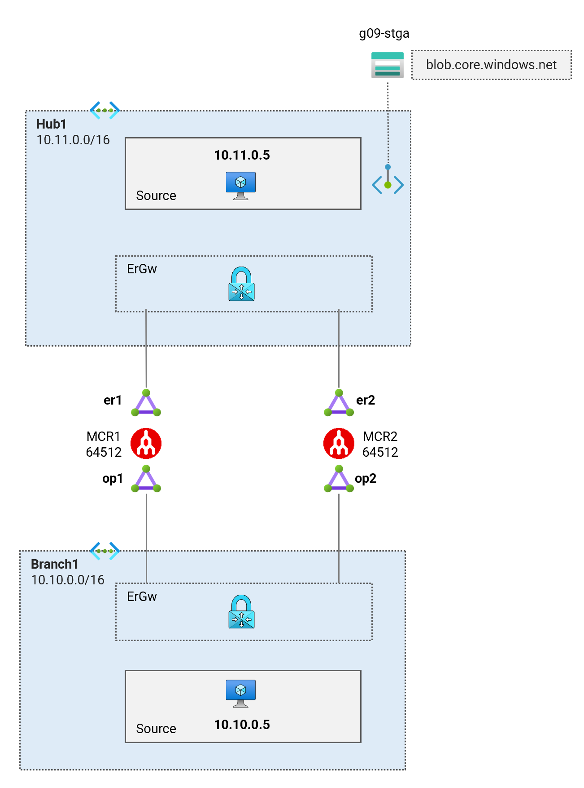
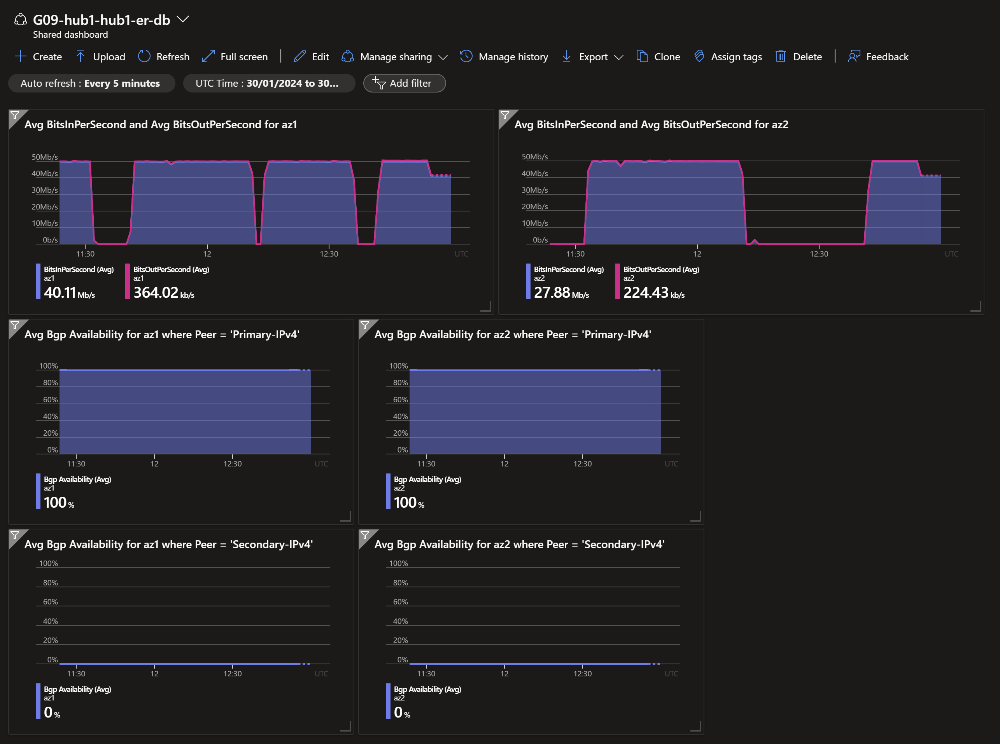
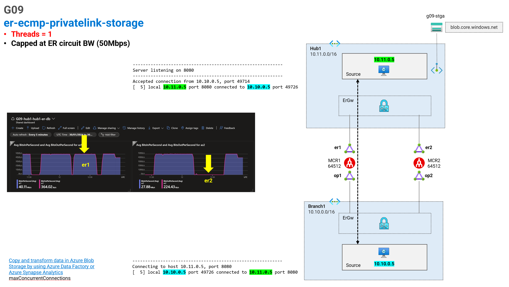
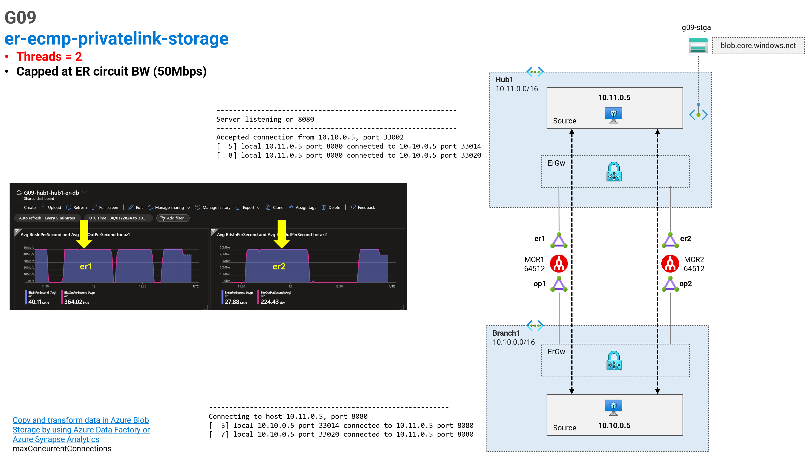
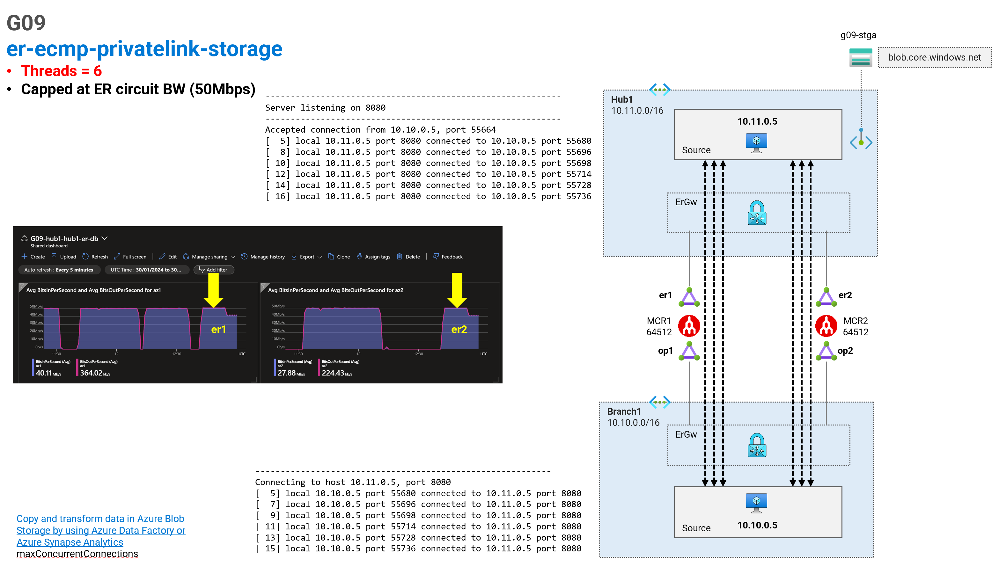

# Megaport ExpressRoute Circuit ECMP <!-- omit from toc -->

## Lab: G09 <!-- omit from toc -->

- [Test the Lab](#test-the-lab)
  - [Troubleshooting](#troubleshooting)
  - [Single Iperf Connection](#single-iperf-connection)
  - [Two Iperf Connections](#two-iperf-connections)
  - [Six Iperf Connections](#six-iperf-connections)
  - [Cleanup](#cleanup)

## Overview

This lab deploys a hub Vnet and a branch Vnet to demonstrate ECMP across multiple ExpressRoute Circuits. The iperf tool is used to test the ECMP functionality.

Related articles and documentation:
* [Optimize ExpressRoute Routing](https://learn.microsoft.com/en-us/azure/expressroute/expressroute-optimize-routing)
* [How can I ensure high availability for a virtual network connected to ExpressRoute?](https://learn.microsoft.com/en-us/azure/expressroute/expressroute-faqs#how-can-i-ensure-high-availability-for-a-virtual-network-connected-to-expressroute)

  

## Prerequisites

Ensure you meet all requirements in the [prerequisites](../../prerequisites/) before proceeding.

You also need to have an active megaport account. You will need to supply the megaport credentials in order to deploy the lab:
* `megaport_access_key`
* `megaport_secret_key`

## Deploy the Lab

1. Clone the Git Repository for the Labs

   ```sh
   git clone https://github.com/kaysalawu/azure-network-terraform.git
   ```

2. Navigate to the lab directory

   ```sh
   cd azure-network-terraform/4-general/09-er-ecmp-privatelink-storage
   ```

3. Run the following terraform commands and type ***yes*** at the prompt:

   ```sh
   terraform init
   terraform plan
   terraform apply -parallelism=50
   ```

# Test the Lab

1. Login to the virtual machine `G09-hub1-vm` and `G09-branch1-vm` via the [serial console](https://learn.microsoft.com/en-us/troubleshoot/azure/virtual-machines/serial-console-overview#access-serial-console-for-virtual-machines-via-azure-portal):

   - On Azure portal select *Virtual machines*
   - Select each virtual machine `G09-hub1-vm`
   - Under ***Help*** section, select ***Serial console*** and wait for a login prompt
   - Enter the login credentials
     - username = ***azureuser***
     - password = ***Password123***
   - You should now be in a shell session `azureuser@vm:~$`

2. Run `G09-hub1-vm` as iperf server listening on port 8080

      ```sh
      iperf3 -s -p 8080 -i 60
      ```

3. Login to virtual machine  `G09-branch1-vm` using same steps as described in step 1.

4. Run `G09-branch1-vm` as iperf client connecting to the iperf server `G09-hub1-vm` on a single thread

      ```sh
      iperf3 -c 10.11.0.5 -t 900 -P 2 -l 8192 -p 8080
      ```

5. Repeat step 3 using different number of threads (1, 2, 6) and observe the results on the dashboard.

   * `iperf3 -c 10.11.0.5 -t 900 -P 2 -l 8192 -p 8080`
   * `iperf3 -c 10.11.0.5 -t 900 -P 6 -l 8192 -p 8080`


6. Observe the dashboard `G09-hub1-er-db` to see the results of the iperf tests.


   To view the dashboards, follow the steps below:

   1. From the Azure portal menu, select **Dashboard hub**.

   2. Under **Browse**, select **Shared dashboards**.

   3. Click the **Go to dashboard** link for dashboard `G09-hub1-er-db`.

   

   The sample dashboard shows the results obtained when using various iperf settings. In the lab we are using ExpressRoute gateway ErGw1AZ which works in active/passive mode. We can see from the dashboard that only the primary circuits is used for traffic. The secondary circuit is only used when the primary circuit is unavailable.


## Troubleshooting

See the [troubleshooting](../../troubleshooting/) section for tips on how to resolve common issues that may occur during the deployment of the lab.

## Single Iperf Connection

With a single connection on iperf, the traffic will only use one ExpressRoute Circuit. Bandwidth is capped at 50Mbps which is the ExpressRoute Standard bandwidth.



## Two Iperf Connections

With two connections on iperf, the traffic will use both ExpressRoute Circuits. Bandwidth is capped at 50Mbps which is the ExpressRoute Standard bandwidth.



## Six Iperf Connections

With six connections on iperf, the traffic will be distributed across both ExpressRoute Circuits. Bandwidth is capped at 50Mbps which is the ExpressRoute Standard bandwidth.



## Cleanup

1. (Optional) Navigate back to the lab directory (if you are not already there)

   ```sh
   cd azure-network-terraform/4-general/09-er-ecmp-privatelink-storage
   ```

2. In order to avoid terraform errors when re-deploying this lab, run a cleanup script to remove diagnostic settings that may not be removed after the resource group is deleted.

   ```sh
   bash ../../scripts/_cleanup.sh G09
   ```

3. Delete the resource group to remove all resources installed.

   ```sh
   az group delete -g G09RG --no-wait
   ```

4. Delete terraform state files and other generated files.

   ```sh
   rm -rf .terraform*
   rm terraform.tfstate*
   ```
