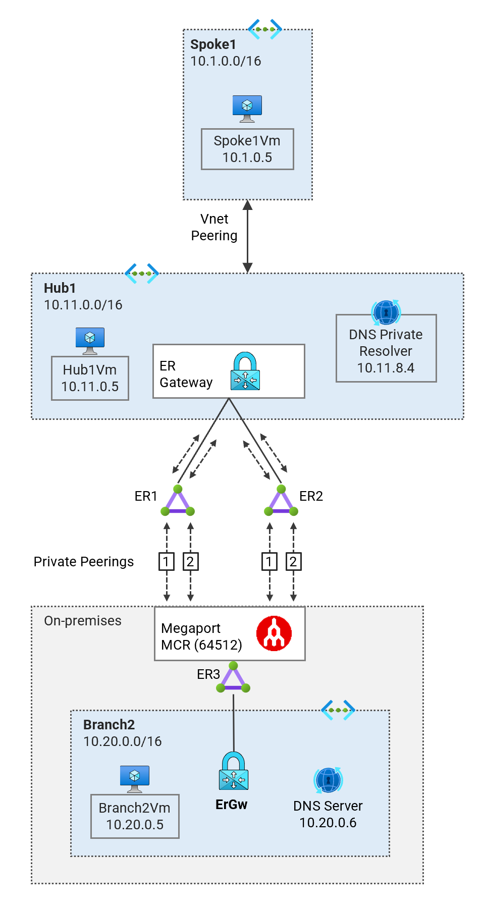
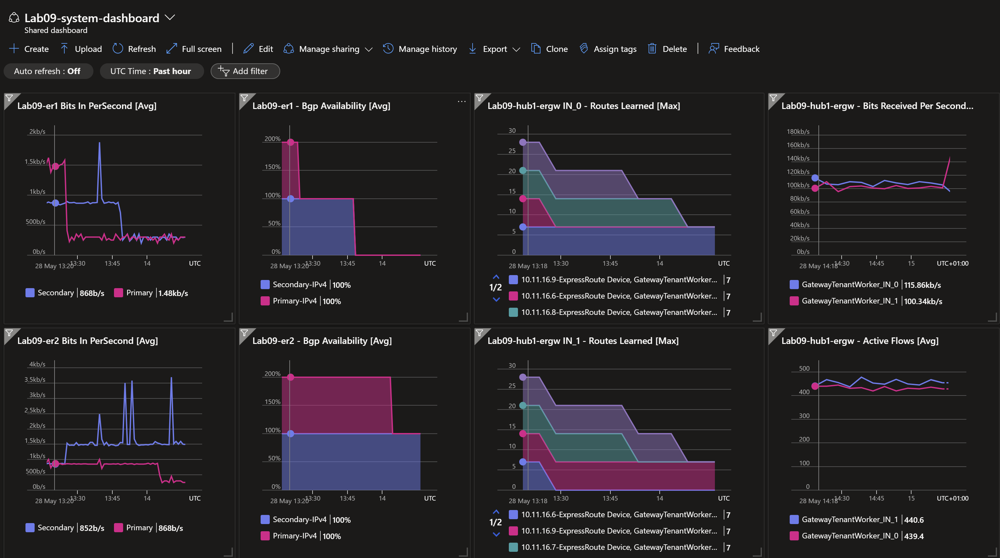

# Azure Network Reliability (High SLA) <!-- omit from toc -->

## Lab09 <!-- omit from toc -->

Contents

- [Overview](#overview)
- [Prerequisites](#prerequisites)
- [Deploy the Lab](#deploy-the-lab)
- [Troubleshooting](#troubleshooting)
- [Outputs](#outputs)
- [Testing](#testing)
  - [1. Ping IP](#1-ping-ip)
  - [2. Ping DNS](#2-ping-dns)
  - [3. Curl DNS](#3-curl-dns)
  - [Detailed Resiliency Test Results](#detailed-resiliency-test-results)
- [Cleanup](#cleanup)

## Overview

This lab deploys a simple hub and spoke architecture to demonstrate high availability network connectivity to Azure using ExpressRoute and VPN gateways. The overall aim is to get a composite SLA higher than the individual SLAs of ExpressRoute and VPN gateways.



The dashboard marker shows all ExpressRoute circuits active. The ExpressRoute gateway `Lab09-hub1-ergw` is zone-redundant and has two instances of the gateway in different availability zones. The dashboard shows active traffic flow across the two instances.



👉 See the detailed [ExpressRoute resiliency test results](./tests/1.%20ER1-primary-down.md)
<p>
<a href="./tests/1.%20ER1-primary-down.md"></a>


## Prerequisites

Ensure you meet all requirements in the [prerequisites](../../prerequisites/README.md) before proceeding. You will need a Megaport account to deploy the lab.

## Deploy the Lab

1. Clone the Git Repository for the Labs

   ```sh
   git clone https://github.com/kaysalawu/azure-network-terraform.git
   ```

2. Navigate to the lab directory

   ```sh
   cd azure-network-terraform/4-general/08-network-paths-er-vpn
   ```

3. Run the following terraform commands and type ***yes*** at the prompt:

   ```sh
   terraform init
   terraform plan
   terraform apply -parallelism=50
   ```

## Troubleshooting

See the [troubleshooting](../../troubleshooting/README.md) section for tips on how to resolve common issues that may occur during the deployment of the lab.

## Outputs

The table below shows the auto-generated output files from the lab. They are located in the `output` directory.

| Item    | Description  | Location |
|--------|--------|--------|
| IP ranges and DNS | IP ranges and DNS hostname values | [output/values.md](./output/values.md) |
| Branch2 DNS | Authoritative DNS and forwarding | [output/branch2Dns.sh](./output/branch2Dns.sh) |
| Web server | Python Flask web server, test scripts | [output/server.sh](./output/server.sh) |
||||

## Testing

Each virtual machine is pre-configured with a shell [script](../../scripts/server.sh) to run various types of network reachability tests. Serial console access has been configured for all virtual machines.

Login to virtual machine `Lab09-spoke1Vm` via the [serial console](https://learn.microsoft.com/en-us/troubleshoot/azure/virtual-machines/serial-console-overview#access-serial-console-for-virtual-machines-via-azure-portal):

- On Azure portal select *Virtual machines*
- Select the virtual machine `Lab09-spoke1Vm`
- Under ***Help*** section, select ***Serial console*** and wait for a login prompt
- Enter the login credentials
  - username = ***azureuser***
  - password = ***Password123***
- You should now be in a shell session `azureuser@Lab09-spoke1Vm:~$`

### 1. Ping IP

**1.1.** Run the IP ping tests

```sh
ping-ipv4
```

<details>

<summary>Sample output</summary>

```sh
azureuser@spoke1Vm:~$ ping-ipv4

 ping ipv4 ...

branch2 - 10.20.0.5 -OK 27.042 ms
hub1    - 10.11.0.5 -OK 1.467 ms
spoke1  - 10.1.0.5 -OK 0.046 ms
internet - icanhazip.com -NA
```

</details>
<p>

### 2. Ping DNS

This script pings the DNS name of some test virtual machines and reports reachability and round trip time. This tests hybrid DNS resolution between on-premises and Azure.

**2.1.** Run the DNS ping tests

```sh
ping-dns4
```

<details>

<summary>Sample output</summary>

```sh
azureuser@spoke1Vm:~$ ping-dns4

 ping dns ipv4 ...

branch2vm.corp - 10.20.0.5 -OK 26.144 ms
hub1vm.eu.az.corp - 10.11.0.5 -OK 1.142 ms
spoke1vm.eu.az.corp - 10.1.0.5 -OK 0.037 ms
icanhazip.com - 104.16.185.241 -NA
```

</details>
<p>

### 3. Curl DNS

This script uses curl to check reachability of web server (python Flask) on the test virtual machines. It reports HTTP response message, round trip time and IP address.

**3.1.** Run the DNS curl test

```sh
curl-dns4
```

<details>

<summary>Sample output</summary>

```sh
azureuser@spoke1Vm:~$ curl-dns4

 curl dns ipv4 ...

200 (0.057777s) - 10.20.0.5 - branch2vm.corp
200 (0.010471s) - 10.11.0.5 - hub1vm.eu.az.corp
200 (0.006746s) - 10.1.0.5 - spoke1vm.eu.az.corp
200 (0.020475s) - 104.16.184.241 - icanhazip.com
```

</details>
<p>

### Detailed Resiliency Test Results

👉 See the detailed [ExpressRoute resiliency test results](./tests/1.%20ER1-primary-down.md)
<p>
<a href="./tests/1.%20ER1-primary-down.md"></a>

## Cleanup

1\. (Optional) Navigate back to the lab directory (if you are not already there)

```sh
cd azure-network-terraform/4-general/08-network-paths-er-vpn
```

2\. (Optional) This is not required if `enable_diagnostics = false` in the [`main.tf`](./02-main.tf). If you deployed the lab with `enable_diagnostics = true`, in order to avoid terraform errors when re-deploying this lab, run a cleanup script to remove diagnostic settings that are not removed after the resource group is deleted.

```sh
bash ../../scripts/_cleanup.sh Lab09_ER_Resiliency_RG
```

<details>

<summary>Sample output</summary>

```sh
08-network-paths-er-vpn$ bash ../../scripts/_cleanup.sh Lab09_ER_Resiliency_RG

Resource group: Lab09_ER_Resiliency_RG

⏳ Checking for diagnostic settings on resources in Lab09_ER_Resiliency_RG ...
➜  Checking firewall ...
➜  Checking vnet gateway ...
    ❌ Deleting: diag setting [Lab09-branch2-ergw-diag] for vnet gateway [Lab09-branch2-ergw] ...
    ❌ Deleting: diag setting [Lab09-hub1-ergw-diag] for vnet gateway [Lab09-hub1-ergw] ...
➜  Checking vpn gateway ...
➜  Checking er gateway ...
➜  Checking app gateway ...
⏳ Checking for azure policies in Lab09_ER_Resiliency_RG ...
Done!
```

</details>
<p>

3\. Set the local variable `deploy = false` in the file [`svc-er-hub1-branch2-max-resiliency.tf`](./svc-er-hub1-branch2-max-resiliency.tf#L3) and re-apply terraform to delete all ExpressRoute and Megaport resources.

```sh
terraform plan
terraform apply -parallelism=50
```

4\. Set the local variable `deploy = true` in the file [`svc-er-hub1-branch2-max-resiliency.tf`](./svc-er-hub1-branch2-max-resiliency.tf#L3)  to allow deployment on the next run.


5\. Delete the resource group to remove all resources installed.

```sh
az group delete -g Lab09_ER_Resiliency_RG --no-wait
```

6\. Delete terraform state files and other generated files.

```sh
rm -rf .terraform*
rm terraform.tfstate*
```
