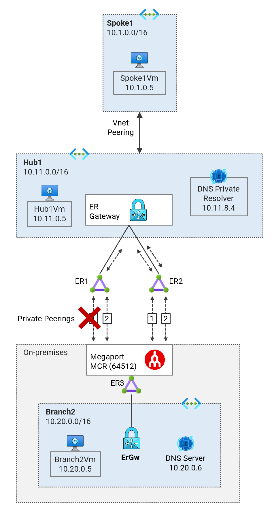
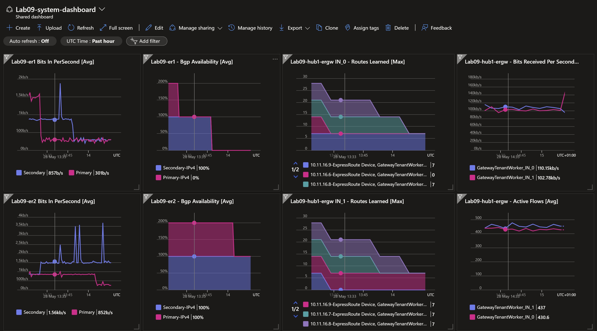

## 1. ExpressRoute Circuit ER1-Primary Down <!-- omit from toc -->

[← Home](../README.md) ✤ [ Next → ](./2.%20ER1-all-down.md)

Contents
- [Overview](#overview)
- [1. ExpressRoute Circuit `Lab09-er1` Primary Down](#1-expressroute-circuit-lab09-er1-primary-down)
- [2. Path Trace from Branch2](#2-path-trace-from-branch2)
- [3. Path Trace from Spoke1](#3-path-trace-from-spoke1)
- [4. Gateway BGP Peers](#4-gateway-bgp-peers)
- [5. Gateway Route Tables](#5-gateway-route-tables)
- [6. ExpressRoute Circuit Route Tables](#6-expressroute-circuit-route-tables)
- [7. Verify Effective Routes](#7-verify-effective-routes)
- [8. Megaport Routes](#8-megaport-routes)
- [Review](#review)

## Overview

In this section, we'll shut down the primary link on `Lab09-er1` on the Megaport Coud Router (MCR) and keep all other ER circuits enabled. The diagram shows the connectivity paths from `P08-Branch2Vm` to both `P08-Hub1Vm` and `P08-Spoke1Vm`. Traffic is now load balanced across both Microsoft Enterprise Edge (MSEE) links of `Poce08-er1` and `Poce08-er2`. Both ExpressRoute circuits advertise equal BGP routes which allows the on-premises network (MCR in this case) to load balance traffic across both links.



The dashboard marker shows that the primary link of ExpressRoute circuit `Lab09-er1` is down whilst other links are up. The ExpressRoute gateway `Lab09-hub1-ergw` is zone-redundant and has two instances of the gateway in different availability zones. The dashboard shows active traffic flow across the two instances.



The following sections show the configuration used and also detailed results on ExpressRoute circuits, gateways and virtual machines.

## 1. ExpressRoute Circuit `Lab09-er1` Primary Down

```bash
app_dir="../../scripts/megaport/app/app/"
python3 $app_dir/main.py bgp disable --mcr salawu-lab09-mcr1 --vxc Lab09-er1-pri
python3 $app_dir/main.py bgp enable --mcr salawu-lab09-mcr1 --vxc Lab09-er1-sec
python3 $app_dir/main.py bgp enable --mcr salawu-lab09-mcr1 --vxc Lab09-er2-pri
python3 $app_dir/main.py bgp enable --mcr salawu-lab09-mcr1 --vxc Lab09-er2-sec
```

## 2. Path Trace from Branch2

Login to virtual machine `Lab09-branch2Vm` via the [serial console](https://learn.microsoft.com/en-us/troubleshoot/azure/virtual-machines/serial-console-overview#access-serial-console-for-virtual-machines-via-azure-portal):

- On Azure portal select *Virtual machines*
- Select the virtual machine `Lab09-branch2Vm`
- Under ***Help*** section, select ***Serial console*** and wait for a login prompt
- Enter the login credentials
  - username = ***azureuser***
  - password = ***Password123***
- You should now be in a shell session `azureuser@Lab09-branch2Vm:~$`

Run the path trace command.

```bash
trace-ipv4
```

<details>

<summary>Sample output</summary>

```bash
azureuser@branch2Vm:~$ trace-ipv4

 trace ipv4 ...


branch2
-------------------------------------
 1:  branch2Vm                                             0.093ms reached
     Resume: pmtu 65535 hops 1 back 1

hub1
-------------------------------------
 1?: [LOCALHOST]                      pmtu 1500
 1:  10.20.16.5                                            2.102ms asymm  2
 1:  10.20.16.4                                            2.985ms asymm  2
 2:  172.16.0.21                                          13.472ms asymm  3
 3:  172.16.0.6                                           24.866ms asymm  4
 4:  no reply
 5:  10.11.0.5                                            26.491ms reached
     Resume: pmtu 1500 hops 5 back 5

spoke1
-------------------------------------
 1?: [LOCALHOST]                      pmtu 1500
 1:  10.20.16.5                                            4.136ms asymm  2
 1:  10.20.16.4                                            3.138ms asymm  2
 2:  172.16.0.17                                          13.387ms asymm  3
 3:  172.16.0.14                                          25.048ms asymm  4
 4:  no reply
 5:  10.1.0.5                                             26.242ms reached
     Resume: pmtu 1500 hops 5 back 5

internet
-------------------------------------
 1?: [LOCALHOST]                      pmtu 1500
 1:  no reply
 2:  no reply
```

We can see that we are ECMP load balancing traffic across two MSEE paths - **172.16.0.4/30** (for `Lab09-hub1Vm`)  and **172.16.0.12/30** (for `Lab09-spoke1Vm`). Trace path shows asymmetrical routing for both paths. This is the normal behaviour for traffic over ExpressRoute circuits - as inbound traffic goes via the ExpressRoute gateway and outbound traffic goes directly to the ExpressRoute circuit on the MSEE.

 </details>
<p>

## 3. Path Trace from Spoke1

Login to virtual machine `Lab09-spoke1Vm` via the [serial console](https://learn.microsoft.com/en-us/troubleshoot/azure/virtual-machines/serial-console-overview#access-serial-console-for-virtual-machines-via-azure-portal)


Run the path trace command.

```bash
trace-ipv4
```

<details>

<summary>Sample output</summary>

```bash
azureuser@spoke1Vm:~$ trace-ipv4

 trace ipv4 ...


branch2
-------------------------------------
 1?: [LOCALHOST]                      pmtu 1500
 1:  10.11.16.9                                            1.974ms asymm  2
 1:  10.11.16.7                                            2.196ms asymm  2
 2:  172.16.0.5                                           13.102ms asymm  3
 3:  172.16.0.22                                          24.270ms asymm  4
 4:  no reply
 5:  10.20.0.5                                            26.376ms reached
     Resume: pmtu 1500 hops 5 back 5

hub1
-------------------------------------
 1?: [LOCALHOST]                      pmtu 1500
 1:  10.11.0.5                                             2.709ms reached
 1:  10.11.0.5                                             2.137ms reached
     Resume: pmtu 1500 hops 1 back 1

spoke1
-------------------------------------
 1:  spoke1vm.internal.cloudapp.net                        0.062ms reached
     Resume: pmtu 65535 hops 1 back 1

internet
-------------------------------------
 1?: [LOCALHOST]                      pmtu 1500
 1:  no reply
 2:  no reply
```

`Lab09-spoke1Vm` uses `Lab09-er1` for the return path to `Lab09-branch2Vm`. We can see the trace path runs through the interface **172.16.0.5** which is linked to `Lab09-er1`.

</details>
<p>

## 4. Gateway BGP Peers

Run the following command to verify the BGP peer status on the gateways.

```bash
bash ../../scripts/vnet-gateway/get_bgp_peer_status.sh Lab09_ER_Resiliency_RG
```

<details>

<summary>Sample output</summary>

```bash
09-express-route-resiliency$ bash ../../scripts/vnet-gateway/get_bgp_peer_status.sh Lab09_ER_Resiliency_RG

Resource group: Lab09_ER_Resiliency_RG

Gateway: Lab09-branch2-ergw
Route tables:
Neighbor    ASN    LocalAddress    RoutesReceived    State
----------  -----  --------------  ----------------  ---------
10.20.16.4  12076  10.20.16.12     8                 Connected
10.20.16.5  12076  10.20.16.12     8                 Connected

Gateway: Lab09-hub1-ergw
Route tables:
Neighbor     ASN    LocalAddress    RoutesReceived    State
-----------  -----  --------------  ----------------  ---------
10.11.16.6   12076  10.11.16.12     0                 Connected
10.11.16.7   12076  10.11.16.12     7                 Connected
10.11.16.8   12076  10.11.16.12     7                 Connected
10.11.16.9   12076  10.11.16.12     7                 Connected
10.11.16.14  65515  10.11.16.12     0                 Connected
10.11.16.15  65515  10.11.16.12     0                 Connected

Gateway: Lab09-hub1-vpngw
Route tables:
Neighbor     ASN    LocalAddress    RoutesReceived    State
-----------  -----  --------------  ----------------  ---------
10.11.16.12  65515  10.11.16.14     2                 Connected
10.11.16.13  65515  10.11.16.14     2                 Connected
10.11.16.14  65515  10.11.16.14     0                 Unknown
10.11.16.15  65515  10.11.16.14     0                 Connected
10.11.16.12  65515  10.11.16.15     2                 Connected
10.11.16.13  65515  10.11.16.15     2                 Connected
10.11.16.14  65515  10.11.16.15     0                 Connected
10.11.16.15  65515  10.11.16.15     0                 Unknown
```

</details>
<p>

## 5. Gateway Route Tables

Run the following command to verify the route tables on the gateways.

```bash
bash ../../scripts/vnet-gateway/get_route_tables.sh Lab09_ER_Resiliency_RG
```

<details>

<summary>Sample output</summary>

```bash
09-express-route-resiliency$ bash ../../scripts/vnet-gateway/get_route_tables.sh Lab09_ER_Resiliency_RG

Resource group: Lab09_ER_Resiliency_RG

Gateway: Lab09-branch2-ergw
Route tables:
Network           NextHop     Origin    SourcePeer    AsPath             Weight
----------------  ----------  --------  ------------  -----------------  --------
10.20.0.0/16                  Network   10.20.16.13                      32768
fd00:db8:20::/56              Network   10.20.16.13                      32768
10.11.0.0/16      10.20.16.5  EBgp      10.20.16.5    12076-64512-12076  32769
10.11.0.0/16      10.20.16.4  EBgp      10.20.16.4    12076-64512-12076  32769
172.16.0.0/30     10.20.16.5  EBgp      10.20.16.5    12076-64512        32769
172.16.0.0/30     10.20.16.4  EBgp      10.20.16.4    12076-64512        32769
172.16.0.4/30     10.20.16.5  EBgp      10.20.16.5    12076-64512        32769
172.16.0.4/30     10.20.16.4  EBgp      10.20.16.4    12076-64512        32769
172.16.0.8/30     10.20.16.5  EBgp      10.20.16.5    12076-64512        32769
172.16.0.8/30     10.20.16.4  EBgp      10.20.16.4    12076-64512        32769
172.16.0.12/30    10.20.16.5  EBgp      10.20.16.5    12076-64512        32769
172.16.0.12/30    10.20.16.4  EBgp      10.20.16.4    12076-64512        32769
172.16.0.16/30    10.20.16.5  EBgp      10.20.16.5    12076-64512        32769
172.16.0.16/30    10.20.16.4  EBgp      10.20.16.4    12076-64512        32769
172.16.0.20/30    10.20.16.5  EBgp      10.20.16.5    12076-64512        32769
172.16.0.20/30    10.20.16.4  EBgp      10.20.16.4    12076-64512        32769
10.1.0.0/16       10.20.16.4  EBgp      10.20.16.4    12076-64512-12076  32769
10.1.0.0/16       10.20.16.5  EBgp      10.20.16.5    12076-64512-12076  32769

Gateway: Lab09-hub1-ergw
Route tables:
Network           NextHop     Origin    SourcePeer    AsPath             Weight
----------------  ----------  --------  ------------  -----------------  --------
10.11.0.0/16                  Network   10.11.16.13                      32768
fd00:db8:11::/56              Network   10.11.16.13                      32768
172.16.0.0/30     10.11.16.8  EBgp      10.11.16.8    12076-64512        32769
172.16.0.0/30     10.11.16.9  EBgp      10.11.16.9    12076-64512        32769
172.16.0.0/30     10.11.16.7  EBgp      10.11.16.7    12076-64512        32769
172.16.0.4/30     10.11.16.8  EBgp      10.11.16.8    12076-64512        32769
172.16.0.4/30     10.11.16.9  EBgp      10.11.16.9    12076-64512        32769
172.16.0.4/30     10.11.16.7  EBgp      10.11.16.7    12076-64512        32769
172.16.0.8/30     10.11.16.8  EBgp      10.11.16.8    12076-64512        32769
172.16.0.8/30     10.11.16.9  EBgp      10.11.16.9    12076-64512        32769
172.16.0.8/30     10.11.16.7  EBgp      10.11.16.7    12076-64512        32769
172.16.0.12/30    10.11.16.8  EBgp      10.11.16.8    12076-64512        32769
172.16.0.12/30    10.11.16.9  EBgp      10.11.16.9    12076-64512        32769
172.16.0.12/30    10.11.16.7  EBgp      10.11.16.7    12076-64512        32769
172.16.0.16/30    10.11.16.8  EBgp      10.11.16.8    12076-64512        32769
172.16.0.16/30    10.11.16.9  EBgp      10.11.16.9    12076-64512        32769
172.16.0.16/30    10.11.16.7  EBgp      10.11.16.7    12076-64512        32769
172.16.0.20/30    10.11.16.8  EBgp      10.11.16.8    12076-64512        32769
172.16.0.20/30    10.11.16.9  EBgp      10.11.16.9    12076-64512        32769
172.16.0.20/30    10.11.16.7  EBgp      10.11.16.7    12076-64512        32769
10.20.0.0/16      10.11.16.8  EBgp      10.11.16.8    12076-64512-12076  32769
10.20.0.0/16      10.11.16.7  EBgp      10.11.16.7    12076-64512-12076  32769
10.20.0.0/16      10.11.16.9  EBgp      10.11.16.9    12076-64512-12076  32769
10.1.0.0/16                   Network   10.11.16.13                      32768
fd00:db8:1::/56               Network   10.11.16.13                      32768

Gateway: Lab09-hub1-vpngw
Route tables:
Network       NextHop      Origin    SourcePeer    AsPath    Weight
------------  -----------  --------  ------------  --------  --------
10.11.0.0/16  10.11.16.12  IBgp      10.11.16.12             32769
10.11.0.0/16  10.11.16.13  IBgp      10.11.16.13             32769
10.1.0.0/16   10.11.16.12  IBgp      10.11.16.12             32769
10.1.0.0/16   10.11.16.13  IBgp      10.11.16.13             32769
10.11.0.0/16               Network   10.11.16.14             32768
10.1.0.0/16                Network   10.11.16.14             32768
10.11.0.0/16  10.11.16.12  IBgp      10.11.16.12             32769
10.11.0.0/16  10.11.16.13  IBgp      10.11.16.13             32769
10.1.0.0/16   10.11.16.13  IBgp      10.11.16.13             32769
10.1.0.0/16   10.11.16.12  IBgp      10.11.16.12             32769
10.11.0.0/16               Network   10.11.16.15             32768
10.1.0.0/16                Network   10.11.16.15             32768
```

</details>
<p>

## 6. ExpressRoute Circuit Route Tables

Run the following command to verify the route tables on the ExpressRoute circuits.

```bash
bash ../../scripts/vnet-gateway/get_er_route_tables.sh Lab09_ER_Resiliency_RG
```

<details>

<summary>Sample output</summary>

```bash
09-express-route-resiliency$ bash ../../scripts/vnet-gateway/get_er_route_tables.sh Lab09_ER_Resiliency_RG

Resource group: Lab09_ER_Resiliency_RG


⏳ AzurePrivatePeering (Primary): Lab09-er1
LocPrf    Network       NextHop       Path    Weight
--------  ------------  ------------  ------  --------
          10.1.0.0/16   10.11.16.12   65515   0
          10.1.0.0/16   10.11.16.13*  65515   0
          10.11.0.0/16  10.11.16.13   65515   0
          10.11.0.0/16  10.11.16.12*  65515   0

⏳ AzurePrivatePeering (Secondary): Lab09-er1
LocPrf    Network         NextHop       Path         Weight
--------  --------------  ------------  -----------  --------
          10.1.0.0/16     172.16.0.5    64512 12076  0
          10.1.0.0/16     10.11.16.12   65515        0
          10.1.0.0/16     10.11.16.13*  65515        0
          10.11.0.0/16    10.11.16.13   65515        0
          10.11.0.0/16    10.11.16.12*  65515        0
          10.11.0.0/16    172.16.0.5    64512 12076  0
          10.20.0.0/16    172.16.0.5    64512 12076  0
          172.16.0.0/30   172.16.0.5    64512 ?      0
          172.16.0.8/30   172.16.0.5    64512 ?      0
          172.16.0.12/30  172.16.0.5    64512 ?      0
          172.16.0.16/30  172.16.0.5    64512 ?      0
          172.16.0.20/30  172.16.0.5    64512 ?      0

⏳ AzurePrivatePeering (Primary): Lab09-er2
LocPrf    Network         NextHop       Path         Weight
--------  --------------  ------------  -----------  --------
          10.1.0.0/16     10.11.16.12   65515        0
          10.1.0.0/16     10.11.16.13*  65515        0
          10.11.0.0/16    10.11.16.12   65515        0
          10.11.0.0/16    10.11.16.13*  65515        0
          10.20.0.0/16    172.16.0.9    64512 12076  0
          172.16.0.0/30   172.16.0.9    64512 ?      0
          172.16.0.4/30   172.16.0.9    64512 ?      0
          172.16.0.12/30  172.16.0.9    64512 ?      0
          172.16.0.16/30  172.16.0.9    64512 ?      0
          172.16.0.20/30  172.16.0.9    64512 ?      0

⏳ AzurePrivatePeering (Secondary): Lab09-er2
LocPrf    Network         NextHop       Path         Weight
--------  --------------  ------------  -----------  --------
          10.1.0.0/16     172.16.0.13   64512 12076  0
          10.1.0.0/16     10.11.16.12   65515        0
          10.1.0.0/16     10.11.16.13*  65515        0
          10.11.0.0/16    172.16.0.13   64512 12076  0
          10.11.0.0/16    10.11.16.12   65515        0
          10.11.0.0/16    10.11.16.13*  65515        0
          10.20.0.0/16    172.16.0.13   64512 12076  0
          172.16.0.0/30   172.16.0.13   64512 ?      0
          172.16.0.4/30   172.16.0.13   64512 ?      0
          172.16.0.8/30   172.16.0.13   64512 ?      0
          172.16.0.16/30  172.16.0.13   64512 ?      0
          172.16.0.20/30  172.16.0.13   64512 ?      0

⏳ AzurePrivatePeering (Primary): Lab09-er3
LocPrf    Network         NextHop       Path         Weight
--------  --------------  ------------  -----------  --------
          10.1.0.0/16     172.16.0.17   64512 12076  0
          10.11.0.0/16    172.16.0.17   64512 12076  0
          10.20.0.0/16    10.20.16.12   65515        0
          10.20.0.0/16    10.20.16.13*  65515        0
          10.20.0.0/16    172.16.0.17   64512 12076  0
          172.16.0.0/30   172.16.0.17   64512 ?      0
          172.16.0.4/30   172.16.0.17   64512 ?      0
          172.16.0.8/30   172.16.0.17   64512 ?      0
          172.16.0.12/30  172.16.0.17   64512 ?      0
          172.16.0.20/30  172.16.0.17   64512 ?      0

⏳ AzurePrivatePeering (Secondary): Lab09-er3
LocPrf    Network         NextHop       Path         Weight
--------  --------------  ------------  -----------  --------
          10.1.0.0/16     172.16.0.21   64512 12076  0
          10.11.0.0/16    172.16.0.21   64512 12076  0
          10.20.0.0/16    10.20.16.13   65515        0
          10.20.0.0/16    10.20.16.12*  65515        0
          172.16.0.0/30   172.16.0.21   64512 ?      0
          172.16.0.4/30   172.16.0.21   64512 ?      0
          172.16.0.8/30   172.16.0.21   64512 ?      0
          172.16.0.12/30  172.16.0.21   64512 ?      0
          172.16.0.16/30  172.16.0.21   64512 ?      0
⭐ Done!
```

</details>
<p>


## 7. Verify Effective Routes

 **7.1** Verify effective routes of `Lab09-branch2-vm-main-nic`.

```bash
bash ../../scripts/_routes_nic.sh Lab09_ER_Resiliency_RG
```

<details>

<summary>Sample output</summary>

```bash
Effective routes for Lab09-branch2-vm-main-nic

Source                 Prefix          State    NextHopType            NextHopIP
---------------------  --------------  -------  ---------------------  ------------
Default                10.20.0.0/16    Active   VnetLocal
VirtualNetworkGateway  10.11.0.0/16    Active   VirtualNetworkGateway  10.20.88.110
VirtualNetworkGateway  10.11.0.0/16    Active   VirtualNetworkGateway  10.20.88.111
VirtualNetworkGateway  172.16.0.0/30   Active   VirtualNetworkGateway  10.20.88.110
VirtualNetworkGateway  172.16.0.0/30   Active   VirtualNetworkGateway  10.20.88.111
VirtualNetworkGateway  10.1.0.0/16     Active   VirtualNetworkGateway  10.20.88.110
VirtualNetworkGateway  10.1.0.0/16     Active   VirtualNetworkGateway  10.20.88.111
VirtualNetworkGateway  172.16.0.4/30   Active   VirtualNetworkGateway  10.20.88.110
VirtualNetworkGateway  172.16.0.4/30   Active   VirtualNetworkGateway  10.20.88.111
VirtualNetworkGateway  172.16.0.8/30   Active   VirtualNetworkGateway  10.20.88.110
VirtualNetworkGateway  172.16.0.8/30   Active   VirtualNetworkGateway  10.20.88.111
VirtualNetworkGateway  172.16.0.12/30  Active   VirtualNetworkGateway  10.20.88.110
VirtualNetworkGateway  172.16.0.12/30  Active   VirtualNetworkGateway  10.20.88.111
VirtualNetworkGateway  172.16.0.16/30  Active   VirtualNetworkGateway  10.20.88.110
VirtualNetworkGateway  172.16.0.16/30  Active   VirtualNetworkGateway  10.20.88.111
VirtualNetworkGateway  172.16.0.20/30  Active   VirtualNetworkGateway  10.20.88.110
VirtualNetworkGateway  172.16.0.20/30  Active   VirtualNetworkGateway  10.20.88.111
Default                0.0.0.0/0       Active   Internet
```

The virtual appliance is the next hop for all traffic in prefix `10.0.0.0/8`; which includes **spoke1**.

</details>
<p>

**7.2** Verify effective routes of `Lab09-spoke1-vm-main-nic`.

```bash
bash ../../scripts/_routes_nic.sh Lab09_ER_Resiliency_RG
```

<details>

<summary>Sample output</summary>

```bash
Effective routes for Lab09-spoke1-vm-main-nic

Source                 Prefix          State    NextHopType            NextHopIP
---------------------  --------------  -------  ---------------------  -------------
Default                10.1.0.0/16     Active   VnetLocal
Default                10.11.0.0/16    Active   VNetPeering
VirtualNetworkGateway  172.16.0.0/30   Active   VirtualNetworkGateway  10.63.110.248
VirtualNetworkGateway  172.16.0.0/30   Active   VirtualNetworkGateway  10.63.110.252
VirtualNetworkGateway  172.16.0.0/30   Active   VirtualNetworkGateway  10.20.88.111
VirtualNetworkGateway  172.16.0.4/30   Active   VirtualNetworkGateway  10.63.110.248
VirtualNetworkGateway  172.16.0.4/30   Active   VirtualNetworkGateway  10.63.110.252
VirtualNetworkGateway  172.16.0.4/30   Active   VirtualNetworkGateway  10.20.88.111
VirtualNetworkGateway  172.16.0.8/30   Active   VirtualNetworkGateway  10.63.110.248
VirtualNetworkGateway  172.16.0.8/30   Active   VirtualNetworkGateway  10.63.110.252
VirtualNetworkGateway  172.16.0.8/30   Active   VirtualNetworkGateway  10.20.88.111
VirtualNetworkGateway  172.16.0.12/30  Active   VirtualNetworkGateway  10.63.110.248
VirtualNetworkGateway  172.16.0.12/30  Active   VirtualNetworkGateway  10.63.110.252
VirtualNetworkGateway  172.16.0.12/30  Active   VirtualNetworkGateway  10.20.88.111
VirtualNetworkGateway  10.20.0.0/16    Active   VirtualNetworkGateway  10.63.110.248
VirtualNetworkGateway  10.20.0.0/16    Active   VirtualNetworkGateway  10.63.110.252
VirtualNetworkGateway  10.20.0.0/16    Active   VirtualNetworkGateway  10.20.88.111
VirtualNetworkGateway  172.16.0.16/30  Active   VirtualNetworkGateway  10.63.110.248
VirtualNetworkGateway  172.16.0.16/30  Active   VirtualNetworkGateway  10.63.110.252
VirtualNetworkGateway  172.16.0.16/30  Active   VirtualNetworkGateway  10.20.88.111
VirtualNetworkGateway  172.16.0.20/30  Active   VirtualNetworkGateway  10.63.110.248
VirtualNetworkGateway  172.16.0.20/30  Active   VirtualNetworkGateway  10.63.110.252
VirtualNetworkGateway  172.16.0.20/30  Active   VirtualNetworkGateway  10.20.88.111
Default                0.0.0.0/0       Active   Internet
```

The ExpressRoute circuit is the next hop for traffic to `Lab09-branch2Vm` (10.20.0.0/20)

</details>
<p>

## 8. Megaport Routes

```bash
app_dir="../../scripts/megaport/app/app/"
python3 $app_dir/main.py show routes -m salawu-lab09-mcr1
```

<details>

<summary>Sample output</summary>

```bash
09-express-route-resiliency$ app_dir="../../scripts/megaport/app/app/"
python3 $app_dir/main.py show routes -m salawu-lab09-mcr1

Prefix            BgpType     NextHop         NextHopVxc        AsPath
-------           --------    ---------       ------------      -------
10.1.0.0/16*      eBGP        172.16.0.10     Lab09-er2-pri     12076
10.1.0.0/16       eBGP        172.16.0.14     Lab09-er2-sec     12076
10.1.0.0/16       eBGP        172.16.0.6      Lab09-er1-sec     12076
10.11.0.0/16*     eBGP        172.16.0.10     Lab09-er2-pri     12076
10.11.0.0/16      eBGP        172.16.0.6      Lab09-er1-sec     12076
10.11.0.0/16      eBGP        172.16.0.14     Lab09-er2-sec     12076
10.20.0.0/16*     eBGP        172.16.0.22     Lab09-er3-sec     12076
10.20.0.0/16      eBGP        172.16.0.18     Lab09-er3-pri     12076
172.16.0.0/30*    eBGP        0.0.0.0         Lab09-er1-pri
172.16.0.4/30*    eBGP        0.0.0.0         Lab09-er1-sec
172.16.0.8/30*    eBGP        0.0.0.0         Lab09-er2-pri
172.16.0.12/30*   eBGP        0.0.0.0         Lab09-er2-sec
172.16.0.16/30*   eBGP        0.0.0.0         Lab09-er3-pri
172.16.0.20/30*   eBGP        0.0.0.0         Lab09-er3-sec
```

The BGP routes through `Lab09-er1` primary link is now withdrawn from the routing table since the link is down. So the on-premises network (Megaport MCR) no longer learns the Azure prefixes **10.11.0.0/20** and **10.1.0.0/20** over this link.

</details>
<p>

## Review

You have successfully tested the scenario where one of the links of an ExpressRoute circuit goes down and the connection uses an alternative path whilst ensuring that the on-premises network continues to communicate with the Azure network.

[← Home](../README.md) ✤ [ Next → ](./2.%20ER1-all-down.md)

