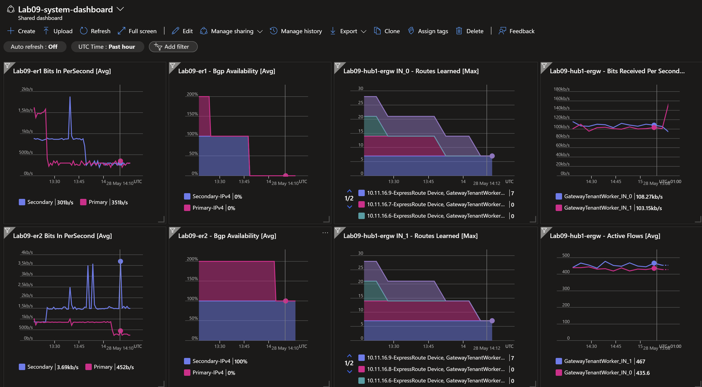

## 3. ExpressRoute Circuits ER1 and ER2 All Down <!-- omit from toc -->

[← 1. Previous](./3.%20ER2-primary-down.md) ✤

Contents
- [Overview](#overview)
- [1. Enable only ER2 Primary](#1-enable-only-er2-primary)
- [2. Path Trace from Branch2](#2-path-trace-from-branch2)
- [3. Path Trace from Spoke1](#3-path-trace-from-spoke1)
- [4. Gateway BGP Peers](#4-gateway-bgp-peers)
- [5. Gateway Route Tables](#5-gateway-route-tables)
- [6. ExpressRoute Circuit Route Tables](#6-expressroute-circuit-route-tables)
- [7. Verify Effective Routes](#7-verify-effective-routes)
- [8. Megaport Routes](#8-megaport-routes)
- [9. NVA Routes](#9-nva-routes)
- [Review](#review)


## Overview

In this section, we'll shut down the entire ExpressRoute circuits `Lab08-er1` and `Lab08-er2` on the Megaport Coud Router (MCR). The diagram shows the connectivity paths from `P08-Branch2Vm` to both `P08-Hub1Vm` and `P08-Spoke1Vm`. Traffic is now only flows through the IPsec VPN active path.


The dashboard shows that all ExpressRoute circuits are down.




## 1. Enable only ER2 Primary

```bash
app_dir="../../scripts/megaport/app/app/"
python3 $app_dir/main.py bgp disable --mcr salawu-lab08-mcr1 --vxc Lab08-er1-pri
python3 $app_dir/main.py bgp disable --mcr salawu-lab08-mcr1 --vxc Lab08-er1-sec
python3 $app_dir/main.py bgp disable --mcr salawu-lab08-mcr1 --vxc Lab08-er2-pri
python3 $app_dir/main.py bgp disable --mcr salawu-lab08-mcr1 --vxc Lab08-er2-sec
```

## 2. Path Trace from Branch2

Login to virtual machine `Lab08-branch2Vm` via the [serial console](https://learn.microsoft.com/en-us/troubleshoot/azure/virtual-machines/serial-console-overview#access-serial-console-for-virtual-machines-via-azure-portal):

- On Azure portal select *Virtual machines*
- Select the virtual machine `Lab08-branch2Vm`
- Under ***Help*** section, select ***Serial console*** and wait for a login prompt
- Enter the login credentials
  - username = ***azureuser***
  - password = ***Password123***
- You should now be in a shell session `azureuser@Lab08-branch2Vm:~$`

Run the path trace command.

```bash
trace-ipv4
```

<details>

<summary>Sample output</summary>

```bash
azureuser@branch2Vm:/usr/local/bin$ trace-ipv4

 trace ipv4 ...


branch2
-------------------------------------
 1:  branch2Vm                                             0.083ms reached
     Resume: pmtu 65535 hops 1 back 1

hub1
-------------------------------------
 1?: [LOCALHOST]                      pmtu 1500
 1:  10.20.1.9                                             1.269ms
 1:  10.20.1.9                                             0.664ms
 2:  10.20.1.9                                             1.793ms pmtu 1436
 2:  10.20.1.9                                             0.835ms pmtu 1422
 2:  10.11.0.5                                             3.406ms reached
     Resume: pmtu 1422 hops 2 back 2

spoke1
-------------------------------------
 1?: [LOCALHOST]                      pmtu 1500
 1:  10.20.1.9                                             0.812ms
 1:  10.20.1.9                                             0.943ms
 2:  10.20.1.9                                             1.693ms pmtu 1436
 2:  10.20.1.9                                             1.060ms pmtu 1422
 2:  10.1.0.5                                              4.400ms reached
     Resume: pmtu 1422 hops 2 back 2

internet
-------------------------------------
 1?: [LOCALHOST]                      pmtu 1500
 1:  no reply
 2:  no reply
```

We can see that traffic no longer goes through ExpressRoute circuit. The path is now through the VPN gateway to reach the `Lab08-hub1Vm` and `Lab08-spoke1Vm`. The path trace doesn't show the VPN tunnel endpoints because ICMP responses are suppressed by the Azure VPN gateway.

 </details>
<p>

## 3. Path Trace from Spoke1

Login to virtual machine `Lab08-spoke1Vm` via the [serial console](https://learn.microsoft.com/en-us/troubleshoot/azure/virtual-machines/serial-console-overview#access-serial-console-for-virtual-machines-via-azure-portal)


Run the path trace command.

```bash
trace-ipv4
```

<details>

<summary>Sample output</summary>

```bash
azureuser@spoke1Vm:~$ trace-ipv4

 trace ipv4 ...


branch2
-------------------------------------
 1?: [LOCALHOST]                      pmtu 1500
 1:  10.10.10.1                                            2.599ms
 2:  10.20.0.5                                             3.954ms reached
     Resume: pmtu 1500 hops 2 back 2

hub1
-------------------------------------
 1?: [LOCALHOST]                      pmtu 1500
 1:  10.11.0.5                                             1.833ms reached
 1:  10.11.0.5                                             1.290ms reached
     Resume: pmtu 1500 hops 1 back 1

spoke1
-------------------------------------
 1:  spoke1vm.internal.cloudapp.net                        0.060ms reached
     Resume: pmtu 65535 hops 1 back 1

internet
-------------------------------------
 1?: [LOCALHOST]                      pmtu 1500
 1:  no reply
 2:  no reply
```

</details>
<p>

## 4. Gateway BGP Peers

Run the following command to verify the BGP peer status on the gateways.

```bash
bash ../../scripts/vnet-gateway/get_bgp_peer_status.sh Lab08_ExR_VPN_RG
```

<details>

<summary>Sample output</summary>

```bash
08-network-paths-er-vpn$ bash ../../scripts/vnet-gateway/get_bgp_peer_status.sh Lab08_ExR_VPN_RG

Resource group: Lab08_ExR_VPN_RG

Gateway: Lab08-branch2-ergw
Route tables:
Neighbor    ASN    LocalAddress    RoutesReceived    State
----------  -----  --------------  ----------------  ---------
10.20.16.4  12076  10.20.16.13     6                 Connected
10.20.16.5  12076  10.20.16.13     6                 Connected
10.20.17.4  65515  10.20.16.13     9                 Connected
10.20.17.5  65515  10.20.16.13     9                 Connected

Gateway: Lab08-hub1-ergw
Route tables:
Neighbor     ASN    LocalAddress    RoutesReceived    State
-----------  -----  --------------  ----------------  ---------
10.11.16.6   12076  10.11.16.13     0                 Connected
10.11.16.7   12076  10.11.16.13     0                 Connected
10.11.16.8   12076  10.11.16.13     0                 Connected
10.11.16.9   12076  10.11.16.13     0                 Connected
10.11.16.14  65515  10.11.16.13     1                 Connected
10.11.16.15  65515  10.11.16.13     0                 Connected

Gateway: Lab08-hub1-vpngw
Route tables:
Neighbor       ASN    LocalAddress    RoutesReceived    State
-------------  -----  --------------  ----------------  ---------
192.168.20.20  65002  10.11.16.14     1                 Connected
10.11.16.14    65515  10.11.16.14     0                 Unknown
10.11.16.15    65515  10.11.16.14     1                 Connected
10.11.16.13    65515  10.11.16.14     3                 Connected
10.11.16.12    65515  10.11.16.14     3                 Connected
192.168.20.20  65002  10.11.16.15     1                 Connected
10.11.16.14    65515  10.11.16.15     2                 Connected
10.11.16.15    65515  10.11.16.15     0                 Unknown
10.11.16.13    65515  10.11.16.15     3                 Connected
10.11.16.12    65515  10.11.16.15     3                 Connected
```

</details>
<p>

## 5. Gateway Route Tables

Run the following command to verify the route tables on the gateways.

```bash
bash ../../scripts/vnet-gateway/get_route_tables.sh Lab08_ExR_VPN_RG
```

<details>

<summary>Sample output</summary>

```bash
08-network-paths-er-vpn$ bash ../../scripts/vnet-gateway/get_route_tables.sh Lab08_ExR_VPN_RG

Resource group: Lab08_ExR_VPN_RG

Gateway: Lab08-branch2-ergw
Route tables:
Network         NextHop     Origin    SourcePeer    AsPath       Weight
--------------  ----------  --------  ------------  -----------  --------
10.20.0.0/20                Network   10.20.16.12                32768
10.20.16.0/20               Network   10.20.16.12                32768
172.16.0.20/30  10.20.16.4  EBgp      10.20.16.4    12076-64512  32769
172.16.0.20/30  10.20.16.5  EBgp      10.20.16.5    12076-64512  32769
172.16.0.12/30  10.20.16.4  EBgp      10.20.16.4    12076-64512  32769
172.16.0.12/30  10.20.16.5  EBgp      10.20.16.5    12076-64512  32769
172.16.0.4/30   10.20.16.4  EBgp      10.20.16.4    12076-64512  32769
172.16.0.4/30   10.20.16.5  EBgp      10.20.16.5    12076-64512  32769
172.16.0.16/30  10.20.16.4  EBgp      10.20.16.4    12076-64512  32769
172.16.0.16/30  10.20.16.5  EBgp      10.20.16.5    12076-64512  32769
172.16.0.8/30   10.20.16.4  EBgp      10.20.16.4    12076-64512  32769
172.16.0.8/30   10.20.16.5  EBgp      10.20.16.5    12076-64512  32769
172.16.0.0/30   10.20.16.4  EBgp      10.20.16.4    12076-64512  32769
172.16.0.0/30   10.20.16.5  EBgp      10.20.16.5    12076-64512  32769
10.1.0.0/20     10.20.1.9   IBgp      10.20.17.4    65002-65002  32768
10.1.0.0/20     10.20.1.9   IBgp      10.20.17.5    65002-65002  32768
10.11.0.0/20    10.20.1.9   IBgp      10.20.17.4    65002-65002  32768
10.11.0.0/20    10.20.1.9   IBgp      10.20.17.5    65002-65002  32768
10.11.16.0/20   10.20.1.9   IBgp      10.20.17.4    65002-65002  32768
10.11.16.0/20   10.20.1.9   IBgp      10.20.17.5    65002-65002  32768

Gateway: Lab08-hub1-ergw
Route tables:
Network          NextHop      Origin    SourcePeer    AsPath                               Weight
---------------  -----------  --------  ------------  -----------------------------------  --------
10.11.0.0/20                  Network   10.11.16.13                                        32768
10.11.16.0/20                 Network   10.11.16.13                                        32768
10.1.0.0/20                   Network   10.11.16.13                                        32768
fd00:db8:1::/56               Network   10.11.16.13                                        32768
10.20.0.0/20     10.11.16.14  IBgp      10.11.16.14   65002-65002-65002-65002-65002-65002  32768

Gateway: Lab08-hub1-vpngw
Route tables:
Network           NextHop        Origin    SourcePeer     AsPath                                     Weight
----------------  -------------  --------  -------------  -----------------------------------------  --------
10.11.0.0/20      10.11.16.12    IBgp      10.11.16.12                                               32769
10.11.0.0/20      10.11.16.13    IBgp      10.11.16.13                                               32769
10.11.16.0/20     10.11.16.12    IBgp      10.11.16.12                                               32769
10.11.16.0/20     10.11.16.13    IBgp      10.11.16.13                                               32769
10.1.0.0/20       10.11.16.12    IBgp      10.11.16.12                                               32769
10.1.0.0/20       10.11.16.13    IBgp      10.11.16.13                                               32769
192.168.20.20/32                 Network   10.11.16.15                                               32768
192.168.20.20/32  10.11.16.14    IBgp      10.11.16.14                                               32768
10.20.0.0/20      10.11.16.14    IBgp      10.11.16.14    65002-65002-65002-65002-65002-65002        32768
10.11.0.0/20                     Network   10.11.16.15                                               32768
10.11.16.0/20                    Network   10.11.16.15                                               32768
10.1.0.0/20                      Network   10.11.16.15                                               32768
10.20.0.0/20      192.168.20.20  EBgp      192.168.20.20  65002-65002-65002-65002-65002-65002-65002  32768
10.11.0.0/20      10.11.16.12    IBgp      10.11.16.12                                               32769
10.11.0.0/20      10.11.16.13    IBgp      10.11.16.13                                               32769
10.11.16.0/20     10.11.16.12    IBgp      10.11.16.12                                               32769
10.11.16.0/20     10.11.16.13    IBgp      10.11.16.13                                               32769
10.1.0.0/20       10.11.16.13    IBgp      10.11.16.13                                               32769
10.1.0.0/20       10.11.16.12    IBgp      10.11.16.12                                               32769
10.20.0.0/20      192.168.20.20  EBgp      192.168.20.20  65002-65002-65002-65002-65002-65002        32768
192.168.20.20/32                 Network   10.11.16.14                                               32768
192.168.20.20/32  10.11.16.15    IBgp      10.11.16.15                                               32768
10.11.0.0/20                     Network   10.11.16.14                                               32768
10.11.16.0/20                    Network   10.11.16.14                                               32768
10.1.0.0/20                      Network   10.11.16.14                                               32768
```

We can now see that the on-premises network **10.20.0.0/20** is advertised over the primary VPN tunnel that has AS-prependers prepended five times.

</details>
<p>

## 6. ExpressRoute Circuit Route Tables

Run the following command to verify the route tables on the ExpressRoute circuits.

```bash
bash ../../scripts/vnet-gateway/get_er_route_tables.sh Lab08_ExR_VPN_RG
```

<details>

<summary>Sample output</summary>

```bash
08-network-paths-er-vpn$ bash ../../scripts/vnet-gateway/get_er_route_tables.sh Lab08_ExR_VPN_RG

Resource group: Lab08_ExR_VPN_RG


⏳ AzurePrivatePeering (Primary): Lab08-er1
LocPrf    Network        NextHop       Path    Weight
--------  -------------  ------------  ------  --------
          10.1.0.0/20    10.11.16.12   65515   0
          10.1.0.0/20    10.11.16.13*  65515   0
          10.11.0.0/20   10.11.16.12   65515   0
          10.11.0.0/20   10.11.16.13*  65515   0
          10.11.16.0/20  10.11.16.12   65515   0
          10.11.16.0/20  10.11.16.13*  65515   0

⏳ AzurePrivatePeering (Secondary): Lab08-er1
LocPrf    Network        NextHop       Path    Weight
--------  -------------  ------------  ------  --------
          10.1.0.0/20    10.11.16.13   65515   0
          10.1.0.0/20    10.11.16.12*  65515   0
          10.11.0.0/20   10.11.16.13   65515   0
          10.11.0.0/20   10.11.16.12*  65515   0
          10.11.16.0/20  10.11.16.13   65515   0
          10.11.16.0/20  10.11.16.12*  65515   0

⏳ AzurePrivatePeering (Primary): Lab08-er2
LocPrf    Network        NextHop       Path    Weight
--------  -------------  ------------  ------  --------
          10.1.0.0/20    10.11.16.13   65515   0
          10.1.0.0/20    10.11.16.12*  65515   0
          10.11.0.0/20   10.11.16.13   65515   0
          10.11.0.0/20   10.11.16.12*  65515   0
          10.11.16.0/20  10.11.16.13   65515   0
          10.11.16.0/20  10.11.16.12*  65515   0

⏳ AzurePrivatePeering (Secondary): Lab08-er2
LocPrf    Network        NextHop       Path    Weight
--------  -------------  ------------  ------  --------
          10.1.0.0/20    10.11.16.12   65515   0
          10.1.0.0/20    10.11.16.13*  65515   0
          10.11.0.0/20   10.11.16.12   65515   0
          10.11.0.0/20   10.11.16.13*  65515   0
          10.11.16.0/20  10.11.16.12   65515   0
          10.11.16.0/20  10.11.16.13*  65515   0

⏳ AzurePrivatePeering (Primary): Lab08-er3
LocPrf    Network         NextHop       Path               Weight
--------  --------------  ------------  -----------------  --------
          10.1.0.0/20     10.20.16.12   65515 65002 65002  0
          10.1.0.0/20     10.20.16.13*  65515 65002 65002  0
          10.11.0.0/20    10.20.16.12   65515 65002 65002  0
          10.11.0.0/20    10.20.16.13*  65515 65002 65002  0
          10.11.16.0/20   10.20.16.12   65515 65002 65002  0
          10.11.16.0/20   10.20.16.13*  65515 65002 65002  0
          10.20.0.0/20    10.20.16.13   65515              0
          10.20.0.0/20    10.20.16.12*  65515              0
          10.20.16.0/20   10.20.16.13   65515              0
          10.20.16.0/20   10.20.16.12*  65515              0
          172.16.0.0/30   172.16.0.17   64512 ?            0
          172.16.0.4/30   172.16.0.17   64512 ?            0
          172.16.0.8/30   172.16.0.17   64512 ?            0
          172.16.0.12/30  172.16.0.17   64512 ?            0
          172.16.0.20/30  172.16.0.17   64512 ?            0

⏳ AzurePrivatePeering (Secondary): Lab08-er3
LocPrf    Network         NextHop       Path               Weight
--------  --------------  ------------  -----------------  --------
          10.1.0.0/20     172.16.0.21   64512 12076        0
          10.1.0.0/20     10.20.16.12   65515 65002 65002  0
          10.1.0.0/20     10.20.16.13   65515 65002 65002  0
          10.11.0.0/20    172.16.0.21   64512 12076        0
          10.11.0.0/20    10.20.16.12   65515 65002 65002  0
          10.11.0.0/20    10.20.16.13   65515 65002 65002  0
          10.11.16.0/20   172.16.0.21   64512 12076        0
          10.11.16.0/20   10.20.16.12   65515 65002 65002  0
          10.11.16.0/20   10.20.16.13   65515 65002 65002  0
          10.20.0.0/20    10.20.16.12   65515              0
          10.20.0.0/20    10.20.16.13*  65515              0
          10.20.0.0/20    172.16.0.21   64512 12076        0
          10.20.16.0/20   10.20.16.12   65515              0
          10.20.16.0/20   10.20.16.13*  65515              0
          10.20.16.0/20   172.16.0.21   64512 12076        0
          172.16.0.0/30   172.16.0.21   64512 ?            0
          172.16.0.4/30   172.16.0.21   64512 ?            0
          172.16.0.8/30   172.16.0.21   64512 ?            0
          172.16.0.12/30  172.16.0.21   64512 ?            0
          172.16.0.16/30  172.16.0.21   64512 ?            0
⭐ Done!
```

</details>
<p>


## 7. Verify Effective Routes

 **7.1** Verify effective routes of `Lab08-branch2-vm-main-nic`.

```bash
bash ../../scripts/_routes_nic.sh Lab08_ExR_VPN_RG
```

<details>

<summary>Sample output</summary>

```bash
Effective routes for Lab08-branch2-vm-main-nic

Source    Prefix         State    NextHopType       NextHopIP
--------  -------------  -------  ----------------  -----------
Default   10.20.0.0/20   Active   VnetLocal
Default   10.20.16.0/20  Active   VnetLocal
Default   0.0.0.0/0      Active   Internet
User      10.0.0.0/8     Active   VirtualAppliance  10.20.1.9
```

The virtual appliance is the next hop for all traffic in prefix `10.0.0.0/8`; which includes **spoke1**.

</details>
<p>

**7.2** Verify effective routes of `Lab08-branch2-nva-untrust-nic`.

```bash
bash ../../scripts/_routes_nic.sh Lab08_ExR_VPN_RG
```

<details>

<summary>Sample output</summary>

```bash
Effective routes for Lab08-branch2-nva-untrust-nic

Source                 Prefix          State    NextHopType            NextHopIP
---------------------  --------------  -------  ---------------------  ------------
Default                10.20.0.0/20    Active   VnetLocal
Default                10.20.16.0/20   Active   VnetLocal
VirtualNetworkGateway  10.11.0.0/20    Active   VirtualNetworkGateway  10.20.1.9
VirtualNetworkGateway  10.11.16.0/20   Active   VirtualNetworkGateway  10.20.1.9
VirtualNetworkGateway  172.16.0.12/30  Active   VirtualNetworkGateway  10.20.88.110
VirtualNetworkGateway  172.16.0.8/30   Active   VirtualNetworkGateway  10.20.88.110
VirtualNetworkGateway  10.1.0.0/20     Active   VirtualNetworkGateway  10.20.1.9
VirtualNetworkGateway  172.16.0.20/30  Active   VirtualNetworkGateway  10.20.88.110
VirtualNetworkGateway  172.16.0.4/30   Active   VirtualNetworkGateway  10.20.88.110
VirtualNetworkGateway  172.16.0.16/30  Active   VirtualNetworkGateway  10.20.88.110
VirtualNetworkGateway  172.16.0.0/30   Active   VirtualNetworkGateway  10.20.88.110
Default                0.0.0.0/0       Active   Internet
```

The networks for the virtual machines `Lab08-hub1Vm` (**10.11.0.0/20**) and `Lab08-spoke1Vm` (**10.1.0.0/20**) are no longer reachable over the ExpressRoute circuits.

</details>
<p>

**7.3** Verify effective routes of `Lab08-spoke1-vm-main-nic`.

```bash
bash ../../scripts/_routes_nic.sh Lab08_ExR_VPN_RG
```

<details>

<summary>Sample output</summary>

```bash
Effective routes for Lab08-spoke1-vm-main-nic

Source                 Prefix         State    NextHopType            NextHopIP
---------------------  -------------  -------  ---------------------  -----------
Default                10.1.0.0/20    Active   VnetLocal
Default                10.11.0.0/20   Active   VNetPeering
Default                10.11.16.0/20  Active   VNetPeering
VirtualNetworkGateway  10.20.0.0/20   Active   VirtualNetworkGateway  10.11.16.14
Default                0.0.0.0/0      Active   Internet
```

The primary VPN tunnel IP **10.11.16.14** is the next hop for traffic to **branch2** **10.20.0.0/20**

</details>
<p>

## 8. Megaport Routes

```bash
app_dir="../../scripts/megaport/app/app/"
python3 $app_dir/main.py show routes -m salawu-lab08-mcr1
```

<details>

<summary>Sample output</summary>

```bash
08-network-paths-er-vpn$ app_dir="../../scripts/megaport/app/app/"
python3 $app_dir/main.py show routes -m salawu-lab08-mcr1

Prefix            BgpType     NextHop         NextHopVxc        AsPath
-------           --------    ---------       ------------      -------
10.1.0.0/20*      eBGP        172.16.0.18     Lab08-er3-pri     12076
10.11.0.0/20*     eBGP        172.16.0.18     Lab08-er3-pri     12076
10.11.16.0/20*    eBGP        172.16.0.18     Lab08-er3-pri     12076
10.20.0.0/20*     eBGP        172.16.0.18     Lab08-er3-pri     12076
10.20.0.0/20      eBGP        172.16.0.22     Lab08-er3-sec     12076
10.20.16.0/20*    eBGP        172.16.0.18     Lab08-er3-pri     12076
10.20.16.0/20     eBGP        172.16.0.22     Lab08-er3-sec     12076
172.16.0.0/30*    eBGP        0.0.0.0         Lab08-er1-pri
172.16.0.4/30*    eBGP        0.0.0.0         Lab08-er1-sec
172.16.0.8/30*    eBGP        0.0.0.0         Lab08-er2-pri
172.16.0.12/30*   eBGP        0.0.0.0         Lab08-er2-sec
172.16.0.16/30*   eBGP        0.0.0.0         Lab08-er3-pri
172.16.0.20/30*   eBGP        0.0.0.0         Lab08-er3-sec
```

All BGP routes through `Lab08-er1` and `Lab08-er2` are now withdrawn from the routing table. So the on-premises network (Megaport MCR) no longer learns the Azure prefixes **10.11.0.0/20** and **10.1.0.0/20** through the ExpressRoute circuits.

</details>
<p>

## 9. NVA Routes

Display the route table of the NVA.

```bash
show ip route
```

<details>

<summary>Sample output</summary>

```bash
branch2Nva# show ip route
Codes: K - kernel route, C - connected, S - static, R - RIP,
       O - OSPF, I - IS-IS, B - BGP, E - EIGRP, N - NHRP,
       T - Table, v - VNC, V - VNC-Direct, A - Babel, D - SHARP,
       F - PBR, f - OpenFabric,
       > - selected route, * - FIB route, q - queued route, r - rejected route

S   0.0.0.0/0 [1/0] via 10.20.1.1, eth0, 2d11h34m
K>* 0.0.0.0/0 [0/100] via 10.20.1.1, eth0, src 10.20.1.9, 2d11h34m
B>* 10.1.0.0/20 [20/0] via 10.11.16.14, vti0, 00:07:29
B>* 10.11.0.0/20 [20/0] via 10.11.16.14, vti0, 00:07:29
B>* 10.11.16.0/20 [20/0] via 10.11.16.14, vti0, 00:07:29
S   10.11.16.14/32 [1/0] is directly connected, vti0, 00:24:37
C>* 10.11.16.14/32 is directly connected, vti0, 00:24:37
S   10.11.16.15/32 [1/0] is directly connected, vti1, 00:18:21
C>* 10.11.16.15/32 is directly connected, vti1, 00:18:21
S>* 10.20.0.0/24 [1/0] via 10.20.1.1, eth0, 2d11h34m
C>* 10.20.1.0/24 is directly connected, eth0, 2d11h34m
C>* 10.20.2.0/24 is directly connected, eth1, 2d11h34m
S>* 10.20.17.4/32 [1/0] via 10.20.1.1, eth0, 2d11h34m
S>* 10.20.17.5/32 [1/0] via 10.20.1.1, eth0, 2d11h34m
K>* 168.63.129.16/32 [0/100] via 10.20.1.1, eth0, src 10.20.1.9, 2d11h34m
K>* 169.254.169.254/32 [0/100] via 10.20.1.1, eth0, src 10.20.1.9, 2d11h34m
C>* 192.168.20.20/32 is directly connected, lo, 2d11h34m
```

</details>
<p>

Display the BGP details of the NVA.

```bash
show ip bgp
```

<details>

<summary>Sample output</summary>

```bash
branch2Nva# show ip bgp
BGP table version is 148, local router ID is 192.168.20.20, vrf id 0
Default local pref 100, local AS 65002
Status codes:  s suppressed, d damped, h history, * valid, > best, = multipath,
               i internal, r RIB-failure, S Stale, R Removed
Nexthop codes: @NNN nexthop's vrf id, < announce-nh-self
Origin codes:  i - IGP, e - EGP, ? - incomplete

   Network          Next Hop            Metric LocPrf Weight Path
*> 10.1.0.0/20      10.11.16.14                   200      0 65515 i
*                   10.11.16.15                   100      0 65515 i
*> 10.11.0.0/20     10.11.16.14                   200      0 65515 i
*                   10.11.16.15                   100      0 65515 i
*> 10.11.16.0/20    10.11.16.14                   200      0 65515 i
*                   10.11.16.15                   100      0 65515 i
*> 10.20.0.0/20     0.0.0.0                  0         32768 i

Displayed  4 routes and 7 total paths
```

We can see both primary tunnel endpoint (10.11.16.14) and secondary tunnel endpoint (10.11.16.15) as the next hops to reach the Azure hub and spoke destinations.

</details>
<p>

## Review

You have successfully tested the scenario where all ExpressRoute circuits are down and the primary VPN path is used. This demonstrates an unlikely situatiion where all ExpressRoute circuits are down due to simultaneous site failures in different peering location facilities.

[← 1. Previous](./3.%20ER2-primary-down.md) ✤

