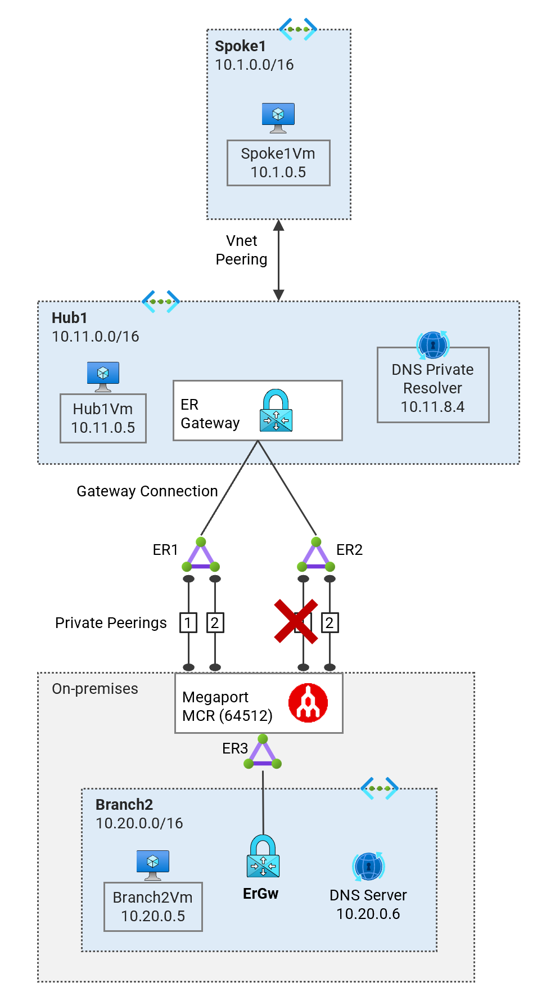

## 3. ExpressRoute Circuits ER1 and ER2 All Down <!-- omit from toc -->

[← 1. Previous](./3.%20ER2-primary-down.md) ✤

Contents
- [Overview](#overview)
- [1. Enable only ER2 Primary](#1-enable-only-er2-primary)
- [2. Path Trace from Branch2](#2-path-trace-from-branch2)
- [3. Path Trace from Spoke1](#3-path-trace-from-spoke1)
- [4. Gateway BGP Peers](#4-gateway-bgp-peers)
- [5. Gateway Route Tables](#5-gateway-route-tables)
- [6. ExpressRoute Circuit Route Tables](#6-expressroute-circuit-route-tables)
- [7. Verify Effective Routes](#7-verify-effective-routes)
- [8. Megaport Routes](#8-megaport-routes)
- [Review](#review)


## Overview

In this section, we'll shut down the entire ExpressRoute circuits `Lab09-er1` and `Lab09-er2` on the Megaport Coud Router (MCR). The diagram shows the connectivity paths from `P08-Branch2Vm` to both `P08-Hub1Vm` and `P08-Spoke1Vm`. Traffic is now only flows through the IPsec VPN active path.



The dashboard shows that all ExpressRoute circuits are down.


## 1. Enable only ER2 Primary

```bash
app_dir="../../scripts/megaport/app/app/"
python3 $app_dir/main.py bgp disable --mcr salawu-lab09-mcr1 --vxc Lab09-er1-pri
python3 $app_dir/main.py bgp disable --mcr salawu-lab09-mcr1 --vxc Lab09-er1-sec
python3 $app_dir/main.py bgp disable --mcr salawu-lab09-mcr1 --vxc Lab09-er2-pri
python3 $app_dir/main.py bgp enable --mcr salawu-lab09-mcr1 --vxc Lab09-er2-sec
```

## 2. Path Trace from Branch2

Login to virtual machine `Lab09-branch2Vm` via the [serial console](https://learn.microsoft.com/en-us/troubleshoot/azure/virtual-machines/serial-console-overview#access-serial-console-for-virtual-machines-via-azure-portal):

- On Azure portal select *Virtual machines*
- Select the virtual machine `Lab09-branch2Vm`
- Under ***Help*** section, select ***Serial console*** and wait for a login prompt
- Enter the login credentials
  - username = ***azureuser***
  - password = ***Password123***
- You should now be in a shell session `azureuser@Lab09-branch2Vm:~$`

Run the path trace command.

```bash
trace-ipv4
```

<details>

<summary>Sample output</summary>

```bash
azureuser@branch2Vm:~$ trace-ipv4

 trace ipv4 ...


branch2
-------------------------------------
 1:  branch2Vm                                             0.099ms reached
     Resume: pmtu 65535 hops 1 back 1

hub1
-------------------------------------
 1?: [LOCALHOST]                      pmtu 1500
 1:  10.20.16.5                                            3.217ms asymm  2
 1:  10.20.16.4                                            2.831ms asymm  2
 2:  172.16.0.21                                          13.349ms asymm  3
 3:  172.16.0.14                                          24.731ms asymm  4
 4:  no reply
 5:  10.11.0.5                                            28.937ms reached
     Resume: pmtu 1500 hops 5 back 5

spoke1
-------------------------------------
 1?: [LOCALHOST]                      pmtu 1500
 1:  10.20.16.4                                            1.894ms asymm  2
 1:  10.20.16.5                                            2.033ms asymm  2
 2:  172.16.0.17                                          13.117ms asymm  3
 3:  172.16.0.14                                          24.664ms asymm  4
 4:  no reply
 5:  10.1.0.5                                             28.326ms reached
     Resume: pmtu 1500 hops 5 back 5

internet
-------------------------------------
 1?: [LOCALHOST]                      pmtu 1500
 1:  no reply
 2:  no reply
```

We can see that traffic no longer goes through ExpressRoute circuit. The path is now through the VPN gateway to reach the `Lab09-hub1Vm` and `Lab09-spoke1Vm`. The path trace doesn't show the VPN tunnel endpoints because ICMP responses are suppressed by the Azure VPN gateway.

 </details>
<p>

## 3. Path Trace from Spoke1

Login to virtual machine `Lab09-spoke1Vm` via the [serial console](https://learn.microsoft.com/en-us/troubleshoot/azure/virtual-machines/serial-console-overview#access-serial-console-for-virtual-machines-via-azure-portal)


Run the path trace command.

```bash
trace-ipv4
```

<details>

<summary>Sample output</summary>

```bash
azureuser@spoke1Vm:~$ trace-ipv4

 trace ipv4 ...


branch2
-------------------------------------
 1?: [LOCALHOST]                      pmtu 1500
 1:  10.11.16.9                                            1.951ms asymm  2
 1:  10.11.16.9                                            1.998ms asymm  2
 2:  172.16.0.13                                          13.079ms asymm  3
 3:  172.16.0.22                                          24.845ms asymm  4
 4:  no reply
 5:  10.20.0.5                                            26.000ms reached
     Resume: pmtu 1500 hops 5 back 5

hub1
-------------------------------------
 1?: [LOCALHOST]                      pmtu 1500
 1:  10.11.0.5                                             8.287ms reached
 1:  10.11.0.5                                             1.408ms reached
     Resume: pmtu 1500 hops 1 back 1

spoke1
-------------------------------------
 1:  spoke1vm.internal.cloudapp.net                        0.166ms reached
     Resume: pmtu 65535 hops 1 back 1

internet
-------------------------------------
 1?: [LOCALHOST]                      pmtu 1500
 1:  no reply
 2:  no reply
```

</details>
<p>

## 4. Gateway BGP Peers

Run the following command to verify the BGP peer status on the gateways.

```bash
bash ../../scripts/vnet-gateway/get_bgp_peer_status.sh Lab09_ER_Resiliency_RG
```

<details>

<summary>Sample output</summary>

```bash
09-express-route-resiliency$ bash ../../scripts/vnet-gateway/get_bgp_peer_status.sh Lab09_ER_Resiliency_RG

Resource group: Lab09_ER_Resiliency_RG

Gateway: Lab09-branch2-ergw
Route tables:
Neighbor    ASN    LocalAddress    RoutesReceived    State
----------  -----  --------------  ----------------  ---------
10.20.16.4  12076  10.20.16.12     8                 Connected
10.20.16.5  12076  10.20.16.12     8                 Connected

Gateway: Lab09-hub1-ergw
Route tables:
Neighbor     ASN    LocalAddress    RoutesReceived    State
-----------  -----  --------------  ----------------  ---------
10.11.16.6   12076  10.11.16.12     0                 Connected
10.11.16.7   12076  10.11.16.12     0                 Connected
10.11.16.8   12076  10.11.16.12     0                 Connected
10.11.16.9   12076  10.11.16.12     7                 Connected
10.11.16.14  65515  10.11.16.12     0                 Connected
10.11.16.15  65515  10.11.16.12     0                 Connected

Gateway: Lab09-hub1-vpngw
Route tables:
Neighbor     ASN    LocalAddress    RoutesReceived    State
-----------  -----  --------------  ----------------  ---------
10.11.16.12  65515  10.11.16.14     2                 Connected
10.11.16.13  65515  10.11.16.14     2                 Connected
10.11.16.14  65515  10.11.16.14     0                 Unknown
10.11.16.15  65515  10.11.16.14     0                 Connected
10.11.16.12  65515  10.11.16.15     2                 Connected
10.11.16.13  65515  10.11.16.15     2                 Connected
10.11.16.14  65515  10.11.16.15     0                 Connected
10.11.16.15  65515  10.11.16.15     0                 Unknown
```

</details>
<p>

## 5. Gateway Route Tables

Run the following command to verify the route tables on the gateways.

```bash
bash ../../scripts/vnet-gateway/get_route_tables.sh Lab09_ER_Resiliency_RG
```

<details>

<summary>Sample output</summary>

```bash
09-express-route-resiliency$ bash ../../scripts/vnet-gateway/get_route_tables.sh Lab09_ER_Resiliency_RG

Resource group: Lab09_ER_Resiliency_RG

Gateway: Lab09-branch2-ergw
Route tables:
Network           NextHop     Origin    SourcePeer    AsPath             Weight
----------------  ----------  --------  ------------  -----------------  --------
10.20.0.0/16                  Network   10.20.16.12                      32768
fd00:db8:20::/56              Network   10.20.16.12                      32768
10.11.0.0/16      10.20.16.5  EBgp      10.20.16.5    12076-64512-12076  32769
10.11.0.0/16      10.20.16.4  EBgp      10.20.16.4    12076-64512-12076  32769
172.16.0.0/30     10.20.16.5  EBgp      10.20.16.5    12076-64512        32769
172.16.0.0/30     10.20.16.4  EBgp      10.20.16.4    12076-64512        32769
172.16.0.4/30     10.20.16.5  EBgp      10.20.16.5    12076-64512        32769
172.16.0.4/30     10.20.16.4  EBgp      10.20.16.4    12076-64512        32769
172.16.0.8/30     10.20.16.5  EBgp      10.20.16.5    12076-64512        32769
172.16.0.8/30     10.20.16.4  EBgp      10.20.16.4    12076-64512        32769
172.16.0.12/30    10.20.16.5  EBgp      10.20.16.5    12076-64512        32769
172.16.0.12/30    10.20.16.4  EBgp      10.20.16.4    12076-64512        32769
172.16.0.16/30    10.20.16.5  EBgp      10.20.16.5    12076-64512        32769
172.16.0.16/30    10.20.16.4  EBgp      10.20.16.4    12076-64512        32769
172.16.0.20/30    10.20.16.5  EBgp      10.20.16.5    12076-64512        32769
172.16.0.20/30    10.20.16.4  EBgp      10.20.16.4    12076-64512        32769
10.1.0.0/16       10.20.16.4  EBgp      10.20.16.4    12076-64512-12076  32769
10.1.0.0/16       10.20.16.5  EBgp      10.20.16.5    12076-64512-12076  32769

Gateway: Lab09-hub1-ergw
Route tables:
Network           NextHop     Origin    SourcePeer    AsPath             Weight
----------------  ----------  --------  ------------  -----------------  --------
10.11.0.0/16                  Network   10.11.16.12                      32768
fd00:db8:11::/56              Network   10.11.16.12                      32768
172.16.0.0/30     10.11.16.9  EBgp      10.11.16.9    12076-64512        32769
172.16.0.4/30     10.11.16.9  EBgp      10.11.16.9    12076-64512        32769
172.16.0.8/30     10.11.16.9  EBgp      10.11.16.9    12076-64512        32769
172.16.0.12/30    10.11.16.9  EBgp      10.11.16.9    12076-64512        32769
172.16.0.16/30    10.11.16.9  EBgp      10.11.16.9    12076-64512        32769
172.16.0.20/30    10.11.16.9  EBgp      10.11.16.9    12076-64512        32769
10.20.0.0/16      10.11.16.9  EBgp      10.11.16.9    12076-64512-12076  32769
10.1.0.0/16                   Network   10.11.16.12                      32768
fd00:db8:1::/56               Network   10.11.16.12                      32768

Gateway: Lab09-hub1-vpngw
Route tables:
Network       NextHop      Origin    SourcePeer    AsPath    Weight
------------  -----------  --------  ------------  --------  --------
10.11.0.0/16  10.11.16.12  IBgp      10.11.16.12             32769
10.11.0.0/16  10.11.16.13  IBgp      10.11.16.13             32769
10.1.0.0/16   10.11.16.12  IBgp      10.11.16.12             32769
10.1.0.0/16   10.11.16.13  IBgp      10.11.16.13             32769
10.11.0.0/16               Network   10.11.16.14             32768
10.1.0.0/16                Network   10.11.16.14             32768
10.11.0.0/16  10.11.16.12  IBgp      10.11.16.12             32769
10.11.0.0/16  10.11.16.13  IBgp      10.11.16.13             32769
10.1.0.0/16   10.11.16.13  IBgp      10.11.16.13             32769
10.1.0.0/16   10.11.16.12  IBgp      10.11.16.12             32769
10.11.0.0/16               Network   10.11.16.15             32768
10.1.0.0/16                Network   10.11.16.15             32768
```

We can now see that the on-premises network **10.20.0.0/20** is advertised over the primary VPN tunnel that has AS-prependers prepended five times.

</details>
<p>

## 6. ExpressRoute Circuit Route Tables

Run the following command to verify the route tables on the ExpressRoute circuits.

```bash
bash ../../scripts/vnet-gateway/get_er_route_tables.sh Lab09_ER_Resiliency_RG
```

<details>

<summary>Sample output</summary>

```bash
09-express-route-resiliency$ bash ../../scripts/vnet-gateway/get_er_route_tables.sh Lab09_ER_Resiliency_RG

Resource group: Lab09_ER_Resiliency_RG


⏳ AzurePrivatePeering (Primary): Lab09-er1
LocPrf    Network       NextHop       Path    Weight
--------  ------------  ------------  ------  --------
          10.1.0.0/16   10.11.16.12   65515   0
          10.1.0.0/16   10.11.16.13*  65515   0
          10.11.0.0/16  10.11.16.13   65515   0
          10.11.0.0/16  10.11.16.12*  65515   0

⏳ AzurePrivatePeering (Secondary): Lab09-er1
LocPrf    Network       NextHop       Path    Weight
--------  ------------  ------------  ------  --------
          10.1.0.0/16   10.11.16.12   65515   0
          10.1.0.0/16   10.11.16.13*  65515   0
          10.11.0.0/16  10.11.16.13   65515   0
          10.11.0.0/16  10.11.16.12*  65515   0

⏳ AzurePrivatePeering (Primary): Lab09-er2
LocPrf    Network       NextHop       Path    Weight
--------  ------------  ------------  ------  --------
          10.1.0.0/16   10.11.16.12   65515   0
          10.1.0.0/16   10.11.16.13*  65515   0
          10.11.0.0/16  10.11.16.12   65515   0
          10.11.0.0/16  10.11.16.13*  65515   0

⏳ AzurePrivatePeering (Secondary): Lab09-er2
LocPrf    Network         NextHop       Path         Weight
--------  --------------  ------------  -----------  --------
          10.1.0.0/16     10.11.16.12   65515        0
          10.1.0.0/16     10.11.16.13*  65515        0
          10.11.0.0/16    10.11.16.12   65515        0
          10.11.0.0/16    10.11.16.13*  65515        0
          10.20.0.0/16    172.16.0.13   64512 12076  0
          172.16.0.0/30   172.16.0.13   64512 ?      0
          172.16.0.4/30   172.16.0.13   64512 ?      0
          172.16.0.8/30   172.16.0.13   64512 ?      0
          172.16.0.16/30  172.16.0.13   64512 ?      0
          172.16.0.20/30  172.16.0.13   64512 ?      0

⏳ AzurePrivatePeering (Primary): Lab09-er3
LocPrf    Network         NextHop       Path         Weight
--------  --------------  ------------  -----------  --------
          10.1.0.0/16     172.16.0.17   64512 12076  0
          10.11.0.0/16    172.16.0.17   64512 12076  0
          10.20.0.0/16    10.20.16.12   65515        0
          10.20.0.0/16    10.20.16.13*  65515        0
          10.20.0.0/16    172.16.0.17   64512 12076  0
          172.16.0.0/30   172.16.0.17   64512 ?      0
          172.16.0.4/30   172.16.0.17   64512 ?      0
          172.16.0.8/30   172.16.0.17   64512 ?      0
          172.16.0.12/30  172.16.0.17   64512 ?      0
          172.16.0.20/30  172.16.0.17   64512 ?      0

⏳ AzurePrivatePeering (Secondary): Lab09-er3
LocPrf    Network         NextHop       Path         Weight
--------  --------------  ------------  -----------  --------
          10.1.0.0/16     172.16.0.21   64512 12076  0
          10.11.0.0/16    172.16.0.21   64512 12076  0
          10.20.0.0/16    10.20.16.13   65515        0
          10.20.0.0/16    10.20.16.12*  65515        0
          172.16.0.0/30   172.16.0.21   64512 ?      0
          172.16.0.4/30   172.16.0.21   64512 ?      0
          172.16.0.8/30   172.16.0.21   64512 ?      0
          172.16.0.12/30  172.16.0.21   64512 ?      0
          172.16.0.16/30  172.16.0.21   64512 ?      0
⭐ Done!
```

</details>
<p>


## 7. Verify Effective Routes

 **7.1** Verify effective routes of `Lab09-branch2-vm-main-nic`.

```bash
bash ../../scripts/_routes_nic.sh Lab09_ER_Resiliency_RG
```

<details>

<summary>Sample output</summary>

```bash
Effective routes for Lab09-branch2-vm-main-nic

Source                 Prefix          State    NextHopType            NextHopIP
---------------------  --------------  -------  ---------------------  ------------
Default                10.20.0.0/16    Active   VnetLocal
VirtualNetworkGateway  10.11.0.0/16    Active   VirtualNetworkGateway  10.20.88.110
VirtualNetworkGateway  10.11.0.0/16    Active   VirtualNetworkGateway  10.20.88.111
VirtualNetworkGateway  172.16.0.0/30   Active   VirtualNetworkGateway  10.20.88.110
VirtualNetworkGateway  172.16.0.0/30   Active   VirtualNetworkGateway  10.20.88.111
VirtualNetworkGateway  10.1.0.0/16     Active   VirtualNetworkGateway  10.20.88.110
VirtualNetworkGateway  10.1.0.0/16     Active   VirtualNetworkGateway  10.20.88.111
VirtualNetworkGateway  172.16.0.4/30   Active   VirtualNetworkGateway  10.20.88.110
VirtualNetworkGateway  172.16.0.4/30   Active   VirtualNetworkGateway  10.20.88.111
VirtualNetworkGateway  172.16.0.8/30   Active   VirtualNetworkGateway  10.20.88.110
VirtualNetworkGateway  172.16.0.8/30   Active   VirtualNetworkGateway  10.20.88.111
VirtualNetworkGateway  172.16.0.12/30  Active   VirtualNetworkGateway  10.20.88.110
VirtualNetworkGateway  172.16.0.12/30  Active   VirtualNetworkGateway  10.20.88.111
VirtualNetworkGateway  172.16.0.16/30  Active   VirtualNetworkGateway  10.20.88.110
VirtualNetworkGateway  172.16.0.16/30  Active   VirtualNetworkGateway  10.20.88.111
VirtualNetworkGateway  172.16.0.20/30  Active   VirtualNetworkGateway  10.20.88.110
VirtualNetworkGateway  172.16.0.20/30  Active   VirtualNetworkGateway  10.20.88.111
Default                0.0.0.0/0       Active   Internet
```

The virtual appliance is the next hop for all traffic in prefix `10.0.0.0/8`; which includes **spoke1**.

</details>
<p>

**7.2** Verify effective routes of `Lab09-spoke1-vm-main-nic`.

```bash
bash ../../scripts/_routes_nic.sh Lab09_ER_Resiliency_RG
```

<details>

<summary>Sample output</summary>

```bash
Effective routes for Lab09-spoke1-vm-main-nic

Source                 Prefix          State    NextHopType            NextHopIP
---------------------  --------------  -------  ---------------------  -------------
Default                10.1.0.0/16     Active   VnetLocal
Default                10.11.0.0/16    Active   VNetPeering
VirtualNetworkGateway  172.16.0.0/30   Active   VirtualNetworkGateway  10.63.110.252
VirtualNetworkGateway  172.16.0.4/30   Active   VirtualNetworkGateway  10.63.110.252
VirtualNetworkGateway  172.16.0.8/30   Active   VirtualNetworkGateway  10.63.110.252
VirtualNetworkGateway  172.16.0.12/30  Active   VirtualNetworkGateway  10.63.110.252
VirtualNetworkGateway  10.20.0.0/16    Active   VirtualNetworkGateway  10.63.110.252
VirtualNetworkGateway  172.16.0.16/30  Active   VirtualNetworkGateway  10.63.110.252
VirtualNetworkGateway  172.16.0.20/30  Active   VirtualNetworkGateway  10.63.110.252
Default                0.0.0.0/0       Active   Internet
```

The primary VPN tunnel IP **10.11.16.14** is the next hop for traffic to **branch2** **10.20.0.0/20**

</details>
<p>

## 8. Megaport Routes

```bash
app_dir="../../scripts/megaport/app/app/"
python3 $app_dir/main.py show routes -m salawu-lab09-mcr1
```

<details>

<summary>Sample output</summary>

```bash
08-network-paths-er-vpn$ app_dir="../../scripts/megaport/app/app/"
python3 $app_dir/main.py show routes -m salawu-lab09-mcr1

Prefix            BgpType     NextHop         NextHopVxc        AsPath
-------           --------    ---------       ------------      -------
10.1.0.0/20*      eBGP        172.16.0.18     Lab09-er3-pri     12076
10.11.0.0/20*     eBGP        172.16.0.18     Lab09-er3-pri     12076
10.11.16.0/20*    eBGP        172.16.0.18     Lab09-er3-pri     12076
10.20.0.0/20*     eBGP        172.16.0.18     Lab09-er3-pri     12076
10.20.0.0/20      eBGP        172.16.0.22     Lab09-er3-sec     12076
10.20.16.0/20*    eBGP        172.16.0.18     Lab09-er3-pri     12076
10.20.16.0/20     eBGP        172.16.0.22     Lab09-er3-sec     12076
172.16.0.0/30*    eBGP        0.0.0.0         Lab09-er1-pri
172.16.0.4/30*    eBGP        0.0.0.0         Lab09-er1-sec
172.16.0.8/30*    eBGP        0.0.0.0         Lab09-er2-pri
172.16.0.12/30*   eBGP        0.0.0.0         Lab09-er2-sec
172.16.0.16/30*   eBGP        0.0.0.0         Lab09-er3-pri
172.16.0.20/30*   eBGP        0.0.0.0         Lab09-er3-sec
```

All BGP routes through `Lab09-er1` and `Lab09-er2` are now withdrawn from the routing table. So the on-premises network (Megaport MCR) no longer learns the Azure prefixes **10.11.0.0/20** and **10.1.0.0/20** through the ExpressRoute circuits.

</details>
<p>

## Review

You have successfully tested the scenario where ExpressRoute route experiences site failure in a peering location and one of the circuits in second peering location fails. This demonstrates resiliency during multiple failure events.

[← 1. Previous](./3.%20ER2-primary-down.md) ✤

