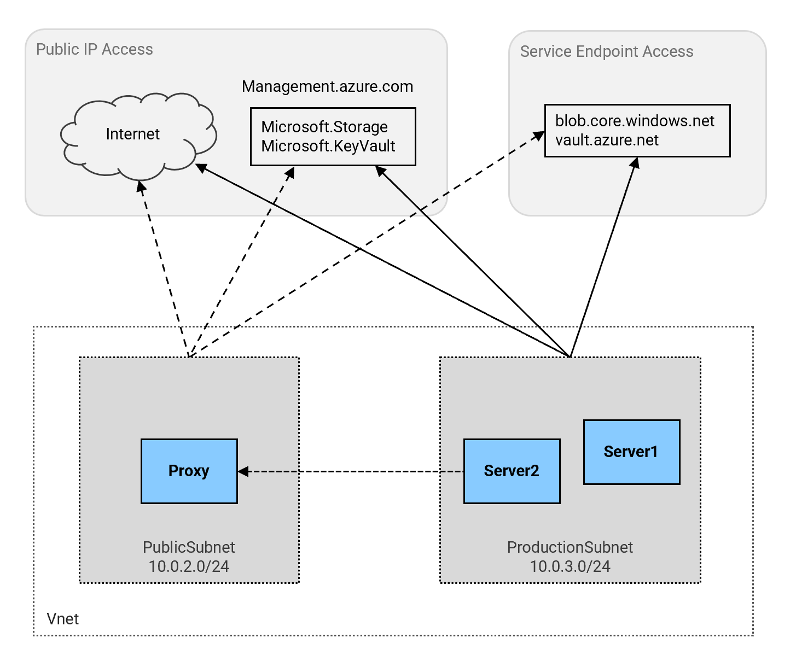
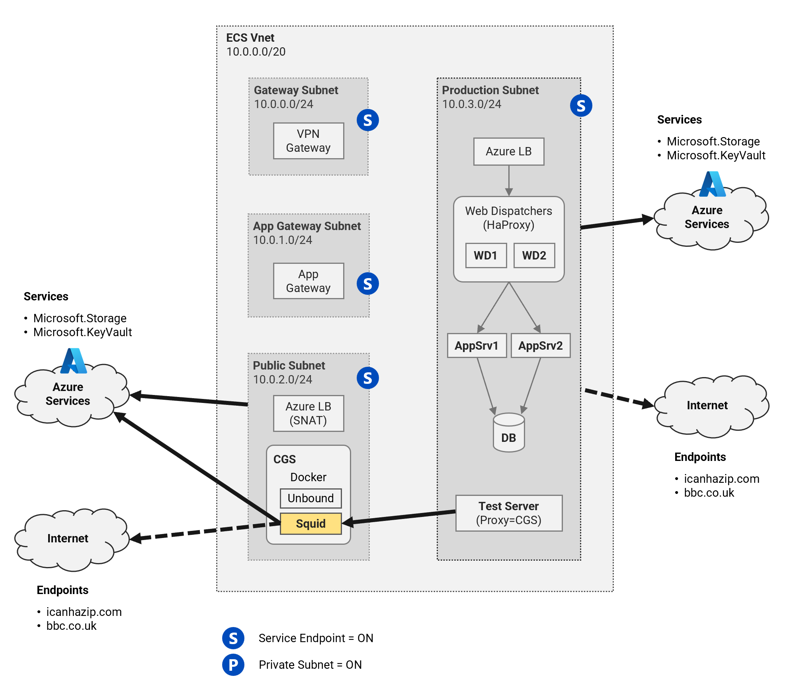
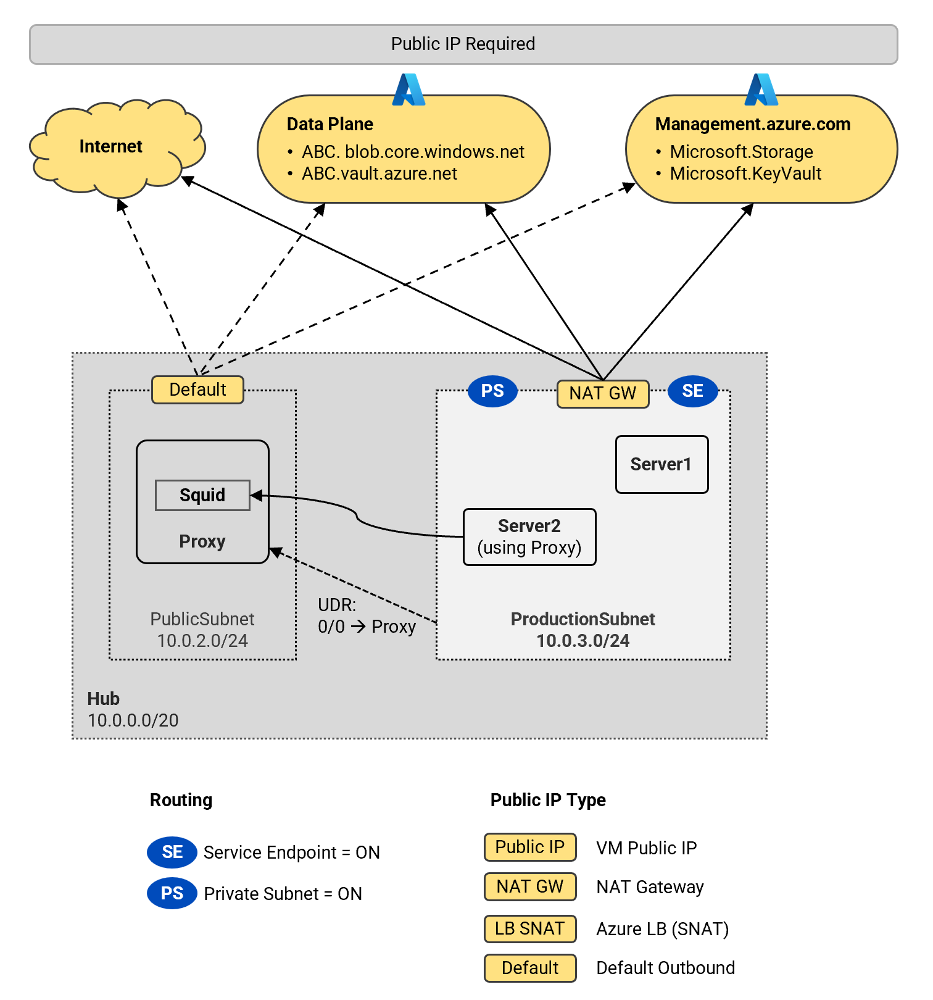
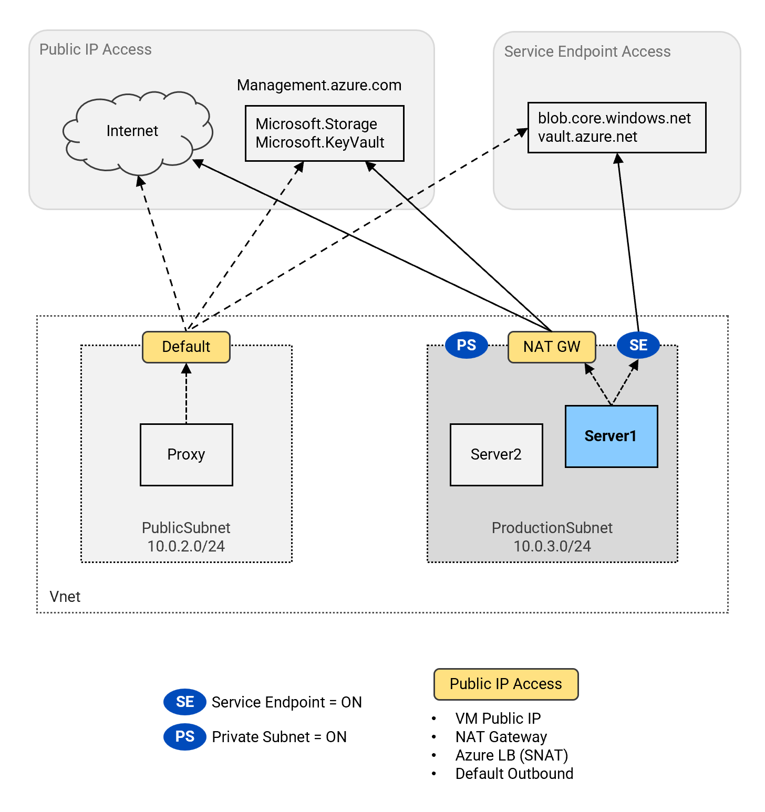
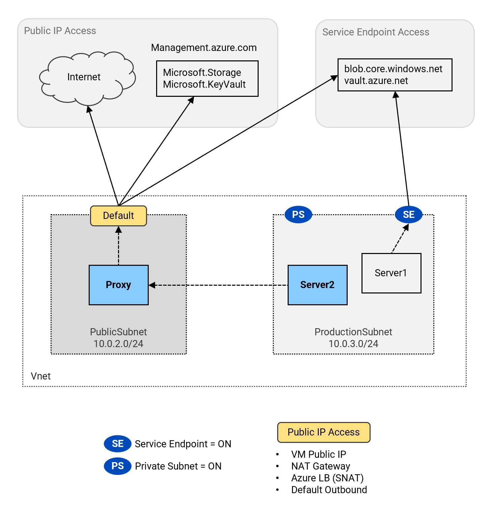
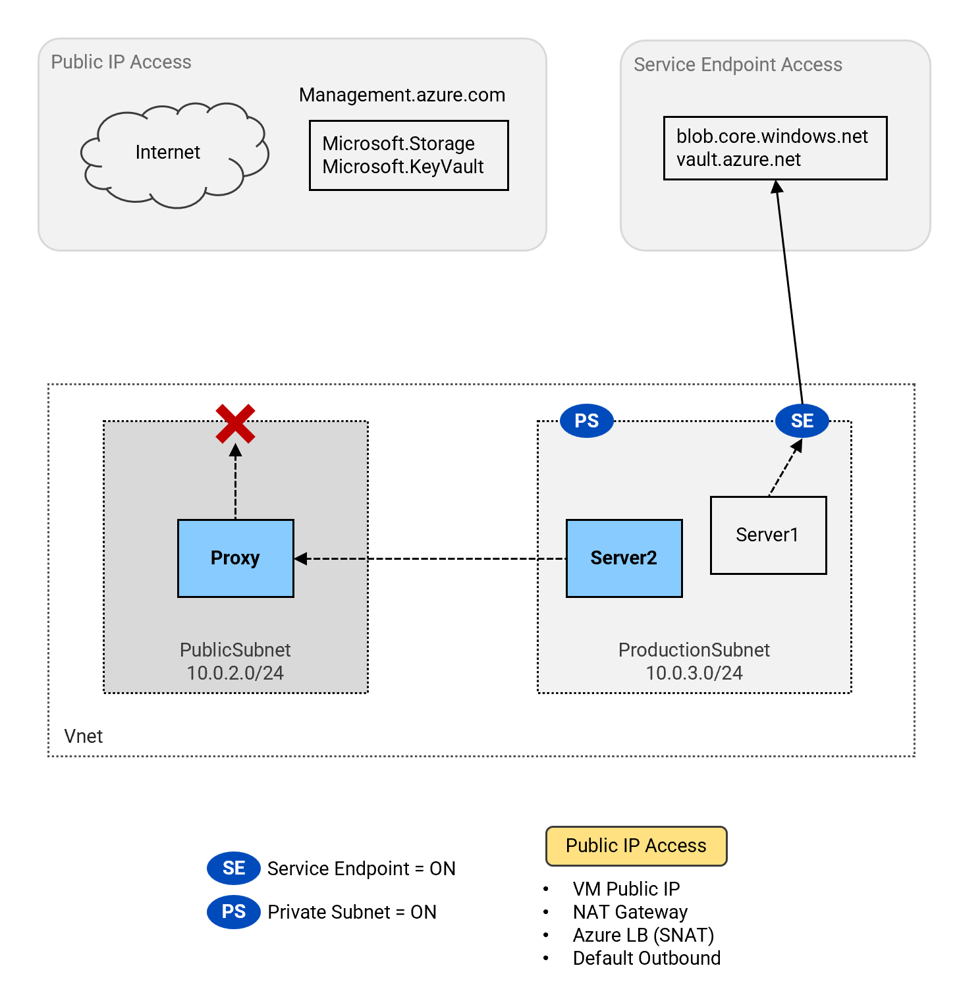

# Network Egress Patterns <!-- omit from toc -->

## Lab: G10 <!-- omit from toc -->

Contents

- [Overview](#overview)
- [Prerequisites](#prerequisites)
- [Deploy the Lab](#deploy-the-lab)
- [Troubleshooting](#troubleshooting)
- [Outputs](#outputs)
- [Accessing the Test Servers](#accessing-the-test-servers)
- [Test Results](#test-results)
  - [A. NAT Gateway, Private-Subnet = Off, Service-Endpoint = Off](#a-nat-gateway-private-subnet--off-service-endpoint--off)
  - [B. NAT-Gateway, Private-Subnet = On, Service-Endpoint = Off](#b-nat-gateway-private-subnet--on-service-endpoint--off)
  - [C. NAT-Gateway, Private-Subnet = On, Service-Endpoint = On](#c-nat-gateway-private-subnet--on-service-endpoint--on)
  - [D. No Explicit Public IP, Private-Subnet = On, Service-Endpoint = On](#d-no-explicit-public-ip-private-subnet--on-service-endpoint--on)
  - [E. Outbound Access via Proxy](#e-outbound-access-via-proxy)
  - [F. No Explicit Public IP, Private-Subnet = Off, Service-Endpoint = Off](#f-no-explicit-public-ip-private-subnet--off-service-endpoint--off)
- [Cleanup](#cleanup)

## Overview

This lab deploys a test environment to experiment with network egress patterns in Azure virtual networks. It demonstrates outbound access to Azure services with various combinations of service endpoints, private subnets, and User Defined Routes (UDR) using service tags.



## Prerequisites

Ensure you meet all requirements in the [prerequisites](../../prerequisites/README.md) before proceeding.

## Deploy the Lab

1. Clone the Git Repository for the Labs

   ```sh
   git clone https://github.com/kaysalawu/azure-network-terraform.git
   ```

2. Navigate to the lab directory

   ```sh
   cd azure-network-terraform/4-general/10-network-egress-scenarios
   ```

3. Run the following terraform commands and type ***yes*** at the prompt:

   ```sh
   terraform init
   terraform plan
   terraform apply -parallelism=50
   ```

## Troubleshooting

See the [troubleshooting](../../troubleshooting/README.md) section for tips on how to resolve common issues that may occur during the deployment of the lab.

## Outputs

The table below shows the auto-generated output files from the lab. They are located in the `output` directory.

| Item    | Description  | Location |
|--------|--------|--------|
| IP ranges and DNS | IP ranges and DNS hostname values | [output/values.md](./output/values.md) |
| Server1 | Cloud-init configuration | [output/server1-init.yaml](./output/server1-crawler.sh) |
| Server2 | Cloud-init configuration | [output/server2-init.yaml](./output/server2-crawler.sh) |
| Proxy | Cloud-init configuration | [output/proxy-init.yaml](./output/proxy-crawler.sh) |
||||

## Accessing the Test Servers

Each virtual machine is pre-configured with a shell [script](../../scripts/server.sh) to run various types of network reachability tests. Serial console access has been configured for all virtual machines.

The virtual machines are also pre-configured with test scripts to check network reachability to various Azure services. The scripts are located in the [`/var/lib/azure/crawler/app/`](../../scripts/init/crawler/app) directory. The scripts can simply be run using the alias `crawlz` navigate to the directory and run the scripts.

The virtual machines are configured with system-assigned managed identities that have the **Network Contributor** role scoped to the resource group.

**1.** Login to virtual machine `G10-Proxy` via the [serial console](https://learn.microsoft.com/en-us/troubleshoot/azure/virtual-machines/serial-console-overview#access-serial-console-for-virtual-machines-via-azure-portal):
- Enter the login credentials
  - username = ***azureuser***
  - password = ***Password123***

**2.** Run `az login` to authenticate with the Azure CLI.

```sh
az login --identity
```

<details>

<summary>Sample output</summary>

```json
azureuser@branch1Vm:~$ az login --identity
[
  {
    "environmentName": "AzureCloud",
    "homeTenantId": "aaa-bbb-ccc-ddd-eee",
    "id": "xxx-yyy-1234-1234-1234",
    "isDefault": true,
    "managedByTenants": [
      {
        "tenantId": "your-tenant-id"
      }
    ],
    "name": "some-random-name",
    "state": "Enabled",
    "tenantId": "your-tenant-id",
    "user": {
      "assignedIdentityInfo": "MSI",
      "name": "systemAssignedIdentity",
      "type": "servicePrincipal"
    }
  }
]
```

</details>
<p>

From here, you can run the `crawlz` command to test service reachability to various Azure services as shown in the following sections. The lab is designed to be run sequentially to achieve the results described in the following sections.

## Test Results

<style>
table {
  font-size: 90%;
}
</style>
<table>
  <tr>
   <td rowspan="2" ><strong></strong></td>
   <td rowspan="2" ><strong>Test VM</strong></td>
   <td rowspan="2" ><strong>Subnet</strong></td>
   <td rowspan="2" ><strong>Service Endpoint</strong></td>
   <td rowspan="2" ><strong>Private Subnet</strong></td>
   <td colspan="4" ><strong>Public IP Type</strong></td>
   <td rowspan="2" ><strong>Azure Mgmt Access?</strong></td>
   <td rowspan="2" ><strong>Internet Access?</strong></td>
   <td colspan="2" ><strong>Data Plane Access?</strong></td>
  </tr>
  <tr>
   <td><strong>NAT GW</td>
   <td><strong>LB SNAT</strong></td>
   <td><strong>VM Public IP</strong></td>
   <td><strong>Default Outbound</strong></td>
   <td><strong>Storage</strong></td>
   <td><strong>KeyVault</strong></td>
  </tr>
  <tr>
   <td>A</td><td>Proxy</td><td>Public</td><td></td><td></td><td></td><td></td><td></td><td>X</td><td>Yes</td><td>Yes<td>Yes<td>Yes</td>
  </tr>
  <tr>
   <td>B</td><td>Server1</td><td>Production</td><td></td><td>X</td><td>X</td><td></td><td></td><td></td><td>Yes</td><td>Yes<td>Yes<td>Yes</td>
  </tr>
  <tr>
   <td>C</td><td>Server1</td><td>Production</td><td>X</td><td>X</td><td>X</td><td></td><td></td><td></td><td>Yes</td><td>Yes<td>Yes<td>Yes</td>
  </tr>
  <tr>
   <td>D</td><td>Server1</td><td>Production</td><td>X</td><td>X</td><td></td><td></td><td></td><td></td><td></td><td><td>Yes<td>Yes</td>
  </tr>
  <tr>
   <td>E</td><td>Proxy</td><td>Public<td></td></td><td></td><td></td><td></td><td></td><td></td><td></td><td><td><td></td>
  </tr>
</table>

### A. NAT Gateway, Private-Subnet = Off, Service-Endpoint = Off

The [default outbound access](https://learn.microsoft.com/en-us/azure/virtual-network/ip-services/default-outbound-access#how-is-default-outbound-access-provided) is used in this scenario because there is no explicit outbound method deployed (NAT gateway, load balancer SNAT, or VM public IP). Using the default outbound access, the VM `G10-Proxy` can access the internet, Azure services, and management services. Traffic to all public endpoints is sourced from the implicit public IP address provided via the default outbound access. Default outbound access is [not recommended for security reasons](https://learn.microsoft.com/en-us/azure/virtual-network/ip-services/default-outbound-access#why-is-disabling-default-outbound-access-recommended).


<p>

**Test instructions:**

1\. Login to `G10-Proxy` VM as described in the [Test Servers](#test-servers) section.

2\. Run the command `crawlz` to test network reachability.

**Summary:**

```sh
-------------------------------------
Environment
-------------------------------------
VM Name:        G10-Proxy
Resource Group: G10_NetworkEgress_RG
Location:       northeurope
VNET Name:      G10-hub-vnet
Subnet Name:    PublicSubnet
Private IP:     10.0.2.4
-------------------------------------
Results
-------------------------------------
1. NAT_IP_Type:         None
2. Service_Endpoints:   False
3. Private_Subnet:      False
4. Internet_Access:     Yes
5. Management_Access:   Yes
6. Blob_Access:         Yes
7. KeyVault_Access:     Yes
-------------------------------------
```

**Detailed Result:**

<details>

<summary>Detailed Result</summary>

```sh
azureuser@Proxy:~$ crawlz

 Service Crawler initiating ...

* Extracting az token...
* Downloading service tags JSON...

-------------------------------------
Environment
-------------------------------------
VM Name:        G10-Proxy
Resource Group: G10_NetworkEgress_RG
Location:       northeurope
VNET Name:      G10-hub-vnet
Subnet Name:    PublicSubnet
Private IP:     10.0.2.4
-------------------------------------

1. Check Public Address Type
   Local IP:    10.0.2.4
   Public IP:   13.79.89.67
   NAT_IP type: None

2. Check Service Endpoints
   Subnet --> PublicSubnet
   Service EP: False

3. Check Private Subnet
   Subnet --> PublicSubnet
   DefaultOutbound: true
   Private Subnet:  False

4. Check Internet Access
   Connecting to https://ifconfig.me ...
   Access: Yes (200)

5. Management (Control Plane)
   url = https://management.azure.com/subscriptions?api-version=2020-01-01
   host = management.azure.com
   52.146.135.86 <-- management.azure.com
   Searching for service tags matching 52.146.134.240
   - 52.146.134.0/23 <-- AzureResourceManager ()
   - 52.146.134.0/23 <-- AzureResourceManager.NorthEurope (northeurope)
   - 52.146.128.0/17 <-- AzureCloud.northeurope (northeurope)
   - 52.146.128.0/17 <-- AzureCloud ()
   Testing access to management.azure.com
   Access: Yes

6. Blob (Data Plane)
   url = https://g10hub99a2.blob.core.windows.net/storage/storage.txt
   host = g10hub99a2.blob.core.windows.net
   20.60.204.97 <-- g10hub99a2.blob.core.windows.net
   Searching for service tags matching 20.60.204.97
   - 20.60.0.0/16 <-- Storage ()
   - 20.60.204.0/23 <-- Storage.NorthEurope (northeurope)
   - 20.60.204.0/23 <-- AzureCloud.northeurope (northeurope)
   - 20.60.204.0/23 <-- AzureCloud ()
   Retrieving blob content ...
   Content: Hello, World!
   Access: Yes

7. KeyVault (Data Plane)
   url: https://g10-hub-kv99a2.vault.azure.net/secrets/message
   host: g10-hub-kv99a2.vault.azure.net
   52.146.137.169 <-- g10-hub-kv99a2.vault.azure.net
   Searching for service tags matching 52.146.137.169
   - 52.146.137.168/29 <-- AzureKeyVault ()
   - 52.146.137.168/29 <-- AzureKeyVault.NorthEurope (northeurope)
   - 52.146.128.0/17 <-- AzureCloud.northeurope (northeurope)
   - 52.146.128.0/17 <-- AzureCloud ()
   Accessing secret ...
   message: Hello, World!
   Access: Yes

-------------------------------------
Results
-------------------------------------
1. NAT_IP_Type:         None
2. Service_Endpoints:   False
3. Private_Subnet:      False
4. Internet_Access:     Yes
5. Management_Access:   Yes
6. Blob_Access:         Yes
7. KeyVault_Access:     Yes
-------------------------------------
```

</details>
<p>

### B. NAT-Gateway, Private-Subnet = On, Service-Endpoint = Off

When private subnet is enabled on `ProductionSubnet` associated with a NAT gateway, the VM `G10-Server1` can access the internet, Azure services, and management services. Traffic to all public endpoints are sourced from the NAT gateway public IP address. Traffic to service endpoints do not require public IP addresses.



**Test instructions:**

Private subnet is already enabled on `ProductionSubnet`. The subnet is also already associated with a NAT gateway.

1\. Login to `G10-Server1` VM as described in the [Test Servers](#test-servers) section.

2\. Run the command `crawlz` to test network reachability.

**Summary:**

```sh
-------------------------------------
Environment
-------------------------------------
VM Name:        G10-Server1
Resource Group: G10_NETWORKEGRESS_RG
Location:       northeurope
VNET Name:      G10-hub-vnet
Subnet Name:    ProductionSubnet
Private IP:     10.0.3.4
-------------------------------------
Results
-------------------------------------
1. NAT_IP_Type:         NatGw
2. Service_Endpoints:   True
3. Private_Subnet:      True
4. Internet_Access:     Yes
5. Management_Access:   Yes
6. Blob_Access:         Yes
7. KeyVault_Access:     Yes
-------------------------------------
```

**Detailed Result:**

<details>

<summary>Detailed Result</summary>

```sh
azureuser@Server1:~$ crawlz

 Service Crawler initiating ...

* Extracting az token...
* Downloading service tags JSON...

-------------------------------------
Environment
-------------------------------------
VM Name:        G10-Server1
Resource Group: G10_NETWORKEGRESS_RG
Location:       northeurope
VNET Name:      G10-hub-vnet
Subnet Name:    ProductionSubnet
Private IP:     10.0.3.4
-------------------------------------

1. Check Public Address Type
   Local IP:    10.0.3.4
   Public IP:   13.74.117.25
   Address type: NatGw

2. Check Service Endpoints
   Subnet --> ProductionSubnet
   Service EP: True
  - Microsoft.Storage
  - Microsoft.KeyVault
  - Microsoft.Sql
  - Microsoft.ServiceBus
  - Microsoft.EventHub
  - Microsoft.AzureActiveDirectory
  - Microsoft.Web
  - Microsoft.CognitiveServices
  - Microsoft.ContainerRegistry
  - Microsoft.AzureCosmosDB

3. Check Private Subnet
   Subnet --> ProductionSubnet
   DefaultOutbound: false
   Private Subnet:  True

4. Check Internet Access
   Connecting to https://ifconfig.me ...
   Access: Yes (200)

5. Management (Control Plane)
   url = https://management.azure.com/subscriptions?api-version=2020-01-01
   host = management.azure.com
   52.146.134.240 <-- management.azure.com
   Searching for service tags matching 52.146.134.240
   - 52.146.134.0/23 <-- AzureResourceManager ()
   - 52.146.134.0/23 <-- AzureResourceManager.NorthEurope (northeurope)
   - 52.146.128.0/17 <-- AzureCloud.northeurope (northeurope)
   - 52.146.128.0/17 <-- AzureCloud ()
   Testing access to management.azure.com
   Access: Yes (200)

6. Blob (Data Plane)
   url = https://g10hub99a2.blob.core.windows.net/storage/storage.txt
   host = g10hub99a2.blob.core.windows.net
   20.60.204.97 <-- g10hub99a2.blob.core.windows.net
   Searching for service tags matching 20.60.204.97
   - 20.60.0.0/16 <-- Storage ()
   - 20.60.204.0/23 <-- Storage.NorthEurope (northeurope)
   - 20.60.204.0/23 <-- AzureCloud.northeurope (northeurope)
   - 20.60.204.0/23 <-- AzureCloud ()
   Retrieving blob content ...
   Content: Hello, World!
   Access: Yes

7. KeyVault (Data Plane)
   url: https://g10-hub-kv99a2.vault.azure.net/secrets/message
   host: g10-hub-kv99a2.vault.azure.net
   52.146.137.169 <-- g10-hub-kv99a2.vault.azure.net
   Searching for service tags matching 52.146.137.169
   - 52.146.137.168/29 <-- AzureKeyVault ()
   - 52.146.137.168/29 <-- AzureKeyVault.NorthEurope (northeurope)
   - 52.146.128.0/17 <-- AzureCloud.northeurope (northeurope)
   - 52.146.128.0/17 <-- AzureCloud ()
   Accessing secret ...
   message: Hello, World!
   Access: Yes

-------------------------------------
Results
-------------------------------------
1. NAT_IP_Type:         NatGw
2. Service_Endpoints:   True
3. Private_Subnet:      True
4. Internet_Access:     Yes
5. Management_Access:   Yes
6. Blob_Access:         Yes
7. KeyVault_Access:     Yes
-------------------------------------
```

</details>
<p>

### C. NAT-Gateway, Private-Subnet = On, Service-Endpoint = On

When private subnet is enabled on `ProductionSubnet` associated with a NAT gateway, the VM `G10-Server1` can access the internet, Azure services, and management services. Traffic to all public endpoints are sourced from the NAT gateway public IP address.



**Test instructions:**

Private subnet is already enabled on `ProductionSubnet`. The subnet is also already associated with a NAT gateway.

1\. Login to `G10-Server1` VM as described in the [Test Servers](#test-servers) section.

2\. Run the command `crawlz` to test network reachability.

**Summary:**

```sh
-------------------------------------
Environment
-------------------------------------
VM Name:        G10-Server1
Resource Group: G10_NetworkEgress_RG
Location:       northeurope
VNET Name:      G10-hub-vnet
Subnet Name:    ProductionSubnet
Private IP:     10.0.3.4
-------------------------------------
Results
-------------------------------------
1. NAT_IP_Type:         NatGw
2. Service_Endpoints:   False
3. Private_Subnet:      True
4. Internet_Access:     Yes
5. Management_Access:   Yes
6. Blob_Access:         Yes
7. KeyVault_Access:     Yes
-------------------------------------
```

**Detailed Result:**

<details>

<summary>Detailed Result</summary>

```sh
azureuser@Server1:~$ crawlz

 Service Crawler initiating ...

* Extracting az token...
* Downloading service tags JSON...

-------------------------------------
Environment
-------------------------------------
VM Name:        G10-Server1
Resource Group: G10_NetworkEgress_RG
Location:       northeurope
VNET Name:      G10-hub-vnet
Subnet Name:    ProductionSubnet
Private IP:     10.0.3.4
-------------------------------------

1. Check Public Address Type
   Local IP:    10.0.3.4
   Public IP:   52.138.199.37
   Address type: NatGw

2. Check Service Endpoints
   Subnet --> ProductionSubnet
   Service EP: False

3. Check Private Subnet
   Subnet --> ProductionSubnet
   DefaultOutbound: false
   Private Subnet:  True

4. Check Internet Access
   Connecting to https://contoso.com ...
   Access: Yes (301)

5. Management (Control Plane)
   url = https://management.azure.com/subscriptions?api-version=2020-01-01
   host = management.azure.com
   52.146.134.240 <-- management.azure.com
   Searching for service tags matching 52.146.134.240
   - 52.146.134.0/23 <-- AzureResourceManager ()
   - 52.146.134.0/23 <-- AzureResourceManager.NorthEurope (northeurope)
   - 52.146.128.0/17 <-- AzureCloud.northeurope (northeurope)
   - 52.146.128.0/17 <-- AzureCloud ()
   Testing access to management.azure.com
   Access: Yes

6. Blob (Data Plane)
   url = https://g10hub33bc.blob.core.windows.net/storage/storage.txt
   host = g10hub33bc.blob.core.windows.net
   20.60.145.164 <-- g10hub33bc.blob.core.windows.net
   Searching for service tags matching 20.60.145.164
   - 20.60.0.0/16 <-- Storage ()
   - 20.60.144.0/23 <-- Storage.NorthEurope (northeurope)
   - 20.60.144.0/23 <-- AzureCloud.northeurope (northeurope)
   - 20.60.144.0/23 <-- AzureCloud ()
   Retrieving blob content ...
   Content: Hello, World!
   Access: Yes

7. KeyVault (Data Plane)
   url: https://g10-hub-kv33bc.vault.azure.net/secrets/message
   host: g10-hub-kv33bc.vault.azure.net
   52.146.137.169 <-- g10-hub-kv33bc.vault.azure.net
   Searching for service tags matching 52.146.137.169
   - 52.146.137.168/29 <-- AzureKeyVault ()
   - 52.146.137.168/29 <-- AzureKeyVault.NorthEurope (northeurope)
   - 52.146.128.0/17 <-- AzureCloud.northeurope (northeurope)
   - 52.146.128.0/17 <-- AzureCloud ()
   Accessing secret ...
   message: Hello, World!
   Access: Yes

-------------------------------------
Results
-------------------------------------
1. NAT_IP_Type:         NatGw
2. Service_Endpoints:   False
3. Private_Subnet:      True
4. Internet_Access:     Yes
5. Management_Access:   Yes
6. Blob_Access:         Yes
7. KeyVault_Access:     Yes
-------------------------------------
```

</details>
<p>

### D. No Explicit Public IP, Private-Subnet = On, Service-Endpoint = On

When private subnet is enabled on `ProductionSubnet` and there is no explicit outbound method deployed (NAT gateway, load balancer SNAT, or VM public IP), the VM `G10-Server1` cannot access the internet, Azure services, and management services. Traffic to all public endpoints are sourced from the implicit public IP address provided via the default outbound access.


**Test instructions:**

1\. Disable NAT gateway for `ProductionSubnet` by commenting out the subnet in the appropriate line in [02-main.tf](./02-main.tf#L57) file.

```sh
  hub_features = {
    config_vnet = {
      ...
      nat_gateway_subnet_names = [
        # "ProductionSubnet",
      ]
    }
    ...
  }
```

2\. Re-apply terraform to remove the subnet association with the NAT gateway.

3\. Login to `G10-Server1` VM as described in the [Test Servers](#test-servers) section.

4\. Run the command `crawlz` to test network reachability.

**Summary:**

```sh
-------------------------------------
Environment
-------------------------------------
VM Name:        G10-Server1
Resource Group: G10_NetworkEgress_RG
Location:       northeurope
VNET Name:
Subnet Name:
Subnet Prefix:  10.0.3.0/24
Private IP:     10.0.3.4
-------------------------------------
Results
-------------------------------------
1. NAT_IP_Type:         None
2. Service_Endpoints:   False
3. Private_Subnet:      False
4. Internet_Access:     No
5. Management_Access:   No
6. Blob_Access:         No
7. KeyVault_Access:     No
-------------------------------------
```

**Detailed Result:**

<details>

<summary>Detailed Result</summary>

```sh
azureuser@Server1:~$ crawlz

 Service Crawler initiating ...

* Extracting az token...
* Getting storage account key...
* Retrieving VNET name...
* Extracting subnet name...
* Downloading service tags JSON...

-------------------------------------
Environment
-------------------------------------
VM Name:        G10-Server1
Resource Group: G10_NetworkEgress_RG
Location:       northeurope
VNET Name:
Subnet Name:
Subnet Prefix:  10.0.3.0/24
Private IP:     10.0.3.4
VM Name:        G10-Server1
Resource Group: G10_NetworkEgress_RG
Location:       northeurope
VNET Name:      G10-hub-vnet
Subnet Name:    ProductionSubnet
Subnet Prefix:  10.0.3.0/24
Private IP:     10.0.3.4
-------------------------------------

1. Check Public Address Type
   Local IP:    10.0.3.4
   Public IP:
   Address type: None

2. Check Service Endpoints
   Subnet -->
   Service EP: False

3. Check Private Subnet
   Subnet -->
   DefaultOutbound: true
   Private Subnet:  False

4. Check Internet Access
   Connecting to http://contoso.com ...
   Access: No ()

5. Management (Control Plane)
   52.146.134.240 <-- management.azure.com
   Testing access to management.azure.com
   Access: No

6. Blob (Data Plane)
   url =
   host =

   Retrieving blob content ...
   Blob download: failed!
   Access: No

7. KeyVault (Data Plane)
   url: https:///secrets/message/<ID>
   host:

   Accessing secret ...
   message: not found!
   Access: No

-------------------------------------
Results
-------------------------------------
1. NAT_IP_Type:         None
2. Service_Endpoints:   False
3. Private_Subnet:      False
4. Internet_Access:     No
5. Management_Access:   No
6. Blob_Access:         No
7. KeyVault_Access:     No
-------------------------------------
```

</details>
<p>

### E. Outbound Access via Proxy

When private subnet is enabled on `ProductionSubnet` and there is no explicit outbound method deployed (NAT gateway, load balancer SNAT, or VM public IP), the VM `G10-Server1` cannot access public endpoints. But with [service endpoints](https://learn.microsoft.com/en-us/azure/virtual-network/virtual-network-service-endpoints-overview) enabled on `ProductionSubnet`, `G10-Server1` can access Azure services that are associated with the service endpoints - in this case, Azure Storage and Azure Key Vault. Service endpoints are accessed via management.azure.com for management operations on resources - listing, creating, updating, and deleting resources.



**Test instructions:**

1\. Enable service endpoints in the appropriate line in [02-main.tf](./02-main.tf#L9) file.

```sh
enable_service_endpoints = true
```

2\. Re-apply terraform to remove the subnet association with the NAT gateway.

3\. Login to `G10-Server1` VM as described in the [Test Servers](#test-servers) section.

4\. Run the command `crawlz` to test network reachability.

**Summary:**

```sh

```

**Detailed Result:**

<details>

<summary>Detailed Result</summary>

```sh

```

</details>
<p>


### F. No Explicit Public IP, Private-Subnet = Off, Service-Endpoint = Off

TBC



**Test instructions:**

1\. Enable service endpoints in the appropriate line in [02-main.tf](./02-main.tf#L9) file.

```sh
enable_service_endpoints = true
```

2\. Re-apply terraform to remove the subnet association with the NAT gateway.

3\. Login to `G10-Server1` VM as described in the [Test Servers](#test-servers) section.

4\. Run the command `crawlz` to test network reachability.

**Summary:**

```sh

```

**Detailed Result:**

<details>

<summary>Detailed Result</summary>

```sh

```

</details>
<p>


## Cleanup

1\. (Optional) Navigate back to the lab directory (if you are not already there)

```sh
cd azure-network-terraform/4-general/10-network-egress-scenarios
```

2\. (Optional) This is not required if `enable_diagnostics = false` in the [`main.tf`](./02-main.tf). If you deployed the lab with `enable_diagnostics = true`, in order to avoid terraform errors when re-deploying this lab, run a cleanup script to remove diagnostic settings that are not removed after the resource group is deleted.

```sh
bash ../../scripts/_cleanup.sh G10_SapNetworking_RG
```

<details>

<summary>Sample output</summary>

```sh
3-hub-spoke-nva-single-region$    bash ../../scripts/_cleanup.sh G10_SapNetworking_RG

Resource group: G10RG

⏳ Checking for diagnostic settings on resources in G10_SapNetworking_RG ...
➜  Checking firewall ...
➜  Checking vnet gateway ...
    ❌ Deleting: diag setting [G10-ecs-vpngw-diag] for vnet gateway [G10-ecs-vpngw] ...
➜  Checking vpn gateway ...
➜  Checking er gateway ...
➜  Checking app gateway ...
⏳ Checking for azure policies in G10RG ...
Done!
```

</details>
<p>

3\. Delete the resource group to remove all resources installed.

```sh
az group delete -g G10_SapNetworking_RG --no-wait
```

4\. Delete terraform state files and other generated files.

```sh
rm -rf .terraform*
rm terraform.tfstate*
```
