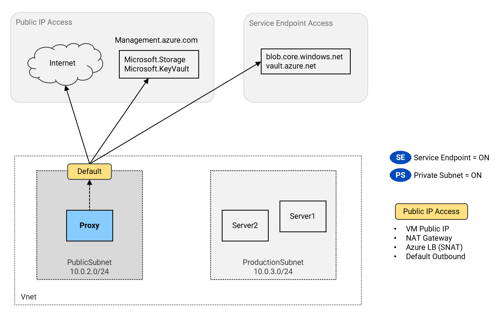

# Network Egress Patterns <!-- omit from toc -->

## Lab: Lab10 <!-- omit from toc -->

Contents

- [Overview](#overview)
- [Prerequisites](#prerequisites)
- [Deploy the Lab](#deploy-the-lab)
- [Troubleshooting](#troubleshooting)
- [Outputs](#outputs)
- [Accessing the Test Servers](#accessing-the-test-servers)
- [Test Results](#test-results)
  - [A. Default Outbound, Private-Subnet = Off, Service-Endpoint = Off](#a-default-outbound-private-subnet--off-service-endpoint--off)
  - [B. NAT-Gateway, Private-Subnet = On, Service-Endpoint = Off](#b-nat-gateway-private-subnet--on-service-endpoint--off)
  - [C. No Public IP, Private-Subnet = On, Service-Endpoint = Off](#c-no-public-ip-private-subnet--on-service-endpoint--off)
  - [D. No Public IP, Private-Subnet = On, Service-Endpoint = On](#d-no-public-ip-private-subnet--on-service-endpoint--on)
  - [E. Outbound Access via Proxy](#e-outbound-access-via-proxy)
- [Cleanup](#cleanup)

## Overview

This lab deploys a test environment to experiment with network egress patterns in Azure virtual networks. It demonstrates outbound access to Azure services with various combinations of service endpoints, private subnets, and User Defined Routes (UDR) using service tags.


## Prerequisites

Ensure you meet all requirements in the [prerequisites](../../prerequisites/README.md) before proceeding.

## Deploy the Lab

 ```sh
 git clone https://github.com/kaysalawu/azure-network-terraform.git
 cd azure-network-terraform/4-general/10-network-scenarios
 terraform init
 terraform plan
 terraform apply -parallelism=50
 ```

## Troubleshooting

See the [troubleshooting](../../troubleshooting/README.md) section for tips on how to resolve common issues that may occur during the deployment of the lab.

## Outputs

The table below shows the generated output files from the lab. They are located in the `output` directory.

| Item    | Description  | Location |
|--------|--------|--------|
| Server1 | Service test scripts | [output/server1-crawler.sh](./output/server1-crawler.sh) |
| Server2 | Service test scripts | [output/server2-crawler.sh](./output/server2-crawler.sh) |
| Proxy | Service test scripts | [output/proxy-crawler.sh](./output/proxy-crawler.sh) |
||||

## Accessing the Test Servers

<details>

<summary>Accessing the Test Servers</summary>

The virtual machines are pre-configured with test scripts to check network reachability to various Azure services. The scripts are located in the [`/var/lib/azure/crawler/app/`](../../scripts/init/crawler/app) directory. The scripts can simply be run using the alias `crawlz` navigate to the directory and run the scripts.

The test VMs are configured with system-assigned managed identities that have the **Network Contributor** role scoped to the resource group. Serial console access has been configured for all VMs.

**1.** Login to any virtual machine via the [serial console](https://learn.microsoft.com/en-us/troubleshoot/azure/virtual-machines/serial-console-overview#access-serial-console-for-virtual-machines-via-azure-portal):
- Enter the login credentials
  - username = ***azureuser***
  - password = ***Password123***

**2.** Run `az login` to authenticate with the Azure CLI.

```sh
az login --identity
```

From here, you can run the `crawlz` command to test service reachability to various Azure services as shown in the following sections. The lab is designed to be run sequentially to achieve the results described in the following sections.
   <td rowspan="2" ><strong>Azure Mgmt Access?</strong></td>
   <td rowspan="2" ><strong>Internet Access?</strong></td>
   <td colspan="2" ><strong>Data Plane Access?</strong></td>
</details>
<p>

## Test Results

<table>
  <tr>
   <td rowspan="2" ><strong>Scenario</strong></td>
   <td rowspan="2" ><strong>Test Server</strong></td>
   <td rowspan="2" ><strong>Subnet</strong></td>
   <td colspan="3" ><strong>Configuration Setting</strong></td>
   <td rowspan="2" ><strong>Internet Access?</strong></td>
   <td rowspan="2" ><strong>Azure Mgmt Access?</strong></td>
   <td colspan="3" ><strong>Data Plane Access?</strong></td>
  </tr>
  <tr>
   <td><strong>Service Endpoint</strong></td>
   <td><strong>Private Subnet</strong></td>
   <td><strong>Explicit Public IP</strong></td>
   <td><strong>Storage</strong></td>
   <td><strong>Key Vault</strong></td>
  </tr>
  <tr>
   <td><a href="#a-default-outbound-private-subnet--off-service-endpoint--off">A</a></td><td>Proxy</td><td>Public</td><td>Disabled</td><td></td><td></td><td>✅</td><td>✅</td><td>✅</td><td>✅</td>
  </tr>
  <tr>
   <td><a href="#b-nat-gateway-private-subnet--on-service-endpoint--off">B</a></td><td>Server1</td><td>Production</td><td></td><td>✔️</td><td>✔️</td><td>✅</td><td>✅</td><td>✅</td><td>✅</td>
  </tr>
  <tr>
   <td><a href="#c-no-public-ip-private-subnet--on-service-endpoint--off">C</a></td><td>Server1</td><td>Production</td><td></td><td>✔️</td><td></td><td>❌</td><td>❌</td><td>✅</td><td>❌</td>
  </tr>
  <tr>
   <td><a href="#d-no-public-ip-private-subnet--on-service-endpoint--on">D</a></td><td>Server1</td><td>Production</td><td>✔️</td><td>✔️</td><td></td><td>❌</td><td>❌</td><td>✅</td><td>✅</td>
  </tr>
  <tr>
   <td><a href="#e-outbound-access-via-proxy">E</a></td><td>Server2 (via Proxy)</td><td>Production</td><td>✔️</td><td>✔️</td><td></td><td>✅</td><td>✅</td><td>✅</td><td>✅</td>
  </tr>
</table>

* ✔️ = Enabled
* ✅ = Successful connectivity
* ❌ = No connectivity

### A. Default Outbound, Private-Subnet = Off, Service-Endpoint = Off

In this scenario, the [default outbound access](https://learn.microsoft.com/en-us/azure/virtual-network/ip-services/default-outbound-access#how-is-default-outbound-access-provided) is used because there is no explicit outbound method deployed (NAT gateway, load balancer SNAT, or VM public IP). Default outbound access is [not recommended for security reasons](https://learn.microsoft.com/en-us/azure/virtual-network/ip-services/default-outbound-access#why-is-disabling-default-outbound-access-recommended).

Access patterns for `Lab10-Proxy`:
- Access to internet is allowed through the default outbound IP
- Access to Azure management ***(management.azure.com)*** is allowed through the default outbound IP
- Access to ***blob.core.windows.net*** and ***vault.azure.net*** is allowed through the default outbound IP.

<p>

<p>

**Summary:**

```sh
-------------------------------------
Environment
-------------------------------------
VM Name:        Lab10-Proxy
Resource Group: Lab10_NetworkEgress_RG
Location:       northeurope
VNET Name:      Lab10-hub-vnet
Subnet Name:    PublicSubnet
Private IP:     10.0.2.4
-------------------------------------
Results
-------------------------------------
1. NAT IP Type:         None
2. Service Endpoints:   Disabled
3. Private Subnet:
4. Internet Access:     Pass
5. Management Access:   Pass
6. Blob Dataplane:      Pass
7. KeyVault Dataplane:  Pass
-------------------------------------
```

<p>
<details>

<summary>Test instructions</summary>

1\. Login to `Lab10-Proxy` VM as described in the [Test Servers](#accessing-the-test-servers) section.

2\. Run the command `crawlz` in `Lab10-Proxy` terminal.

</details>
<p>

</details>
<p>

<details>

<summary>Detailed Result</summary>

```sh
azureuser@Proxy:~$ crawlz

Extracting az token...
Downloading service tags JSON...

-------------------------------------
Environment
-------------------------------------
VM Name:        Lab10-Proxy
Resource Group: Lab10_NetworkEgress_RG
Location:       northeurope
VNET Name:      Lab10-hub-vnet
Subnet Name:    PublicSubnet
Private IP:     10.0.2.4
-------------------------------------

1. Check Public Address Type
   Local IP:    10.0.2.4
   Public IP:   52.138.221.6
   NAT_IP type: None

2. Check Service Endpoints
   Subnet --> PublicSubnet
   Service Endpoint: Disabled

3. Check Private Subnet
   Subnet --> PublicSubnet
   Private Subnet:

4. Check Internet Access
   curl https://ifconfig.me
   Internet Access: Pass (200)

5. Management (Control Plane)
   url = https://management.azure.com/subscriptions?api-version=2020-01-01
   host = management.azure.com
   52.146.134.240 <-- management.azure.com
   Searching for service tags matching IP (52.146.134.240)
   - 52.146.134.0/23 <-- AzureResourceManager ()
   - 52.146.134.0/23 <-- AzureResourceManager.NorthEurope (northeurope)
   - 52.146.128.0/17 <-- AzureCloud.northeurope (northeurope)
   - 52.146.128.0/17 <-- AzureCloud ()
   curl -H Authorization : Bearer TOKEN https://management.azure.com/subscriptions?api-version=2020-01-01
   Management Access: Pass (200)

6. Blob (Data Plane)
   url = https://lab10hub481a.blob.core.windows.net/storage/storage.txt
   host = lab10hub481a.blob.core.windows.net
   20.150.47.132 <-- lab10hub481a.blob.core.windows.net
   Searching for service tags matching IP (20.150.47.132)
   - 20.150.0.0/17 <-- Storage ()
   - 20.150.47.128/25 <-- Storage.NorthEurope (northeurope)
   - 20.150.47.128/25 <-- AzureCloud.northeurope (northeurope)
   - 20.150.47.128/25 <-- AzureCloud ()
   az storage account keys list -g Lab10_NetworkEgress_RG --account-name lab10hub481a
   az storage blob download --account-name lab10hub481a -c storage -n storage.txt --account-key <KEY>
   Content: Hello, World!
   Blob Dataplane: Pass

7. KeyVault (Data Plane)
   url: https://lab10-hub-kv481a.vault.azure.net/secrets/message
   host: lab10-hub-kv481a.vault.azure.net
   52.146.137.168 <-- lab10-hub-kv481a.vault.azure.net
   Searching for service tags matching IP (52.146.137.168)
   - 52.146.137.168/29 <-- AzureKeyVault ()
   - 52.146.137.168/29 <-- AzureKeyVault.NorthEurope (northeurope)
   - 52.146.128.0/17 <-- AzureCloud.northeurope (northeurope)
   - 52.146.128.0/17 <-- AzureCloud ()
   az keyvault secret show --vault-name lab10-hub-kv481a --name message
   message: Hello, World!
   Vault Dataplane: Pass

-------------------------------------
Results
-------------------------------------
1. NAT IP Type:         None
2. Service Endpoints:   Disabled
3. Private Subnet:
4. Internet Access:     Pass
5. Management Access:   Pass
6. Blob Dataplane:      Pass
7. KeyVault Dataplane:  Pass
-------------------------------------
```

</details>
<p>

### B. NAT-Gateway, Private-Subnet = On, Service-Endpoint = Off

In this scenario, private subnet is enabled on `ProductionSubnet` which is associated with a NAT gateway.

Access patterns for `Lab10-Server1`:
- Access to internet is allowed through the NAT gateway
- Access to Azure management ***(management.azure.com)*** is allowed through the NAT gateway
- Access to ***blob.core.windows.net*** and *****vault.azure.net***** is allowed through the NAT gateway.

<p>

<p>

**Summary:**

```sh
-------------------------------------
Environment
-------------------------------------
VM Name:        Lab10-Server1
Resource Group: Lab10_NetworkEgress_RG
Location:       northeurope
VNET Name:      Lab10-hub-vnet
Subnet Name:    ProductionSubnet
Private IP:     10.0.3.4
-------------------------------------
Results
-------------------------------------
1. NAT IP Type:         NatGw
2. Service Endpoints:   Disabled
3. Private Subnet:      Enabled
4. Internet Access:     Pass
5. Management Access:   Pass
6. Blob Dataplane:      Pass
7. KeyVault Dataplane:  Pass
-------------------------------------
```

<p>
<details>

<summary>Test instructions</summary>

Private subnet is already enabled on `ProductionSubnet`. The subnet is also already associated with a NAT gateway.

1\. Login to `Lab10-Server1` VM as described in the [Test Servers](#accessing-the-test-servers) section.

2\. Run the command `crawlz` in `Lab10-Server1` terminal.

</details>
<p>

<details>

<summary>Detailed Result</summary>

```sh
azureuser@Server1:~$ crawlz

Extracting az token...
Downloading service tags JSON...

-------------------------------------
Environment
-------------------------------------
VM Name:        Lab10-Server1
Resource Group: Lab10_NetworkEgress_RG
Location:       northeurope
VNET Name:      Lab10-hub-vnet
Subnet Name:    ProductionSubnet
Private IP:     10.0.3.4
-------------------------------------

1. Check Public Address Type
   Local IP:    10.0.3.4
   Public IP:   52.138.222.40
   Address type: NatGw

2. Check Service Endpoints
   Subnet --> ProductionSubnet
   Service Endpoint: Disabled

3. Check Private Subnet
   Subnet --> ProductionSubnet
   Private Subnet:  Enabled

4. Check Internet Access
   curl https://ifconfig.me
   Internet Access: Pass (200)

5. Management (Control Plane)
   url = https://management.azure.com/subscriptions?api-version=2020-01-01
   host = management.azure.com
   52.146.134.240 <-- management.azure.com
   Searching for service tags matching IP (52.146.134.240)
   - 52.146.134.0/23 <-- AzureResourceManager ()
   - 52.146.134.0/23 <-- AzureResourceManager.NorthEurope (northeurope)
   - 52.146.128.0/17 <-- AzureCloud.northeurope (northeurope)
   - 52.146.128.0/17 <-- AzureCloud ()
   curl -H Authorization : Bearer TOKEN https://management.azure.com/subscriptions?api-version=2020-01-01
   Management Access: Pass (200)

6. Blob (Data Plane)
   url = https://lab10hub481a.blob.core.windows.net/storage/storage.txt
   host = lab10hub481a.blob.core.windows.net
   20.150.47.132 <-- lab10hub481a.blob.core.windows.net
   Searching for service tags matching IP (20.150.47.132)
   - 20.150.0.0/17 <-- Storage ()
   - 20.150.47.128/25 <-- Storage.NorthEurope (northeurope)
   - 20.150.47.128/25 <-- AzureCloud.northeurope (northeurope)
   - 20.150.47.128/25 <-- AzureCloud ()
   az storage account keys list -g Lab10_NetworkEgress_RG --account-name lab10hub481a
   az storage blob download --account-name lab10hub481a -c storage -n storage.txt --account-key <KEY>
   Content: Hello, World!
   Blob Dataplane: Pass

7. KeyVault (Data Plane)
   url: https://lab10-hub-kv481a.vault.azure.net/secrets/message
   host: lab10-hub-kv481a.vault.azure.net
   52.146.137.168 <-- lab10-hub-kv481a.vault.azure.net
   Searching for service tags matching IP (52.146.137.168)
   - 52.146.137.168/29 <-- AzureKeyVault ()
   - 52.146.137.168/29 <-- AzureKeyVault.NorthEurope (northeurope)
   - 52.146.128.0/17 <-- AzureCloud.northeurope (northeurope)
   - 52.146.128.0/17 <-- AzureCloud ()
   az keyvault secret show --vault-name lab10-hub-kv481a --name message
   message: Hello, World!
   Vault Dataplane: Pass

-------------------------------------
Results
-------------------------------------
1. NAT IP Type:         NatGw
2. Service Endpoints:   Disabled
3. Private Subnet:      Enabled
4. Internet Access:     Pass
5. Management Access:   Pass
6. Blob Dataplane:      Pass
7. KeyVault Dataplane:  Pass
-------------------------------------
```

</details>
<p>

### C. No Public IP, Private-Subnet = On, Service-Endpoint = Off

In this scenario, private subnet is enabled on `ProductionSubnet` and service endpoints are not enabled. The subnet is also removed from the NAT gateway; which ensures that server `Lab10-Server1` has no public IP address. As a result, the server is expected not to have access to the internet or Azure services. It is however observed that the server has access to the storage account.

<p>

<p>

**Summary:**

```sh
-------------------------------------
Environment
-------------------------------------
VM Name:        Lab10-Server1
Resource Group: Lab10_NetworkEgress_RG
Location:       northeurope
VNET Name:      Lab10-hub-vnet
Subnet Name:    ProductionSubnet
Private IP:     10.0.3.4
-------------------------------------
Results
-------------------------------------
1. NAT IP Type:         None
2. Service Endpoints:   Timed out!
3. Private Subnet:      Timed out!
4. Internet Access:     Timed out!
5. Management Access:   Timed out!
6. Blob Dataplane:      Pass
7. KeyVault Dataplane:  Fail
-------------------------------------
```

<details>

<summary>Test instructions</summary>

1\. Disable NAT gateway for `ProductionSubnet`

```sh
az network vnet subnet update \
-g Lab10_NetworkEgress_RG \
--vnet-name Lab10-hub-vnet \
--name ProductionSubnet \
--remove natGateway
```

2\. Run the command `crawlz` in `Lab10-Server1` terminal.

</details>
<p>

<details>

<summary>Detailed Result</summary>

```sh
azureuser@Server1:/var/lib/azure/crawler/app$ crawlz

Extracting az token...
Downloading service tags JSON...

-------------------------------------
Environment
-------------------------------------
VM Name:        Lab10-Server1
Resource Group: Lab10_NetworkEgress_RG
Location:       northeurope
VNET Name:      Lab10-hub-vnet
Subnet Name:    ProductionSubnet
Private IP:     10.0.3.4
-------------------------------------

1. Check Public Address Type
   Local IP:    10.0.3.4
   Public IP:
   Address type: None

2. Check Service Endpoints
   Subnet --> ProductionSubnet
   Service Endpoint: Timed out!

3. Check Private Subnet
   Subnet --> ProductionSubnet
   DefaultOutbound: Timed out!
   Private Subnet:  Timed out!

4. Check Internet Access
   curl https://ifconfig.me
   Internet Access: Timed out!

5. Management (Control Plane)
   url = https://management.azure.com/subscriptions?api-version=2020-01-01
   host = management.azure.com
   52.146.134.240 <-- management.azure.com
   Searching for service tags matching IP (52.146.134.240)
   - 52.146.134.0/23 <-- AzureResourceManager ()
   - 52.146.134.0/23 <-- AzureResourceManager.NorthEurope (northeurope)
   - 52.146.128.0/17 <-- AzureCloud.northeurope (northeurope)
   - 52.146.128.0/17 <-- AzureCloud ()
   curl -H Authorization : Bearer TOKEN https://management.azure.com/subscriptions?api-version=2020-01-01
   Management Access: Timed out!

6. Blob (Data Plane)
   url = https://lab10hub481a.blob.core.windows.net/storage/storage.txt
   host = lab10hub481a.blob.core.windows.net
   20.150.47.132 <-- lab10hub481a.blob.core.windows.net
   Searching for service tags matching IP (20.150.47.132)
   - 20.150.0.0/17 <-- Storage ()
   - 20.150.47.128/25 <-- Storage.NorthEurope (northeurope)
   - 20.150.47.128/25 <-- AzureCloud.northeurope (northeurope)
   - 20.150.47.128/25 <-- AzureCloud ()
   az storage account keys list -g Lab10_NetworkEgress_RG --account-name lab10hub481a
   Storage account key: timed out!
   Fallback: Get access token for storage.azure.com via metadata ...
   curl https://lab10hub481a.blob.core.windows.net/storage/storage.txt ...
   Content: Hello, World!
   Blob Dataplane: Pass

7. KeyVault (Data Plane)
   url: https://lab10-hub-kv481a.vault.azure.net/secrets/message
   host: lab10-hub-kv481a.vault.azure.net
   52.146.137.168 <-- lab10-hub-kv481a.vault.azure.net
   Searching for service tags matching IP (52.146.137.168)
   - 52.146.137.168/29 <-- AzureKeyVault ()
   - 52.146.137.168/29 <-- AzureKeyVault.NorthEurope (northeurope)
   - 52.146.128.0/17 <-- AzureCloud.northeurope (northeurope)
   - 52.146.128.0/17 <-- AzureCloud ()
   az keyvault secret show --vault-name lab10-hub-kv481a --name message
   message: timed out!
   Fallback: Get access token for vault.azure.net via metadata ...
curl https://lab10-hub-kv481a.vault.azure.net/secrets/message?api-version=7.2
   message: not found!
   Vault Dataplane: Fail

-------------------------------------
Results
-------------------------------------
1. NAT IP Type:         None
2. Service Endpoints:   Timed out!
3. Private Subnet:      Timed out!
4. Internet Access:     Timed out!
5. Management Access:   Timed out!
6. Blob Dataplane:      Pass
7. KeyVault Dataplane:  Fail
-------------------------------------
```

</details>
<p>

<details>

<summary>Debugs</summary>

Detailed curl shows that a connection is made to blob host lab10hub481a.blob.core.windows.net (20.150.47.132). Request returns 200 OK. This is not the expected result as the server should not have access to storage when private subnet is enabled with service endpoints or public IP.

```sh
root@Server1:/var/lib/azure/crawler/app# curl -s -H "Cache-Control: no-cache" -H "Pragma: no-cache" -H "x-ms-version: 2019-02-02" -H "Authorization: Bearer $storage_access_token" "https://lab10hub481a.blob.core.windows.net/storage/storage.txt" -v
*   Trying 20.150.47.132:443...
* TCP_NODELAY set
* Connected to lab10hub481a.blob.core.windows.net (20.150.47.132) port 443 (#0)
* ALPN, offering h2
* ALPN, offering http/1.1
* successfully set certificate verify locations:
*   CAfile: /etc/ssl/certs/ca-certificates.crt
  CApath: /etc/ssl/certs
* TLSv1.3 (OUT), TLS handshake, Client hello (1):
* TLSv1.3 (IN), TLS handshake, Server hello (2):
* TLSv1.3 (OUT), TLS change cipher, Change cipher spec (1):
* TLSv1.3 (OUT), TLS handshake, Client hello (1):
* TLSv1.3 (IN), TLS handshake, Server hello (2):
* TLSv1.3 (IN), TLS handshake, Encrypted Extensions (8):
* TLSv1.3 (IN), TLS handshake, Certificate (11):
* TLSv1.3 (IN), TLS handshake, CERT verify (15):
* TLSv1.3 (IN), TLS handshake, Finished (20):
* TLSv1.3 (OUT), TLS handshake, Finished (20):
* SSL connection using TLSv1.3 / TLS_AES_256_GCM_SHA384
* ALPN, server did not agree to a protocol
* Server certificate:
*  subject: C=US; ST=WA; L=Redmond; O=Microsoft Corporation; CN=*.blob.core.windows.net
*  start date: Jan 24 07:40:16 2024 GMT
*  expire date: Jun 27 23:59:59 2024 GMT
*  subjectAltName: host "lab10hub481a.blob.core.windows.net" matched cert's "*.blob.core.windows.net"
*  issuer: C=US; O=Microsoft Corporation; CN=Microsoft Azure TLS Issuing CA 01
*  SSL certificate verify ok.
> GET /storage/storage.txt HTTP/1.1
> Host: lab10hub481a.blob.core.windows.net
> User-Agent: curl/7.68.0
> Accept: */*
> Cache-Control: no-cache
> Pragma: no-cache
> x-ms-version: 2019-02-02
> Authorization: Bearer <TOKEN HERE>
>
* TLSv1.3 (IN), TLS handshake, Newsession Ticket (4):
* Mark bundle as not supporting multiuse
< HTTP/1.1 200 OK
< Content-Length: 13
< Content-Type: text/plain
< Content-MD5: ZajifYh5KDgxtmS9i38K1A==
< Last-Modified: Fri, 29 Mar 2024 16:22:12 GMT
< Accept-Ranges: bytes
< ETag: "0x8DC500C63E0CBF1"
< Server: Windows-Azure-Blob/1.0 Microsoft-HTTPAPI/2.0
< x-ms-request-id: 6bb13c41-a01e-0059-4bfd-8198a9000000
< x-ms-version: 2019-02-02
< x-ms-creation-time: Fri, 29 Mar 2024 16:22:12 GMT
< x-ms-lease-status: unlocked
< x-ms-lease-state: available
< x-ms-blob-type: BlockBlob
< x-ms-server-encrypted: true
< Date: Fri, 29 Mar 2024 17:24:28 GMT
<
* Connection #0 to host lab10hub481a.blob.core.windows.net left intact
```

</details>
<p>

### D. No Public IP, Private-Subnet = On, Service-Endpoint = On

In this scenario, we will enable service endpoints on `ProductionSubnet`. The server `Lab10-Server1` does not have a public IP address.

Access patterns for `Lab10-Server1`:
- No access to the internet
- No access to Azure management (management.azure.com)
- Access to ***blob.core.windows.net*** and ***vault.azure.net*** is allowed through the service endpoints

<p>

<p>

**Summary:**

```sh
-------------------------------------
Environment
-------------------------------------
VM Name:        Lab10-Server1
Resource Group: Lab10_NetworkEgress_RG
Location:       northeurope
VNET Name:      Lab10-hub-vnet
Subnet Name:    ProductionSubnet
Private IP:     10.0.3.4
-------------------------------------
Results
-------------------------------------
1. NAT IP Type:         None
2. Service Endpoints:   Timed out!
3. Private Subnet:      Timed out!
4. Internet Access:     Timed out!
5. Management Access:   Timed out!
6. Blob Dataplane:      Pass
7. KeyVault Dataplane:  Pass
-------------------------------------
```

<details>

<summary>Test instructions</summary>

**Test instructions:**

1\. Enable service endpoints on `ProductionSubnet`

```sh
az network vnet subnet update \
-g Lab10_NetworkEgress_RG \
--vnet-name Lab10-hub-vnet \
--name ProductionSubnet \
--service-endpoints Microsoft.Storage Microsoft.KeyVault Microsoft.AzureActiveDirectory
```

2\. Run the command `crawlz` in `Lab10-Server1` terminal.

</details>
<p>

<details>

<summary>Detailed Result</summary>

```sh
azureuser@Server1:/var/lib/azure/crawler/app$ crawlz

Extracting az token...
Downloading service tags JSON...

-------------------------------------
Environment
-------------------------------------
VM Name:        Lab10-Server1
Resource Group: Lab10_NetworkEgress_RG
Location:       northeurope
VNET Name:      Lab10-hub-vnet
Subnet Name:    ProductionSubnet
Private IP:     10.0.3.4
-------------------------------------

1. Check Public Address Type
   Local IP:    10.0.3.4
   Public IP:
   Address type: None

2. Check Service Endpoints
   Subnet --> ProductionSubnet
   Service Endpoint: Timed out!

3. Check Private Subnet
   Subnet --> ProductionSubnet
   DefaultOutbound: Timed out!
   Private Subnet:  Timed out!

4. Check Internet Access
   curl https://ifconfig.me
   Internet Access: Timed out!

5. Management (Control Plane)
   url = https://management.azure.com/subscriptions?api-version=2020-01-01
   host = management.azure.com
   52.146.135.86 <-- management.azure.com
   Searching for service tags matching IP (52.146.135.86)
   - 52.146.134.0/23 <-- AzureResourceManager ()
   - 52.146.134.0/23 <-- AzureResourceManager.NorthEurope (northeurope)
   - 52.146.128.0/17 <-- AzureCloud.northeurope (northeurope)
   - 52.146.128.0/17 <-- AzureCloud ()
   curl -H Authorization : Bearer TOKEN https://management.azure.com/subscriptions?api-version=2020-01-01
   Management Access: Timed out!

6. Blob (Data Plane)
   url = https://lab10hub481a.blob.core.windows.net/storage/storage.txt
   host = lab10hub481a.blob.core.windows.net
   20.150.47.132 <-- lab10hub481a.blob.core.windows.net
   Searching for service tags matching IP (20.150.47.132)
   - 20.150.0.0/17 <-- Storage ()
   - 20.150.47.128/25 <-- Storage.NorthEurope (northeurope)
   - 20.150.47.128/25 <-- AzureCloud.northeurope (northeurope)
   - 20.150.47.128/25 <-- AzureCloud ()
   az storage account keys list -g Lab10_NetworkEgress_RG --account-name lab10hub481a
   Storage account key: timed out!
   Fallback: Get access token for storage.azure.com via metadata ...
   curl https://lab10hub481a.blob.core.windows.net/storage/storage.txt ...
   Content: Hello, World!
   Blob Dataplane: Pass

7. KeyVault (Data Plane)
   url: https://lab10-hub-kv481a.vault.azure.net/secrets/message
   host: lab10-hub-kv481a.vault.azure.net
   52.146.137.168 <-- lab10-hub-kv481a.vault.azure.net
   Searching for service tags matching IP (52.146.137.168)
   - 52.146.137.168/29 <-- AzureKeyVault ()
   - 52.146.137.168/29 <-- AzureKeyVault.NorthEurope (northeurope)
   - 52.146.128.0/17 <-- AzureCloud.northeurope (northeurope)
   - 52.146.128.0/17 <-- AzureCloud ()
   az keyvault secret show --vault-name lab10-hub-kv481a --name message
   message: Hello, World!
   Vault Dataplane: Pass

-------------------------------------
Results
-------------------------------------
1. NAT IP Type:         None
2. Service Endpoints:   Timed out!
3. Private Subnet:      Timed out!
4. Internet Access:     Timed out!
5. Management Access:   Timed out!
6. Blob Dataplane:      Pass
7. KeyVault Dataplane:  Pass
-------------------------------------
```

</details>
<p>

### E. Outbound Access via Proxy

In this scenario, we will use a proxy server, `Lab10-proxy` to route all outbound traffic from `Lab10-Server2` to the internet and to Azure services. The proxy server is deployed in the `PublicSubnet` and uses the default outbound access method.

Server `Lab10-Server2` will send all outbound traffic to the private IP of the proxy server and is not affected by the configuration of private subnet or service endpoints.

Access patterns for `Lab10-Server2`:
- Internet access works through the proxy server
- Azure management operations (management.azure.com) works through the proxy server
- Data plane access to blob.core.windows.net and vault.azure.net works through the proxy server.

<p>

<p>

**Summary:**

```sh
-------------------------------------
Environment
-------------------------------------
VM Name:        Lab10-Server2
Resource Group: Lab10_NetworkEgress_RG
Location:       northeurope
VNET Name:      Lab10-hub-vnet
Subnet Name:    ProductionSubnet
Private IP:     10.0.3.5
-------------------------------------
Results
-------------------------------------
1. NAT IP Type:         None
2. Service Endpoints:   Enabled
3. Private Subnet:      Enabled
4. Internet Access:     Pass
5. Management Access:   Pass
6. Blob Dataplane:      Pass
7. KeyVault Dataplane:  Pass
-------------------------------------
```

<details>

<summary>Test instructions</summary>

1\. Login to `Lab10-Server2` VM as described in the [Test Servers](#accessing-the-test-servers) section.

2\. Run the command `crawlz` in `Lab10-Server2` terminal.

</details>
<p>

<details>

<summary>Detailed Result</summary>

```sh
azureuser@Server2:~$ crawlz

Extracting az token...
Downloading service tags JSON...

-------------------------------------
Environment
-------------------------------------
VM Name:        Lab10-Server2
Resource Group: Lab10_NetworkEgress_RG
Location:       northeurope
VNET Name:      Lab10-hub-vnet
Subnet Name:    ProductionSubnet
Private IP:     10.0.3.5
-------------------------------------

1. Check Public Address Type
   Local IP:    10.0.3.5
   Public IP:   52.138.221.6
   NAT_IP type: None

2. Check Service Endpoints
   Subnet --> ProductionSubnet
   Service Endpoint: Enabled
   - Microsoft.Storage
   - Microsoft.KeyVault
   - Microsoft.AzureActiveDirectory

3. Check Private Subnet
   Subnet --> ProductionSubnet
   Private Subnet:  Enabled

4. Check Internet Access
   curl https://ifconfig.me
   Internet Access: Pass (200)

5. Management (Control Plane)
   url = https://management.azure.com/subscriptions?api-version=2020-01-01
   host = management.azure.com
   52.146.134.240 <-- management.azure.com
   Searching for service tags matching IP (52.146.134.240)
   - 52.146.134.0/23 <-- AzureResourceManager ()
   - 52.146.134.0/23 <-- AzureResourceManager.NorthEurope (northeurope)
   - 52.146.128.0/17 <-- AzureCloud.northeurope (northeurope)
   - 52.146.128.0/17 <-- AzureCloud ()
   curl -H Authorization : Bearer TOKEN https://management.azure.com/subscriptions?api-version=2020-01-01
   Management Access: Pass (200)

6. Blob (Data Plane)
   url = https://lab10hub481a.blob.core.windows.net/storage/storage.txt
   host = lab10hub481a.blob.core.windows.net
   20.150.47.132 <-- lab10hub481a.blob.core.windows.net
   Searching for service tags matching IP (20.150.47.132)
   - 20.150.0.0/17 <-- Storage ()
   - 20.150.47.128/25 <-- Storage.NorthEurope (northeurope)
   - 20.150.47.128/25 <-- AzureCloud.northeurope (northeurope)
   - 20.150.47.128/25 <-- AzureCloud ()
   az storage account keys list -g Lab10_NetworkEgress_RG --account-name lab10hub481a
   az storage blob download --account-name lab10hub481a -c storage -n storage.txt --account-key <KEY>
   Content: Hello, World!
   Blob Dataplane: Pass

7. KeyVault (Data Plane)
   url: https://lab10-hub-kv481a.vault.azure.net/secrets/message
   host: lab10-hub-kv481a.vault.azure.net
   52.146.137.168 <-- lab10-hub-kv481a.vault.azure.net
   Searching for service tags matching IP (52.146.137.168)
   - 52.146.137.168/29 <-- AzureKeyVault ()
   - 52.146.137.168/29 <-- AzureKeyVault.NorthEurope (northeurope)
   - 52.146.128.0/17 <-- AzureCloud.northeurope (northeurope)
   - 52.146.128.0/17 <-- AzureCloud ()
   az keyvault secret show --vault-name lab10-hub-kv481a --name message
   message: Hello, World!
   Vault Dataplane: Pass

-------------------------------------
Results
-------------------------------------
1. NAT IP Type:         None
2. Service Endpoints:   Enabled
3. Private Subnet:      Enabled
4. Internet Access:     Pass
5. Management Access:   Pass
6. Blob Dataplane:      Pass
7. KeyVault Dataplane:  Pass
-------------------------------------
```

</details>
<p>

## Cleanup

1\. (Optional) Navigate back to the lab directory (if you are not already there)

```sh
cd azure-network-terraform/4-general/10-network-scenarios
```

2\. (Optional) This is not required if `enable_diagnostics = false` in the [`main.tf`](./02-main.tf). If you deployed the lab with `enable_diagnostics = true`, in order to avoid terraform errors when re-deploying this lab, run a cleanup script to remove diagnostic settings that are not removed after the resource group is deleted.

```sh
bash ../../scripts/_cleanup.sh Lab10_NetworkEgress_RG
```

<details>

<summary>Sample output</summary>

```sh
3-hub-spoke-nva-single-region$    bash ../../scripts/_cleanup.sh Lab10_NetworkEgress_RG

Resource group: Lab10RG

⏳ Checking for diagnostic settings on resources in Lab10_NetworkEgress_RG ...
➜  Checking firewall ...
➜  Checking vnet gateway ...
    ❌ Deleting: diag setting [Lab10-ecs-vpngw-diag] for vnet gateway [Lab10-ecs-vpngw] ...
➜  Checking vpn gateway ...
➜  Checking er gateway ...
➜  Checking app gateway ...
⏳ Checking for azure policies in Lab10RG ...
Done!
```

</details>
<p>

3\. Delete the resource group to remove all resources installed.

```sh
az group delete -g Lab10_NetworkEgress_RG --no-wait
```

4\. Delete terraform state files and other generated files.

```sh
rm -rf .terraform*
rm terraform.tfstate*
```
