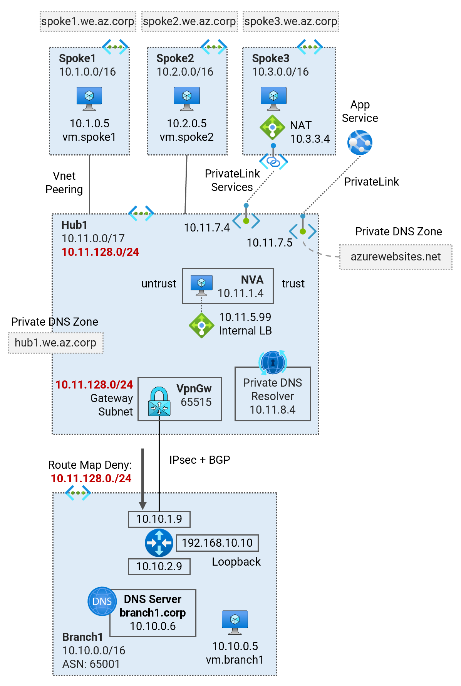

# Site-to-site VPN (Active-Active) over ExpressRoute <!-- omit from toc -->

## Lab: G10 <!-- omit from toc -->

- [Overview](#overview)
- [Prerequisites](#prerequisites)
- [Deploy the Lab](#deploy-the-lab)
- [Branch1 NVA (Cisco)](#branch1-nva-cisco)
- [Branch1 VM](#branch1-vm)
- [Spoke1 VM](#spoke1-vm)
- [Hub1 NVA](#hub1-nva)
- [ExpressRoute Circuits](#expressroute-circuits)
- [Gateway BGP Peers](#gateway-bgp-peers)
- [Gateway Route Tables](#gateway-route-tables)
- [Troubleshooting](#troubleshooting)
- [Cleanup](#cleanup)

## Overview

This lab deploys a single region hub and spoke topology to demonstrate IPsec over ExpressRoute to an on-premises branch location. Megaport is used as the ExpressRoute provider.

Related articles and documentation:
* [Lab - Virtual WAN Scenario: IPsec VPN over ER](https://github.com/dmauser/azure-virtualwan/tree/main/vpn-over-er)
* [Configure a Site-to-Site VPN connection over ExpressRoute private peering](https://learn.microsoft.com/en-us/azure/vpn-gateway/site-to-site-vpn-private-peering)

  

## Prerequisites

Ensure you meet all requirements in the [prerequisites](../../prerequisites/) before proceeding.

> **NOTE**: You need to have an active [megaport](https://www.megaport.com/) account. You will need to supply the megaport credentials in order to deploy the lab:
* `megaport_access_key`
* `megaport_secret_key`

## Deploy the Lab

1. Clone the Git Repository for the Labs

   ```sh
   git clone https://github.com/kaysalawu/azure-network-terraform.git
   ```

2. Navigate to the lab directory

   ```sh
   cd azure-network-terraform/4-general/11-er-traffic-collector-rate-limit
   ```

3. Run the following terraform commands and type ***yes*** at the prompt:

   ```sh
   terraform init
   terraform plan
   terraform apply -parallelism=50
   ```

## Branch1 NVA (Cisco)

### Route table <!-- omit in toc -->

```sh
G10-branch1-nva#show ip route
...
Gateway of last resort is 10.10.1.1 to network 0.0.0.0

S*    0.0.0.0/0 [1/0] via 10.10.1.1
      10.0.0.0/8 is variably subnetted, 14 subnets, 5 masks
B        10.1.0.0/16 [20/0] via 10.11.128.14, 14:31:54
B        10.2.0.0/16 [20/0] via 10.11.128.14, 14:31:54
S        10.10.0.0/24 [1/0] via 10.10.2.1
C        10.10.1.0/24 is directly connected, GigabitEthernet1
L        10.10.1.9/32 is directly connected, GigabitEthernet1
C        10.10.2.0/24 is directly connected, GigabitEthernet2
L        10.10.2.9/32 is directly connected, GigabitEthernet2
C        10.10.10.0/30 is directly connected, Tunnel0
L        10.10.10.1/32 is directly connected, Tunnel0
C        10.10.10.4/30 is directly connected, Tunnel1
L        10.10.10.5/32 is directly connected, Tunnel1
B        10.11.0.0/17 [20/0] via 10.11.128.14, 14:31:54
S        10.11.128.14/32 is directly connected, Tunnel0
S        10.11.128.15/32 is directly connected, Tunnel1
      168.63.0.0/32 is subnetted, 1 subnets
S        168.63.129.16 [254/0] via 10.10.1.1
      169.254.0.0/32 is subnetted, 1 subnets
S        169.254.169.254 [254/0] via 10.10.1.1
      192.168.10.0/32 is subnetted, 1 subnets
C        192.168.10.10 is directly connected, Loopback0
```

### BGP table <!-- omit in toc -->

```sh
G10-branch1-nva#show ip bgp
BGP table version is 5, local router ID is 192.168.10.10
Status codes: s suppressed, d damped, h history, * valid, > best, i - internal,
              r RIB-failure, S Stale, m multipath, b backup-path, f RT-Filter,
              x best-external, a additional-path, c RIB-compressed,
              t secondary path, L long-lived-stale,
Origin codes: i - IGP, e - EGP, ? - incomplete
RPKI validation codes: V valid, I invalid, N Not found

     Network          Next Hop            Metric LocPrf Weight Path
 *    10.1.0.0/16      10.11.128.15                           0 65515 i
 *>                    10.11.128.14                           0 65515 i
 *    10.2.0.0/16      10.11.128.15                           0 65515 i
 *>                    10.11.128.14                           0 65515 i
 *>   10.10.0.0/24     10.10.2.1                0         32768 i
 *    10.11.0.0/17     10.11.128.15                           0 65515 i
 *>                    10.11.128.14                           0 65515 i
```

We can see that the inbound route map filtered out the Azure hub gateway subnet **10.11.128.0/24**. Without the route map, once the IPsec BGP tunnels is up, the gateway subnet will be advertised via BGP. As a result, the NVA will attempt to establish IPsec tunnel over this route rather than through the ExpressRoute underlay reachable via the 0.0.0.0/0 static route.

The other hub subnets **10.11.0.0/17** are advertised because we need to reach resources like VMs and PrivateLink endpoints in the hub.

### Interfaces <!-- omit in toc -->

```sh
G10-branch1-nva#show ip int br
Interface              IP-Address      OK? Method Status                Protocol
GigabitEthernet1       10.10.1.9       YES DHCP   up                    up
GigabitEthernet2       10.10.2.9       YES DHCP   up                    up
Loopback0              192.168.10.10   YES TFTP   up                    up
Tunnel0                10.10.10.1      YES TFTP   up                    up
Tunnel1                10.10.10.5      YES TFTP   up                    up
Tunnel2                10.10.10.9      YES TFTP   up                    down
VirtualPortGroup0      192.168.35.101  YES TFTP   up                    up
```

### Advertised routes <!-- omit in toc -->

```sh
G10-branch1-nva#show ip bgp neighbors 10.11.128.14 advertised-routes
BGP table version is 5, local router ID is 192.168.10.10
Status codes: s suppressed, d damped, h history, * valid, > best, i - internal,
              r RIB-failure, S Stale, m multipath, b backup-path, f RT-Filter,
              x best-external, a additional-path, c RIB-compressed,
              t secondary path, L long-lived-stale,
Origin codes: i - IGP, e - EGP, ? - incomplete
RPKI validation codes: V valid, I invalid, N Not found

     Network          Next Hop            Metric LocPrf Weight Path
 *>   10.1.0.0/16      10.11.128.14                           0 65515 i
 *>   10.2.0.0/16      10.11.128.14                           0 65515 i
 *>   10.10.0.0/24     10.10.2.1                0         32768 i
 *>   10.11.0.0/17     10.11.128.14                           0 65515 i
```

## Branch1 VM

### Curl DNS <!-- omit in toc -->

```sh
azureuser@vm:~$ curl-dns

 curl dns ...

200 (0.020977s) - 10.10.0.5 - vm.branch1.corp
200 (0.585441s) - 10.11.0.5 - vm.hub1.eu.az.corp
200 (0.547891s) - 10.11.7.4 - spoke3.p.hub1.eu.az.corp
200 (0.552618s) - 10.1.0.5 - vm.spoke1.eu.az.corp
200 (0.564752s) - 10.2.0.5 - vm.spoke2.eu.az.corp
000 (2.001149s) -  - vm.spoke3.eu.az.corp
200 (0.039254s) - 104.18.114.97 - icanhazip.com
200 (0.553922s) - 10.11.7.5 - g10-spoke3-d45e.azurewebsites.net
```

## Spoke1 VM

### Curl DNS <!-- omit in toc -->

```sh
azureuser@vm:~$ curl-dns

 curl dns ...

200 (0.564315s) - 10.10.0.5 - vm.branch1.corp
200 (0.020567s) - 10.11.0.5 - vm.hub1.eu.az.corp
200 (0.015678s) - 10.11.7.4 - spoke3.p.hub1.eu.az.corp
200 (0.026063s) - 10.1.0.5 - vm.spoke1.eu.az.corp
200 (0.023438s) - 10.2.0.5 - vm.spoke2.eu.az.corp
000 (2.000223s) -  - vm.spoke3.eu.az.corp
200 (0.025911s) - 104.18.114.97 - icanhazip.com
200 (0.023887s) - 10.11.7.5 - g10-spoke3-d45e.azurewebsites.net
```

### Effective routes <!-- omit in toc -->

```sh
Effective routes for G10-spoke1-vm-main-nic

Source    Prefix          State    NextHopType        NextHopIP
--------  --------------  -------  -----------------  -----------
Default   10.1.0.0/16     Active   VnetLocal
Default   10.11.0.0/17    Invalid  VNetPeering
Default   10.11.128.0/24  Invalid  VNetPeering
Default   0.0.0.0/0       Invalid  Internet
User      0.0.0.0/0       Active   VirtualAppliance   10.11.5.99
User      10.11.0.0/17    Active   VirtualAppliance   10.11.5.99
User      10.11.128.0/24  Active   VirtualAppliance   10.11.5.99
Default   10.11.7.4/32    Active   InterfaceEndpoint
Default   10.11.7.5/32    Active   InterfaceEndpoint
```

## Hub1 NVA

### Effective routes - Untrust <!-- omit in toc -->

```sh
Effective routes for G10-hub1-nva-untrust-nic

Source                 Prefix          State    NextHopType            NextHopIP
---------------------  --------------  -------  ---------------------  ------------
Default                10.11.0.0/17    Active   VnetLocal
Default                10.11.128.0/24  Active   VnetLocal
Default                10.1.0.0/16     Active   VNetPeering
Default                10.2.0.0/16     Active   VNetPeering
VirtualNetworkGateway  10.10.0.0/16    Active   VirtualNetworkGateway  10.20.88.110
VirtualNetworkGateway  172.16.0.0/30   Active   VirtualNetworkGateway  10.20.88.110
VirtualNetworkGateway  172.16.0.8/30   Active   VirtualNetworkGateway  10.20.88.110
VirtualNetworkGateway  10.10.0.0/24    Active   VirtualNetworkGateway  10.11.128.14
VirtualNetworkGateway  10.10.0.0/24    Active   VirtualNetworkGateway  10.11.128.15
Default                0.0.0.0/0       Active   Internet
Default                10.11.7.4/32    Active   InterfaceEndpoint
Default                10.11.7.5/32    Active   InterfaceEndpoint
```

## ExpressRoute Circuits

### Route tables <!-- omit in toc -->

```sh
10-s2s-over-er-active-active$ . ../../scripts/express-route/get_route_tables.sh G10RG

Resource group: G10RG


⏳ AzurePrivatePeering (Primary): branch1
LocPrf    Network         NextHop      Path         Weight
--------  --------------  -----------  -----------  --------
          10.1.0.0/16     172.16.0.1   64512 12076  0
          10.2.0.0/16     172.16.0.1   64512 12076  0
          10.10.0.0/16    10.10.5.12   65515        0
          10.10.0.0/16    10.10.5.13*  65515        0
          10.11.0.0/17    172.16.0.1   64512 12076  0
          10.11.128.0/24  172.16.0.1   64512 12076  0
          172.16.0.8/30   172.16.0.1   64512 ?      0

⏳ AzurePrivatePeering (Secondary): branch1
LocPrf    Network       NextHop      Path    Weight
--------  ------------  -----------  ------  --------
          10.10.0.0/16  10.10.5.12   65515   0
          10.10.0.0/16  10.10.5.13*  65515   0

⏳ AzurePrivatePeering (Primary): hub1
LocPrf    Network        NextHop        Path         Weight
--------  -------------  -------------  -----------  --------
          10.1.0.0/16    10.11.128.13   65515        0
          10.1.0.0/16    10.11.128.12*  65515        0
          10.2.0.0/16    10.11.128.13   65515        0
          10.2.0.0/16    10.11.128.12*  65515        0
          10.10.0.0/16   172.16.0.9     64512 12076  0
          10.11.0.0/17   10.11.128.13   65515        0
          10.11.0.0/17   10.11.128.12*  65515        0
          172.16.0.0/30  172.16.0.9     64512 ?      0

⏳ AzurePrivatePeering (Secondary): hub1
LocPrf    Network       NextHop        Path    Weight
--------  ------------  -------------  ------  --------
          10.1.0.0/16   10.11.128.13   65515   0
          10.1.0.0/16   10.11.128.12*  65515   0
          10.2.0.0/16   10.11.128.13   65515   0
          10.2.0.0/16   10.11.128.12*  65515   0
          10.11.0.0/17  10.11.128.13   65515   0
          10.11.0.0/17  10.11.128.12*  65515   0
⭐ Done!
```

## Gateway BGP Peers

```sh
10-s2s-over-er-active-active$ . ../../scripts/vnet-gateway/get_bgp_peer_status.sh g10rg

Resource group: g10rg

Gateway: G10-branch1-ergw
Route tables:
Neighbor    ASN    LocalAddress    RoutesReceived    State
----------  -----  --------------  ----------------  ---------
10.10.5.4   12076  10.10.5.12      6                 Connected
10.10.5.5   12076  10.10.5.12      0                 Connected

Gateway: G10-hub1-ergw
Route tables:
Neighbor      ASN    LocalAddress    RoutesReceived    State
------------  -----  --------------  ----------------  ---------
10.11.128.6   12076  10.11.128.12    3                 Connected
10.11.128.7   12076  10.11.128.12    0                 Connected
10.11.128.14  65515  10.11.128.12    1                 Connected
10.11.128.15  65515  10.11.128.12    1                 Connected

Gateway: G10-hub1-vpngw
Route tables:
Neighbor       ASN    LocalAddress    RoutesReceived    State
-------------  -----  --------------  ----------------  ---------
192.168.10.10  65001  10.11.128.14    1                 Connected
10.11.128.13   65515  10.11.128.14    4                 Connected
10.11.128.12   65515  10.11.128.14    4                 Connected
10.11.128.14   65515  10.11.128.14    0                 Unknown
10.11.128.15   65515  10.11.128.14    2                 Connected
192.168.10.10  65001  10.11.128.15    1                 Connected
10.11.128.13   65515  10.11.128.15    4                 Connected
10.11.128.12   65515  10.11.128.15    4                 Connected
10.11.128.14   65515  10.11.128.15    2                 Connected
10.11.128.15   65515  10.11.128.15    0                 Unknown
```

## Gateway Route Tables

```sh
10-s2s-over-er-active-active$ . ../../scripts/vnet-gateway/get_route_tables.sh g10rg

Resource group: g10rg

Gateway: G10-branch1-ergw
Route tables:
Network         NextHop    Origin    SourcePeer    AsPath             Weight
--------------  ---------  --------  ------------  -----------------  --------
10.10.0.0/16               Network   10.10.5.12                       32768
10.1.0.0/16     10.10.5.4  EBgp      10.10.5.4     12076-64512-12076  32769
10.2.0.0/16     10.10.5.4  EBgp      10.10.5.4     12076-64512-12076  32769
10.11.0.0/17    10.10.5.4  EBgp      10.10.5.4     12076-64512-12076  32769
10.11.128.0/24  10.10.5.4  EBgp      10.10.5.4     12076-64512-12076  32769
172.16.0.0/30   10.10.5.4  EBgp      10.10.5.4     12076-64512        32769
172.16.0.8/30   10.10.5.4  EBgp      10.10.5.4     12076-64512        32769

Gateway: G10-hub1-ergw
Route tables:
Network         NextHop       Origin    SourcePeer    AsPath             Weight
--------------  ------------  --------  ------------  -----------------  --------
10.11.0.0/17                  Network   10.11.128.13                     32768
10.11.128.0/24                Network   10.11.128.13                     32768
10.1.0.0/16                   Network   10.11.128.13                     32768
10.2.0.0/16                   Network   10.11.128.13                     32768
10.10.0.0/24    10.11.128.14  IBgp      10.11.128.14  65001              32768
10.10.0.0/24    10.11.128.15  IBgp      10.11.128.15  65001              32768
10.10.0.0/16    10.11.128.6   EBgp      10.11.128.6   12076-64512-12076  32769
172.16.0.0/30   10.11.128.6   EBgp      10.11.128.6   12076-64512        32769
172.16.0.8/30   10.11.128.6   EBgp      10.11.128.6   12076-64512        32769

Gateway: G10-hub1-vpngw
Route tables:
Network           NextHop        Origin    SourcePeer     AsPath    Weight
----------------  -------------  --------  -------------  --------  --------
10.11.0.0/17      10.11.128.12   IBgp      10.11.128.12             32769
10.11.0.0/17      10.11.128.13   IBgp      10.11.128.13             32769
10.11.128.0/24    10.11.128.12   IBgp      10.11.128.12             32769
10.11.128.0/24    10.11.128.13   IBgp      10.11.128.13             32769
10.1.0.0/16       10.11.128.12   IBgp      10.11.128.12             32769
10.1.0.0/16       10.11.128.13   IBgp      10.11.128.13             32769
10.2.0.0/16       10.11.128.12   IBgp      10.11.128.12             32769
10.2.0.0/16       10.11.128.13   IBgp      10.11.128.13             32769
192.168.10.10/32                 Network   10.11.128.14             32768
192.168.10.10/32  10.11.128.15   IBgp      10.11.128.15             32768
10.10.0.0/24      192.168.10.10  EBgp      192.168.10.10  65001     32768
10.10.0.0/24      10.11.128.15   IBgp      10.11.128.15   65001     32768
10.11.0.0/17                     Network   10.11.128.14             32768
10.11.128.0/24                   Network   10.11.128.14             32768
10.1.0.0/16                      Network   10.11.128.14             32768
10.2.0.0/16                      Network   10.11.128.14             32768
10.11.0.0/17      10.11.128.12   IBgp      10.11.128.12             32769
10.11.0.0/17      10.11.128.13   IBgp      10.11.128.13             32769
10.11.128.0/24    10.11.128.12   IBgp      10.11.128.12             32769
10.11.128.0/24    10.11.128.13   IBgp      10.11.128.13             32769
10.1.0.0/16       10.11.128.12   IBgp      10.11.128.12             32769
10.1.0.0/16       10.11.128.13   IBgp      10.11.128.13             32769
10.2.0.0/16       10.11.128.12   IBgp      10.11.128.12             32769
10.2.0.0/16       10.11.128.13   IBgp      10.11.128.13             32769
192.168.10.10/32                 Network   10.11.128.15             32768
192.168.10.10/32  10.11.128.14   IBgp      10.11.128.14             32768
10.10.0.0/24      192.168.10.10  EBgp      192.168.10.10  65001     32768
10.10.0.0/24      10.11.128.14   IBgp      10.11.128.14   65001     32768
10.11.0.0/17                     Network   10.11.128.15             32768
10.11.128.0/24                   Network   10.11.128.15             32768
10.1.0.0/16                      Network   10.11.128.15             32768
10.2.0.0/16                      Network   10.11.128.15             32768
```

## Troubleshooting

See the [troubleshooting](../../troubleshooting/) section for tips on how to resolve common issues that may occur during the deployment of the lab.

## Cleanup

1. (Optional) Navigate back to the lab directory (if you are not already there)

   ```sh
   cd azure-network-terraform/4-general/11-er-traffic-collector-rate-limit
   ```

2. In order to avoid terraform errors when re-deploying this lab, run a cleanup script to remove diagnostic settings that may not be removed after the resource group is deleted.

   ```sh
   bash ../../scripts/_cleanup.sh G10
   ```

3. Run script to delete private peerings on all express route circuits.

   ```sh
   bash ../../scripts/express-route/delete_private_peerings.sh G10RG
   ```

4. Delete the resource group to remove all resources installed.

   ```sh
   az group delete -g G10RG --no-wait
   ```

5. Delete terraform state files and other generated files.

   ```sh
   rm -rf .terraform*
   rm terraform.tfstate*
   ```
