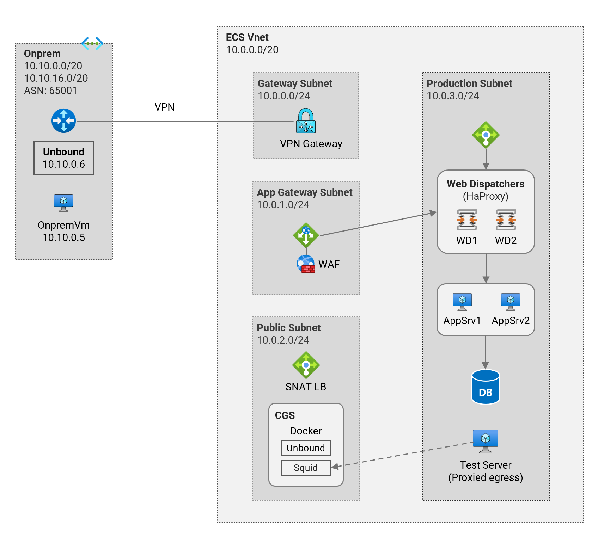
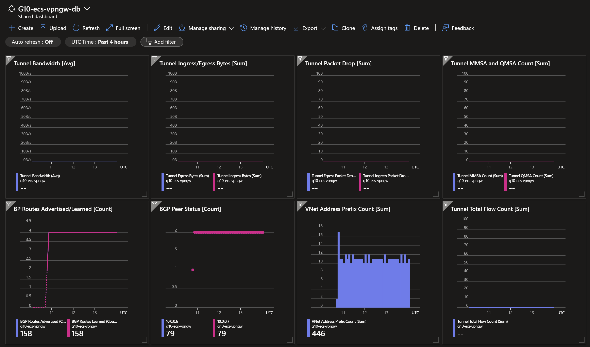
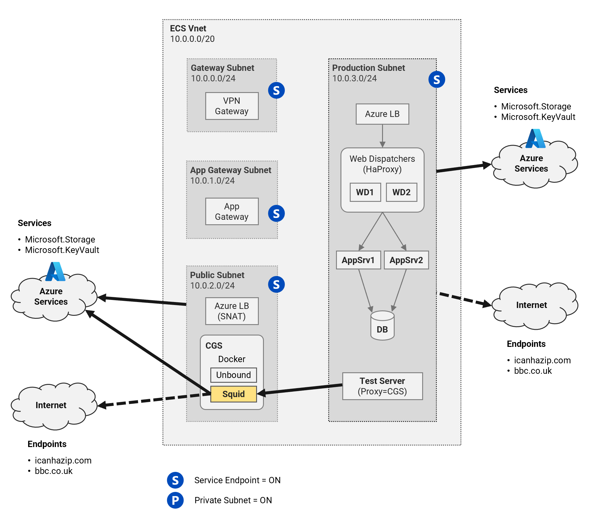

# Hub and Spoke - Single Region (NVA) <!-- omit from toc -->

## Lab: G10 <!-- omit from toc -->

Contents

- [Overview](#overview)
- [Prerequisites](#prerequisites)
- [Deploy the Lab](#deploy-the-lab)
- [Troubleshooting](#troubleshooting)
- [Outputs](#outputs)
- [Dashboards (Optional)](#dashboards-optional)
- [Data Egress Tests](#data-egress-tests)
  - [A. Default Outbound and Service Endpoints](#a-default-outbound-and-service-endpoints)
  - [B. Default Outbound and Service Tag UDR](#b-default-outbound-and-service-tag-udr)
  - [C. Default Outbound, Service Endpoints, and Service Tag UDR](#c-default-outbound-service-endpoints-and-service-tag-udr)
  - [D. Private Subnet and Service Endpoints](#d-private-subnet-and-service-endpoints)
  - [E. Private Subnet and Service Tag UDR](#e-private-subnet-and-service-tag-udr)
  - [F. Private Subnet, Service Endpoints, and Service Tag UDR](#f-private-subnet-service-endpoints-and-service-tag-udr)
  - [G. Mixed - Default Outbound and Private Subnet](#g-mixed---default-outbound-and-private-subnet)
- [Cleanup](#cleanup)

## Overview

This lab is a mock scenario for SAP RISE ECS (Enterprise Cloud Services) deployment in Azure. It aims to demonstrate the infrastructure and connectivity options available in a real SAP RISE ECS deployment.

> Note: This lab does not include any SAP workloads, databases, or the full set of network and security components required for a real SAP deployment. The lab just emulates the infrastructure, connectivity, and network security components.



These are the main components of the lab:
- **Vnet**: The simulated virtual network for the SAP RISE ECS deployment
- **Subnets**: There are four subnets in the ECS Vnet:
  - **GatewaySubnet**: For VPN and ExpressRoute gateways
  - **AppGatewaySubnet**: For the Azure Application Gateway
  - **PublicSubnet**: For the resources that require outbound internet access
    - Customer Gateway Server (CGS): Linux VM running docker containers [unbound](https://en.wikipedia.org/wiki/Unbound_(DNS_server)) DNS, [Squid](https://en.wikipedia.org/wiki/Squid_(software)) forward proxy etc.
  - **ProductionSubnet**: For the simulated SAP production workloads
    - Simulated [Web dispatchers](https://help.sap.com/doc/saphelp_nw74/7.4.16/en-us/48/8fe37933114e6fe10000000a421937/frameset.htm) (HaProxy)
    - Simulated App servers (NodeJS)
    - Simulated Database servers (MongoDB)

## Prerequisites

Ensure you meet all requirements in the [prerequisites](../../prerequisites/README.md) before proceeding.

## Deploy the Lab

1. Clone the Git Repository for the Labs

   ```sh
   git clone https://github.com/kaysalawu/azure-network-terraform.git
   ```

2. Navigate to the lab directory

   ```sh
   cd azure-network-terraform/4-general/10-sap-mock-lab
   ```

3. Run the following terraform commands and type ***yes*** at the prompt:

   ```sh
   terraform init
   terraform plan
   terraform apply -parallelism=50
   ```

## Troubleshooting

See the [troubleshooting](../../troubleshooting/README.md) section for tips on how to resolve common issues that may occur during the deployment of the lab.

## Outputs

The table below shows the auto-generated output files from the lab. They are located in the `output` directory.

| Item    | Description  | Location |
|--------|--------|--------|
| IP ranges and DNS | IP ranges and DNS hostname values | [output/values.md](./output/values.md) |
| Onprem DNS | Authoritative DNS | [output/onpremDns.sh](./output/onpremDns.sh) |
| Onprem NVA | Linux Strongswan + FRR configuration | [output/onpremNva.sh](./output/onpremNva.sh) |
| Web server | Python Flask web server, test scripts | [output/server.sh](./output/server.sh) |
||||

## Dashboards (Optional)

This lab contains a number of pre-configured dashboards for monitoring gateways, VPN gateways, and Azure Firewall. To deploy the dashboards, set `enable_diagnostics = true` in the [`main.tf`](./02-main.tf) file. Then run `terraform apply` to update the deployment.

<details>

<summary>Sample Dashboards</summary>

To view the dashboards, follow the steps below:

1. From the Azure portal menu, select **Dashboard hub**.

2. Under **Browse**, select **Shared dashboards**.

3. Select the dashboard you want to view.

4. Click on a dashboard under **Go to dashboard** column.

   Sample dashboard for VPN gateway in ***ecs***.

    

    </details>
<p>

## Data Egress Tests

Each virtual machine is pre-configured with a shell [script](../../scripts/server.sh) to run various types of network reachability tests. Serial console access has been configured for all virtual machines.

Login to any virtual machine via the [serial console](https://learn.microsoft.com/en-us/troubleshoot/azure/virtual-machines/serial-console-overview#access-serial-console-for-virtual-machines-via-azure-portal):

- On Azure portal select *Virtual machines*
- Select the virtual machine
- Under ***Help*** section, select ***Serial console*** and wait for a login prompt
- Enter the login credentials
  - username = ***azureuser***
  - password = ***Password123***
- You should now be in a shell session of the virtual machine.

Run the following tests from inside the serial console session.

### A. Default Outbound and Service Endpoints

Work in progress.



<table>
  <tr>
   <td rowspan="2" ><strong>Subnet</strong></td>
   <td rowspan="2" ><strong>Service Endpoint</strong></td>
   <td rowspan="2" ><strong>Private Subnet</strong></td>
   <td rowspan="2" ><strong>Service Tag UDR</strong></td>
   <td colspan="4" ><strong>Public IP Type</strong></td>
   <td rowspan="2" ><strong>Access to Internet?</strong></td>
   <td colspan="2" ><strong>Access to Azure Services?</strong></td>
  </tr>
  <tr>
   <td><strong>NAT GW</strong></td>
   <td><strong>LB SNAT</strong></td>
   <td><strong>Public IP</strong></td>
   <td><strong>Default</strong></td>
   <td><strong>Storage</strong></td>
   <td><strong>KeyVault</strong></td>
  </tr>
  <tr>
   <td>Production</td><td>ON</td><td>OFF</td><td>X</td><td>Y</td><td>Z</td><td>A</td><td>Y</td><td>N</td><td>NA<td>NA</td>
  </tr>
  <tr>
   <td>Public</td><td>ON</td><td>OFF</td><td>X</td><td>Y</td><td>Z</td><td>A</td><td>Y</td><td>N</td><td>NA<td>NA</td>
  </tr>
  <tr>
   <td>Gateway</td><td>ON</td><td>OFF</td><td>X</td><td>Y</td><td>Z</td><td>A</td><td>Y</td><td>N</td><td>NA<td>NA</td>
  </tr>
  <tr>
   <td>App Gateway</td><td>ON</td><td>OFF</td><td>X</td><td>Y</td><td>Z</td><td>A</td><td>Y</td><td>N</td><td>NA<td>NA</td>
  </tr>
</table>

### B. Default Outbound and Service Tag UDR


<table>
  <tr>
   <td rowspan="2" ><strong>Subnet</strong></td>
   <td rowspan="2" ><strong>Service Endpoint</strong></td>
   <td rowspan="2" ><strong>Private Subnet</strong></td>
   <td rowspan="2" ><strong>Service Tag UDR</strong></td>
   <td colspan="4" ><strong>Public IP Type</strong></td>
   <td rowspan="2" ><strong>Access to Internet?</strong></td>
   <td colspan="2" ><strong>Access to Azure Services?</strong></td>
  </tr>
  <tr>
   <td><strong>NAT GW</strong></td>
   <td><strong>LB SNAT</strong></td>
   <td><strong>Public IP</strong></td>
   <td><strong>Default</strong></td>
   <td><strong>Storage</strong></td>
   <td><strong>KeyVault</strong></td>
  </tr>
  <tr>
   <td>Production</td><td>ON</td><td>OFF</td><td>X</td><td>Y</td><td>Z</td><td>A</td><td>Y</td><td>N</td><td>NA<td>NA</td>
  </tr>
  <tr>
   <td>Public</td><td>ON</td><td>OFF</td><td>X</td><td>Y</td><td>Z</td><td>A</td><td>Y</td><td>N</td><td>NA<td>NA</td>
  </tr>
  <tr>
   <td>Gateway</td><td>ON</td><td>OFF</td><td>X</td><td>Y</td><td>Z</td><td>A</td><td>Y</td><td>N</td><td>NA<td>NA</td>
  </tr>
  <tr>
   <td>App Gateway</td><td>ON</td><td>OFF</td><td>X</td><td>Y</td><td>Z</td><td>A</td><td>Y</td><td>N</td><td>NA<td>NA</td>
  </tr>
</table>

### C. Default Outbound, Service Endpoints, and Service Tag UDR


<table>
  <tr>
   <td rowspan="2" ><strong>Subnet</strong></td>
   <td rowspan="2" ><strong>Service Endpoint</strong></td>
   <td rowspan="2" ><strong>Private Subnet</strong></td>
   <td rowspan="2" ><strong>Service Tag UDR</strong></td>
   <td colspan="4" ><strong>Public IP Type</strong></td>
   <td rowspan="2" ><strong>Access to Internet?</strong></td>
   <td colspan="2" ><strong>Access to Azure Services?</strong></td>
  </tr>
  <tr>
   <td><strong>NAT GW</strong></td>
   <td><strong>LB SNAT</strong></td>
   <td><strong>Public IP</strong></td>
   <td><strong>Default</strong></td>
   <td><strong>Storage</strong></td>
   <td><strong>KeyVault</strong></td>
  </tr>
  <tr>
   <td>Production</td><td>ON</td><td>OFF</td><td>X</td><td>Y</td><td>Z</td><td>A</td><td>Y</td><td>N</td><td>NA<td>NA</td>
  </tr>
  <tr>
   <td>Public</td><td>ON</td><td>OFF</td><td>X</td><td>Y</td><td>Z</td><td>A</td><td>Y</td><td>N</td><td>NA<td>NA</td>
  </tr>
  <tr>
   <td>Gateway</td><td>ON</td><td>OFF</td><td>X</td><td>Y</td><td>Z</td><td>A</td><td>Y</td><td>N</td><td>NA<td>NA</td>
  </tr>
  <tr>
   <td>App Gateway</td><td>ON</td><td>OFF</td><td>X</td><td>Y</td><td>Z</td><td>A</td><td>Y</td><td>N</td><td>NA<td>NA</td>
  </tr>
</table>

### D. Private Subnet and Service Endpoints


<table>
  <tr>
   <td rowspan="2" ><strong>Subnet</strong></td>
   <td rowspan="2" ><strong>Service Endpoint</strong></td>
   <td rowspan="2" ><strong>Private Subnet</strong></td>
   <td rowspan="2" ><strong>Service Tag UDR</strong></td>
   <td colspan="4" ><strong>Public IP Type</strong></td>
   <td rowspan="2" ><strong>Access to Internet?</strong></td>
   <td colspan="2" ><strong>Access to Azure Services?</strong></td>
  </tr>
  <tr>
   <td><strong>NAT GW</strong></td>
   <td><strong>LB SNAT</strong></td>
   <td><strong>Public IP</strong></td>
   <td><strong>Default</strong></td>
   <td><strong>Storage</strong></td>
   <td><strong>KeyVault</strong></td>
  </tr>
  <tr>
   <td>Production</td><td>ON</td><td>OFF</td><td>X</td><td>Y</td><td>Z</td><td>A</td><td>Y</td><td>N</td><td>NA<td>NA</td>
  </tr>
  <tr>
   <td>Public</td><td>ON</td><td>OFF</td><td>X</td><td>Y</td><td>Z</td><td>A</td><td>Y</td><td>N</td><td>NA<td>NA</td>
  </tr>
  <tr>
   <td>Gateway</td><td>ON</td><td>OFF</td><td>X</td><td>Y</td><td>Z</td><td>A</td><td>Y</td><td>N</td><td>NA<td>NA</td>
  </tr>
  <tr>
   <td>App Gateway</td><td>ON</td><td>OFF</td><td>X</td><td>Y</td><td>Z</td><td>A</td><td>Y</td><td>N</td><td>NA<td>NA</td>
  </tr>
</table>

### E. Private Subnet and Service Tag UDR


<table>
  <tr>
   <td rowspan="2" ><strong>Subnet</strong></td>
   <td rowspan="2" ><strong>Service Endpoint</strong></td>
   <td rowspan="2" ><strong>Private Subnet</strong></td>
   <td rowspan="2" ><strong>Service Tag UDR</strong></td>
   <td colspan="4" ><strong>Public IP Type</strong></td>
   <td rowspan="2" ><strong>Access to Internet?</strong></td>
   <td colspan="2" ><strong>Access to Azure Services?</strong></td>
  </tr>
  <tr>
   <td><strong>NAT GW</strong></td>
   <td><strong>LB SNAT</strong></td>
   <td><strong>Public IP</strong></td>
   <td><strong>Default</strong></td>
   <td><strong>Storage</strong></td>
   <td><strong>KeyVault</strong></td>
  </tr>
  <tr>
   <td>Production</td><td>ON</td><td>OFF</td><td>X</td><td>Y</td><td>Z</td><td>A</td><td>Y</td><td>N</td><td>NA<td>NA</td>
  </tr>
  <tr>
   <td>Public</td><td>ON</td><td>OFF</td><td>X</td><td>Y</td><td>Z</td><td>A</td><td>Y</td><td>N</td><td>NA<td>NA</td>
  </tr>
  <tr>
   <td>Gateway</td><td>ON</td><td>OFF</td><td>X</td><td>Y</td><td>Z</td><td>A</td><td>Y</td><td>N</td><td>NA<td>NA</td>
  </tr>
  <tr>
   <td>App Gateway</td><td>ON</td><td>OFF</td><td>X</td><td>Y</td><td>Z</td><td>A</td><td>Y</td><td>N</td><td>NA<td>NA</td>
  </tr>
</table>

### F. Private Subnet, Service Endpoints, and Service Tag UDR


<table>
  <tr>
   <td rowspan="2" ><strong>Subnet</strong></td>
   <td rowspan="2" ><strong>Service Endpoint</strong></td>
   <td rowspan="2" ><strong>Private Subnet</strong></td>
   <td rowspan="2" ><strong>Service Tag UDR</strong></td>
   <td colspan="4" ><strong>Public IP Type</strong></td>
   <td rowspan="2" ><strong>Access to Internet?</strong></td>
   <td colspan="2" ><strong>Access to Azure Services?</strong></td>
  </tr>
  <tr>
   <td><strong>NAT GW</strong></td>
   <td><strong>LB SNAT</strong></td>
   <td><strong>Public IP</strong></td>
   <td><strong>Default</strong></td>
   <td><strong>Storage</strong></td>
   <td><strong>KeyVault</strong></td>
  </tr>
  <tr>
   <td>Production</td><td>ON</td><td>OFF</td><td>X</td><td>Y</td><td>Z</td><td>A</td><td>Y</td><td>N</td><td>NA<td>NA</td>
  </tr>
  <tr>
   <td>Public</td><td>ON</td><td>OFF</td><td>X</td><td>Y</td><td>Z</td><td>A</td><td>Y</td><td>N</td><td>NA<td>NA</td>
  </tr>
  <tr>
   <td>Gateway</td><td>ON</td><td>OFF</td><td>X</td><td>Y</td><td>Z</td><td>A</td><td>Y</td><td>N</td><td>NA<td>NA</td>
  </tr>
  <tr>
   <td>App Gateway</td><td>ON</td><td>OFF</td><td>X</td><td>Y</td><td>Z</td><td>A</td><td>Y</td><td>N</td><td>NA<td>NA</td>
  </tr>
</table>

### G. Mixed - Default Outbound and Private Subnet

<table>
  <tr>
   <td rowspan="2" ><strong>Subnet</strong></td>
   <td rowspan="2" ><strong>Service Endpoint</strong></td>
   <td rowspan="2" ><strong>Private Subnet</strong></td>
   <td rowspan="2" ><strong>Service Tag UDR</strong></td>
   <td colspan="4" ><strong>Public IP Type</strong></td>
   <td rowspan="2" ><strong>Access to Internet?</strong></td>
   <td colspan="2" ><strong>Access to Azure Services?</strong></td>
  </tr>
  <tr>
   <td><strong>NAT GW</strong></td>
   <td><strong>LB SNAT</strong></td>
   <td><strong>Public IP</strong></td>
   <td><strong>Default</strong></td>
   <td><strong>Storage</strong></td>
   <td><strong>KeyVault</strong></td>
  </tr>
  <tr>
   <td>Production</td><td>ON</td><td>OFF</td><td>X</td><td>Y</td><td>Z</td><td>A</td><td>Y</td><td>N</td><td>NA<td>NA</td>
  </tr>
  <tr>
   <td>Public</td><td>ON</td><td>OFF</td><td>X</td><td>Y</td><td>Z</td><td>A</td><td>Y</td><td>N</td><td>NA<td>NA</td>
  </tr>
  <tr>
   <td>Gateway</td><td>ON</td><td>OFF</td><td>X</td><td>Y</td><td>Z</td><td>A</td><td>Y</td><td>N</td><td>NA<td>NA</td>
  </tr>
  <tr>
   <td>App Gateway</td><td>ON</td><td>OFF</td><td>X</td><td>Y</td><td>Z</td><td>A</td><td>Y</td><td>N</td><td>NA<td>NA</td>
  </tr>
</table>


## Cleanup

1\. (Optional) Navigate back to the lab directory (if you are not already there)

```sh
cd azure-network-terraform/4-general/10-sap-mock-lab
```

2\. (Optional) This is not required if `enable_diagnostics = false` in the [`main.tf`](./02-main.tf). If you deployed the lab with `enable_diagnostics = true`, in order to avoid terraform errors when re-deploying this lab, run a cleanup script to remove diagnostic settings that are not removed after the resource group is deleted.

```sh
bash ../../scripts/_cleanup.sh G10
```

<details>

<summary>Sample output</summary>

```sh
3-hub-spoke-nva-single-region$    bash ../../scripts/_cleanup.sh G10

Resource group: G10RG

⏳ Checking for diagnostic settings on resources in G10RG ...
➜  Checking firewall ...
➜  Checking vnet gateway ...
    ❌ Deleting: diag setting [G10-ecs-vpngw-diag] for vnet gateway [G10-ecs-vpngw] ...
➜  Checking vpn gateway ...
➜  Checking er gateway ...
➜  Checking app gateway ...
⏳ Checking for azure policies in G10RG ...
Done!
```

</details>
<p>

3\. Delete the resource group to remove all resources installed.

```sh
az group delete -g G10RG --no-wait
```

4\. Delete terraform state files and other generated files.

```sh
rm -rf .terraform*
rm terraform.tfstate*
```
