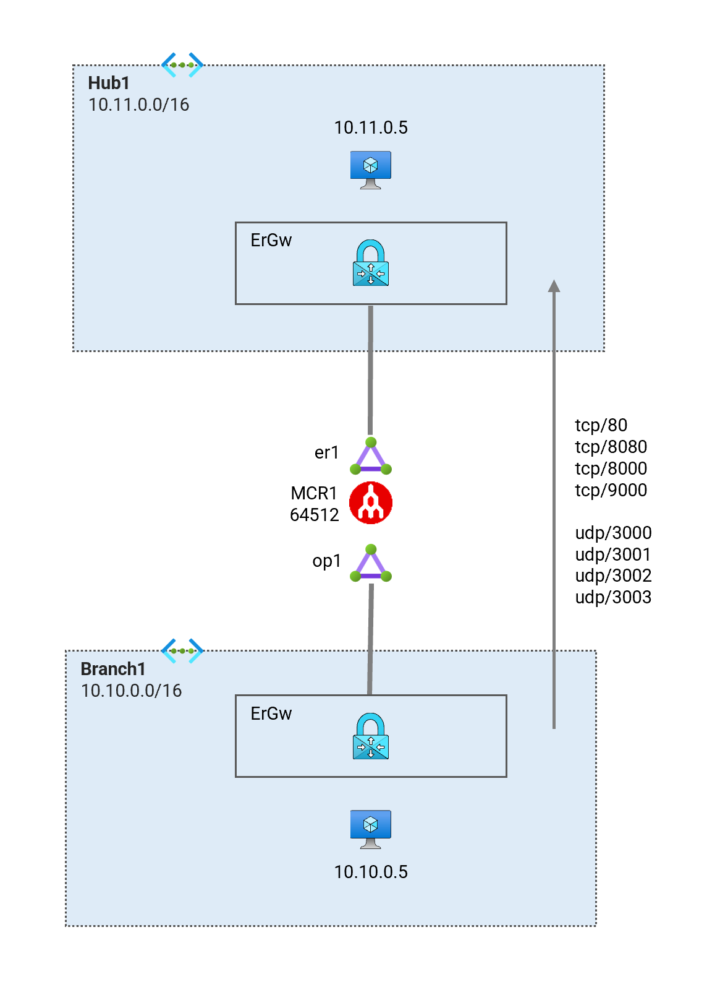

# Megaport ExpressRoute Circuit <!-- omit from toc -->

## Lab: G11 <!-- omit from toc -->

- [Test the Lab](#test-the-lab)
  - [Troubleshooting](#troubleshooting)
  - [Cleanup](#cleanup)

## Overview

This lab deploys a hub Vnet and a branch Vnet to demonstrate ExpressRoute traffic collector.

Related articles and documentation:
* [Optimize ExpressRoute Routing](https://learn.microsoft.com/en-us/azure/expressroute/expressroute-optimize-routing)
* [How can I ensure high availability for a virtual network connected to ExpressRoute?](https://learn.microsoft.com/en-us/azure/expressroute/expressroute-faqs#how-can-i-ensure-high-availability-for-a-virtual-network-connected-to-expressroute)

  

## Prerequisites

Ensure you meet all requirements in the [prerequisites](../../prerequisites/README.md) before proceeding.

You also need to have an active megaport account. You will need to supply the megaport credentials in order to deploy the lab:
* `megaport_access_key`
* `megaport_secret_key`

## Deploy the Lab

1. Clone the Git Repository for the Labs

   ```sh
   git clone https://github.com/kaysalawu/azure-network-terraform.git
   ```

2. Navigate to the lab directory

   ```sh
   cd azure-network-terraform/4-general/11-er-ecmp-privatelink-storage
   ```

3. Run the following terraform commands and type ***yes*** at the prompt:

   ```sh
   terraform init
   terraform plan
   terraform apply -parallelism=50
   ```

# Test the Lab

1. Login to the virtual machine `G11-hub1-vm` and `G11-branch1Vm` via the [serial console](https://learn.microsoft.com/en-us/troubleshoot/azure/virtual-machines/serial-console-overview#access-serial-console-for-virtual-machines-via-azure-portal):

   - On Azure portal select *Virtual machines*
   - Select each virtual machine `G11-hub1-vm`
   - Under ***Help*** section, select ***Serial console*** and wait for a login prompt
   - Enter the login credentials
     - username = ***azureuser***
     - password = ***Password123***
   - You should now be in a shell session `azureuser@vm:~$`

2. Run ping tests from `G11-hub1-vm` to `G11-branch1Vm` and vice versa.


## Troubleshooting

See the [troubleshooting](../../troubleshooting/README.md) section for tips on how to resolve common issues that may occur during the deployment of the lab.

## Cleanup

1. (Optional) Navigate back to the lab directory (if you are not already there)

   ```sh
   cd azure-network-terraform/4-general/11-er-ecmp-privatelink-storage
   ```

2. In order to avoid terraform errors when re-deploying this lab, run a cleanup script to remove diagnostic settings that may not be removed after the resource group is deleted.

   ```sh
   bash ../../scripts/_cleanup.sh G11
   ```

3. Delete the resource group to remove all resources installed.

   ```sh
   az group delete -g G11RG --no-wait
   ```

4. Delete terraform state files and other generated files.

   ```sh
   rm -rf .terraform*
   rm terraform.tfstate*
   ```
