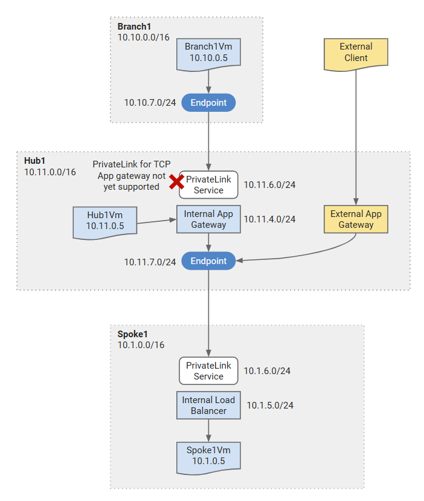

# Hub and Spoke - Dual Region (NVA) <!-- omit from toc -->

## Lab: Hs14 <!-- omit from toc -->

Contents

- [Overview](#overview)
- [Prerequisites](#prerequisites)
- [Deploy the Lab](#deploy-the-lab)
- [Troubleshooting](#troubleshooting)
- [Testing](#testing)
- [Cleanup](#cleanup)

## Overview

Private Link for TCP proxy application gateway is not yet supported. This lab creates the resources required to test the scenario when support becomes available.


<p>

## Prerequisites

Ensure you meet all requirements in the [prerequisites](../../prerequisites/README.md) before proceeding.

## Deploy the Lab

1. Clone the Git Repository for the Labs

   ```sh
   git clone https://github.com/kaysalawu/azure-network-terraform.git
   ```

2. Navigate to the lab directory

   ```sh
   cd azure-network-terraform/4-general/11-privatelink-chain
   ```

3. Run the following terraform commands and type ***yes*** at the prompt:

   ```sh
   terraform init
   terraform plan
   terraform apply -parallelism=50
   ```

## Troubleshooting

See the [troubleshooting](../../troubleshooting/README.md) section for tips on how to resolve common issues that may occur during the deployment of the lab.

## Testing

As mentioned earlier, Private Link for TCP proxy application gateway is not yet supported. This lab creates the resources required to test the scenario when support becomes available.

## Cleanup

1\. (Optional) Navigate back to the lab directory (if you are not already there)

```sh
cd azure-network-terraform/4-general/11-privatelink-chain
```

2\. (Optional) This is not required if `enable_diagnostics = false` in the [`02-main.tf`](./02-main.tf). If you deployed the lab with `enable_diagnostics = true`, in order to avoid terraform errors when re-deploying this lab, run a cleanup script to remove diagnostic settings that are not removed after the resource group is deleted.

```sh
bash ../../scripts/_cleanup.sh Lab11_PrivateLink_RG
```

<details>

<summary>Sample output</summary>

```sh
11-privatelink-chain$ bash ../../scripts/_cleanup.sh Lab11_PrivateLink_RG

Resource group: Lab11_PrivateLink_RG

⏳ Checking for diagnostic settings on resources in Lab11_PrivateLink_RG ...
➜  Checking firewall ...
➜  Checking vnet gateway ...
➜  Checking vpn gateway ...
➜  Checking er gateway ...
➜  Checking app gateway ...
➜  Checking NVA vm extensions ...
⏳ Checking for azure policies in Lab11_PrivateLink_RG ...
➜  Checking express route private peerings ...
Done!
```

</details>
<p>

3\. Delete the resource group to remove all resources installed.

```sh
az group delete -g Lab11_PrivateLink_RG --no-wait
```

4\. Delete terraform state files and other generated files.

```sh
rm -rf .terraform*
rm terraform.tfstate*
```
