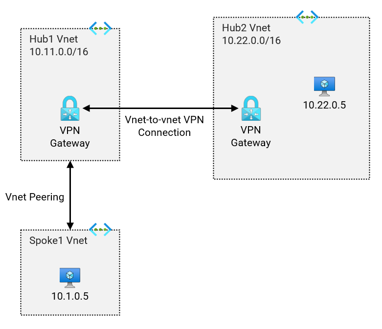

# Hub and Spoke - Single Region (NVA) <!-- omit from toc -->

## Lab: Lab13 <!-- omit from toc -->

Contents

- [Overview](#overview)
- [Prerequisites](#prerequisites)
- [Deploy the Lab](#deploy-the-lab)
- [Troubleshooting](#troubleshooting)
- [Outputs](#outputs)
- [Dashboards (Optional)](#dashboards-optional)
- [Testing](#testing)
  - [1. Ping IP](#1-ping-ip)
  - [2. Verify Effective Routes in Spoke1](#2-verify-effective-routes-in-spoke1)
- [Cleanup](#cleanup)

## Overview

This lab deploys a single-region Hub and Spoke Vnet topology demontrating the use of Vnet-to-vnet VPN connection. This use case assumed that `hub1` is a simple Vnet that uses the VPN gateway as the transit device to route traffic to `hub2`.



## Prerequisites

Ensure you meet all requirements in the [prerequisites](../../prerequisites/README.md) before proceeding.

## Deploy the Lab

1. Clone the Git Repository for the Labs

   ```sh
   git clone https://github.com/kaysalawu/azure-network-terraform.git
   ```

2. Navigate to the lab directory

   ```sh
   cd azure-network-terraform/4-general/11-vnet-to-vnet-vpn
   ```
3. (Optional) If you wannt to enable additional features such as IPv6, Vnet flow logs and logging set the following variables to `true` in the [`main.tf`](./02-main.tf) file.

   | Variable | Description | Default | Link |
   |----------|-------------|---------|------|
   | enable_diagnostics | Enable Azure Monitor diagnostics | false | [main.tf](./02-main.tf#L9) |
   | enable_ipv6 | Enable IPv6 on all supported resources | false | [main.tf](./02-main.tf#L10) |
   | enable_flow_logs | Enable Vnet flow logs in the Vnet hubs | false | [main.tf](./02-main.tf#L11) |
   ||||

4. Run the following terraform commands and type ***yes*** at the prompt:

   ```sh
   terraform init
   terraform plan
   terraform apply -parallelism=50
   ```

## Troubleshooting

See the [troubleshooting](../../troubleshooting/README.md) section for tips on how to resolve common issues that may occur during the deployment of the lab.

## Outputs

The table below shows the auto-generated output files from the lab. They are located in the `output` directory.

| Item    | Description  | Location |
|--------|--------|--------|
| Web server | Python Flask web server, test scripts | [output/server.sh](./output/server.sh) |
||||

## Dashboards (Optional)

This lab contains a number of pre-configured dashboards for monitoring gateways, VPN gateways, and Azure Firewall. To deploy the dashboards, set `enable_diagnostics = true` in the [`main.tf`](./02-main.tf) file. Then run `terraform apply` to update the deployment.

<details>

<summary>Sample Dashboards</summary>

To view the dashboards, follow the steps below:

1. From the Azure portal menu, select **Dashboard hub**.

2. Under **Browse**, select **Shared dashboards**.

3. Select the dashboard you want to view.

4. Click on a dashboard under **Go to dashboard** column.

   Sample dashboard for VPN gateway in ***hub1***.

    

</details>
<p>

## Testing

Each virtual machine is pre-configured with a shell [script](../../scripts/server.sh) to run various types of network reachability tests. Serial console access has been configured for all virtual machines.

Login to virtual machine `Lab13-spoke1Vm` via the [serial console](https://learn.microsoft.com/en-us/troubleshoot/azure/virtual-machines/serial-console-overview#access-serial-console-for-virtual-machines-via-azure-portal):

- On Azure portal select *Virtual machines*
- Select the virtual machine `Lab13-spoke1Vm`
- Under ***Help*** section, select ***Serial console*** and wait for a login prompt
- Enter the login credentials
  - username = ***azureuser***
  - password = ***Password123***
- You should now be in a shell session `azureuser@Lab13-spoke1Vm:~$`

</details>
<p>

Run the following tests from inside the serial console session.

### 1. Ping IP

This script pings the IP addresses of some test virtual machines and reports reachability and round trip time.

**1.1.** Run the IP ping tests

```sh
ping-ipv4
```

<details>

<summary>Sample output</summary>

```sh
azureuser@spoke1Vm:~$ ping-ipv4

 ping ipv4 ...

hub1    - 10.11.0.5 -OK 1.590 ms
spoke1  - 10.1.0.5 -OK 0.058 ms
hub2    - 10.22.0.5 -OK 4.425 ms
internet - icanhazip.com -NA
```

</details>
<p>

### 2. Verify Effective Routes in Spoke1

 **7.1** Verify effective routes of `Lab11-spoke1-vm-main-nic`.

```bash
bash ../../scripts/_routes_nic.sh Lab11_Vnet_to_Vnet_VPN_RG
```

<details>

<summary>Sample output</summary>

```bash
Resource group: Lab11_Vnet_to_Vnet_VPN_RG

Available NICs:
1. Lab11-hub1-vm-main-nic
2. Lab11-hub2-vm-main-nic
3. Lab11-spoke1-vm-main-nic

Select NIC to view effective routes (enter the number)

Selection: 3

Effective routes for Lab11-spoke1-vm-main-nic

Source                 Prefix        State    NextHopType            NextHopIP
---------------------  ------------  -------  ---------------------  -----------
Default                10.1.0.0/16   Active   VnetLocal
Default                10.11.0.0/16  Active   VNetPeering
VirtualNetworkGateway  10.22.0.0/16  Active   VirtualNetworkGateway  10.11.16.6
VirtualNetworkGateway  10.22.0.0/16  Active   VirtualNetworkGateway  10.11.16.7
Default                0.0.0.0/0     Active   Internet
```

The virtual network gateway is the next hop for `hub2` IP range `10.22.0.0/16`.

</details>
<p>

## Cleanup

1\. (Optional) Navigate back to the lab directory (if you are not already there)

```sh
cd azure-network-terraform/4-general/11-vnet-to-vnet-vpn
```

2\. (Optional) This is not required if `enable_diagnostics = false` in the [`main.tf`](./02-main.tf). If you deployed the lab with `enable_diagnostics = true`, in order to avoid terraform errors when re-deploying this lab, run a cleanup script to remove diagnostic settings that are not removed after the resource group is deleted.

```sh
bash ../../scripts/_cleanup.sh Lab11_Vnet_to_Vnet_VPN_RG
```

<details>

<summary>Sample output</summary>

```sh
11-vnet-to-vnet-vpn$ bash ../../scripts/_cleanup.sh Lab11_Vnet_to_Vnet_VPN_RG

Resource group: Lab11_Vnet_to_Vnet_VPN_RG

⏳ Checking for diagnostic settings on resources in Lab11_Vnet_to_Vnet_VPN_RG ...
➜  Checking firewall ...
➜  Checking vnet gateway ...
➜  Checking vpn gateway ...
➜  Checking er gateway ...
➜  Checking app gateway ...
➜  Checking NVA vm extensions ...
⏳ Checking for azure policies in Lab11_Vnet_to_Vnet_VPN_RG ...
➜  Checking express route private peerings ...
Done!
```

</details>
<p>

3\. Delete the resource group to remove all resources installed.

```sh
az group delete -g Lab11_Vnet_to_Vnet_VPN_RG --no-wait
```

4\. Delete terraform state files and other generated files.

```sh
rm -rf .terraform*
rm terraform.tfstate*
```
