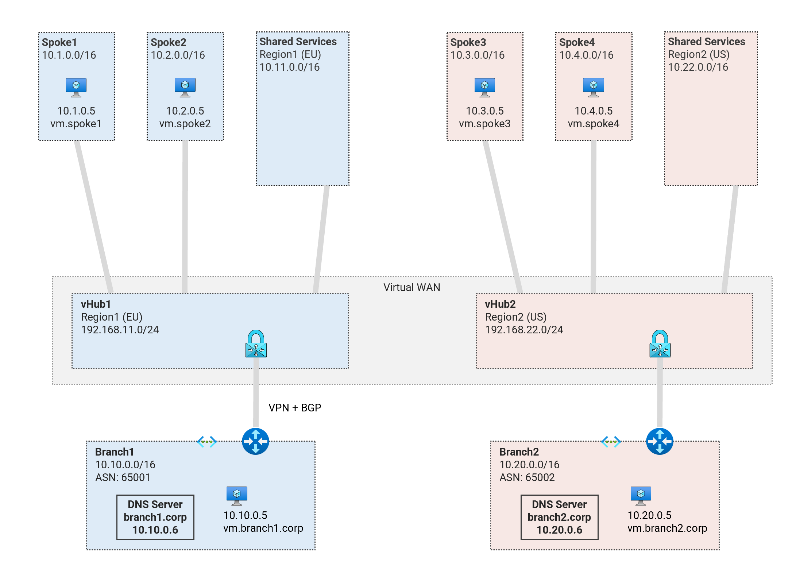

# Private DNS - Secured Virtual WAN (Dual Region) <!-- omit from toc -->

## MicroHack: MH51 <!-- omit from toc -->

Contents

- [Overview](#overview)
- [Prerequisites](#prerequisites)
- [Deploy the Base Lab](#deploy-the-base-lab)
- [Troubleshooting](#troubleshooting)
- [Outputs](#outputs)
- [Testing](#testing)

## Overview

This microhack is part of a series of tutorials in [Azure Networking Microhack](https://azuregbb.github.io/MicroHack#azure-networking) series. This tutorial explores private DNS configuration in a secured [Virtual WAN](https://learn.microsoft.com/en-us/azure/firewall-manager/secured-virtual-hub) topology.

This microhack is based on the terraform lab [Secured Virtual WAN (Dual Region)](../../2-virtual-wan/4-vwan-sec-dual-region/README.md#overview) - which is a fully automated deployment of all resources including the private DNS configuration you will learn in this lab. Feel free to visit the terraform lab to learn more about other topics such as routing, firewall, VPN, etc. This microhack will cover configuration of private DNS in full.

### What you'll learn <!-- omit from toc -->

In this tutorial, you will learn about:

1. [Private DNS Zones, Vnet links and DNS Auto-registration](./exercises/1.%20Private%20DNS%20Zones,%20Vnet%20links%20and%20DNS%20Auto-registration.md)
2. [DNS resolution between On-premises and Azure](./exercises/2.%20DNS%20Resolution%20between%20On-premises%20and%20Azure.md)
3. [DNS Resolution between Spokes](./exercises/3.%20DNS%20Resolution%20between%20Spokes.md)
4. [High Availability (HA) and Disaster Recovery (DR)](./exercises/4.%20High%20Availability%20(HA)%20and%20Disaster%20Recovery%20(DR).md)
5. [Metrics and Monitoring](./exercises/5.%20Metrics%20and%20Monitoring.md)

### What you'll need <!-- omit from toc -->

The following are nice-to-have but not required as the tutorial is detailed enough to be completed on its own:

* Basic knowledge of Azure Virtual networks (Vnet) and virtual WAN (Vwan)
* Basic knowledge of azure virtual machines
* Basic knowledge of Linux shell commands

## Prerequisites

Ensure you meet all requirements in the [prerequisites](../../prerequisites/) that explain how to set up your test environment to use Cloud Shell Bash.

## Deploy the Base Lab

Deploy a dual-region Secured Virtual WAN (Vwan) topology which will server as the base infrastructure upon which we will deploy private DNS configuration. The topology has been designed with a mix of connectivity types which cover many typical Azure customer scenarios. The following are the resources deployed:
* Direct Vnet spokes ***spoke1***, ***spoke4***, connected to the Vwan hubs
* Indirect Vnet spokes, ***spoke2***, ***spoke4*** connected to Vnet hubs
* Floating spokes, ***spoke3***, ***spoke6*** hosting [private link services](https://learn.microsoft.com/en-us/azure/private-link/private-link-service-overview)
* On-premises branches, ***branch1*** and ***branch2*** connected to the Vwan hubs.
* PaaS services (App Service) to be accessed publicly and privately.
* [Routing Intent](https://learn.microsoft.com/en-us/azure/virtual-wan/how-to-routing-policies) in the virtual hubs for traffic inspection.



***Spoke2*** and ***spoke4*** are indirect spokes from a Vwan perspective; and are connected to standard Vnet hubs - ***shared1*** and ***shared2*** respectively. ***Spoke2*** and ***spoke4*** use the Network Virtual Appliance (NVA) in the Vnet hubs as the next hop for traffic to all destinations.

The isolated spokes (***spoke3*** and ***spoke6***) do not have Vnet peering to their respective Vnet hubs, but are reachable via [Private Link Service](https://learn.microsoft.com/en-us/azure/private-link/private-link-service-overview) endpoints in the hubs.

***Branch1*** and ***branch2*** are on-premises networks simulated using Vnets. Multi-NIC Cisco-CSR-1000V NVA appliances connect to the hubs using IPsec VPN connections with dynamic (BGP) routing.

1. Clone the Git Repository for the Labs

   ```sh
   git clone https://github.com/kaysalawu/azure-network-terraform.git
   ```

2. Navigate to the lab directory

   ```sh
   cd azure-network-terraform/5-micro-hacks/1-vwan-dual-region-private-dns
   ```

3. Run the following terraform commands and type ***yes*** at the prompt:

   ```sh
   terraform init
   terraform plan
   terraform apply -parallelism=50
   ```

## Troubleshooting

See the [troubleshooting](../../troubleshooting/) section for tips on how to resolve common issues that may occur during the deployment of the lab.

## Outputs

The table below shows the auto-generated output files from the lab. They are located in the `output` directory.

| Item    | Description  | Location |
|--------|--------|--------|
| IP ranges and DNS | IP ranges and DNS hostname values | [output/values.md](./output/values.md) |
| Branch DNS Server | Unbound DNS server configuration showing on-premises authoritative zones and conditional forwarding to hub private DNS resolver endpoint | [output/branch-dnsmasq.sh](./output/branch-dnsmasq.sh) |
| Branch1 NVA | Cisco IOS commands for IPsec VPN, BGP, route maps etc. | [output/branch1-nva.sh](./output/branch1-nva.sh) |
| Branch3 NVA | Cisco IOS commands for IPsec VPN, BGP, route maps etc. | [output/branch2-nva.sh](./output/branch2-nva.sh) |
| Web server for workload VMs | Python Flask web server and various test and debug scripts | [output/server.sh](./output/server.sh) |
||||

## Testing

After deploying the base infrastructure, you should have network connectivity from any virtual machine (VM) to all other VMs. We will now test access from `Vwan24-spoke1-vm` to all other VMs.

Each VM is pre-configured with a shell [script](../../scripts/server.sh) to run various types of network reachability tests. Serial console access has been configured for all virtual machines. You can [access the serial console](https://learn.microsoft.com/en-us/troubleshoot/azure/virtual-machines/serial-console-overview#access-serial-console-for-virtual-machines-via-azure-portal) of a virtual machine from the Azure portal.

Login to virtual machine `Vwan24-spoke1-vm` via the serial console:

- On Azure portal select *Virtual machines*
- Select the virtual machine `Vwan24-spoke1-vm`
- Under ***Help*** section, select ***Serial console*** and wait for a login prompt
- Enter the login credentials
  - username = ***azureuser***
  - password = ***Password123***
- You should now be in a shell session `azureuser@mH51_Vwan_Dns-spoke1-vm:~$`

Run the following tests from inside the serial console session.

### 1. Ping IP <!-- omit from toc -->

This script pings the IP addresses of some test VMs and reports reachability and round trip time.

**1.1.** Run the IP ping test

```sh
ping-ip
```

Sample output

```sh
azureuser@mH51_Vwan_Dns-spoke1-vm:~$ ping-ip

 ping ip ...

branch1 - 10.10.0.5 -OK 7.386 ms
shared1    - 10.11.0.5 -OK 5.000 ms
spoke1  - 10.1.0.5 -OK 0.024 ms
spoke2  - 10.2.0.5 -OK 7.032 ms
branch2 - 10.30.0.5 -OK 23.405 ms
shared2    - 10.22.0.5 -OK 23.352 ms
spoke4  - 10.4.0.5 -OK 19.402 ms
spoke4  - 10.5.0.5 -OK 20.471 ms
internet - icanhazip.com -NA
```

### 2. Curl DNS <!-- omit from toc -->

This script uses curl to check reachability of web server (python Flask) on the test virtual machines. It reports HTTP response message, round trip time and IP address.

**3.1.** Run the DNS curl test

```sh
curl-dns
```

Sample output

```sh
azureuser@mH51VwanDns-spoke1-vm:~$ curl-dns

 curl dns ...

000 (0.045774s) -  - vm.branch1.corp
000 (0.078401s) -  - vm.shared1.eu.az.corp
000 (0.087987s) -  - spoke3.p.shared1.eu.az.corp
000 (0.082900s) -  - vm.spoke1.eu.az.corp
000 (0.077184s) -  - vm.spoke2.eu.az.corp
000 (0.088936s) -  - vm.spoke3.eu.az.corp
000 (0.055307s) -  - vm.branch2.corp
000 (0.091453s) -  - vm.shared2.us.az.corp
000 (0.025416s) -  - spoke6.p.shared2.us.az.corp
000 (0.032110s) -  - vm.spoke4.us.az.corp
000 (0.039810s) -  - vm.spoke4.us.az.corp
000 (0.154529s) -  - vm.spoke6.us.az.corp
200 (0.022036s) - 104.18.115.97 - icanhazip.com
200 (0.034683s) - 20.119.8.30 - spoke3-f946.azurewebsites.net
200 (0.211198s) - 20.107.224.16 - spoke6-f946.azurewebsites.net
```

We can see that private DNS resolution failed for all VMs. That is expected because we have not yet configured private DNS. We have public DNS resolution for Internet and public endpoints for app services.

## NEXT STEP <!-- omit from toc -->
Go to exercise [1. Private DNS Zones, Vnet links and DNS auto-registration](./exercises/1.%20Private%20DNS%20Zones,%20Vnet%20links%20and%20DNS%20Auto-registration.md)

