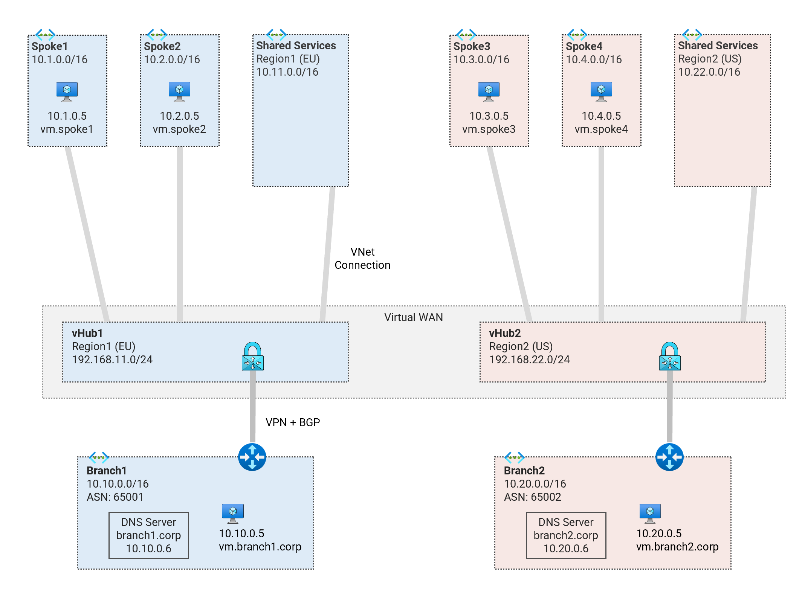

# Private DNS in Virtual WAN <!-- omit from toc -->

## MicroHack: MH51 <!-- omit from toc -->

Contents

- [Overview](#overview)
- [Prerequisites](#prerequisites)
- [Deploy the Base Infrastructure for the Lab](#deploy-the-base-infrastructure-for-the-lab)
- [Troubleshooting](#troubleshooting)

## Overview

This microhack is a tutorial in the [Azure Networking Microhack](https://azuregbb.github.io/MicroHack#azure-networking) series. We will explore private DNS configuration in a [Virtual WAN](https://learn.microsoft.com/en-us/azure/firewall-manager/secured-virtual-hub) topology. While Virtual WAN itself does not yet fully support private DNS, we will explore how to integrate private DNS in a spoke Virtual Network (Vnet).

### What you'll learn <!-- omit from toc -->

In this tutorial, you will learn about:

1. [Private DNS Zones, Vnet links and DNS Auto-registration](./exercises/1.%20Private%20DNS%20Zones,%20Vnet%20links%20and%20DNS%20Auto-registration.md)
2. [DNS resolution between On-premises and Azure](./exercises/2.%20DNS%20Resolution%20between%20On-premises%20and%20Azure.md)
3. [DNS Resolution between Spokes](./exercises/3.%20DNS%20Resolution%20between%20Spokes.md)
4. [High Availability (HA) and Disaster Recovery (DR)](./exercises/4.%20High%20Availability%20(HA)%20and%20Disaster%20Recovery%20(DR).md)
5. [Metrics and Monitoring](./exercises/5.%20Metrics%20and%20Monitoring.md)

### What you'll need <!-- omit from toc -->

The following are nice-to-have but not required as the tutorial is detailed enough to be completed on its own:

* Basic knowledge of Azure Virtual networks (Vnet) and virtual WAN (Vwan)
* Basic knowledge of azure virtual machines
* Basic knowledge of Linux shell commands (using Azure Cloud Shell Bash)

## Prerequisites

Ensure you meet all requirements in the [prerequisites](../../prerequisites/) that explain how to set up your test environment to use Cloud Shell Bash.

## Deploy the Base Infrastructure for the Lab

To complete this microhack, you need to deploy a dual-region Virtual WAN (Vwan) topology which will serve as the base infrastructure for the private DNS configuration.



This microhack is based on some assumptions for the customer requirements. There are various customer requirements and different solutions possible, but we will focus on the context below:

* Each spoke represents an application landing zone for a business unit (BU).
* Each BU creates and manage their landing zone resources (Vnet, private DNS zones, etc.)
* The Shared Services Vnets and Vwan hubs are owned by a central network/security team and hosts services like DNS, firewall, IaC tooling etc.
* Central network/security team managed hybrid and inter-cloud DNS resolution.
* Each on-premises location should connect to the nearest Azure region for both data plane traffic and DNS resolution.

1. Clone the Git Repository for the Labs

   ```sh
   git clone https://github.com/kaysalawu/azure-network-terraform.git
   ```

2. Navigate to the lab directory

   ```sh
   cd azure-network-terraform/5-micro-hacks/1-vwan-dual-region-private-dns
   ```

3. Run the following terraform commands and type ***yes*** at the prompt:

   ```sh
   terraform init
   terraform plan
   terraform apply -parallelism=50
   ```

## Troubleshooting

See the [troubleshooting](../../troubleshooting/README.md) section for tips on how to resolve common issues that may occur after deploying the terraform code.

## NEXT STEP <!-- omit from toc -->
Go to exercise [1. Private DNS Zones, Vnet links and DNS auto-registration](./exercises/1.%20Private%20DNS%20Zones,%20Vnet%20links%20and%20DNS%20Auto-registration.md)

