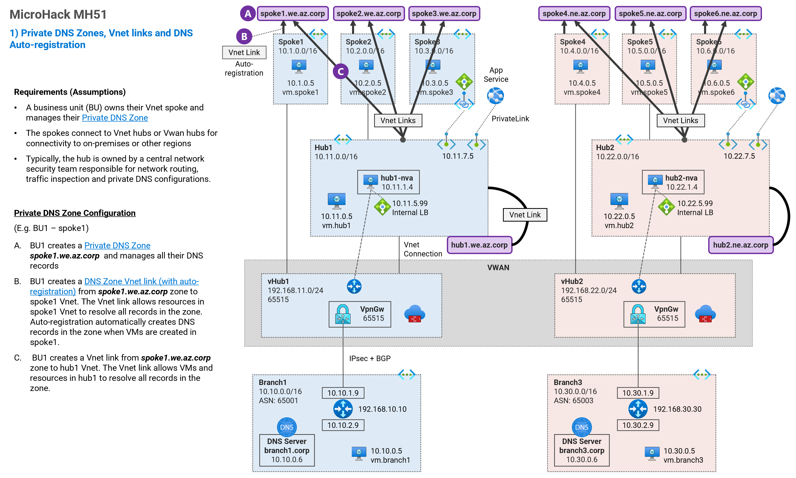

## 1. Private DNS Zones, Vnet links and DNS Auto-registration <!-- omit from toc -->

MicroHack MH51: Private DNS - Secured Virtual WAN (Dual Region) <!-- omit from toc -->

[Next →](./2.%20DNS%20Resolution%20between%20On-premises%20and%20Azure.md)

Contents

- [Overview](#overview)

## Overview

In this exercise we will:
* Configure Private DNS zones
* Configure Private DNS zone Vnet links
* Configure DNS link auto-registration
* Test DNS resolution to the Private DNS zones

## NEXT STEP <!-- omit from toc -->
Go to exercise - [2. DNS Resolution between On-premises and Azure](./2.%20DNS%20Resolution%20between%20On-premises%20and%20Azure.md)

[Next →](./2.%20DNS%20Resolution%20between%20On-premises%20and%20Azure.md)
