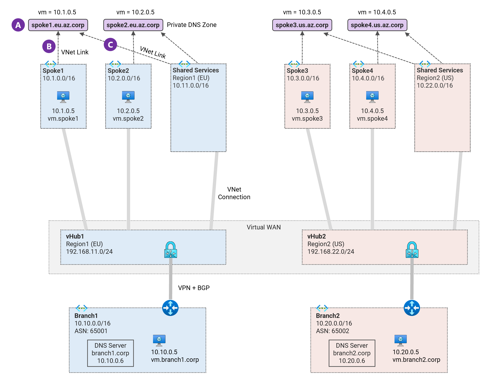
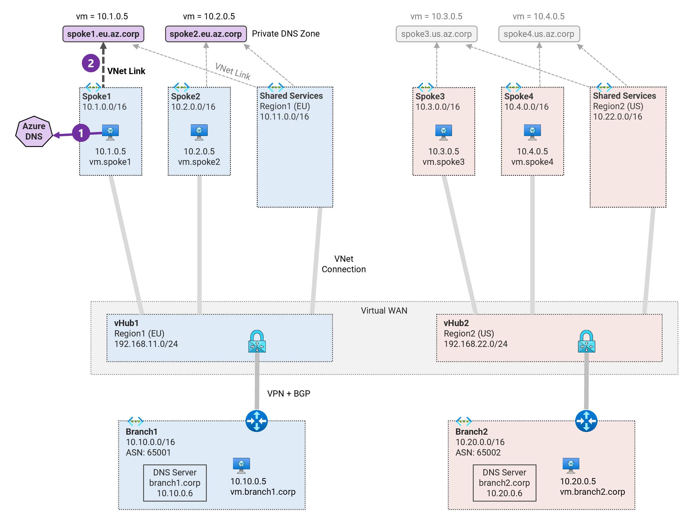

## 1. Private DNS Zones, VNet links and DNS Auto-registration <!-- omit from toc -->

MicroHack MH51: Private DNS in Virtual WAN <!-- omit from toc -->

[← Previous](../README.md)

Contents

- [Overview](#overview)
- [Task 1: Create Private DNS zones](#task-1-create-private-dns-zones)
- [Task 2: Create VNet links and enable DNS auto-registration](#task-2-create-vnet-links-and-enable-dns-auto-registration)
- [Task 3: Test DNS Resolution in Spoke1 VM](#task-3-test-dns-resolution-in-spoke1-vm)
- [Review](#review)

## Overview

In this exercise we will create private DNS zones for each spoke and link them to the virtual network. We will also enable private DNS zone auto-registration for the spoke virtual networks.



## Task 1: Create Private DNS zones

A [private DNS zone](https://learn.microsoft.com/en-us/azure/dns/private-dns-privatednszone) is used to host the private DNS records for a particular domain. Each DNS record for your domain is created inside this DNS zone.

We will now create the private DNS zones for each spoke.

1\. Save the environment variables

  ```sh
  export PREFIX=Vwan_Dns
  export RG_NAME=${PREFIX}RG
  ```

2\. Create the private DNS zones.

```sh
az network private-dns zone create -g $RG_NAME -n spoke1.eu.az.corp
az network private-dns zone create -g $RG_NAME -n spoke2.eu.az.corp
az network private-dns zone create -g $RG_NAME -n spoke3.us.az.corp
az network private-dns zone create -g $RG_NAME -n spoke4.us.az.corp
```

## Task 2: Create VNet links and enable DNS auto-registration

To publish a private DNS zone to your virtual network, you specify the list of virtual networks that are allowed to resolve records within the zone. This is done by creating a [virtual network link](https://learn.microsoft.com/en-us/azure/dns/private-dns-autoregistration) between the DNS zone and the virtual network.

The Azure DNS private zones [auto registration](https://learn.microsoft.com/en-us/azure/dns/private-dns-autoregistration) feature manages DNS records for virtual machines deployed in a virtual network. When you link a virtual network with a private DNS zone with auto-registration enabled, a DNS record is created for each virtual machine deployed in the virtual network.

We will now create the VNet links and enable DNS auto-registration for the spoke virtual networks.

1\. Create VNet links with auto-registration from each private DNS zone to its corresponding spoke virtual network.

```sh
command="az network private-dns link vnet create -g $RG_NAME -e true"
$command -n spoke1-vnet-link -z spoke1.eu.az.corp -v "${PREFIX}-spoke1-vnet"
$command -n spoke2-vnet-link -z spoke2.eu.az.corp -v "${PREFIX}-spoke2-vnet"
$command -n spoke3-vnet-link -z spoke3.us.az.corp -v "${PREFIX}-spoke3-vnet"
$command -n spoke4-vnet-link -z spoke4.us.az.corp -v "${PREFIX}-spoke4-vnet"
```

2\. Create VNet links from each private DNS zone to **region1** shared services VNet.

```sh
command="az network private-dns link vnet create -g $RG_NAME -e false"
$command -n shared1-spoke1-vnet-link -z spoke1.eu.az.corp -v ${PREFIX}-shared1-vnet
$command -n shared1-spoke2-vnet-link -z spoke2.eu.az.corp -v ${PREFIX}-shared1-vnet
```

3\. Create VNet links from each private DNS zone to **region2** shared services VNet.

```sh
command="az network private-dns link vnet create -g $RG_NAME -e false"
$command -n shared2-spoke3-vnet-link -z spoke3.us.az.corp -v ${PREFIX}-shared2-vnet
$command -n shared2-spoke4-vnet-link -z spoke4.us.az.corp -v ${PREFIX}-shared2-vnet
```

4\. Verify the created private DNS zones.

```sh
echo && az network private-dns zone list -g $RG_NAME -o table \
--query "[].{ZoneName:name, \
RecordSets: numberOfRecordSets, \
VNetLinks: numberOfVirtualNetworkLinks, \
AutoRegistrationLinks: numberOfVirtualNetworkLinksWithRegistration}" && echo
```

Expected output:

```sh
ZoneName           RecordSets    VNetLinks    AutoRegistrationLinks
-----------------  ------------  -----------  -----------------------
spoke1.eu.az.corp  2             2            1
spoke2.eu.az.corp  2             2            1
spoke3.us.az.corp  2             2            1
spoke4.us.az.corp  2             2            1
```

5\. Verify the VNet links for private DNS zone `spoke1.eu.az.corp`.

```sh
echo && az network private-dns link vnet list -g $RG_NAME -o table -z spoke1.eu.az.corp \
--query "[].{ZoneName:privateZoneName, \
VNetName:virtualNetworkLink.vnet.id, \
VNetLinkName:name, \
AutoRegistration:registrationEnabled}" && echo
```

Expected output:

```sh
VNetLinkName              AutoRegistration
------------------------  ------------------
shared1-spoke1-vnet-link  False
spoke1-vnet-link          True
```

6\. Navigate through the Azure portal to verify all the private DNS zones and VNet links.

## Task 3: Test DNS Resolution in Spoke1 VM

We will now test DNS resolution to the following destinations from the `Vwan_Dns-spoke1-vm` virtual machine:
* `vm.spoke1.eu.az.corp`
* `vm.spoke2.eu.az.corp`



1\. Verify that the VNet of `Vwan_Dns-spoke1-vm` has no custom DNS servers configured; which means the VNet will use the Azure DNS service for all DNS resolution.

```sh
az network vnet show -g $RG_NAME -n ${PREFIX}-spoke1-vnet --query "dhcpOptions.dnsServers"
```
Expected output:

```sh
[]
```

2\. Login to virtual machine `Vwan_Dns-spoke1-vm` via the [serial console](https://learn.microsoft.com/en-us/troubleshoot/azure/virtual-machines/serial-console-overview#access-serial-console-for-virtual-machines-via-azure-portal):
* username = ***azureuser***
* password = ***Password123***

You should now be in a shell terminal session `azureuser@vm:~$` where we will run the following tests.

> **Note:** Each virtual machine is pre-configured with [scripts](../../../scripts/server.sh) to run various types of network reachability tests including DNS resolution.

3\. Run a DNS lookup for the private DNS zone `spoke1.eu.az.corp`

```sh
nslookup vm.spoke1.eu.az.corp
```

Sample output:

```sh
azureuser@vm:~$ nslookup vm.spoke1.eu.az.corp
Server:         127.0.0.53
Address:        127.0.0.53#53

Non-authoritative answer:
Name:   vm.spoke1.eu.az.corp
Address: 10.1.0.5
```

4\. Run a DNS lookup for the private DNS zone `spoke2.eu.az.corp`

```sh
nslookup vm.spoke2.eu.az.corp
```
Sample output:

```sh
azureuser@vm:~$ nslookup vm.spoke2.eu.az.corp
Server:         127.0.0.53
Address:        127.0.0.53#53

** server can't find vm.spoke2.eu.az.corp: NXDOMAIN
```

5\. Run a DNS lookup for `vm.branch1.corp` which is a DNS record in the on-premises DNS server.

 ```sh
 nslookup vm.branch1.corp
 ```

 Sample output:

 ```sh
 azureuser@vm:~$ nslookup vm.branch1.corp
 Server:         127.0.0.53
 Address:        127.0.0.53#53

 ** server can't find vm.branch1.corp: NXDOMAIN
 ```

The `NXDOMAIN` errors are expected. The VM can only resolve private DNS zone `spoke1.eu.az.corp`. It cannot resolve records in other private DNS zones in Azure or on-premises.

6\. Run the `ping-dns` test script to check DNS resolution to all virtual machines.

  ```sh
  ping-dns
  ```

  Sample output:

  ```sh
 azureuser@vm:~$ ping-dns

  ping dns ...

 vm.branch1.corp -  -NA
 vm.spoke1.eu.az.corp - 10.1.0.5 -OK 0.037 ms
 vm.spoke2.eu.az.corp -  -NA
 vm.branch2.corp -  -NA
 vm.spoke3.eu.az.corp -  -NA
 vm.spoke4.us.az.corp -  -NA
 icanhazip.com - 104.18.114.97 -NA
 ```
The script confirms that `Vwan_Dns-spoke1-vm` can only resolve DNS names in DNS zone `spoke1.eu.az.corp` and public DNS names (e.g. icanhazip.com) via the Azure DNS service. All other DNS names are not resolvable.

## Review

You have created private DNS zones for each spoke and linked them to virtual networks. You have also enabled DNS auto-registration for virtual networks.

## NEXT STEP <!-- omit from toc -->
Go to exercise [2. DNS Resolution from Azure to On-premises](../exercises/2.%20DNS%20Resolution%20from%20Azure%20to%20On-premises.md)

[← Previous](../README.md) | [Next →](../exercises/2.%20DNS%20Resolution%20from%20Azure%20to%20On-premises.md)
