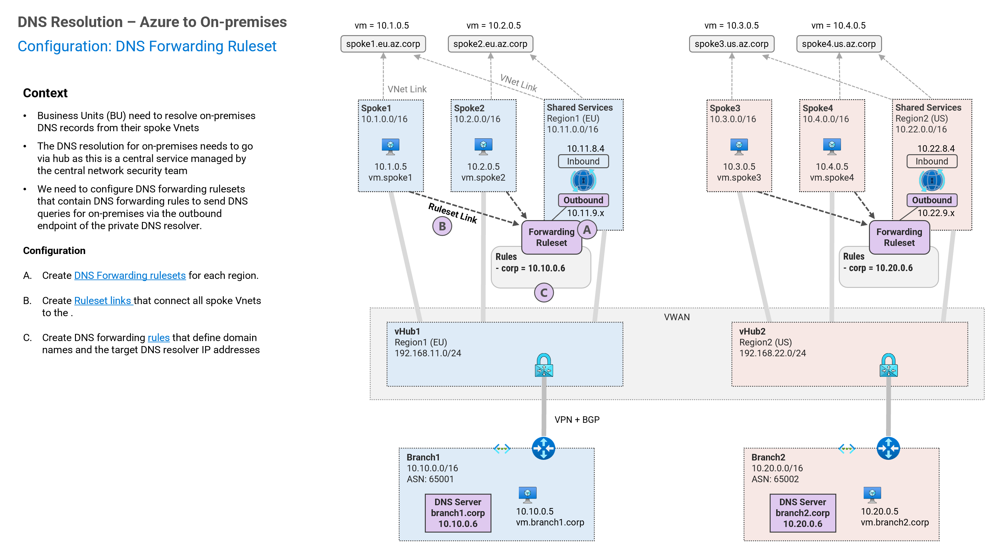
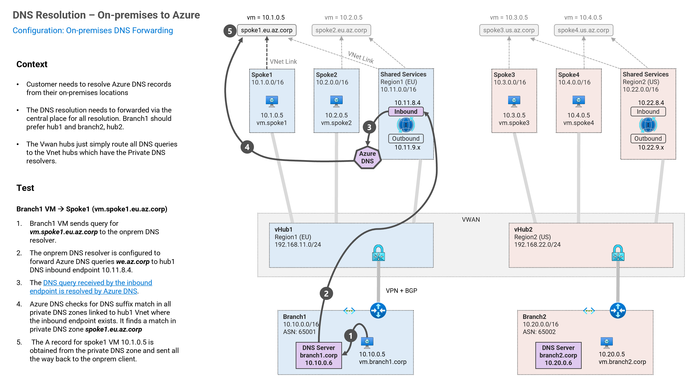

## 2. DNS Resolution between On-premises and Azure <!-- omit from toc -->

MicroHack MH51: Private DNS - Secured Virtual WAN (Dual Region) <!-- omit from toc -->

[← Previous](./1.%20Private%20DNS%20Zones,%20Vnet%20links%20and%20DNS%20Auto-registration.md) | [Next →](./3.%20DNS%20Resolution%20between%20Spokes.md)

Contents

- [Overview](#overview)
- [Task 1: Configure DNS Forwarding Ruleset, Rules and Links](#task-1-configure-dns-forwarding-ruleset-rules-and-links)
- [Task 2: Test DNS Resolution from Spoke1 to On-premises](#task-2-test-dns-resolution-from-spoke1-to-on-premises)
- [Task3: Configure DNS Forwarding in On-premises DNS Server](#task3-configure-dns-forwarding-in-on-premises-dns-server)
- [Task4: Test DNS Resolution from On-premises to Spoke1](#task4-test-dns-resolution-from-on-premises-to-spoke1)

## Overview

## Task 1: Configure DNS Forwarding Ruleset, Rules and Links

In this task, we will test DNS resolution in `spoke1-vm1` to resolve the on-premises DNS ***vm.branch1.corp***. This requires a private DNS resolver in the ***shared1*** vnet to forward the DNS query to the on-premises DNS server running dnsmasq.

## Task 2: Test DNS Resolution from Spoke1 to On-premises

## Task3: Configure DNS Forwarding in On-premises DNS Server

## Task4: Test DNS Resolution from On-premises to Spoke1

In this task, we will test DNS resolution in the on-premises DNS ***branch1-vm*** to resolve the Azure DNS ***vm.spoke1.eu.az.corp***. This will use the private DNS resolver in ***shared1*** vnet to resolve the Azure DNS query using Azure DNS. We will also configure DNS forwarding on the dnsmasq onpremises DNS server to forward the query to the ***shared1** DNS inbound endpoint.

## CONGRATULATIONS! <!-- omit from toc -->

You have completed this exercise. You have learned how to configure DNS resolution between On-premises and Azure.

## NEXT STEP <!-- omit from toc -->
Go to exercise - [3. DNS Resolution between Spokes](./3.%20DNS%20Resolution%20between%20Spokes.md)

[← Previous](./1.%20Private%20DNS%20Zones,%20Vnet%20links%20and%20DNS%20Auto-registration.md) | [Next →](./3.%20DNS%20Resolution%20between%20Spokes.md)
