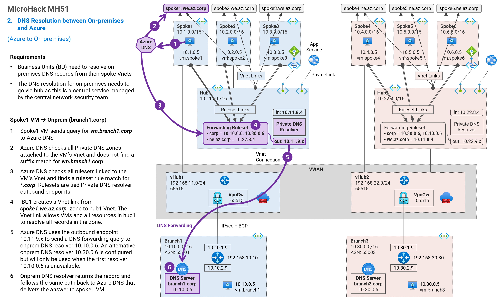
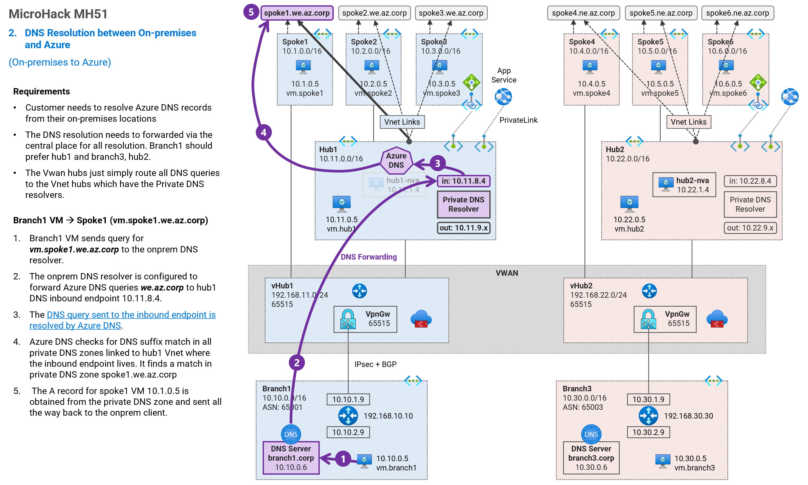

## 2. DNS Resolution between On-premises and Azure <!-- omit from toc -->

MicroHack MH51: Private DNS - Secured Virtual WAN (Dual Region) <!-- omit from toc -->

[← Previous](./1.%20Private%20DNS%20Zones,%20Vnet%20links%20and%20DNS%20Auto-registration.md) | [Next →](./3.%20DNS%20Resolution%20between%20Spokes.md)

Contents

- [Overview](#overview)
- [Task 1: DNS Resolution from Azure to On-premises](#task-1-dns-resolution-from-azure-to-on-premises)
- [Task 2: DNS Resolution from On-premises to Azure](#task-2-dns-resolution-from-on-premises-to-azure)

## Overview

## Task 1: DNS Resolution from Azure to On-premises

In this task, we will test DNS resolution in `spoke1-vm1` to resolve the on-premises DNS ***vm.branch1.corp***. This requires a private DNS resolver in the ***hub1*** vnet to forward the DNS query to the on-premises DNS server running dnsmasq.

## Task 2: DNS Resolution from On-premises to Azure

In this task, we will test DNS resolution in the on-premises DNS ***branch1-vm*** to resolve the Azure DNS ***vm.spoke1.we.az.corp***. This will use the private DNS resolver in ***hub1*** vnet to resolve the Azure DNS query using Azure DNS. We will also configure DNS forwarding on the dnsmasq onpremises DNS server to forward the query to the ***hub1** DNS inbound endpoint.

## CONGRATULATIONS! <!-- omit from toc -->

You have completed this exercise.

## NEXT STEP <!-- omit from toc -->
Go to exercise - [3. DNS Resolution between Spokes](./3.%20DNS%20Resolution%20between%20Spokes.md)

[← Previous](./1.%20Private%20DNS%20Zones,%20Vnet%20links%20and%20DNS%20Auto-registration.md) | [Next →](./3.%20DNS%20Resolution%20between%20Spokes.md)
