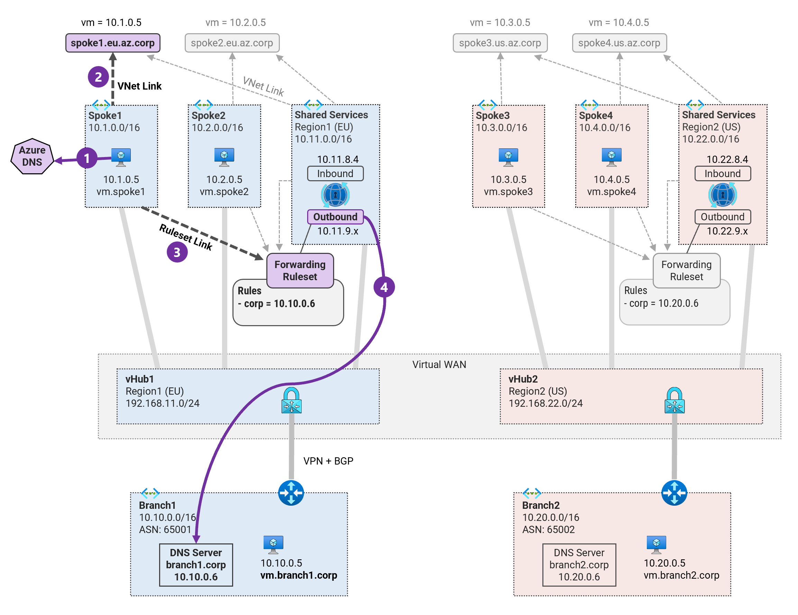

## 2. DNS Resolution from Azure to On-premises <!-- omit from toc -->

MicroHack MH51: Private DNS in Virtual WAN <!-- omit from toc -->

[← Previous](./1.%20Private%20DNS%20Zones,%20Vnet%20links%20and%20DNS%20Auto-registration.md) | [Next →](./3.%20DNS%20Resolution%20from%20On-premises%20to%20Azure.md)

Contents

- [Prerequisites](#prerequisites)
- [Overview](#overview)
- [Task 1: Create Private DNS Resolver](#task-1-create-private-dns-resolver)
- [Task 2: Create Inbound and Outbound Endpoints](#task-2-create-inbound-and-outbound-endpoints)
- [Task 3: Create DNS Forwarding Rulesets](#task-3-create-dns-forwarding-rulesets)
- [Task 4: Create DNS Forwarding Rules](#task-4-create-dns-forwarding-rules)
- [Task 5: Create VNet links to Rulesets](#task-5-create-vnet-links-to-rulesets)
- [Task 6: Test DNS Resolution from Spoke1 to On-premises](#task-6-test-dns-resolution-from-spoke1-to-on-premises)
- [Task 7 (Optional): Test DNS Resolution from all Spokes](#task-7-optional-test-dns-resolution-from-all-spokes)
- [Review](#review)

## Prerequisites

Ensure you have completed the previous exercise - [1. Private DNS Zones, Vnet links and DNS Auto-registration](./1.%20Private%20DNS%20Zones,%20Vnet%20links%20and%20DNS%20Auto-registration.md).

## Overview

In this exercise, we will configure DNS forwarding between On-premises and Azure using Azure [private DNS resolver](https://learn.microsoft.com/en-us/azure/dns/dns-private-resolver-overview). The private DNS resolver is a virtual network resource that forwards DNS queries to on-premises and also receives DNS queries forwarded from on-premises.


## Task 1: Create Private DNS Resolver

1\. Save the environment variables

```sh
export PREFIX=Vwan_Dns
export RG_NAME=${PREFIX}RG
export REGION1=northeurope
export REGION2=eastus
export SHARED1_VNET_NAME="${PREFIX}-shared1-vnet"
export SHARED2_VNET_NAME="${PREFIX}-shared2-vnet"
export SHARED1_DNS_RESOLVER_NAME="${PREFIX}-shared1-dns-resolver"
export SHARED2_DNS_RESOLVER_NAME="${PREFIX}-shared2-dns-resolver"
```

Azure DNS Private Resolver is deployed in a Virtual Network, and in the same region.

2\. Get the virtual network resource ID for the ***shared1*** and ***shared2*** vnets.

```sh
SHARED1_VNET_ID=$(az network vnet show -g $RG_NAME -n $SHARED1_VNET_NAME --query id -o tsv)
SHARED2_VNET_ID=$(az network vnet show -g $RG_NAME -n $SHARED2_VNET_NAME --query id -o tsv)
```

3\. Create a private DNS resolver in the ***shared1*** VNet.

```sh
az dns-resolver create -g $RG_NAME \
--name $SHARED1_DNS_RESOLVER_NAME \
--id $SHARED1_VNET_ID \
--location $REGION1
```

Wait for about a minute for the deployment to complete.

4\. Create a private DNS resolver in the ***shared2*** VNet.

```sh
az dns-resolver create -g $RG_NAME \
--name $SHARED2_DNS_RESOLVER_NAME \
--id $SHARED2_VNET_ID \
--location $REGION2
```
Wait for about a minute for the deployment to complete.

## Task 2: Create Inbound and Outbound Endpoints

The private DNS Resolver has one or more [inbound endpoints](https://learn.microsoft.com/en-us/azure/dns/dns-private-resolver-overview#inbound-endpoints) that can be used as the destination for DNS queries. The private DNS resolver also has one or more [outbound endpoints](https://learn.microsoft.com/en-us/azure/dns/dns-private-resolver-overview#outbound-endpoints) used to send DNS queries to on-premises.

1\. Create subnets for inbound and outbound endpoints in the ***shared1*** VNet.

```sh
az network vnet subnet create -g $RG_NAME \
--name "DnsResolverInboundSubnet" \
--vnet-name $SHARED1_VNET_NAME \
--address-prefixes "10.11.8.0/24"

az network vnet subnet create -g $RG_NAME \
--name "DnsResolverOutboundSubnet" \
--vnet-name $SHARED1_VNET_NAME \
--address-prefixes "10.11.9.0/24"
```

2\. Create subnets for inbound and outbound endpoints in the ***shared2*** VNet.

```sh
az network vnet subnet create -g $RG_NAME \
--name "DnsResolverInboundSubnet" \
--vnet-name $SHARED2_VNET_NAME \
--address-prefixes "10.22.8.0/24"

az network vnet subnet create -g $RG_NAME \
--name "DnsResolverOutboundSubnet" \
--vnet-name $SHARED2_VNET_NAME \
--address-prefixes "10.22.9.0/24"
```

3\. Get the subnet resource IDs for the inbound and outbound endpoints.

```sh
SHARED1_DNS_IN_SUBNET_ID=$(az network vnet subnet show -g "$RG_NAME" --name "DnsResolverInboundSubnet" --vnet-name "$SHARED1_VNET_NAME" --query id -o tsv)
SHARED2_DNS_IN_SUBNET_ID=$(az network vnet subnet show -g "$RG_NAME" --name "DnsResolverInboundSubnet" --vnet-name "$SHARED2_VNET_NAME" --query id -o tsv)
SHARED1_DNS_OUT_SUBNET_ID=$(az network vnet subnet show -g "$RG_NAME" --name "DnsResolverOutboundSubnet" --vnet-name "$SHARED1_VNET_NAME" --query id -o tsv)
SHARED2_DNS_OUT_SUBNET_ID=$(az network vnet subnet show -g "$RG_NAME" --name "DnsResolverOutboundSubnet" --vnet-name "$SHARED2_VNET_NAME" --query id -o tsv)
```

4\. Create inbound endpoint for the DNS resolver in the ***shared1*** VNet.

```sh
az dns-resolver inbound-endpoint create -g $RG_NAME \
--dns-resolver-name $SHARED1_DNS_RESOLVER_NAME \
--name "shared1-dns-inbound" \
--location $REGION1 \
--ip-configurations "[{private-ip-address:'10.11.8.4',private-ip-allocation-method:'Static',id:'$SHARED1_DNS_IN_SUBNET_ID'}]"
```

We specified a static IP address, *10.11.8.4* for the inbound endpoint.

5\. Create outbound endpoint for the DNS resolver in the ***shared1*** VNet.

```sh
az dns-resolver outbound-endpoint create -g $RG_NAME \
--dns-resolver-name $SHARED1_DNS_RESOLVER_NAME \
--name "shared1-dns-outbound" \
--location $REGION1 \
--id $SHARED1_DNS_OUT_SUBNET_ID
```

6\. Create inbound endpoint for the DNS resolver in the ***shared2*** VNet.

```sh
az dns-resolver inbound-endpoint create -g $RG_NAME \
--dns-resolver-name $SHARED2_DNS_RESOLVER_NAME \
--name "shared2-dns-inbound" \
--location $REGION2 \
--ip-configurations "[{private-ip-address:'10.22.8.4',private-ip-allocation-method:'Static',id:'$SHARED2_DNS_IN_SUBNET_ID'}]"
```

We specified a static IP address, *10.22.8.4* for the inbound endpoint.

7\. Create outbound endpoint for the DNS resolver in the ***shared2*** VNet.

```sh
az dns-resolver outbound-endpoint create -g $RG_NAME \
--dns-resolver-name $SHARED2_DNS_RESOLVER_NAME \
--name "shared2-dns-outbound" \
--location $REGION2 \
--id $SHARED2_DNS_OUT_SUBNET_ID
```

8\. Navigate through the Azure portal to verify the private DNS resolver and the inbound and outbound endpoints.

## Task 3: Create DNS Forwarding Rulesets

A DNS [forwarding ruleset](https://learn.microsoft.com/en-us/azure/dns/private-resolver-endpoints-rulesets#dns-forwarding-rulesets) enables you to specify one or more target DNS servers to answer queries for specific DNS namespaces.

1\. Get the resource IDs for the outbound endpoints.

```sh
SHARED1_DNS_OUT_ENDPOINT_ID=$(az dns-resolver outbound-endpoint show -g $RG_NAME \
--dns-resolver-name $SHARED1_DNS_RESOLVER_NAME \
--name "shared1-dns-outbound" \
--query id -o tsv)

SHARED2_DNS_OUT_ENDPOINT_ID=$(az dns-resolver outbound-endpoint show -g $RG_NAME \
--dns-resolver-name $SHARED2_DNS_RESOLVER_NAME \
--name "shared2-dns-outbound" \
--query id -o tsv)
```

2\. Create a DNS forwarding ruleset for the ***shared1*** DNS resolver.

```sh
az dns-resolver forwarding-ruleset create -g $RG_NAME \
--name "shared1-dns-forwarding-ruleset" \
--location $REGION1 \
--outbound-endpoints "[{id:'$SHARED1_DNS_OUT_ENDPOINT_ID'}]"
```

3\. Create a DNS forwarding ruleset for the ***shared2*** DNS resolver.

```sh
az dns-resolver forwarding-ruleset create -g $RG_NAME \
--name "shared2-dns-forwarding-ruleset" \
--location $REGION2 \
--outbound-endpoints "[{id:'$SHARED2_DNS_OUT_ENDPOINT_ID'}]"
```

## Task 4: Create DNS Forwarding Rules

The individual [rules](https://learn.microsoft.com/en-us/azure/dns/private-resolver-endpoints-rulesets#rules) in a ruleset determine how DNS names are resolved. Each rule specifies a DNS domain name and a list of target DNS servers that can resolve queries for that domain name.

1\. Create a DNS forwarding rule for the on-premises DNS domain ***corp.*** for the ruleset `shared1-dns-forwarding-ruleset`.

```sh
az dns-resolver forwarding-rule create -g $RG_NAME \
--ruleset-name "shared1-dns-forwarding-ruleset" \
--name "onprem-rule" \
--domain-name "corp." \
--forwarding-rule-state "Enabled" \
--target-dns-servers "[{ip-address:"10.10.0.6",port:53}]"
```

This rule specifies that the DNS resolver should forward DNS queries for on-premises ***.corp*** domain to the on-premises **branch1** DNS server, **10.10.0.6** running unbound DNS service. This rule will be used for spokes in ***region1***.

2\. Create a DNS forwarding rule for the on-premises DNS domain ***corp.*** for the ruleset `shared2-dns-forwarding-ruleset`.

```sh
az dns-resolver forwarding-rule create -g $RG_NAME \
--ruleset-name "shared2-dns-forwarding-ruleset" \
--name "onprem-rule" \
--domain-name "corp." \
--forwarding-rule-state "Enabled" \
--target-dns-servers "[{ip-address:"10.20.0.6",port:53}]"
```

This rule specifies that the DNS resolver should forward DNS queries for on-premises ***.corp*** domain to the on-premises **branch2** DNS server, **10.20.0.6** running unbound DNS service. This rule will be used for spokes in ***region2***.

## Task 5: Create VNet links to Rulesets

When you [link a ruleset](https://learn.microsoft.com/en-us/azure/dns/private-resolver-endpoints-rulesets#ruleset-links) to a virtual network, resources within that virtual network use the DNS forwarding rules enabled in the ruleset. In our case, we will link the spoke VNets to rulesets in the same region as the spokes.

1\. Get the spoke VNet IDs.

```sh
SPOKE1_VNET_ID=$(az network vnet show -g $RG_NAME -n "${PREFIX}-spoke1-vnet" --query id -o tsv)
SPOKE2_VNET_ID=$(az network vnet show -g $RG_NAME -n "${PREFIX}-spoke2-vnet" --query id -o tsv)
SPOKE3_VNET_ID=$(az network vnet show -g $RG_NAME -n "${PREFIX}-spoke3-vnet" --query id -o tsv)
SPOKE4_VNET_ID=$(az network vnet show -g $RG_NAME -n "${PREFIX}-spoke4-vnet" --query id -o tsv)
```

1\. Get the resource IDs for the DNS forwarding rulesets.

```sh
SHARED1_FORWARDING_RULESET_ID=$(az dns-resolver forwarding-ruleset show -g $RG_NAME \
--name "shared1-dns-forwarding-ruleset" \
--query id -o tsv)

SHARED2_FORWARDING_RULESET_ID=$(az dns-resolver forwarding-ruleset show -g $RG_NAME \
--name "shared2-dns-forwarding-ruleset" \
--query id -o tsv)
```

2\. Create ruleset link for the ***spoke1*** VNet.

```sh
az dns-resolver vnet-link create -g $RG_NAME \
--ruleset-name "shared1-dns-forwarding-ruleset" \
--name "spoke1-vnet-link" \
--id $SPOKE1_VNET_ID
```

3\. Create ruleset link for the ***spoke2*** VNet.

```sh
az dns-resolver vnet-link create -g $RG_NAME \
--ruleset-name "shared1-dns-forwarding-ruleset" \
--name "spoke2-vnet-link" \
--id $SPOKE2_VNET_ID
```

4\. Create ruleset link for the ***spoke3*** VNet.

```sh
az dns-resolver vnet-link create -g $RG_NAME \
--ruleset-name "shared2-dns-forwarding-ruleset" \
--name "spoke3-vnet-link" \
--id $SPOKE3_VNET_ID
```

5\. Create ruleset link for the ***spoke4*** VNet.

```sh
az dns-resolver vnet-link create -g $RG_NAME \
--ruleset-name "shared2-dns-forwarding-ruleset" \
--name "spoke4-vnet-link" \
--id $SPOKE4_VNET_ID
```

## Task 6: Test DNS Resolution from Spoke1 to On-premises

We will now test DNS resolution in `Vwan_Dns-spoke1-vm1` to resolve the on-premises DNS ***vm.branch1.corp***. The on-premises unbound DNS server is the authoritative DNS server for the ***.corp*** domain.



1\. Login to virtual machine `Vwan_Dns-spoke1-vm` via the [serial console](https://learn.microsoft.com/en-us/troubleshoot/azure/virtual-machines/serial-console-overview#access-serial-console-for-virtual-machines-via-azure-portal):
* username = ***azureuser***
* password = ***Password123***

You should now be in a shell terminal session `azureuser@vm:~$` where we will run the following tests.

2\. Run a DNS query to resolve the on-premises DNS ***vm.branch1.corp***.

```sh
nslookup vm.branch1.corp
```

Expected output:

```sh
azureuser@vm:~$ nslookup vm.branch1.corp
Server:         127.0.0.53
Address:        127.0.0.53#53

Non-authoritative answer:
Name:   vm.branch1.corp
Address: 10.10.0.5
```

We can see that the DNS query was resolved by the on-premises DNS server.

3\. Run the `ping-dns` test script to check DNS resolution to all virtual machines.

```sh
ping-dns
```

Sample output:

```sh
azureuser@vm:~$ ping-dns

 ping dns ...

vm.branch1.corp - 10.10.0.5 -OK 3.012 ms
vm.spoke1.eu.az.corp - 10.1.0.5 -OK 0.036 ms
vm.spoke2.eu.az.corp -  -NA
vm.branch2.corp - 10.20.0.5 -OK 87.403 ms
vm.spoke3.us.az.corp -  -NA
vm.spoke4.us.az.corp -  -NA
icanhazip.com - 104.18.115.97 -NA
```

From ***spoke1*** virtual machine `Vwan_Dns-spoke1-vm1`, we can now resolve on-premises DNS names. We still cannot resolve DNS names in other spokes.

## Task 7 (Optional): Test DNS Resolution from all Spokes

Login to the other virtual machines and run the `ping-dns` test script for DNS resolution:
* `Vwan_Dns-spoke2-vm1`
* `Vwan_Dns-spoke3-vm1`
* `Vwan_Dns-spoke4-vm1`

## Review

You have configured private DNS resolvers and DNS forwarding rules to enable DNS resolution from Azure to on-premises.

## NEXT STEP <!-- omit from toc -->
Go to exercise - [3. DNS Resolution from On-premises to Azure](./3.%20DNS%20Resolution%20from%20On-premises%20to%20Azure.md)

[← Previous](./1.%20Private%20DNS%20Zones,%20Vnet%20links%20and%20DNS%20Auto-registration.md) | [Next →](./3.%20DNS%20Resolution%20from%20On-premises%20to%20Azure.md)
