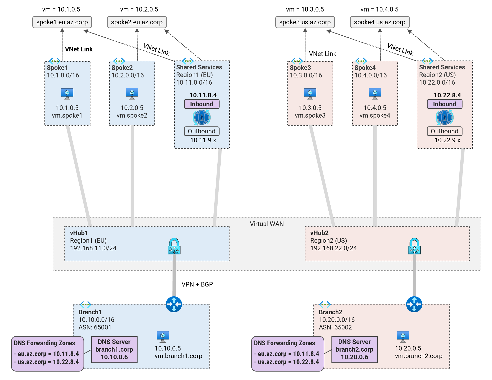

## 3. DNS Resolution between Spokes <!-- omit from toc -->

MicroHack MH51: Private DNS in Virtual WAN <!-- omit from toc -->

[← Previous](./2.%20DNS%20Resolution%20from%20Azure%20to%20On-premises.md) | [Next →](./4.%20DNS%20Resolution%20from%20On-premises%20to%20Azure.md)


Contents

- [Pre-requisites](#pre-requisites)
- [Overview](#overview)
- [Task 1: Inter-Spoke (Intra-Region DNS Forwarding)](#task-1-inter-spoke-intra-region-dns-forwarding)
- [Task 2 (Optional): Inter-Region using VNet Link (Spoke1 to Spoke3)](#task-2-optional-inter-region-using-vnet-link-spoke1-to-spoke3)
- [Task 3: Inter-Spoke (Cross-Region DNS Forwarding)](#task-3-inter-spoke-cross-region-dns-forwarding)
- [Review](#review)

## Pre-requisites

Ensure that you have completed the previous exercise - [2. DNS Resolution from Azure to On-premises](./2.%20DNS%20Resolution%20from%20Azure%20to%20On-premises.md).

## Overview

In this exercise, we will configure DNS resolution between spokes using the private DNS resolver [distributed DNS architecture](https://learn.microsoft.com/en-us/azure/dns/private-resolver-architecture#distributed-dns-architecture). In this architecture pattern, spoke VNets are configured to use [Azure-provided DNS](https://learn.microsoft.com/en-us/azure/virtual-network/virtual-networks-name-resolution-for-vms-and-role-instances?tabs=redhat#azure-provided-name-resolution) for all DNS resolution. The spoke VNets are also linked to forwarding rulesets that define how DNS queries to private DNS zones are forwarded.

This is similar to our scenario. The spoke VNets are already configured to use the default Azure DNS server as confirmed in [*Exercise 1, Task 3*](./1.%20Private%20DNS%20Zones,%20Vnet%20links%20and%20DNS%20Auto-registration.md#task-3-test-dns-resolution-in-spoke1). We now need to configure additional forwarding rules to allow DNS resolution between spokes. To achieve this, we will add new forwarding rules to the rulesets created in [*Exercise 2, Task 3*](./2.%20DNS%20Resolution%20from%20Azure%20to%20On-premises.md#task-3-create-dns-forwarding-rulesets).

## Task 1: Inter-Spoke (Intra-Region DNS Forwarding)

In this task, we will configure DNS forwarding rules to allow DNS resolution between spokes.



🔍 DNS query process for ***vm.spoke2.eu.az.corp***:
1. Spoke1 VM’s Vnet is configured to use the default (Azure-provided) DNS servers for all DNS resolution.
2. All private DNS zones linked to the VM’s VNet are checked for DNS suffix match. No match is found for ***spoke2.eu.az.corp***.
3. All rulesets linked to the VM’s Vnet are checked for a DNS suffix match in the rules.  A rule match is found for ***eu.az.corp***.
4. The outbound endpoint ***10.11.9.x*** forwards the DNS query to the DNS inbound endpoint ***10.11.8.4***.
5. The [DNS query received by the inbound endpoint is resolved by Azure DNS](https://learn.microsoft.com/en-us/azure/dns/private-resolver-endpoints-rulesets#inbound-endpoints).
6. All private DNS zones linked to the DNS resolver's VNet are checked for DNS suffix match. A match is found in zone ***spoke2.eu.az.corp*** and the record for ***vm.spoke2.eu.az.corp*** is returned to spoke1 VM.

Let's configure the required forwarding rules.

⚙️ 1\. Save the environment variables

```sh
export PREFIX=Vwan_Dns
export RG_NAME=${PREFIX}RG
```

⚙️ 2\. Login to the ***spoke1*** virtual machine `Vwan_Dns-spoke1-vm` via the [serial console](https://learn.microsoft.com/en-us/troubleshoot/azure/virtual-machines/serial-console-overview#access-serial-console-for-virtual-machines-via-azure-portal):
* username = ***azureuser***
* password = ***Password123***

You should now be in a shell terminal session `azureuser@vm:~$` where we will run the following tests.

⚙️ 3\. Run a DNS query for `vm.spoke2.eu.az.corp`

```sh
nslookup vm.spoke2.eu.az.corp
```

Expected output:

```sh
azureuser@vm:~$ nslookup vm.spoke2.eu.az.corp
Server:         127.0.0.53
Address:        127.0.0.53#53

** server can't find vm.spoke2.eu.az.corp: NXDOMAIN
```

***Spoke2*** is not resolvable from ***spoke1***. This is expected as we have not configured DNS forwarding rules to allow this DNS resolution.

⚙️ 4\. Create DNS forwarding rule for ***eu.az.corp*** in ***region1*** ruleset.

```sh
az dns-resolver forwarding-rule create -g $RG_NAME \
--ruleset-name "shared1-dns-forwarding-ruleset" \
--name "azure-eu-rule" \
--domain-name "eu.az.corp." \
--forwarding-rule-state "Enabled" \
--target-dns-servers "[{ip-address:"10.11.8.4",port:53}]"
```

With this configuration, any DNS query matching ***eu.az.corp*** will be forwarded to the inbound endpoint ***10.11.8.4***.

⚙️ 5\. Return to `Vwan_Dns-spoke1-vm` console session and re-run the DNS query for `vm.spoke2.eu.az.corp`

```sh
nslookup vm.spoke2.eu.az.corp
```

Expected output:

```sh
azureuser@vm:~$ nslookup vm.spoke2.eu.az.corp
Server:         127.0.0.53
Address:        127.0.0.53#53

Non-authoritative answer:
Name:   vm.spoke2.eu.az.corp
Address: 10.2.0.5
```

We can now resolve ***vm.spoke2.eu.az.corp*** from ***spoke1***.

## Task 2 (Optional): Inter-Region using VNet Link (Spoke1 to Spoke3)

By design, we have so far, assumed that shared services VNets can only be linked to private DNS zones containing records for resources in the same region as the shared services VNet. This is not a strict requirement and just the assumption this microhack is based on. Customer requirements may vary.

We can configure the private DNS zones to be linked to VNets in other regions. This will allow DNS resolution between all spokes. An example is shown in the image below for resolution between ***spoke1*** and ***spoke3***. This works in the same way as DNS resolution between ***spoke1*** to ***spoke2*** described in [Task 1](#task-1-intra-region-spoke1-to-spoke2) above.


Feel free to try this out as an optional task. Test DNS resolution between ***spoke1*** and ***spoke3*** using the VNet link approach. With the shared services VNets linked to all spokes, we can now resolve DNS queries for any spoke from any other spoke. And as such, we would not require the forwarding rules configured in [Task 3](#task-3-inter-region-using-forwarding-rule-spoke1-to-spoke3) below.

In case you attempted this task, once you are done, delete all the configurations made in this task and proceed to the next task.

## Task 3: Inter-Spoke (Cross-Region DNS Forwarding)

In this task, we will configure DNS forwarding rules to allow DNS resolution between ***spoke1*** and ***spoke3*** using DNS forwarding between private DNS resolvers across the virtual WAN.


The DNS resolution works as follows:
1. ***Spoke1*** VM sends a DNS query for ***vm.spoke3.us.az.corp*** to Azure-provided DNS.
2. Azure DNS checks all Private DNS zones attached to the VM’s VNet and does not find a suffix match.
3. Azure DNS checks all rulesets linked to the VM’s VNet and finds a rule match for ***us.az.corp***.
4. The outbound endpoint ***10.11.9.x*** forwards the DNS query to the remote inbound endpoint ***10.22.8.4***.
5. The DNS query received on the inbound endpoint is [resolved by Azure DNS](https://learn.microsoft.com/en-us/azure/dns/private-resolver-endpoints-rulesets#inbound-endpoints).
6. Azure DNS checks for DNS suffix match in all private DNS zones linked to shared services VNet where the inbound endpoint exists. It finds a match in private DNS zone spoke3.us.az.corp. The A record for spoke3 VM ***10.3.0.5*** is obtained from the private DNS zone and returned to spoke1 VM.

Let's proceed with the configuration.

⚙️ 1\. Login to `Vwan_Dns-spoke1-vm` console session and run a DNS query for `vm.spoke3.us.az.corp`

```sh
nslookup vm.spoke3.us.az.corp
```

Expected output:

```sh
azureuser@vm:~$ nslookup vm.spoke3.us.az.corp
Server:         127.0.0.53
Address:        127.0.0.53#53

** server can't find vm.spoke3.us.az.corp: NXDOMAIN
```

***Spoke3*** is not resolvable from ***spoke1***. This is expected as we have not configured DNS forwarding rules to allow this DNS resolution.

⚙️ 2\. Create DNS forwarding rule for ***us.az.corp*** in ***region1*** ruleset.

```sh
az dns-resolver forwarding-rule create -g $RG_NAME \
--ruleset-name "shared1-dns-forwarding-ruleset" \
--name "azure-us-rule" \
--domain-name "us.az.corp." \
--forwarding-rule-state "Enabled" \
--target-dns-servers "[{ip-address:"10.22.8.4",port:53}]"
```

With this configuration, any DNS query matching ***us.az.corp*** will be forwarded to the inbound endpoint ***10.22.8.4***.

⚙️ 3\. Return to `Vwan_Dns-spoke1-vm` console session and re-run the DNS query for `vm.spoke3.us.az.corp`

```sh
nslookup vm.spoke3.us.az.corp
```

Expected output:

```sh
azureuser@vm:~$ nslookup vm.spoke3.us.az.corp
Server:         127.0.0.53
Address:        127.0.0.53#53

Non-authoritative answer:
Name:   vm.spoke3.us.az.corp
Address: 10.3.0.5
```

We can now resolve ***vm.spoke3.us.az.corp*** from ***spoke1***.

So far we have configured ruleset rules in ***region1*** DNS resolver. For the sake of completeness, let's configure the ruleset rules in ***region2*** DNS resolver.

⚙️ 4\. Create DNS forwarding rule for ***eu.az.corp*** in ***region2*** ruleset.

```sh
az dns-resolver forwarding-rule create -g $RG_NAME \
--ruleset-name "shared2-dns-forwarding-ruleset" \
--name "azure-eu-rule" \
--domain-name "eu.az.corp." \
--forwarding-rule-state "Enabled" \
--target-dns-servers "[{ip-address:"10.11.8.4",port:53}]"
```

⚙️ 5\. Create DNS forwarding rule for ***us.az.corp*** in ***region2*** ruleset.

```sh
az dns-resolver forwarding-rule create -g $RG_NAME \
--ruleset-name "shared2-dns-forwarding-ruleset" \
--name "azure-us-rule" \
--domain-name "us.az.corp." \
--forwarding-rule-state "Enabled" \
--target-dns-servers "[{ip-address:"10.22.8.4",port:53}]"
```

With this configuration, every spoke should be able to resolve DNS names in all other spokes and on-premises.

⚙️ 6\. (Optional) Login to all the spoke VMs and run the `ping-dns` script to test DNS resolution to all destinations. Compare your results to the expected result in the file [ping-dns-expected.txt](../tests/ping-dns-expected.txt).


## Review

You have successfully configured DNS resolution between spokes using various approaches.

## NEXT STEP <!-- omit from toc -->
Go to exercise - [4. DNS Resolution from On-premises to Azure](./4.%20DNS%20Resolution%20from%20On-premises%20to%20Azure.md)

[← Previous](./2.%20DNS%20Resolution%20from%20Azure%20to%20On-premises.md) | [Next →](./4.%20DNS%20Resolution%20from%20On-premises%20to%20Azure.md)
