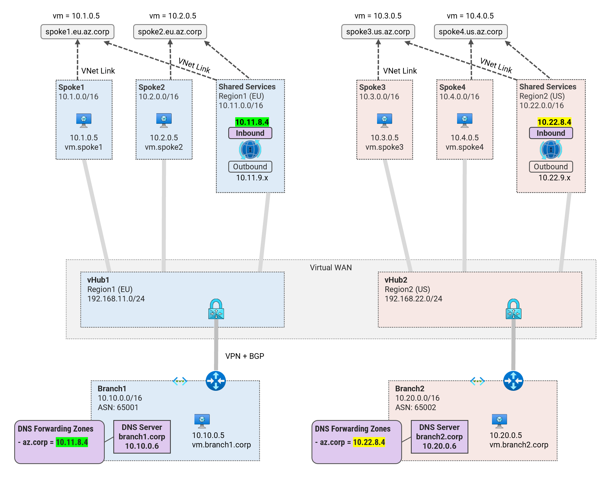
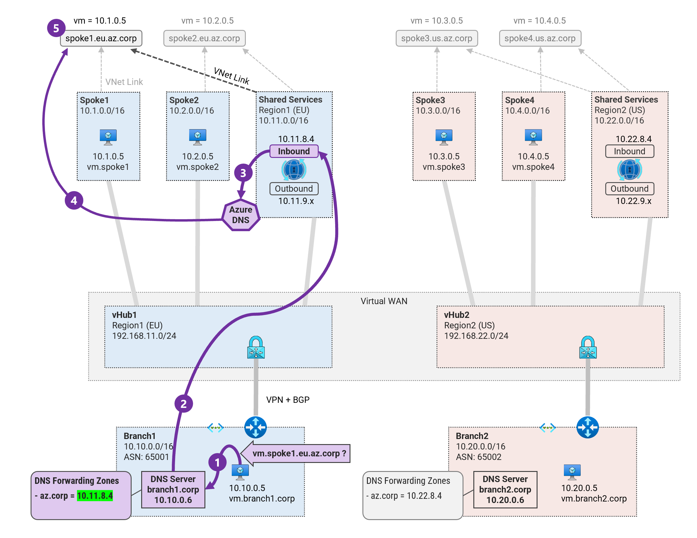
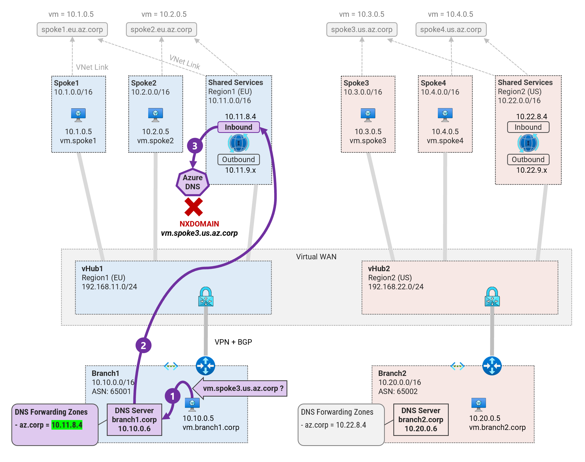

## 3. DNS Resolution from On-premises to Azure <!-- omit from toc -->

MicroHack MH51: Private DNS in Virtual WAN <!-- omit from toc -->

[← Previous](./2.%20DNS%20Resolution%20from%20Azure%20to%20On-premises.md) | [Next →](./4.%20DNS%20Resolution%20between%20Spokes.md)

Contents

- [Prerequisites](#prerequisites)
- [Overview](#overview)
- [Task 1: Test DNS Resolution from On-premises to Spoke1](#task-1-test-dns-resolution-from-on-premises-to-spoke1)
- [Task 2: Configure On-premises DNS Forwarding](#task-2-configure-on-premises-dns-forwarding)
- [Task 3: Test DNS Resolution from On-premises to Spoke1](#task-3-test-dns-resolution-from-on-premises-to-spoke1)
- [Task 4: Test DNS Resolution from On-premises to Spoke3](#task-4-test-dns-resolution-from-on-premises-to-spoke3)
- [Review!](#review)

## Prerequisites

Ensure you have completed the previous exercise - [2. DNS Resolution from Azure to On-premises](./2.%20DNS%20Resolution%20from%20Azure%20to%20On-premises.md).

## Overview

In this exercise, we will configure DNS forwarding from on-premises to Azure. This will allow on-premises servers to resolve DNS records hosted in Azure.



## Task 1: Test DNS Resolution from On-premises to Spoke1

We will test DNS resolution for ***vm.spoke1.eu.az.corp*** in the on-premises server ***Vwan_Dns-branch1-vm***.

1\. Save the environment variables

```sh
export PREFIX=Vwan_Dns
export RG_NAME=${PREFIX}RG
export REGION1=northeurope
export REGION2=eastus
export SHARED1_VNET_NAME="${PREFIX}-shared1-vnet"
export SHARED2_VNET_NAME="${PREFIX}-shared2-vnet"
export SHARED1_DNS_RESOLVER_NAME="${PREFIX}-shared1-dns-resolver"
export SHARED2_DNS_RESOLVER_NAME="${PREFIX}-shared2-dns-resolver"
```

In this lab, the on-premises servers are configured to use the on-premises custom DNS server running unbound. The unbound DNS server is authoritative for the ***.corp*** domain; and hence why it could resolve ***vm.branch1.corp*** in [Task 6](#task-6-test-dns-resolution-from-spoke1-to-on-premises). This task will focus on configuring and testing DNS forwarding on-premises.

1\. Verify that the VNet of `Vwan_Dns-branch1-vm` is configured to use the on-premises custom DNS server.

```sh
az network vnet show -g $RG_NAME -n ${PREFIX}-branch1-vnet --query "dhcpOptions.dnsServers"
```
Expected output:

```sh
[
  "10.10.0.6"
]
```

This confirms that our on-premises DNS server will be used for all DNS queries from on-premises VMs.

2\. Login to the on-premises server `Vwan_Dns-branch1-vm` via the [serial console](https://learn.microsoft.com/en-us/troubleshoot/azure/virtual-machines/serial-console-overview#access-serial-console-for-virtual-machines-via-azure-portal):
* username = ***azureuser***
* password = ***Password123***

You should now be in a shell terminal session `azureuser@vm:~$` where we will run the following test.

3\. Run a DNS query to resolve the on-premises DNS ***vm.spoke1.eu.az.corp***.

```sh
nslookup vm.spoke1.eu.az.corp
```

Expected output:

```sh
azureuser@vm:~$ nslookup vm.spoke1.eu.az.corp
Server:         127.0.0.53
Address:        127.0.0.53#53

** server can't find vm.spoke1.eu.az.corp: NXDOMAIN
```

This confirms that we cannot resolve the DNS record for ***vm.spoke1.eu.az.corp*** from on-premises.

## Task 2: Configure On-premises DNS Forwarding

1\. Login to the on-premises server `Vwan_Dns-branch1-dns` via the [serial console](https://learn.microsoft.com/en-us/troubleshoot/azure/virtual-machines/serial-console-overview#access-serial-console-for-virtual-machines-via-azure-portal):
* username = ***azureuser***
* password = ***Password123***

You should now be in a shell terminal session `azureuser@dns:~$` where we will configure DNS forwarding.

2\. View the DNS configuration file `/etc/unbound/unbound.conf.d/forward.conf`.

```sh
cat /etc/unbound/unbound.conf
```

Sample output:

```sh
azureuser@dns:~$ cat /etc/unbound/unbound.conf
server:
        port: 53
        do-ip4: yes
        do-udp: yes
        do-tcp: yes

        interface: 0.0.0.0

        access-control: 0.0.0.0 deny
        access-control: 10.0.0.0/8 allow
        access-control: 172.16.0.0/12 allow
        access-control: 192.168.0.0/16 allow
        access-control: 100.64.0.0/10 allow
        access-control: 127.0.0.0/8 allow
        access-control: 35.199.192.0/19 allow

        # local data records
        local-data: "vm.branch1.corp 300 IN A 10.10.0.5"
        local-data: "vm.branch2.corp 300 IN A 10.30.0.5"

        # hosts redirected to PrivateLink


forward-zone:
        name: "."
        forward-addr: 168.63.129.16
```

Currently, the unbound DNS server can only resolve local zones records which it is authoritative for - i.e. `vm.branch1.corp` and `vm.branch2.corp`. It can also resolve public DNS via Azure DNS - 168.63.129.16.

We need to configure additional forward-zones to allow DNS forwarding to Azure.

3\. Add the DNS forwarding to the config file `/etc/unbound/unbound.conf.d/forward.conf`.

```sh
sudo su
cat << EOF >> /etc/unbound/unbound.conf

forward-zone:
        name: "az.corp"
        forward-addr: 10.11.8.4
EOF
exit
```

4\. Restart the unbound DNS server.

```sh
sudo systemctl restart unbound
```

5\. Run a DNS query to resolve the on-premises DNS ***vm.spoke1.eu.az.corp***.

```sh
nslookup vm.spoke1.eu.az.corp
```

Expected output:

```sh
azureuser@dns:~$ nslookup vm.spoke1.eu.az.corp
Server:         127.0.0.1
Address:        127.0.0.1#53

Non-authoritative answer:
Name:   vm.spoke1.eu.az.corp
Address: 10.1.0.5
```

This confirms that we have successfully configured DNS forwarding from on-premises to Azure.

## Task 3: Test DNS Resolution from On-premises to Spoke1

1\. Log back into the on-premises server `Vwan_Dns-branch1-vm` via the serial console

2\. Run a DNS query to resolve the on-premises DNS ***vm.spoke1.eu.az.corp***.

```sh
nslookup vm.spoke1.eu.az.corp
```

Expected output:

```sh
azureuser@vm:~$ nslookup vm.spoke1.eu.az.corp
Server:         127.0.0.53
Address:        127.0.0.53#53

Non-authoritative answer:
Name:   vm.spoke1.eu.az.corp
Address: 10.1.0.5
```

We can now resolve the DNS record for ***vm.spoke1.eu.az.corp*** from on-premises.



The DNS resolution steps are as follows:
1. Branch1 VM sends query for `vm.spoke1.eu.az.corp` to the onprem DNS resolver.
2. The onprem DNS resolver forwards the query to the DNS inbound endpoint
3. The DNS query received by the inbound endpoint is resolved by Azure DNS.
4. Azure DNS checks for DNS suffix match in all private DNS zones linked to ***shared1*** Vnet where the inbound endpoint exists. It finds a match in private DNS zone spoke1.eu.az.corp
5. The A record for spoke1 VM 10.1.0.5 is obtained from the private DNS zone and returned to the onprem DNS resolver, and then to the ***branch1*** VM.


## Task 4: Test DNS Resolution from On-premises to Spoke3

3\. Run a DNS query to resolve the on-premises DNS ***vm.spoke3.eu.az.corp***.

```sh
nslookup vm.spoke3.eu.az.corp
```

Expected output:

```sh
azureuser@vm:~$ nslookup vm.spoke3.eu.az.corp
Server:         127.0.0.53
Address:        127.0.0.53#53

** server can't find vm.spoke3.eu.az.corp: NXDOMAIN
```

We cannot resolve the DNS record for ***vm.spoke3.eu.az.corp*** from on-premises.



The DNS resolution steps are as follows:
1. Branch1 VM sends query for `vm.spoke3.us.az.corp` to the onprem DNS resolver.
2. The onprem DNS resolver forwards the query to the DNS inbound endpoint 10.11.8.4.
3. The DNS query received by the inbound endpoint is resolved by Azure DNS.
4. Azure DNS checks for DNS suffix match in all private DNS zones linked to ***shared1*** Vnet where the inbound endpoint exists. It returns **NXDOMAIN** because the shared services VNet is not linked to the zone `spoke3.us.az.corp`.

This will be fixed in the next exercise where we will configure DNS resolution between spokes.

## Review!

You have learned how to configure DNS forwarding from on-premises to Azure. The private DNS resolver inbound endpoint is the target for the on-premises DNS forwarding.

## NEXT STEP <!-- omit from toc -->
Go to exercise - [4. DNS Resolution between Spokes](./4.%20DNS%20Resolution%20between%20Spokes.md)

[← Previous](./2.%20DNS%20Resolution%20from%20Azure%20to%20On-premises.md) | [Next →](./4.%20DNS%20Resolution%20between%20Spokes.md)
