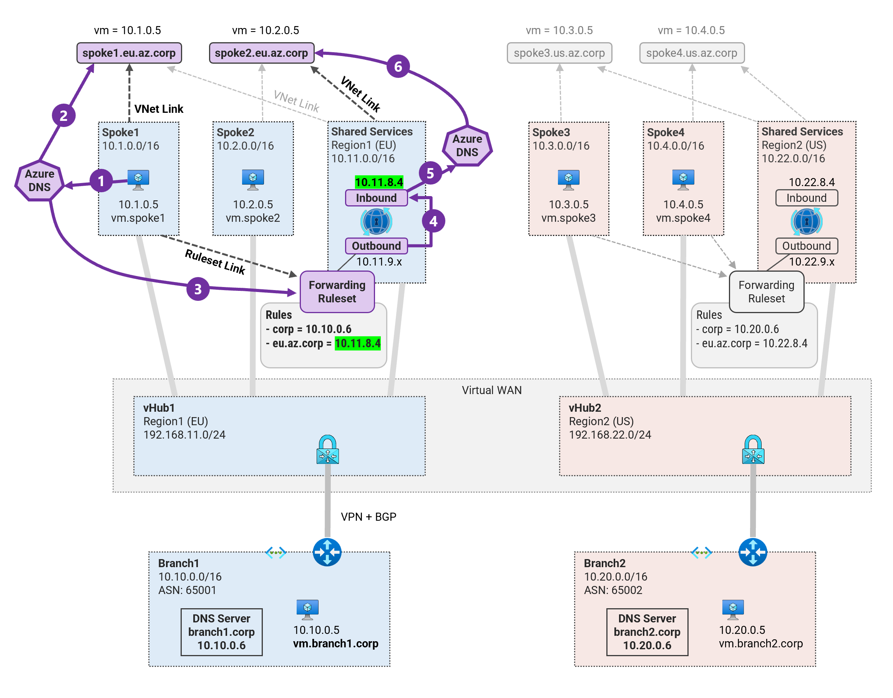
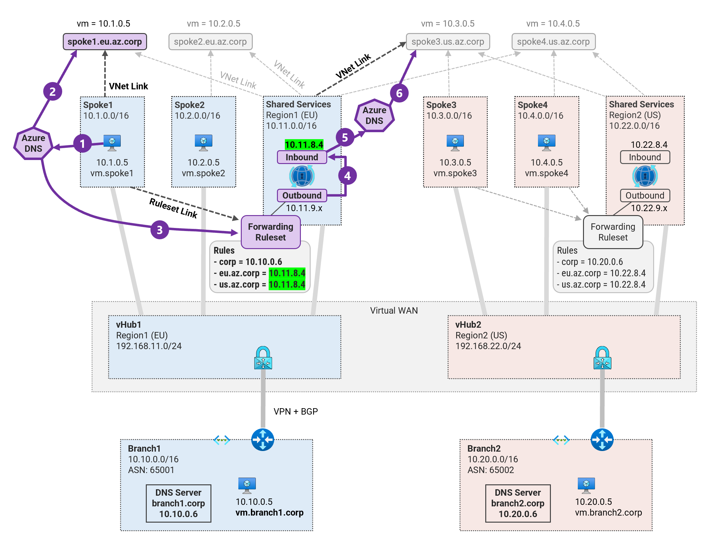
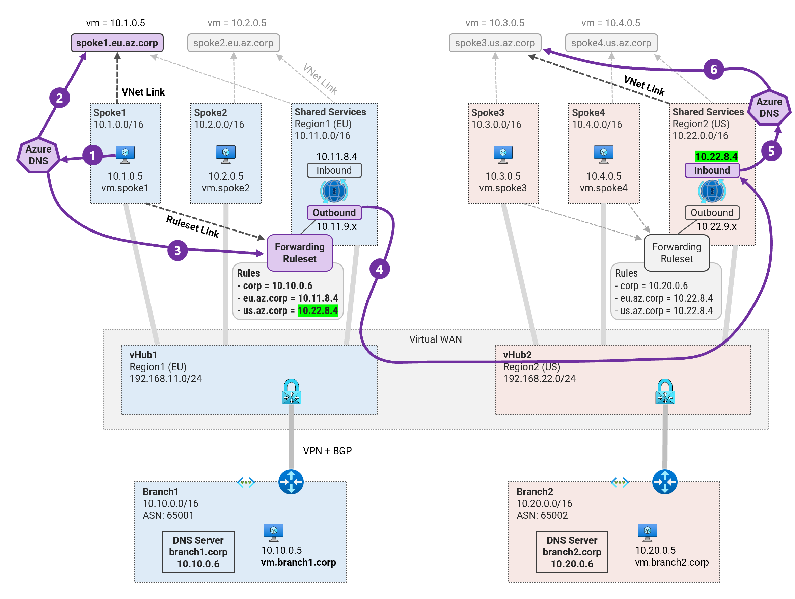

## 4. DNS Resolution between Spokes <!-- omit from toc -->

MicroHack MH51: Private DNS in Virtual WAN <!-- omit from toc -->

[← Previous](./3.%20DNS%20Resolution%20from%20On-premises%20to%20Azure.md) | [Next →](./5.%20High%20Availability%20(HA)%20and%20Disaster%20Recovery%20(DR).md)


Contents

- [Pre-requisites](#pre-requisites)
- [Overview](#overview)
- [Task 1: Intra-Region (Spoke1 to Spoke2)](#task-1-intra-region-spoke1-to-spoke2)
- [Task 2 (Optional): Inter-Region using VNet Link (Spoke1 to Spoke3)](#task-2-optional-inter-region-using-vnet-link-spoke1-to-spoke3)
- [Task 3: Inter-region using Forwarding Rule (Spoke1 to Spoke3)](#task-3-inter-region-using-forwarding-rule-spoke1-to-spoke3)
- [Review](#review)

## Pre-requisites

Ensure you have completed the previous exercise - [2. DNS Resolution from Azure to On-premises](./2.%20DNS%20Resolution%20from%20Azure%20to%20On-premises.md).

## Overview

In this exercise we will configure DNS resolution between spokes. In order to allow DNS resolution between spokes, we will extend the configuration of the DNS forwarding rule created in [Exercise 2, Task 4](./2.%20DNS%20Resolution%20from%20Azure%20to%20On-premises.md#task-4-create-dns-forwarding-rules) to allow resolution between spokes.

## Task 1: Intra-Region (Spoke1 to Spoke2)

In this task, we will configure DNS forwarding rules to allow DNS resolution between ***spoke1*** and ***spoke2***.



The DNS resolution wroks as follows:
1. ***Spoke1*** VM sends a DNS query for ***vm.spoke2.eu.az.corp*** to Azure-provided DNS.
2. Azure DNS checks all Private DNS zones attached to the VM’s Vnet and does not find a suffix match.
3. Azure DNS checks all rulesets linked to the VM’s Vnet and finds a rule match for ***eu.az.corp***.
4. The outbound endpoint ***10.11.9.x*** forwards the DNS query to the inbound endpoint ***10.11.8.4***.
5. The DNS query received on the inbound endpoint is [resolved by Azure DNS](https://learn.microsoft.com/en-us/azure/dns/private-resolver-endpoints-rulesets#inbound-endpoints).
6. Azure DNS checks for DNS suffix match in all private DNS zones linked to Shared Services Vnet where the inbound endpoint exists. It finds a match in private DNS zone spoke2.eu.az.corp. The A record for spoke2 VM ***10.2.0.5*** is obtained from the private DNS zone and returned to spoke1 VM.


Let's proceed with the configuration.

1\. Save the environment variables

```sh
export PREFIX=Vwan_Dns
export RG_NAME=${PREFIX}RG
export REGION1=northeurope
export REGION2=eastus
export SHARED1_VNET_NAME="${PREFIX}-shared1-vnet"
export SHARED2_VNET_NAME="${PREFIX}-shared2-vnet"
export SHARED1_DNS_RESOLVER_NAME="${PREFIX}-shared1-dns-resolver"
export SHARED2_DNS_RESOLVER_NAME="${PREFIX}-shared2-dns-resolver"
```

2\. Login to the ***spoke1*** virtual machine `Vwan_Dns-spoke1-vm` via the [serial console](https://learn.microsoft.com/en-us/troubleshoot/azure/virtual-machines/serial-console-overview#access-serial-console-for-virtual-machines-via-azure-portal):
* username = ***azureuser***
* password = ***Password123***

You should now be in a shell terminal session `azureuser@vm:~$` where we will run the following tests.

3\. Run a DNS query for `vm.spoke2.eu.az.corp`

```sh
nslookup vm.spoke2.eu.az.corp
```

Expected output:

```sh

```

***Spoke2*** is not resolvable from ***spoke1***. This is expected as we have not configured DNS forwarding rules to allow this DNS resolution.

4\. Create DNS forwarding rule for ***eu.az.corp*** in ***region1*** ruleset.

```sh
az dns-resolver forwarding-rule create -g $RG_NAME \
--ruleset-name "shared1-dns-forwarding-ruleset" \
--name "azure-eu-rule" \
--domain-name "eu.az.corp." \
--forwarding-rule-state "Enabled" \
--target-dns-servers "[{ip-address:"10.11.8.4",port:53}]"
```

With this configuration, any DNS query matching ***eu.az.corp*** will be forwarded to the inbound endpoint ***10.11.8.4***.

5\. Return to `Vwan_Dns-spoke1-vm` console session and re-run the DNS query for `vm.spoke2.eu.az.corp`

```sh
nslookup vm.spoke2.eu.az.corp
```

Expected output:

```sh
azureuser@vm:~$ nslookup vm.spoke2.eu.az.corp
Server:         127.0.0.53
Address:        127.0.0.53#53

Non-authoritative answer:
Name:   vm.spoke2.eu.az.corp
Address: 10.2.0.5
```

We should now be able to resolve ***vm.spoke2.eu.az.corp*** from ***spoke1***.

## Task 2 (Optional): Inter-Region using VNet Link (Spoke1 to Spoke3)

By design, we have so far assumed that shared services VNets can only be linked to private DNS zones containing records for resources in the same region as the shared services VNet. This is not a strict requirement.

We can configure the private DNS zones to be linked to VNets in other regions. This will allow DNS resolution between all spokes. An example is shown in the image below for resolution between ***spoke1*** and ***spoke3***. This works in the same way as DNS resolution between ***spoke1*** to ***spoke2*** described in [Task 1](#task-1-intra-region-spoke1-to-spoke2) above.



Feel free to try this out as an optional task.

## Task 3: Inter-region using Forwarding Rule (Spoke1 to Spoke3)

In this task, we will configure DNS forwarding rules to allow DNS resolution between ***spoke1*** and ***spoke3*** using DNS forwarding across the virtual WAN.



The DNS resolution works as follows:
1. ***Spoke1*** VM sends a DNS query for ***vm.spoke3.us.az.corp*** to Azure-provided DNS.
2. Azure DNS checks all Private DNS zones attached to the VM’s Vnet and does not find a suffix match.
3. Azure DNS checks all rulesets linked to the VM’s Vnet and finds a rule match for ***us.az.corp***.
4. The outbound endpoint ***10.11.9.x*** forwards the DNS query to the remote inbound endpoint ***10.22.8.4***.
5. The DNS query received on the inbound endpoint is [resolved by Azure DNS](https://learn.microsoft.com/en-us/azure/dns/private-resolver-endpoints-rulesets#inbound-endpoints).
6. Azure DNS checks for DNS suffix match in all private DNS zones linked to shared services Vnet where the inbound endpoint exists. It finds a match in private DNS zone spoke3.us.az.corp. The A record for spoke3 VM ***10.3.0.5*** is obtained from the private DNS zone and returned to spoke1 VM.

Let's proceed with the configuration.

1\. Login to `Vwan_Dns-spoke1-vm` console session and run a DNS query for `vm.spoke3.us.az.corp`

```sh
nslookup vm.spoke3.us.az.corp
```

Expected output:

```sh

```

***Spoke3*** is not resolvable from ***spoke1***. This is expected as we have not configured DNS forwarding rules to allow this DNS resolution.

2\. Create DNS forwarding rule for ***us.az.corp*** in ***region1*** ruleset.

```sh
az dns-resolver forwarding-rule create -g $RG_NAME \
--ruleset-name "shared1-dns-forwarding-ruleset" \
--name "azure-us-rule" \
--domain-name "us.az.corp." \
--forwarding-rule-state "Enabled" \
--target-dns-servers "[{ip-address:"10.22.8.4",port:53}]"
```

With this configuration, any DNS query matching ***us.az.corp*** will be forwarded to the inbound endpoint ***10.22.8.4***.

3\. Return to `Vwan_Dns-spoke1-vm` console session and re-run the DNS query for `vm.spoke3.us.az.corp`

```sh
nslookup vm.spoke3.us.az.corp
```

Expected output:

```sh
azureuser@vm:~$ nslookup vm.spoke3.us.az.corp
Server:         127.0.0.53
Address:        127.0.0.53#53

Non-authoritative answer:
Name:   vm.spoke3.us.az.corp
Address: 10.3.0.5
```

We should now be able to resolve ***vm.spoke3.us.az.corp*** from ***spoke1***.

So far we have completed the configuration of the rulest rules in ***region1***. For the sake of completeness, let's configure the rules for ***region2*** ruleset.

4\. Create DNS forwarding rule for ***eu.az.corp*** in ***region2*** ruleset.

```sh
az dns-resolver forwarding-rule create -g $RG_NAME \
--ruleset-name "shared2-dns-forwarding-ruleset" \
--name "azure-eu-rule" \
--domain-name "eu.az.corp." \
--forwarding-rule-state "Enabled" \
--target-dns-servers "[{ip-address:"10.11.8.4",port:53}]"
```

5\. Create DNS forwarding rule for ***us.az.corp*** in ***region2*** ruleset.

```sh
az dns-resolver forwarding-rule create -g $RG_NAME \
--ruleset-name "shared2-dns-forwarding-ruleset" \
--name "azure-us-rule" \
--domain-name "us.az.corp." \
--forwarding-rule-state "Enabled" \
--target-dns-servers "[{ip-address:"10.22.8.4",port:53}]"
```

## Review

You have successfully configured DNS resolution between spokes using various approaches.

## NEXT STEP <!-- omit from toc -->
Go to exercise - [5. High Availability (HA) and Disaster Recovery (DR)](./5.%20High%20Availability%20(HA)%20and%20Disaster%20Recovery%20(DR).md)

[← Previous](./3.%20DNS%20Resolution%20from%20On-premises%20to%20Azure.md) | [Next →](./5.%20High%20Availability%20(HA)%20and%20Disaster%20Recovery%20(DR).md)
