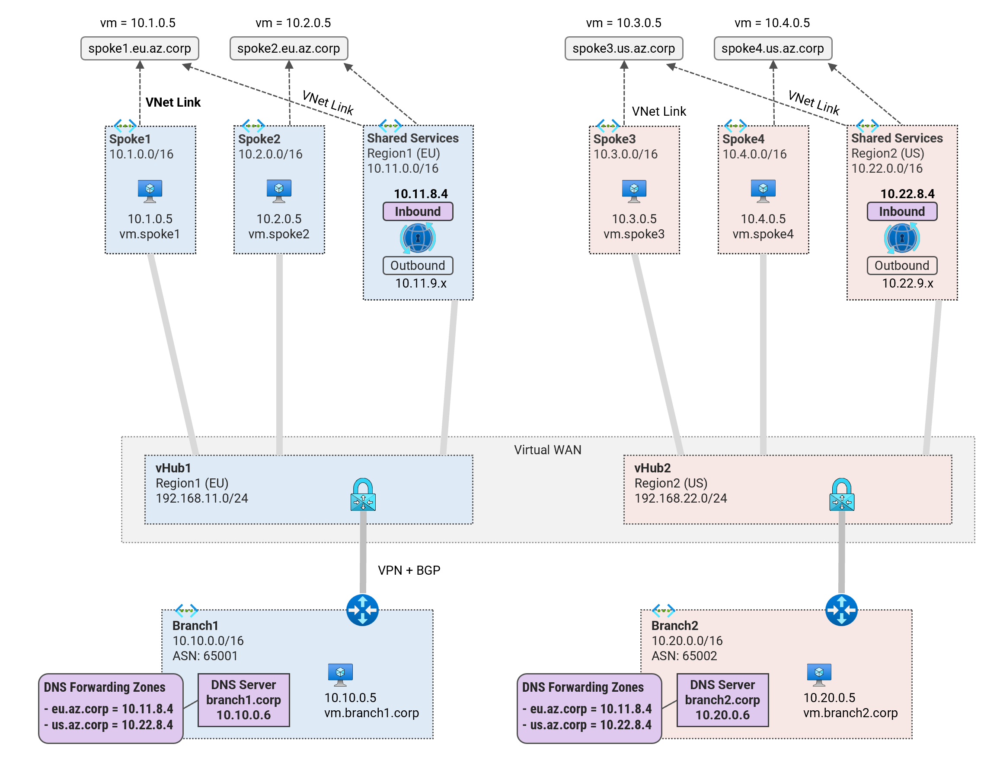
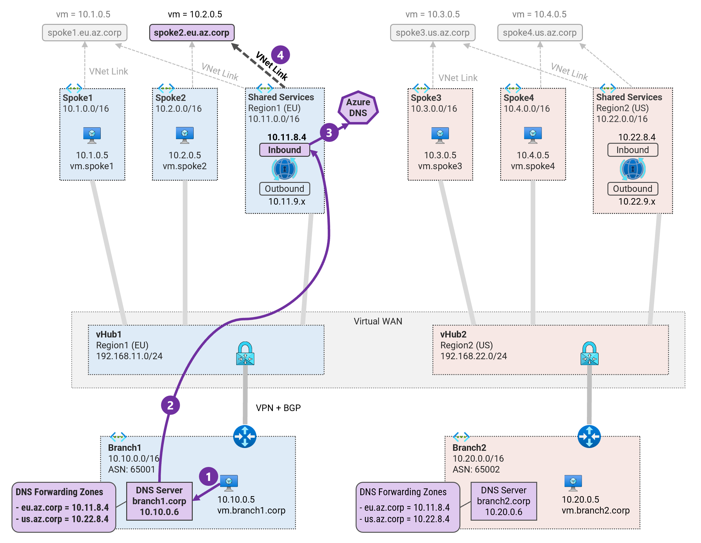

## 4. DNS Resolution from On-premises to Azure <!-- omit from toc -->

MicroHack MH51: Private DNS in Virtual WAN <!-- omit from toc -->

[← Previous](./3.%20DNS%20Resolution%20between%20Spokes.md) | [Next →](./5.%20PrivateLink.md)

Contents

- [Prerequisites](#prerequisites)
- [Overview](#overview)
- [Task 1: Test DNS Resolution from On-premises to Spoke1](#task-1-test-dns-resolution-from-on-premises-to-spoke1)
- [Task 2: Configure On-premises DNS Forwarding](#task-2-configure-on-premises-dns-forwarding)
- [Task 3 (Optional): Test DNS Resolution from On-premises](#task-3-optional-test-dns-resolution-from-on-premises)
- [Review](#review)

## Prerequisites

Ensure that you have completed the previous exercise - [3. DNS Resolution between Spokes](./3.%20DNS%20Resolution%20between%20Spokes.md).

## Overview

In this exercise, we will configure DNS forwarding from on-premises to Azure. This will allow on-premises servers to resolve DNS records hosted in Azure spokes.



The on-premises DNS serves are configured to forward DNS queries to the private DNS resolver inbound endpoints. Queries for `eu.az.corp` will be forwarded to the inbound endpoint in the ***shared1*** VNet. Queries for `us.az.corp` will be forwarded to the inbound endpoint in the ***shared1*** VNet.

## Task 1: Test DNS Resolution from On-premises to Spoke1

We will test DNS resolution to ***vm.spoke2.eu.az.corp*** from the on-premises server ***Vwan_Dns-branch1-vm***.

⚙️ **1\.** Save the environment variables

```bash
export PREFIX=Vwan_Dns
export RG_NAME=${PREFIX}RG
```

In this lab, the on-premises servers are configured to use the on-premises custom DNS server running unbound. The unbound DNS server is authoritative for the ***.corp*** domain and already contains the on-premises records. This task will focus on configuring and testing DNS forwarding on-premises.

⚙️ **2\.** Verify that the VNet of `Vwan_Dns-branch1-vm` is configured to use the on-premises custom DNS server ***10.10.0.6***.

```bash
az network vnet show -g $RG_NAME -n ${PREFIX}-branch1-vnet --query "dhcpOptions.dnsServers"
```
Expected output:

```bash
[
  "10.10.0.6"
]
```

This confirms that our on-premises VM will use the on-premises DNS server **10.10.0.6** for all DNS resolution.

## Task 2: Configure On-premises DNS Forwarding



🔍 DNS query process for ***vm.spoke2.eu.az.corp***:

1. Branch1 VM is configured to use custom DNS server and sends query for ***vm.spoke2.eu.az.corp*** to the onprem DNS resolver.
2. The onprem DNS resolver is configured to forward Azure DNS queries ***eu.az.corp*** to the DNS inbound endpoint ***10.11.8.4***.
3. The DNS query received by the inbound endpoint is [resolved by Azure DNS](https://learn.microsoft.com/en-us/azure/dns/private-resolver-endpoints-rulesets#inbound-endpoints).
4. All private DNS zones linked to the DNS resolver’s VNet are checked for DNS suffix match. A match is found ***(spoke2.eu.az.corp)*** and the record for **vm.spoke2.eu.az.corp** is returned to the branch1 VM.

⚙️ **1\.** Login to the on-premises server `Vwan_Dns-branch1-dns` via the [serial console](https://learn.microsoft.com/en-us/troubleshoot/azure/virtual-machines/serial-console-overview#access-serial-console-for-virtual-machines-via-azure-portal):
* username = ***azureuser***
* password = ***Password123***

You should now be in a shell terminal session `azureuser@dns:~$` where we will configure DNS forwarding.

⚙️ **2\.** Run a DNS query to resolve the on-premises DNS ***vm.spoke2.eu.az.corp***.

```bash
nslookup vm.spoke2.eu.az.corp
```

Expected output:

```bash
azureuser@dns:~$ nslookup vm.spoke2.eu.az.corp
Server:         127.0.0.1
Address:        127.0.0.1#53

** server can't find vm.spoke2.eu.az.corp: NXDOMAIN
```

⚙️ **3\.** View the DNS configuration file `/etc/unbound/unbound.conf.d/forward.conf`.

```bash
cat /etc/unbound/unbound.conf
```

Sample output:

```bash
azureuser@dns:~$ cat /etc/unbound/unbound.conf
server:
        port: 53
        do-ip4: yes
        do-udp: yes
        do-tcp: yes

        interface: 0.0.0.0

        access-control: 0.0.0.0 deny
        access-control: 10.0.0.0/8 allow
        access-control: 172.16.0.0/12 allow
        access-control: 192.168.0.0/16 allow
        access-control: 100.64.0.0/10 allow
        access-control: 127.0.0.0/8 allow
        access-control: 35.199.192.0/19 allow

        # local data records
        local-data: "vm.branch1.corp 300 IN A 10.10.0.5"
        local-data: "vm.branch2.corp 300 IN A 10.30.0.5"


forward-zone:
        name: "."
        forward-addr: 168.63.129.16
```

The on-premises DNS server is authoritative for the `corp` domain and contains A records for `vm.branch1.corp` and `vm.branch2.corp`. It can also resolve public DNS via Azure DNS, 168.63.129.16.

We need to configure additional forward-zones to allow DNS forwarding to Azure.

⚙️ **3\.** Add the DNS forwarding to the config file `/etc/unbound/unbound.conf`.

```bash
sudo su
cat << EOF >> /etc/unbound/unbound.conf

forward-zone:
        name: "eu.az.corp"
        forward-addr: 10.11.8.4

forward-zone:
        name: "us.az.corp"
        forward-addr: 10.22.8.4
EOF
exit
```

⚙️ **4\.** Restart the unbound DNS server.

```bash
sudo systemctl restart unbound
```

⚙️ **5\.** Run a DNS query to resolve the on-premises DNS ***vm.spoke2.eu.az.corp***.

```bash
nslookup vm.spoke2.eu.az.corp
```

Expected output:

```bash
Server:         127.0.0.1
Address:        127.0.0.1#53

Non-authoritative answer:
Name:   vm.spoke2.eu.az.corp
Address: 10.2.0.5
```

We have successfully configured DNS forwarding from on-premises to Azure.

## Task 3 (Optional): Test DNS Resolution from On-premises

* Login to all branch VMs `Vwan_Dns-branch1-vm` and `Vwan_Dns-branch2-vm`
* Run the `ping-dns` script to test DNS resolution to all destinations.
* Compare your results to the expected result in the file [branch-dns-test.txt](../tests/branch-dns-test.txt).

## Review

You have configured DNS forwarding from on-premises to Azure. The private DNS resolver inbound endpoint is the target for the on-premises DNS forwarding.

## NEXT STEP <!-- omit from toc -->
Go to exercise - [5. High Availability (HA)](./5.%20High%20Availability%20(HA).md)

[← Previous](./3.%20DNS%20Resolution%20between%20Spokes.md) | [Next →](./5.%20PrivateLink.md)
