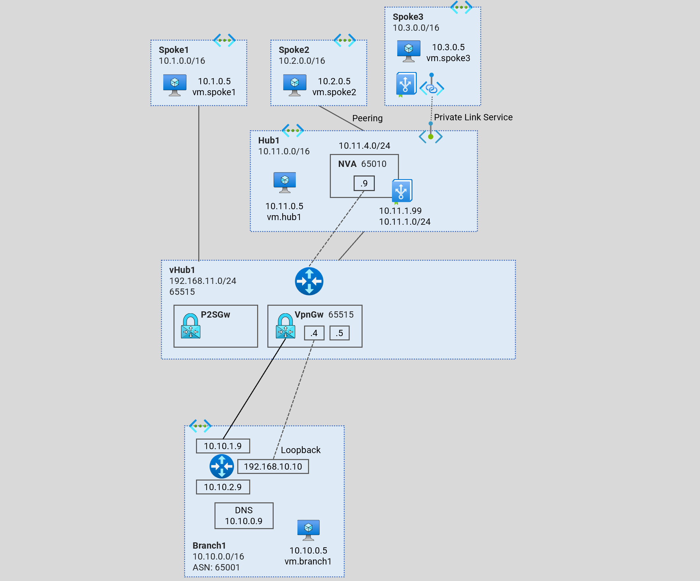
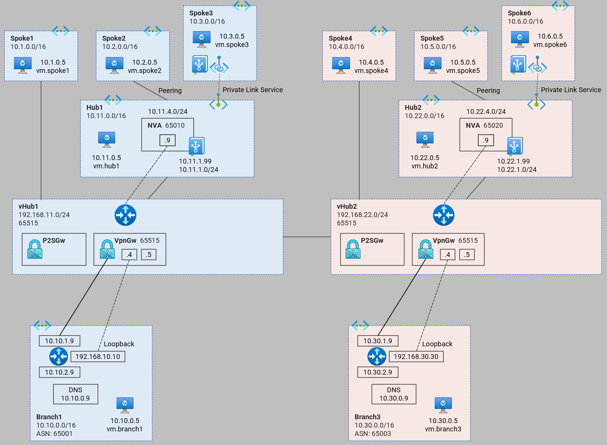
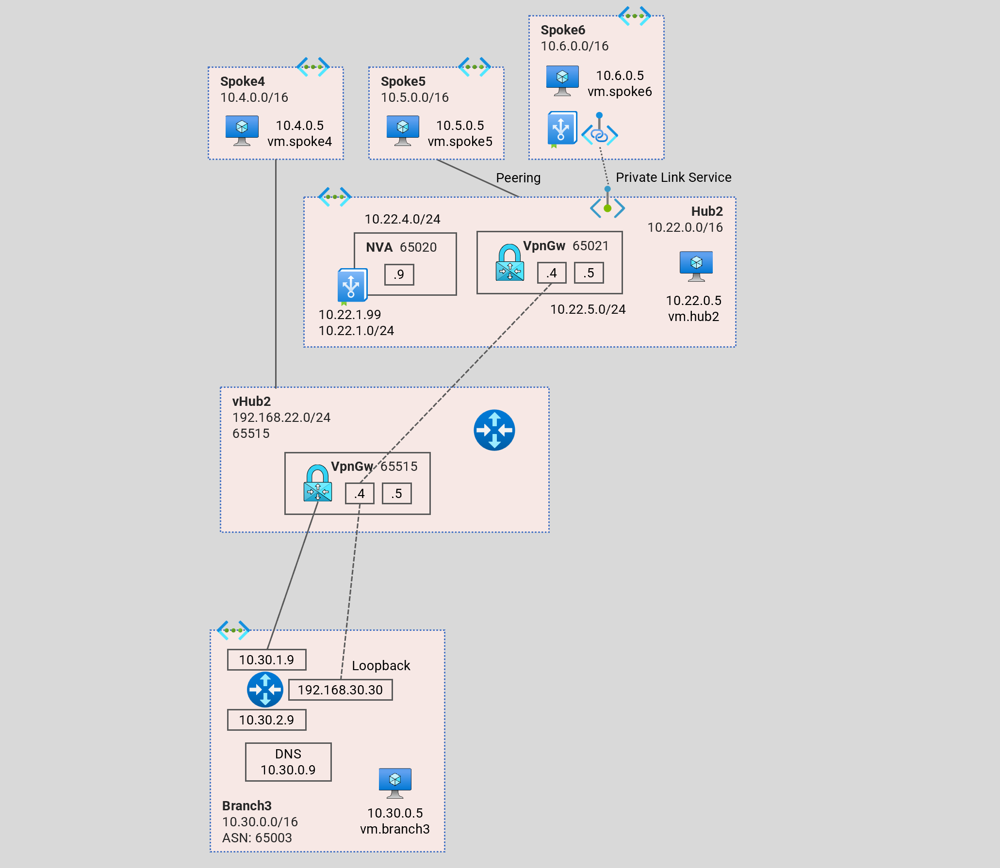
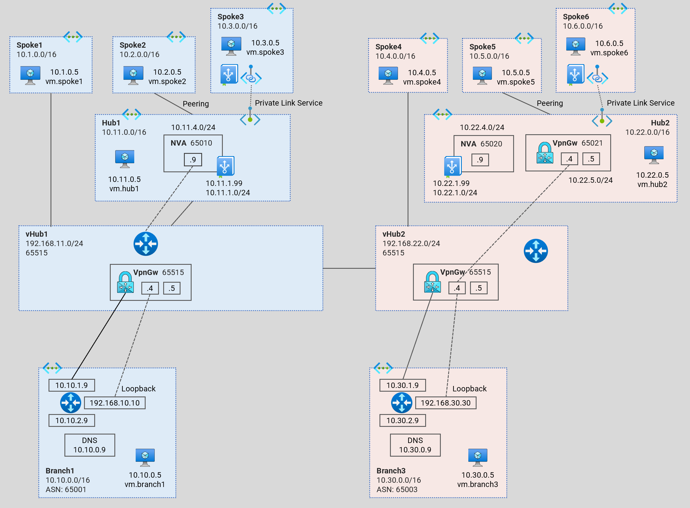

# Azure Network Topology - Terraform Examples

<!-- TOC -->
- [1. Hub and Spoke](#1-hub-and-spoke)
    - [1.1. Hub and Spoke (Single Region)](#1-1-hub-spoke-single-region)
    - [1.2. Hub and Spoke (Dual Region)](#1-2-hub-spoke-dual-region)
- [2. Virtual WAN](#2-virtual-wan)
    - [2.1. Virtual WAN (Single Hub)](#2-1-virtual-wan-single-hub)
    - [2.2. Virtual WAN (Dual Hub)](#2-2-Virtual-wan-dual-hub)
    - [2.3. Virtual WAN (Single Hub - Mixed)](#2-3-virtual-wan-single-hub-mixed)
    - [2.4. Virtual WAN (Dual Hub - Mixed)](#2-4-virtual-wan-dual-hub-mixed)
- [3. Virtual Network Manager](#3-virtual-network-manager)
- [4. General](#4-general)
<!-- /TOC -->

# [1. Hub and Spoke](./1-hub-and-spoke/)

## [1.1. Hub and Spoke (Single Region)](./1-hub-and-spoke/1-hub-spoke-single-region/)
This [terraform code](./1-hub-and-spoke/1-hub-spoke-single-region/) deploys a hub and spoke topology playground to observe dynamic routing with Azure Route Server (ARS) and a Network Virtual Appiance (NVA).

## [1.2. Hub and Spoke (Dual Region)](./1-hub-and-spoke/2-hub-spoke-dual-region/)
This [terraform code](./1-hub-and-spoke/2-hub-spoke-dual-region/) deploys a multi-region hub and spoke topology playground to observe dynamic routing with Azure Route Server (ARS) and Network Virtual Appiances (NVA).

# [2. Virtual WAN](./2-virtual-wan/)

## [2.1. Virtual WAN (Single Hub)](./2-virtual-wan/1-virtual-wan-single-hub/)
This [terraform code](./2-virtual-wan/1-virtual-wan-single-hub/) deploys a virtual WAN architecture playground to observe dynamic routing patterns. In this architecture, we integrate a standard hub `hub1` to the virtual WAN hub `vHub1` via a connection.

## [2.2. Virtual WAN (Dual Hub)](./2-virtual-wan/2-virtual-wan-dual-hub/)
This [terraform code](./2-virtual-wan/2-virtual-wan-dual-hub/) deploys a multi-hub (multi-region) virtual WAN architecture playground to observe dynamic routing patterns. In this architecture, we integrate the standard hubs to the virtual WAN hubs.

## [2.3. Virtual WAN (Single Hub - Mixed)](./2-virtual-wan/3-virtual-wan-single-hub-mixed/)
This [terraform code](./2-virtual-wan/3-virtual-wan-single-hub-mixed/) deploys a virtual WAN architecture playground to observe dynamic routing patterns. In this architecture, we integrate a standard hub `hub1` (as a branch) to the virtual WAN hub `vHub1` via a VPN connection.

## [2.4. Virtual WAN (Dual Hub - Mixed)](./2-virtual-wan/4-virtual-wan-dual-hub-mixed/)
This [terraform code](./2-virtual-wan/4-virtual-wan-dual-hub-mixed/) deploys a multi-hub (multi-region) virtual WAN architecture playground to observe dynamic routing patterns. In this architecture, we integrate the standard hub `hub1` to the virtual WAN hub `vHub1` via a connection. And we integrate the standard hub `hub2` to the virtual WAN hub `vHub2` via a VPN connection.

# [3. Virtual Network Manager](./3-virtual-network-manager/)

# [4. General](./4-general/)
