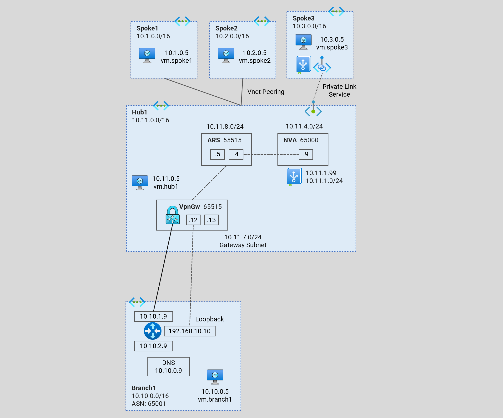
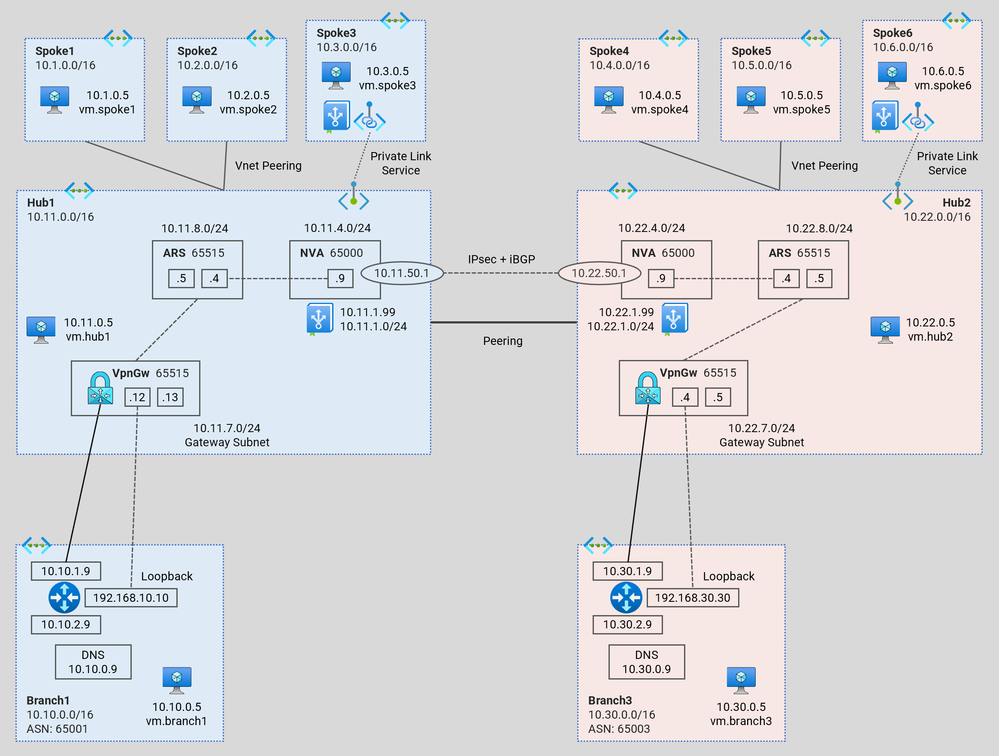
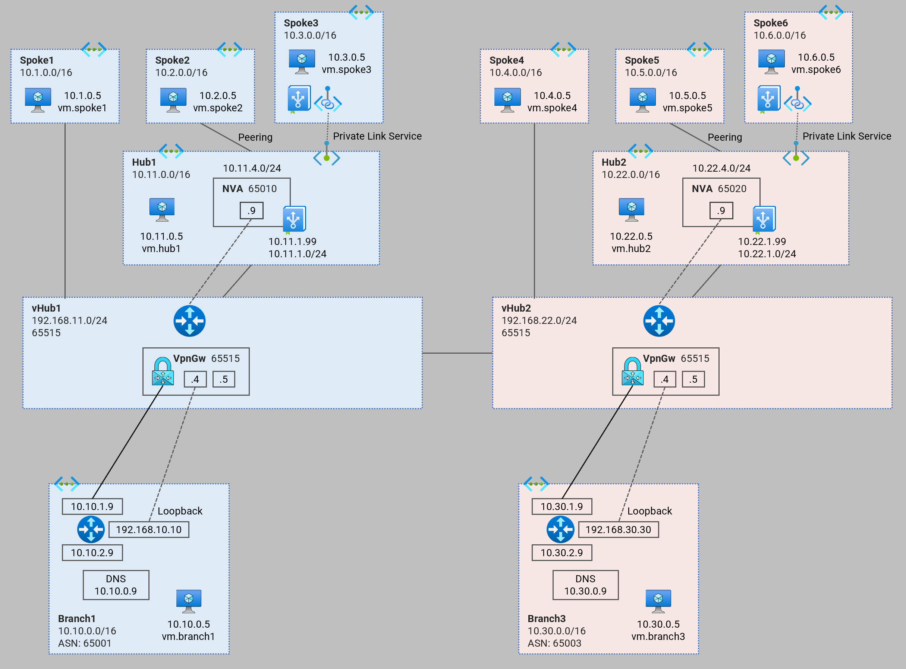
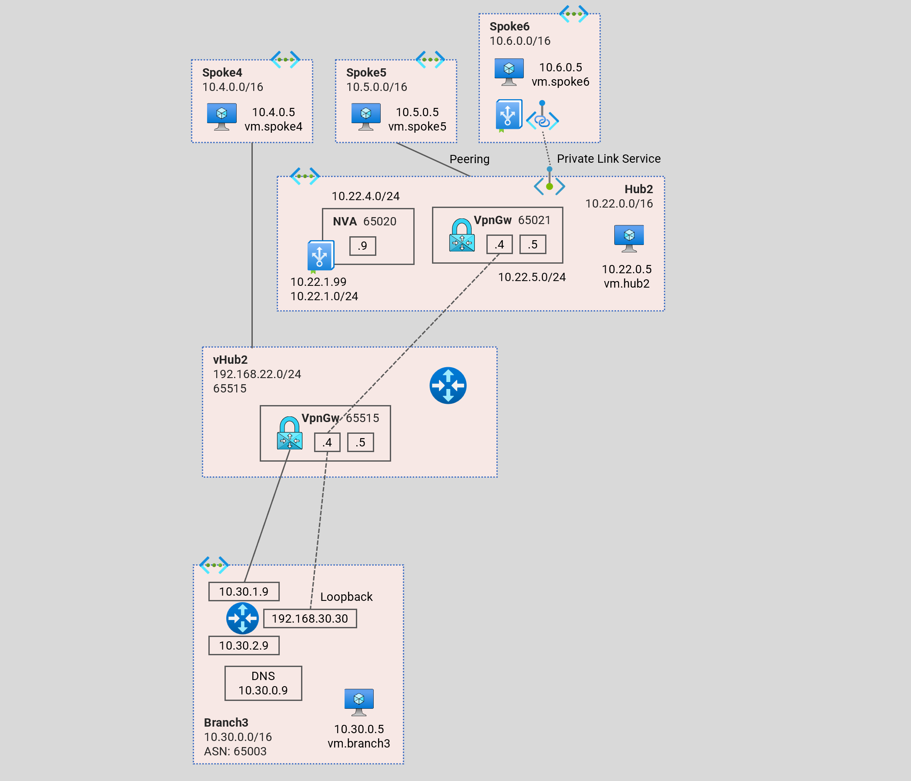

# Azure Network Architecture - Terraform Examples <!-- omit from toc -->

Contents
<!-- TOC -->
- [1. Hub and Spoke](#1-hub-and-spoke)
  - [1.1. Hub and Spoke - Single Region](#11-hub-and-spoke---single-region)
  - [1.2. Hub and Spoke - Dual Region](#12-hub-and-spoke---dual-region)
- [2. Virtual WAN](#2-virtual-wan)
  - [2.1. Virtual WAN - Single Hub](#21-virtual-wan---single-hub)
  - [2.2. Virtual WAN - Dual Hub](#22-virtual-wan---dual-hub)
  - [2.3. Virtual WAN - Single Hub (VPN)](#23-virtual-wan---single-hub-vpn)
  - [2.4. Virtual WAN - Dual Hub (Mixed)](#24-virtual-wan---dual-hub-mixed)
- [3. Virtual Network Manager](#3-virtual-network-manager)
- [4. General](#4-general)
<!-- /TOC -->

## [1. Hub and Spoke](./1-hub-and-spoke/)

### 1.1. Hub and Spoke - Single Region
[Terraform Code](./1-hub-and-spoke/1-hub-spoke-single-region)

This code deploys a hub and spoke topology playground to observe dynamic routing with Azure Route Server (ARS) and a Network Virtual Appiance (NVA).

### 1.2. Hub and Spoke - Dual Region
[Terraform Code](./1-hub-and-spoke/2-hub-spoke-dual-region/)

This code deploys a multi-region standard hub and spoke topology playground to observe dynamic routing with Azure Route Server (ARS) and a Network Virtual Appiance (NVA).

## [2. Virtual WAN](./2-virtual-wan/)

### 2.1. Virtual WAN - Single Hub
[Terraform Code](./2-virtual-wan/1-virtual-wan-single-hub/)

This code deploys a virtual WAN architecture playground to observe dynamic routing patterns. 

### 2.2. Virtual WAN - Dual Hub
[Terraform Code](./2-virtual-wan/2-virtual-wan-dual-hub/)

This code deploys a multi-hub (multi-region) virtual WAN architecture playground to observe dynamic routing patterns. In this architecture, we integrate the standard hubs to the virtual WAN hubs.

### 2.3. Virtual WAN - Single Hub (VPN)
[Terraform Code](./2-virtual-wan/3-virtual-wan-single-hub-vpn/)

This code deploys a virtual WAN architecture playground to observe dynamic routing patterns. In this architecture, we integrate a standard hub `hub1` (as a branch) to the virtual WAN hub `vHub1` via a VPN connection.

### 2.4. Virtual WAN - Dual Hub (Mixed)
[Terraform Code](./2-virtual-wan/4-virtual-wan-dual-hub-mixed/)

This code deploys a multi-hub (multi-region) virtual WAN architecture playground to observe dynamic routing patterns. In this architecture, we integrate the standard hub `hub1` to the virtual WAN hub `vHub1` via a connection. And we integrate the standard hub `hub2` to the virtual WAN hub `vHub2` via a VPN connection.

## [3. Virtual Network Manager](./3-virtual-network-manager/)

## [4. General](./4-general/)
