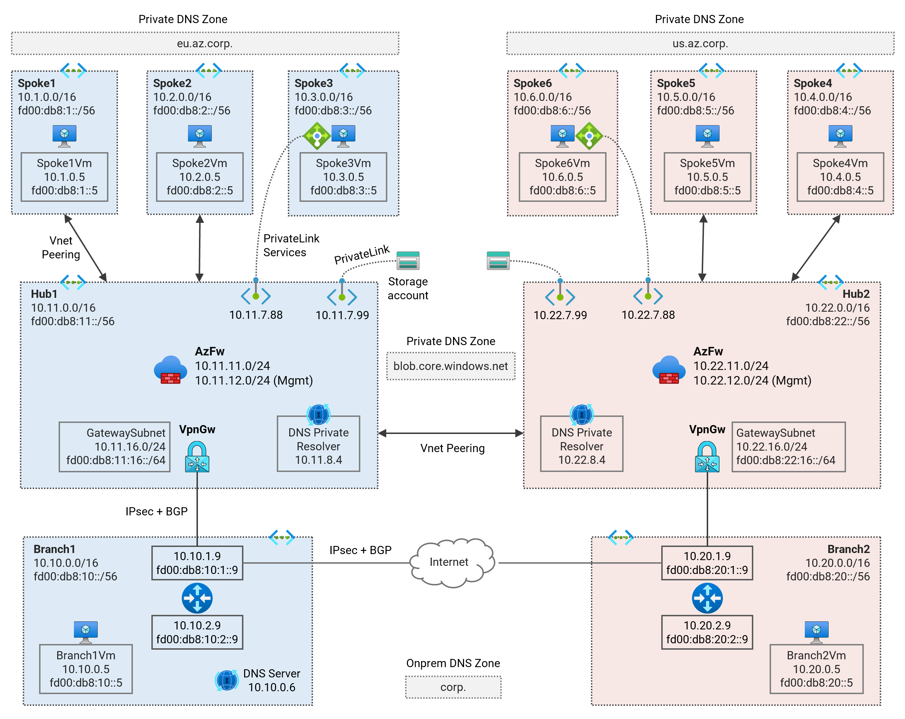
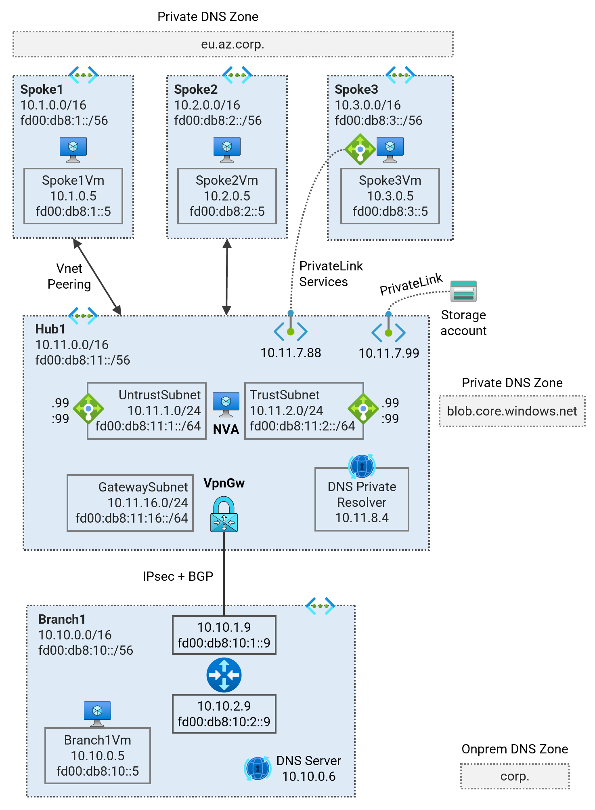
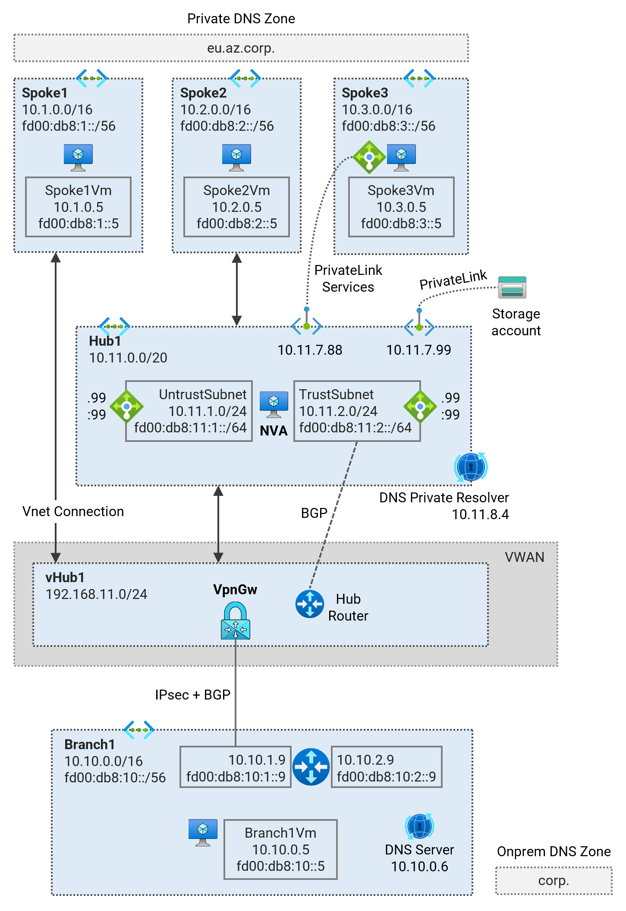
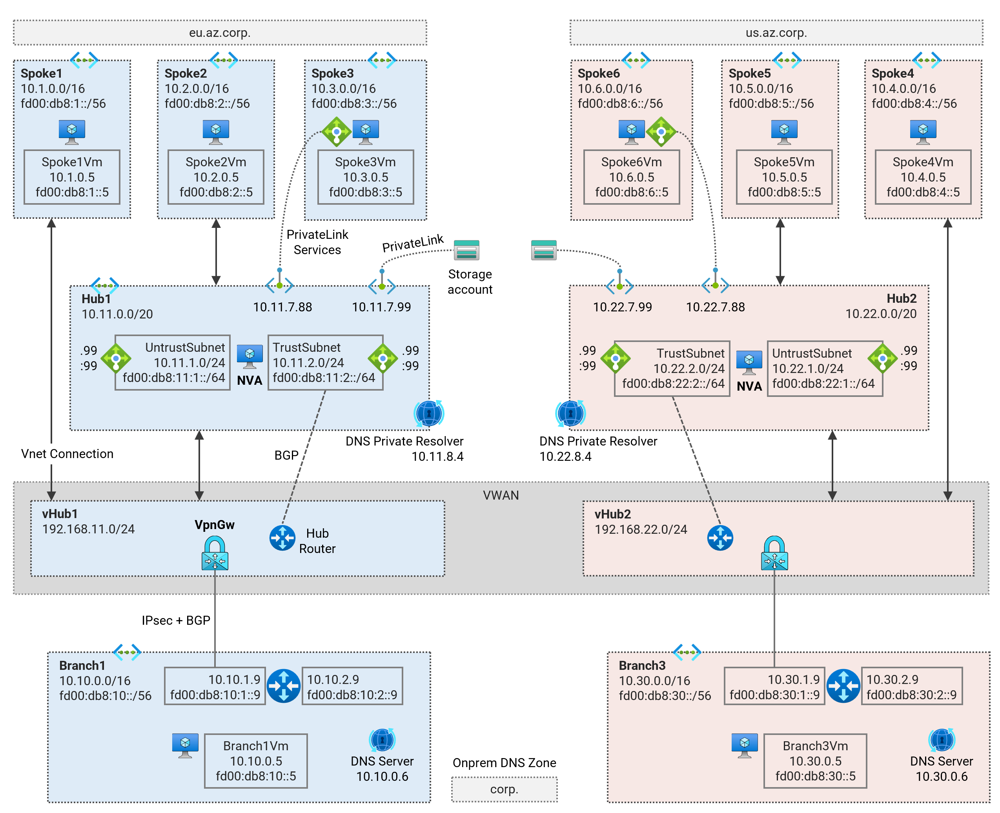
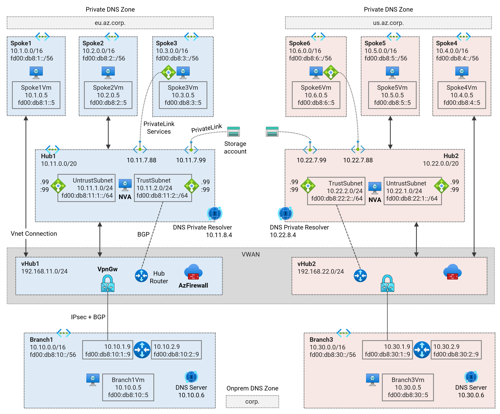

# Azure Network Architecture - Terraform Examples <!-- omit from toc -->

## [1. Hub and Spoke](./1-hub-and-spoke)

Terraform codes in this collection cover different hub and spoke network patterns using standard Virtual Network (Vnet) network topologies.

### 1.1. Secured Hub and Spoke - Single Region

⚙️ [**Deploy Terraform Code**](./1-hub-and-spoke/1-hub-spoke-azfw-single-region/)

This lab deploys a single-region Hub and Spoke Secured Virtual Network (Vnet) topology using Azure Firewall for traffic inspection. The lab demonstrates traffic routing patterns, [hybrid DNS](https://learn.microsoft.com/en-us/azure/dns/private-resolver-hybrid-dns) resolution, firewall security policies, and [PrivateLink Services](https://learn.microsoft.com/en-us/azure/private-link/private-link-service-overview) access to IaaS, [PrivateLink](https://learn.microsoft.com/en-us/azure/private-link/private-link-overview) access to PaaS services.

### 1.2. Secured Hub and Spoke - Dual Region

⚙️ [**Deploy Terraform Code**](./1-hub-and-spoke/2-hub-spoke-azfw-dual-region/)

This lab deploys a dual-region Secured Hub and Spoke Vnet topology using Azure Firewalls for traffic inspection. The lab demonstrates multi-region traffic routing patterns, [hybrid DNS](https://learn.microsoft.com/en-us/azure/dns/private-resolver-hybrid-dns) resolution, firewall security policies, and [PrivateLink Services](https://learn.microsoft.com/en-us/azure/private-link/private-link-service-overview) access to IaaS, [PrivateLink](https://learn.microsoft.com/en-us/azure/private-link/private-link-overview) access to PaaS services.

### 1.3. Hub and Spoke - Single Region (NVA)

⚙️ [**Deploy Terraform Code**](./1-hub-and-spoke/3-hub-spoke-nva-single-region/)

This lab deploys a single-region Hub and Spoke Vnet topology using Virtual Network Appliances (NVA) for traffic inspection. The lab demonstrates traffic routing patterns, [hybrid DNS](https://learn.microsoft.com/en-us/azure/dns/private-resolver-hybrid-dns) resolution, NVA deployment, and [PrivateLink Services](https://learn.microsoft.com/en-us/azure/private-link/private-link-service-overview) access to IaaS, [PrivateLink](https://learn.microsoft.com/en-us/azure/private-link/private-link-overview) access to PaaS services.

### 1.4. Hub and Spoke - Dual Region (NVA)

⚙️ [**Deploy Terraform Code**](./1-hub-and-spoke/4-hub-spoke-nva-dual-region/)

This lab deploys a dual-region Hub and Spoke Vnet topology using Virtual Network Appliances (NVA) for traffic inspection. The lab demonstrates multi-region traffic routing patterns, [hybrid DNS](https://learn.microsoft.com/en-us/azure/dns/private-resolver-hybrid-dns) resolution, NVA deployment, and [PrivateLink Services](https://learn.microsoft.com/en-us/azure/private-link/private-link-service-overview) access to IaaS, [PrivateLink](https://learn.microsoft.com/en-us/azure/private-link/private-link-overview) access to PaaS services.

## [2. Virtual WAN](./2-virtual-wan/)

Terraform codes in this collection cover different hub and spoke network patterns using Virtual WAN.

### 2.1. Virtual WAN - Single Region

⚙️ [**Deploy Terraform Code**](./2-virtual-wan/1-vwan-single-region/)

This lab deploys a single-region Virtual WAN (Vwan) topology. The lab demonstrates traffic routing patterns, [hybrid DNS](https://learn.microsoft.com/en-us/azure/dns/private-resolver-hybrid-dns) resolution, [connecting NVA](https://learn.microsoft.com/en-us/azure/virtual-wan/scenario-bgp-peering-hub) into the virtual hub, and [PrivateLink Services](https://learn.microsoft.com/en-us/azure/private-link/private-link-service-overview) access to IaaS, [PrivateLink](https://learn.microsoft.com/en-us/azure/private-link/private-link-overview) access to PaaS services.

### 2.2. Virtual WAN - Dual Region

⚙️ [**Deploy Terraform Code**](./2-virtual-wan/2-vwan-dual-region/)

This lab deploys a dual-region Virtual WAN (Vwan) topology. The lab demonstrates multi-region traffic routing patterns, [hybrid DNS](https://learn.microsoft.com/en-us/azure/dns/private-resolver-hybrid-dns) resolution, [connecting NVA](https://learn.microsoft.com/en-us/azure/virtual-wan/scenario-bgp-peering-hub) into the virtual hubs, and [PrivateLink Services](https://learn.microsoft.com/en-us/azure/private-link/private-link-service-overview) access to IaaS, [PrivateLink](https://learn.microsoft.com/en-us/azure/private-link/private-link-overview) access to PaaS services.

### 2.3. Secured Virtual WAN - Single Region

⚙️ [**Deploy Terraform Code**](./2-virtual-wan/3-vwan-sec-single-region/)

This lab deploys a single-region Secured Virtual WAN (Vwan) topology. [Routing Intent](https://learn.microsoft.com/en-us/azure/virtual-wan/how-to-routing-policies) feature is enabled to allow traffic inspection through the Azure firewall in the virtual hub. The lab demonstrates traffic routing patterns, routing intent [security policies](https://learn.microsoft.com/en-us/azure/virtual-wan/how-to-routing-policies), [hybrid DNS](https://learn.microsoft.com/en-us/azure/dns/private-resolver-hybrid-dns) resolution, NVA integration into the virtual hub, and [PrivateLink Services](https://learn.microsoft.com/en-us/azure/private-link/private-link-service-overview) access to IaaS, [PrivateLink](https://learn.microsoft.com/en-us/azure/private-link/private-link-overview) access to PaaS services.

### 2.4. Secured Virtual WAN - Dual Region

⚙️ [**Deploy Terraform Code**](./2-virtual-wan/4-vwan-sec-dual-region/)

This lab deploys a dual-region Secured Virtual WAN (Vwan) topology. [Routing Intent](https://learn.microsoft.com/en-us/azure/virtual-wan/how-to-routing-policies) feature is enabled to allow traffic inspection through the Azure firewalls in the virtual hubs. The lab demonstrates multi-region traffic routing patterns, routing intent [security policies](https://learn.microsoft.com/en-us/azure/virtual-wan/how-to-routing-policies), [hybrid DNS](https://learn.microsoft.com/en-us/azure/dns/private-resolver-hybrid-dns) resolution, [connecting NVA](https://learn.microsoft.com/en-us/azure/virtual-wan/scenario-bgp-peering-hub) into the virtual hubs, and [PrivateLink Services](https://learn.microsoft.com/en-us/azure/private-link/private-link-service-overview) access to IaaS, [PrivateLink](https://learn.microsoft.com/en-us/azure/private-link/private-link-overview) access to PaaS services.

## [3. Virtual Network Manager](./3-network-manager/)

### 3.1. Secured Hub and Spoke - Single Region (Virtual Network Manager)

⚙️ [**Deploy Terraform Code**](./3-network-manager/1-hub-spoke-azfw-single-region/)

Deploy a single-region Hub and Spoke Secured Virtual Network (Vnet) topology using the [Azure Virtual Network Manager](https://learn.microsoft.com/en-us/azure/virtual-network-manager/concept-connectivity-configuration#hub-and-spoke-topology) (AVNM) service. Learn about traffic routing patterns, [hybrid DNS](https://learn.microsoft.com/en-us/azure/dns/private-resolver-hybrid-dns) resolution, firewall security policies, and [PrivateLink Services](https://learn.microsoft.com/en-us/azure/private-link/private-link-service-overview) access to IaaS, [PrivateLink](https://learn.microsoft.com/en-us/azure/private-link/private-link-overview) access to PaaS services.

### 3.2. Secured Hub and Spoke - Dual Region (Virtual Network Manager)

⚙️ [**Deploy Terraform Code**](./3-network-manager/2-hub-spoke-azfw-dual-region/)

Deploy a dual-region Hub and Spoke Secured Virtual Network (Vnet) topology using the [Azure Virtual Network Manager](https://learn.microsoft.com/en-us/azure/virtual-network-manager/concept-connectivity-configuration#hub-and-spoke-topology) (AVNM) service. Learn about traffic routing patterns, [hybrid DNS](https://learn.microsoft.com/en-us/azure/dns/private-resolver-hybrid-dns) resolution, firewall security policies, and [PrivateLink Services](https://learn.microsoft.com/en-us/azure/private-link/private-link-service-overview) access to IaaS, [PrivateLink](https://learn.microsoft.com/en-us/azure/private-link/private-link-overview) access to PaaS services.

## [4. General](./4-general/)

(In progress)
