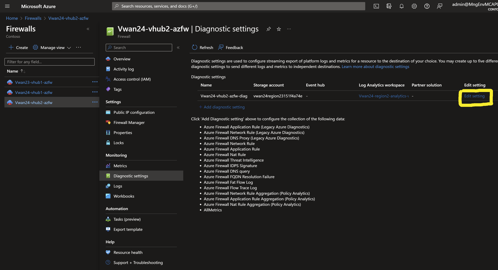

# Troubleshooting <!-- omit from toc -->

Errors
- [1. Network Security Group - "Context Deadline Exceeded"](#1-network-security-group---context-deadline-exceeded)
- [2. Network Security Group - "Already Exists"](#2-network-security-group---already-exists)
- [3. Subnet - "Already Exists"](#3-subnet---already-exists)
- [4. Backend Adress Pool - "Error Updating"](#4-backend-adress-pool---error-updating)
- [5. Azure Firewall Diagnostic Setting - "Already Exists"](#5-azure-firewall-diagnostic-setting---already-exists)
- [6. Virtual Machine Extension - "Already Exists"](#6-virtual-machine-extension---already-exists)
- [7. Azure Policy Assignment - "Already Exists"](#7-azure-policy-assignment---already-exists)
- [8. Waitiing for Virtual Network Peering"](#8-waitiing-for-virtual-network-peering)

Terraform seializes some resource creation which creates situations where some resources wait for a long time for dependent resources to be created. There are scenarios where you might encounter errors after running terraform to deploy any of the labs. This could be as a result of occassional race conditions that come up because some terraform resources are dependent on Azure resources that take a long time to deploy - such as virtual network gateways.

The folowing are some of the common errors and how to resolve them.

## 1. Network Security Group - "Context Deadline Exceeded"

This occurs when terraform times out on associating the NSG to a subnet.

**Example:**

```sh
Error: updating Network Security Group Association for Subnet: (Name "HubSpokeS1-hub1-nva" / Virtual Network Name "HubSpokeS1-hub1-vnet" / Resource Group "HubSpokeS1RG"): network.SubnetsClient#CreateOrUpdate: Failure sending request: StatusCode=0 -- Original Error: context deadline exceeded

  with module.hub1.azurerm_subnet_network_security_group_association.this["nva"],
  on ../../modules/base/main.tf line 19, in resource "azurerm_subnet_network_security_group_association" "this":
  19: resource "azurerm_subnet_network_security_group_association" "this" {
```
```sh
Error: retrieving Subnet: (Name "HubSpokeS1-hub1-dns-in" / Virtual Network Name "HubSpokeS1-hub1-vnet" / Resource Group "HubSpokeS1RG"): network.SubnetsClient#Get: Failure sending request: StatusCode=0 -- Original Error: context deadline exceeded

  with module.hub1.azurerm_subnet_network_security_group_association.this["dns"],
  on ../../modules/base/main.tf line 19, in resource "azurerm_subnet_network_security_group_association" "this":
  19: resource "azurerm_subnet_network_security_group_association" "this" {
```

**Solution:**

Apply terraform again.
```sh
terraform plam
terraform apply
```

Repeat the above steps for all similar errors.

## 2. Network Security Group - "Already Exists"

This occurs when terraform is trying to apply an NSG rule to a subnet which already has the NSG associated with the subnet from the previous terraform run.

**Example:**

```sh
╷
│ Error: A resource with the ID "/subscriptions/ec265026-bc67-44f6-92bc-9849685d921d/resourceGroups/VwanS4RG/providers/Microsoft.Network/virtualNetworks/VwanS4-hub2-vnet/subnets/VwanS4-hub2-main" already exists - to be managed via Terraform this resource needs to be imported into the State. Please see the resource documentation for "azurerm_subnet_network_security_group_association" for more information.
│
│   with module.hub2.azurerm_subnet_network_security_group_association.this["main"],
│   on ../../modules/base/main.tf line 19, in resource "azurerm_subnet_network_security_group_association" "this":
│   19: resource "azurerm_subnet_network_security_group_association" "this" {
```

**Solution:**

Remove the NSG associated with the subnet. Subtitute the values of your resource group, subnet name and virtual network name below and run the CLI command:
```sh
RG=<Resource Group>
Subnet=<Subnet name>
Vnet=<VNET name>
az network vnet subnet update -g $RG -n $Subnet --vnet-name $Vnet --network-security-group null
```

Re-apply terraform
```sh
terraform plan
terraform apply
```

Repeat the above steps for all similar errors.

## 3. Subnet - "Already Exists"

This occurs when terraform is attempting to create a subnet which already exists from a previous terraform run.

**Example:**

```sh
│ Error: A resource with the ID "/subscriptions/ec265026-bc67-44f6-92bc-9849685d921d/resourceGroups/HubSpokeS1RG/providers/Microsoft.Network/virtualNetworks/HubSpokeS1-hub1-vnet/subnets/HubSpokeS1-hub1-dns-out" already exists - to be managed via Terraform this resource needs to be imported into the State. Please see the resource documentation for "azurerm_subnet" for more information.
│
│   with module.hub1.azurerm_subnet.this["HubSpokeS1-hub1-dns-out"],
│   on ../../modules/base/main.tf line 62, in resource "azurerm_subnet" "this":
│   62: resource "azurerm_subnet" "this" {
```

**Solution:**

1. Delete the subnet
2. Re-apply terraform
```sh
terraform plan
terraform apply
```

Repeat the above steps for all similar errors.

## 4. Backend Adress Pool - "Error Updating"

This error could occur when terraform is trying to update the backend address pool of a load balancer. This could be as a result of the load balancer being in a state of updating from a previous terraform run, or as a result of race condition encountered when deploying multiple terraform resources at the same time.

**Example:**

```sh
│ Error: updating Backend Address Pool Address: (Address Name "Vwan23-hub1-nva-beap-addr" / Backend Address Pool Name "Vwan23-hub1-nva-beap" / Load Balancer Name "Vwan23-hub1-nva-lb" / Resource Group "Vwan23RG"): network.LoadBalancerBackendAddressPoolsClient#CreateOrUpdate: Failure sending request: StatusCode=409 -- Original Error: Code="AnotherOperationInProgress" Message="Another operation on this or dependent resource is in progress. To retrieve status of the operation use uri: https://management.azure.com/subscriptions/b120edff-2b3e-4896-adb7-55d2918f337f/providers/Microsoft.Network/locations/westeurope/operations/5d66a0e0-e08b-4ecf-aee5-0ff5a461962b?api-version=2022-07-01." Details=[]
│
│   with azurerm_lb_backend_address_pool_address.hub1_nva,
│   on 08-conn-hub1.tf line 208, in resource "azurerm_lb_backend_address_pool_address" "hub1_nva":
│  208: resource "azurerm_lb_backend_address_pool_address" "hub1_nva" {
│
│ updating Backend Address Pool Address: (Address Name "Vwan23-hub1-nva-beap-addr" / Backend Address Pool Name "Vwan23-hub1-nva-beap" / Load Balancer Name "Vwan23-hub1-nva-lb" / Resource Group "Vwan23RG"):
│ network.LoadBalancerBackendAddressPoolsClient#CreateOrUpdate: Failure sending request: StatusCode=409 -- Original Error: Code="AnotherOperationInProgress" Message="Another operation on this or dependent resource is in
│ progress. To retrieve status of the operation use uri:
│ https://management.azure.com/subscriptions/b120edff-2b3e-4896-adb7-55d2918f337f/providers/Microsoft.Network/locations/westeurope/operations/5d66a0e0-e08b-4ecf-aee5-0ff5a461962b?api-version=2022-07-01." Details=[]
 ```

 **Solution:**

Re-apply terraform
```sh
terraform plan
terraform apply
```

Repeat the above steps for all similar errors.

## 5. Azure Firewall Diagnostic Setting - "Already Exists"

This error could occur when terraform is trying to create a diagnostic setting for Azure Firewall. This could be as a result of the diagnostic setting already existing from a previous terraform run, or as a result of race condition encountered when deploying multiple terraform resources at the same time.

**Example:**

```sh
│ Error: A resource with the ID "/subscriptions/b120edff-2b3e-4896-adb7-55d2918f337f/resourceGroups/Vwan24RG/providers/Microsoft.Network/azureFirewalls/Vwan24-vhub2-azfw|Vwan24-vhub2-azfw-diag" already exists - to be managed via Terraform this resource needs to be imported into the State. Please see the resource documentation for "azurerm_monitor_diagnostic_setting" for more information.
│
│   with module.vhub2.azurerm_monitor_diagnostic_setting.this[0],
│   on ../../modules/virtual-hub/main.tf line 74, in resource "azurerm_monitor_diagnostic_setting" "this":
│   74: resource "azurerm_monitor_diagnostic_setting" "this" {
 ```

 **Solution 1:**

 1. Identify the terraform resource that is causing the error. In the example above, the resource is `azurerm_monitor_diagnostic_setting.this[0]`
 2. Identify the resource ID in the error message. In the example above, the resource ID is `/subscriptions/b120edff-2b3e-4896-adb7-55d2918f337f/resourceGroups/Vwan24RG/providers/Microsoft.Network/azureFirewalls/Vwan24-vhub2-azfw|Vwan24-vhub2-azfw-diag`
 3. Import the resource into the terraform state. Substitute the resource ID in the command below with the resource ID from the error message above.

```sh
import <Resource_Name> "<Resource_ID>"
```
In this example, the command will be:

 ```sh
terraform import module.vhub2.azurerm_monitor_diagnostic_setting.this[0] "/subscriptions/b120edff-2b3e-4896-adb7-55d2918f337f/resourceGroups/Vwan24RG/providers/Microsoft.Network/azureFirewalls/Vwan24-vhub2-
azfw|Vwan24-vhub2-azfw-diag"
```
4. Re-apply terraform
```sh
terraform plan
terraform apply
```

 **Solution 2:**

 Alternatively, you can delete the resource from the Azure portal and re-apply terraform.

 1. Select teh firewall from teh Azure portal.
 2. Select Diagnostic Settings
 3. Click on *Edit setting*
 4. Click on *Delete* to delete the diagnostic setting


 5. Re-apply terraform
```sh
terraform plan
terraform apply
```

## 6. Virtual Machine Extension - "Already Exists"

This error could occur when terraform is trying to create a virtual machine extension. This could be as a result of the virtual machine extension already existing from a previous terraform run, or as a result of race condition encountered when deploying multiple terraform resources at the same time.

**Example:**

```sh
│ Error: A resource with the ID "/subscriptions/b120edff-2b3e-4896-adb7-55d2918f337f/resourceGroups/Hs14RG/providers/Microsoft.Compute/virtualMachines/Hs14-branch1-dns/extensions/Hs14-branch1-dns" already exists - to be managed via Terraform this resource needs to be imported into the State. Please see the resource documentation for "azurerm_virtual_machine_extension" for more information.
│
│   with module.branch1.module.vm["dns"].azurerm_virtual_machine_extension.this[0],
│   on ../../modules/linux/main.tf line 93, in resource "azurerm_virtual_machine_extension" "this":
│   93: resource "azurerm_virtual_machine_extension" "this" {
```

 **Solution:**

 Delete the virtual machine extension from the Azure portal and re-apply terraform.

 1. Select the virtual machine from the Azure portal.
 2. Select Extensions + applications*
 3. Click on the extension to be deleted - in this scenario, the extension is *Hs14-branch1-dns*
 4. Click on *Uninstall*


  5. Re-apply terraform
  ```sh
  terraform plan
  terraform apply
  ```

  Repeat the above steps for all similar errors.

  ## 7. Azure Policy Assignment - "Already Exists"

This error could occur when terraform is trying to create an Azure policy assignment. This could be as a result of the policy asignment already existing from a previous terraform run, or as a result of race condition encountered when deploying multiple terraform resources at the same time.

**Example:**

```sh
Error: A resource with the ID "/subscriptions/b120edff-2b3e-4896-adb7-55d2918f337f/providers/Microsoft.Authorization/policyAssignments/Ne31-ng-spokes-prod-region1" already exists - to be managed via Terraform this resource needs to be imported into the State. Please see the resource documentation for "azurerm_subscription_policy_assignment" for more information.
│
│   with azurerm_subscription_policy_assignment.ng_spokes_prod_region1,
│   on svc-nm-common.tf line 57, in resource "azurerm_subscription_policy_assignment" "ng_spokes_prod_region1":
│   57: resource "azurerm_subscription_policy_assignment" "ng_spokes_prod_region1" {
│
│ A resource with the ID
│ "/subscriptions/b120edff-2b3e-4896-adb7-55d2918f337f/providers/Microsoft.Authorization/policyAssignments/Ne31-ng-spokes-prod-region1"
│ already exists - to be managed via Terraform this resource needs to be imported into the
│ State. Please see the resource documentation for "azurerm_subscription_policy_assignment"
│ for more information.
```

 **Solution:**

 Delete the policy assignment using azure CLI and re-apply terraform.

  1. Run the command below to delete the policy assignment. Substitute the policy assignment name with the name of the policy assignment in the error message above.

  ```sh
  az policy assignment delete --name <policy_assignment_name>
  ```

  In this example, the command will be:

  ```sh
  az policy assignment delete --name Ne31-ng-spokes-prod-region1
  ```

  2. Re-apply terraform
  ```sh
  terraform plan
  terraform apply
  ```

  ## 8. Waitiing for Virtual Network Peering"

  This error could occur due to simultaneous Vnet peering creation operations.

  **Example:**

```sh
Error: waiting for Virtual Network Peering: (Name "Vwan22-hub2-to-spoke5-peering" / Virtual Network Name "Vwan22-hub2-vnet" / Resource Group "Vwan22RG") to be created: network.VirtualNetworkPeeringsClient#CreateOrUpdate: Failure sending request: StatusCode=400 -- Original Error: Code="ReferencedResourceNotProvisioned" Message="Cannot proceed with operation because resource /subscriptions/b120edff-2b3e-4896-adb7-55d2918f337f/resourceGroups/Vwan22RG/providers/Microsoft.Network/virtualNetworks/Vwan22-hub2-vnet used by resource /subscriptions/b120edff-2b3e-4896-adb7-55d2918f337f/resourceGroups/Vwan22RG/providers/Microsoft.Network/virtualNetworks/Vwan22-hub2-vnet/virtualNetworkPeerings/Vwan22-hub2-to-spoke5-peering is not in Succeeded state. Resource is in Updating state and the last operation that updated/is updating the resource is PutSubnetOperation." Details=[]
│
│   with azurerm_virtual_network_peering.hub2_to_spoke5_peering,
│   on 08-conn-hub2.tf line 23, in resource "azurerm_virtual_network_peering" "hub2_to_spoke5_peering":
│   23: resource "azurerm_virtual_network_peering" "hub2_to_spoke5_peering" {
```

 **Solution:**

 Re-apply terraform
 ```sh
 terraform plan
 terraform apply
 ```
